<div style="text-align: right;">
    <a href="https://kranthib.github.io/tech-pulse/" style="display: inline-block; padding: 6px 14px; background-color: #2054a6; color: white; text-decoration: none; border-radius: 3px; font-size: 14px; font-weight: 500; transition: background-color 0.3s;">Back to Home →</a>
</div>

# LLM Engineer's Handbook: Master the art of engineering large language models from concept to production

## Complete Reference Guide
**Authors:** Paul Iusztin & Maxime Labonne  
**Publisher:** Packt Publishing (October 2024)  
**Pages:** 490+  

---

## 📚 Table of Contents

- [Overview](#-overview)
- [Chapter 1: Understanding the LLM Twin Concept and Architecture](#chapter-1-understanding-the-llm-twin-concept-and-architecture)
- [Chapter 2: Tooling and Installation](#chapter-2-tooling-and-installation)
- [Chapter 3: Data Engineering](#chapter-3-data-engineering)
- [Chapter 4: RAG Feature Pipeline](#chapter-4-rag-feature-pipeline)
- [Chapter 5: Supervised Fine-Tuning](#chapter-5-supervised-fine-tuning)
- [Chapter 6: Fine-Tuning with Preference Alignment](#chapter-6-fine-tuning-with-preference-alignment)
- [Chapter 7: Evaluating LLMs](#chapter-7-evaluating-llms)
- [Chapter 8: Inference Optimization](#chapter-8-inference-optimization)
- [Chapter 9: Advanced RAG Techniques](#chapter-9-advanced-rag-techniques)
- [Chapter 10: Inference Pipeline Deployment](#chapter-10-inference-pipeline-deployment)
- [Chapter 11: MLOps and LLMOps](#chapter-11-mlops-and-llmops)
- [Appendix: MLOps Principles](#appendix-mlops-principles-summary)
- [Key Diagrams & Architectures](#key-diagrams--architectures)
- [Implementation Code Patterns](#implementation-code-patterns)
- [Best Practices Summary](#best-practices-summary)

---

## 📖 Overview

This handbook provides a comprehensive guide to building production-ready LLM applications through the **LLM Twin** project - an AI character that learns to write like a specific person by incorporating their style, voice, and personality.

### **Core Philosophy**
The book follows a hands-on approach, believing that the best way to learn about LLMs and production ML is to build real systems. Every concept is demonstrated through the practical implementation of the LLM Twin.

### **What You'll Learn**
- End-to-end LLM application development
- Production-ready MLOps and LLMOps practices
- Advanced RAG (Retrieval-Augmented Generation) techniques
- Supervised fine-tuning and preference alignment
- Scalable deployment strategies
- Monitoring and continuous improvement

---

## Chapter 1: Understanding the LLM Twin Concept and Architecture

### **🎯 What is an LLM Twin?**

An **LLM Twin** is an AI character that incorporates your writing style, voice, and personality into an LLM. It's a digital version of yourself projected into an LLM through fine-tuning on your personal data.

**Key Characteristics:**
- Learns from your LinkedIn posts, Medium articles, GitHub repositories, personal messages
- Incorporates style transfer concepts from image generation
- Uses both fine-tuning and RAG techniques
- Reflects the data it was trained on (like a projection - some information is lost)

### **🚀 Why Build an LLM Twin?**

**Business Value:**
- **Content Creation**: Generate posts, articles, code in your style
- **Personal Branding**: Maintain consistent voice across platforms  
- **Productivity**: Automate writing tasks while preserving authenticity
- **Knowledge Preservation**: Capture and replicate domain expertise

**Technical Learning Value:**
- Demonstrates end-to-end ML lifecycle
- Showcases advanced LLM techniques
- Provides scalable architecture patterns
- Illustrates production MLOps practices

### **🏗️ System Architecture: FTI Pipeline Design**

The LLM Twin follows the **Feature/Training/Inference (FTI)** architecture pattern:

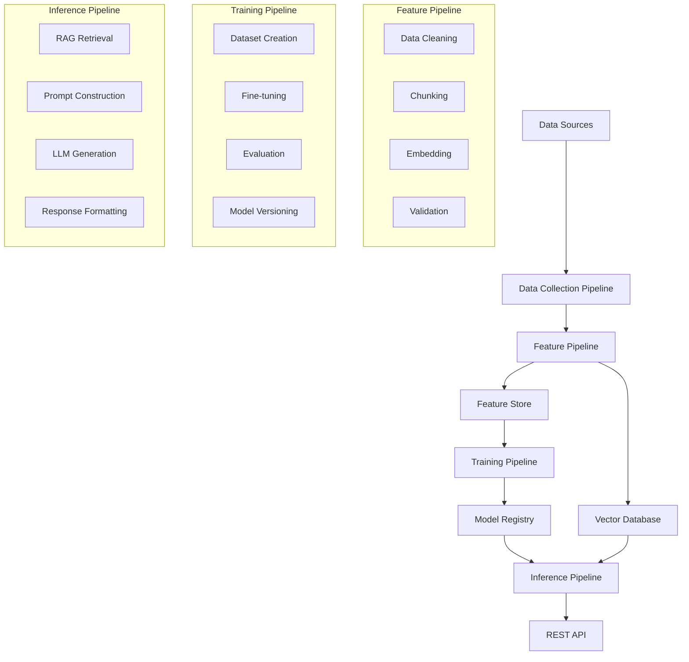

### **📊 Technical Requirements**

**Data Processing:**
- Autonomous data collection from LinkedIn, Medium, Substack, GitHub
- Data standardization and warehouse storage
- Raw data cleaning and preprocessing
- Instruction dataset creation for fine-tuning
- Document chunking and embedding for RAG

**Model Training:**
- Support for LLMs of various sizes (7B, 14B, 30B, 70B parameters)
- Multiple instruction dataset sizes
- LLM type flexibility (Mistral, Llama, GPT)
- Experiment tracking and comparison
- Hyperparameter optimization

**Inference & Deployment:**
- RESTful API endpoints
- RAG-enhanced generation
- Real-time and batch inference modes
- Auto-scaling capabilities
- Performance monitoring

**MLOps Integration:**
- Dataset and model versioning
- Lineage tracking and reproducibility
- Continuous training (CT) pipelines
- CI/CD integration
- Monitoring and alerting

### **🔧 FTI Architecture Benefits**

| Benefit | Description |
|---------|-------------|
| **Modularity** | Each pipeline can be developed, tested, and deployed independently |
| **Scalability** | Components scale differently based on requirements (CPU vs GPU) |
| **Reusability** | Pipelines can be reused across different models and datasets |
| **Maintainability** | Clear separation of concerns simplifies debugging and updates |
| **Flexibility** | Easy to swap components or add new functionality |

### **💡 LLM Twin vs. Co-pilot Comparison**

| Aspect | LLM Twin | Co-pilot |
|--------|----------|----------|
| **Purpose** | Personal writing style replication | General coding assistance |
| **Training Data** | Personal content (posts, articles, code) | Broad internet data |
| **Use Cases** | Content creation, personal branding | Code completion, debugging |
| **Personalization** | Highly personalized to individual | Generic across users |
| **Domain** | Content creation + coding | Primarily coding |

---

## Chapter 2: Tooling and Installation

### **🐍 Python Ecosystem Setup**

**Core Requirements:**
- **Python 3.11.8** (tested version)
- **pyenv** for Python version management
- **Poetry** for dependency management
- **Poe the Poet** for task execution

#### **Python Version Management with pyenv**

```bash
# Install specific Python version
pyenv install 3.11.8

# Set global default
pyenv global 3.11.8

# Set local version for project
pyenv local 3.11.8

# Verify installation
python --version  # Should output: Python 3.11.8
```

#### **Dependency Management with Poetry**

**Key Benefits:**
- Dependency resolution and locking
- Virtual environment management
- Package building and publishing
- Development dependency separation

**Essential Commands:**
```bash
# Install dependencies
poetry install --without aws

# Add new dependency
poetry add requests

# Add development dependency  
poetry add --group dev pytest

# Activate virtual environment
poetry shell

# Run commands in environment
poetry run python script.py
```

#### **Task Automation with Poe the Poet**

**Configuration (pyproject.toml):**
```toml
[tool.poe.tasks]
test = "pytest tests/"
format = "black ."
lint = "flake8 ."
start = "python main.py"
deploy-inference-endpoint = "python -m llm_engineering.infrastructure.aws.deploy"
```

**Usage:**
```bash
poetry poe test
poetry poe format
poetry poe deploy-inference-endpoint
```

### **🛠️ MLOps and LLMOps Tooling**

#### **Core Tool Stack**

| Tool | Purpose | Key Features |
|------|---------|--------------|
| **Hugging Face** | Model registry & datasets | Pre-trained models, dataset hosting, model sharing |
| **ZenML** | ML orchestration | Pipeline management, metadata tracking, artifacts |
| **Comet ML** | Experiment tracking | Metrics logging, model comparison, visualization |
| **Opik** | Prompt monitoring | LLM observability, prompt tracking, performance analysis |
| **MongoDB** | NoSQL database | Document storage, flexible schema, horizontal scaling |
| **Qdrant** | Vector database | Semantic search, embedding storage, fast retrieval |

#### **ZenML: Orchestration Platform**

**Key Concepts:**
- **Pipelines**: Sequences of steps that process data or train models
- **Steps**: Individual functions that perform specific tasks
- **Artifacts**: Data objects passed between steps
- **Stack**: Collection of infrastructure components

**Basic Pipeline Structure:**
```python
from zenml import pipeline, step

@step
def load_data() -> pd.DataFrame:
    """Load raw data from source."""
    return pd.read_csv("data.csv")

@step  
def preprocess_data(data: pd.DataFrame) -> pd.DataFrame:
    """Clean and preprocess data."""
    return data.dropna()

@step
def train_model(data: pd.DataFrame) -> Any:
    """Train ML model on processed data."""
    return model

@pipeline
def training_pipeline():
    """Complete training pipeline."""
    raw_data = load_data()
    clean_data = preprocess_data(raw_data)
    model = train_model(clean_data)
    return model
```

### **📊 Database Solutions**

#### **MongoDB: NoSQL Document Store**

**Use Cases:**
- Storing crawled articles and posts
- Flexible schema for different content types
- Document-based queries and aggregations

**Key Features:**
- Horizontal scaling through sharding
- Rich query language
- Automatic indexing
- GridFS for large file storage

#### **Qdrant: Vector Database**

**Use Cases:**
- Storing document embeddings
- Semantic similarity search
- RAG retrieval operations

**Key Features:**
- Fast approximate nearest neighbor search
- Metadata filtering
- Payload-based filtering
- REST and gRPC APIs

**Vector Search Example:**
```python
from qdrant_client.models import Filter, FieldCondition, MatchValue

# Search with metadata filtering
results = qdrant_client.search(
    collection_name="documents",
    query_vector=embedding,
    query_filter=Filter(
        must=[
            FieldCondition(
                key="author_id",
                match=MatchValue(value="author_123")
            )
        ]
    ),
    limit=10
)
```

### **☁️ AWS Infrastructure Setup**

#### **Required AWS Services**

| Service | Purpose | Key Benefits |
|---------|---------|--------------|
| **SageMaker** | ML training & inference | Managed Jupyter notebooks, distributed training, auto-scaling |
| **S3** | Object storage | Data lake, model artifacts, unlimited scalability |
| **ECR** | Container registry | Docker image storage, integration with SageMaker |
| **CloudWatch** | Monitoring | Logs, metrics, alarms, dashboards |
| **IAM** | Access control | Fine-grained permissions, roles, policies |

#### **AWS Configuration Steps**

**1. Create AWS Account & Access Keys:**
```bash
# Install AWS CLI
pip install awscli

# Configure credentials
aws configure
# AWS Access Key ID: [YOUR_ACCESS_KEY]
# AWS Secret Access Key: [YOUR_SECRET_KEY]  
# Default region name: us-east-1
# Default output format: json
```

**2. Create SageMaker Execution Role:**
```python
# Create role with necessary permissions
poetry poe create-sagemaker-execution-role

# Update .env file with generated ARN
AWS_ARN_ROLE=arn:aws:iam::123456789012:role/SageMakerExecutionRole
```

**3. Environment Configuration (.env):**
```bash
# AWS Configuration
AWS_ACCESS_KEY_ID=your_access_key
AWS_SECRET_ACCESS_KEY=your_secret_key
AWS_DEFAULT_REGION=us-east-1
AWS_ARN_ROLE=arn:aws:iam::account:role/SageMakerExecutionRole

# API Keys
OPENAI_API_KEY=your_openai_key
HUGGINGFACE_ACCESS_TOKEN=your_hf_token

# Database URLs
MONGODB_URL=mongodb://localhost:27017
QDRANT_URL=http://localhost:6333
```

#### **Docker Infrastructure Setup**

**Quick Start (3 steps):**
1. Install Docker 27.1.1+
2. Fill .env file with credentials
3. Run local infrastructure:

```bash
# Start all services
docker-compose up -d

# Services started:
# - MongoDB (port 27017)
# - Qdrant (port 6333)  
# - ZenML Server (port 8237)
```

---

## Chapter 3: Data Engineering

### **🏗️ Data Collection Pipeline Architecture**

The data collection pipeline implements the **ETL (Extract, Transform, Load)** pattern to autonomously gather content from multiple platforms.

**Supported Data Sources:**
- **LinkedIn**: Professional posts and articles
- **Medium**: Technical articles and stories  
- **Substack**: Newsletter content and posts
- **GitHub**: README files, documentation, code comments

### **📊 ETL Pipeline Flow**

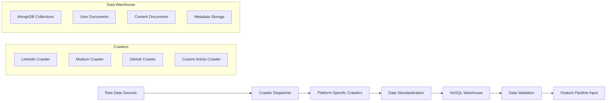

### **🔧 Implementation Architecture**

#### **ZenML Pipeline Structure**

```python
from zenml import pipeline, step
from typing import Dict, Any

@step
def extract_data_step(source_config: Dict[str, Any]) -> List[Dict]:
    """Extract data from configured sources."""
    dispatcher = CrawlerDispatcher()
    return dispatcher.crawl_all_sources(source_config)

@step  
def transform_data_step(raw_data: List[Dict]) -> List[Dict]:
    """Transform and standardize extracted data."""
    cleaned_data = []
    for item in raw_data:
        cleaned_item = standardize_document(item)
        cleaned_data.append(cleaned_item)
    return cleaned_data

@step
def load_data_step(transformed_data: List[Dict]) -> bool:
    """Load data into warehouse."""
    warehouse = NoSQLDataWarehouse()
    return warehouse.bulk_insert(transformed_data)

@pipeline  
def data_collection_pipeline():
    """Complete data collection ETL pipeline."""
    raw_data = extract_data_step()
    clean_data = transform_data_step(raw_data)
    success = load_data_step(clean_data)
    return success
```

### **🕷️ Crawler Implementation Details**

#### **Base Crawler Interface**

```python
from abc import ABC, abstractmethod
from typing import List, Dict, Any
from selenium import webdriver

class BaseCrawler(ABC):
    """Abstract base class for all crawlers."""
    
    def __init__(self, config: Dict[str, Any]):
        self.config = config
        self.driver = None
        
    @abstractmethod
    def extract(self, source_url: str) -> List[Dict[str, Any]]:
        """Extract data from source URL."""
        pass
    
    def setup_driver(self) -> webdriver.Chrome:
        """Initialize Selenium WebDriver with optimal settings."""
        options = webdriver.ChromeOptions()
        options.add_argument('--headless')
        options.add_argument('--no-sandbox')
        options.add_argument('--disable-dev-shm-usage')
        return webdriver.Chrome(options=options)
    
    def cleanup(self):
        """Clean up resources."""
        if self.driver:
            self.driver.quit()
```

#### **GitHub Crawler Implementation**

```python
class GitHubCrawler(BaseCrawler):
    """Crawler for GitHub repositories and documentation."""
    
    def extract(self, repo_url: str) -> List[Dict[str, Any]]:
        """Extract README and documentation files."""
        documents = []
        
        # Clone repository or use GitHub API
        repo_data = self._fetch_repo_content(repo_url)
        
        for file_path, content in repo_data.items():
            if self._is_documentation_file(file_path):
                doc = {
                    'content': content,
                    'source_url': f"{repo_url}/blob/main/{file_path}",
                    'platform': 'github',
                    'file_type': self._get_file_type(file_path),
                    'created_at': self._get_file_timestamp(file_path),
                    'metadata': {
                        'repository': repo_url,
                        'file_path': file_path,
                        'language': self._detect_language(content)
                    }
                }
                documents.append(doc)
                
        return documents
    
    def _is_documentation_file(self, file_path: str) -> bool:
        """Check if file contains documentation."""
        doc_patterns = ['.md', '.txt', '.rst', 'README', 'CHANGELOG']
        return any(pattern in file_path for pattern in doc_patterns)
```

#### **Medium Crawler Implementation**

```python
class MediumCrawler(BaseCrawler):
    """Crawler for Medium articles and publications."""
    
    def extract(self, profile_url: str) -> List[Dict[str, Any]]:
        """Extract articles from Medium profile."""
        self.driver = self.setup_driver()
        articles = []
        
        try:
            # Navigate to profile page
            self.driver.get(profile_url)
            
            # Scroll to load all articles
            self._scroll_to_load_content()
            
            # Extract article links
            article_links = self._get_article_links()
            
            # Extract content from each article
            for link in article_links:
                article_data = self._extract_article_content(link)
                if article_data:
                    articles.append(article_data)
                    
        finally:
            self.cleanup()
            
        return articles
    
    def _extract_article_content(self, article_url: str) -> Dict[str, Any]:
        """Extract content from individual Medium article."""
        self.driver.get(article_url)
        
        # Wait for content to load
        WebDriverWait(self.driver, 10).until(
            EC.presence_of_element_located((By.TAG_NAME, "article"))
        )
        
        # Extract article data
        title = self.driver.find_element(By.TAG_NAME, "h1").text
        content = self._extract_article_text()
        published_date = self._extract_publish_date()
        
        return {
            'title': title,
            'content': content,
            'source_url': article_url,
            'platform': 'medium',
            'published_at': published_date,
            'metadata': {
                'word_count': len(content.split()),
                'reading_time': self._estimate_reading_time(content)
            }
        }
```

### **🏭 Crawler Dispatcher Pattern**

```python
class CrawlerDispatcher:
    """Dispatcher to route crawling requests to appropriate crawlers."""
    
    def __init__(self):
        self.crawlers = {
            'github': GitHubCrawler,
            'medium': MediumCrawler,
            'linkedin': LinkedInCrawler,
            'custom': CustomArticleCrawler
        }
    
    def get_crawler(self, platform: str, config: Dict[str, Any]) -> BaseCrawler:
        """Factory method to instantiate the right crawler."""
        if platform not in self.crawlers:
            raise ValueError(f"Unsupported platform: {platform}")
            
        crawler_class = self.crawlers[platform]
        return crawler_class(config)
    
    def crawl_all_sources(self, sources_config: Dict[str, Any]) -> List[Dict[str, Any]]:
        """Crawl all configured data sources."""
        all_documents = []
        
        for platform, config in sources_config.items():
            try:
                crawler = self.get_crawler(platform, config)
                documents = crawler.extract(config['source_url'])
                all_documents.extend(documents)
                
            except Exception as e:
                logger.error(f"Failed to crawl {platform}: {str(e)}")
                continue
                
        return all_documents
```

### **🗄️ NoSQL Data Warehouse Design**

#### **Document Schema Design**

**User Document:**
```python
from pydantic import BaseModel, Field
from datetime import datetime
from typing import Optional, Dict, Any
from uuid import UUID, uuid4

class UserDocument(BaseModel):
    """User profile document schema."""
    
    id: UUID = Field(default_factory=uuid4)
    full_name: str
    email: Optional[str] = None
    bio: Optional[str] = None
    linkedin_url: Optional[str] = None
    medium_url: Optional[str] = None
    github_url: Optional[str] = None
    created_at: datetime = Field(default_factory=datetime.utcnow)
    updated_at: datetime = Field(default_factory=datetime.utcnow)
    
    class Config:
        json_encoders = {
            datetime: lambda v: v.isoformat(),
            UUID: lambda v: str(v)
        }
```

**Content Documents:**
```python
class BaseDocument(BaseModel):
    """Base schema for all content documents."""
    
    id: UUID = Field(default_factory=uuid4)
    content: str
    title: Optional[str] = None
    source_url: str
    platform: str  # github, medium, linkedin, custom
    author_id: UUID
    created_at: datetime = Field(default_factory=datetime.utcnow)
    metadata: Dict[str, Any] = Field(default_factory=dict)

class ArticleDocument(BaseDocument):
    """Schema for articles and blog posts."""
    
    published_at: Optional[datetime] = None
    word_count: Optional[int] = None
    reading_time: Optional[int] = None  # minutes
    tags: List[str] = Field(default_factory=list)

class PostDocument(BaseDocument):
    """Schema for social media posts."""
    
    engagement_metrics: Optional[Dict[str, int]] = None
    hashtags: List[str] = Field(default_factory=list)
    mentions: List[str] = Field(default_factory=list)

class RepositoryDocument(BaseDocument):
    """Schema for code repositories."""
    
    language: Optional[str] = None
    file_path: str
    file_type: str  # .md, .py, .txt, etc.
    repository_url: str
    branch: str = "main"
```

#### **ODM (Object Document Mapper) Implementation**

```python
from motor.motor_asyncio import AsyncIOMotorClient
from pymongo import IndexModel, ASCENDING, TEXT

class NoSQLDataWarehouse:
    """MongoDB-based data warehouse with ODM capabilities."""
    
    def __init__(self, connection_string: str, database_name: str):
        self.client = AsyncIOMotorClient(connection_string)
        self.db = self.client[database_name]
        self._ensure_indexes()
    
    async def _ensure_indexes(self):
        """Create necessary indexes for optimal query performance."""
        # User collection indexes
        await self.db.users.create_indexes([
            IndexModel([("email", ASCENDING)], unique=True),
            IndexModel([("full_name", TEXT)])
        ])
        
        # Content collection indexes  
        for collection_name in ['articles', 'posts', 'repositories']:
            collection = self.db[collection_name]
            await collection.create_indexes([
                IndexModel([("author_id", ASCENDING)]),
                IndexModel([("platform", ASCENDING)]),
                IndexModel([("created_at", ASCENDING)]),
                IndexModel([("content", TEXT), ("title", TEXT)])
            ])
    
    async def insert_document(self, document: BaseDocument, collection_name: str) -> str:
        """Insert a single document."""
        collection = self.db[collection_name]
        doc_dict = document.dict()
        result = await collection.insert_one(doc_dict)
        return str(result.inserted_id)
    
    async def bulk_insert_documents(self, documents: List[BaseDocument], 
                                  collection_name: str) -> List[str]:
        """Bulk insert multiple documents."""
        if not documents:
            return []
            
        collection = self.db[collection_name]
        doc_dicts = [doc.dict() for doc in documents]
        result = await collection.insert_many(doc_dicts)
        return [str(oid) for oid in result.inserted_ids]
    
    async def find_documents_by_author(self, author_id: str, 
                                     collection_name: str) -> List[Dict[str, Any]]:
        """Retrieve all documents for a specific author."""
        collection = self.db[collection_name]
        cursor = collection.find({"author_id": author_id})
        return await cursor.to_list(length=None)
```

### **🔍 Data Quality & Validation**

#### **Data Cleaning Pipeline**

```python
import re
from typing import List, Dict, Any
from bs4 import BeautifulSoup

class DataCleaner:
    """Comprehensive data cleaning utilities."""
    
    @staticmethod
    def clean_html_content(content: str) -> str:
        """Remove HTML tags and clean text."""
        # Parse HTML and extract text
        soup = BeautifulSoup(content, 'html.parser')
        
        # Remove script and style elements
        for script in soup(["script", "style"]):
            script.decompose()
        
        # Get text and clean whitespace
        text = soup.get_text()
        text = re.sub(r'\s+', ' ', text)  # Normalize whitespace
        text = text.strip()
        
        return text
    
    @staticmethod
    def remove_personal_info(content: str) -> str:
        """Remove or mask personal information."""
        # Remove email addresses
        content = re.sub(r'\b[A-Za-z0-9._%+-]+@[A-Za-z0-9.-]+\.[A-Z|a-z]{2,}\b', 
                        '[EMAIL]', content)
        
        # Remove phone numbers (basic pattern)
        content = re.sub(r'\b\d{3}[-.]?\d{3}[-.]?\d{4}\b', '[PHONE]', content)
        
        # Remove URLs
        content = re.sub(r'http[s]?://(?:[a-zA-Z]|[0-9]|[$-_@.&+]|[!*\(\),]|(?:%[0-9a-fA-F][0-9a-fA-F]))+', 
                        '[URL]', content)
        
        return content
    
    @staticmethod
    def standardize_encoding(content: str) -> str:
        """Standardize text encoding and fix common issues."""
        # Fix common encoding issues
        replacements = {
            ''': "'",
            ''': "'", 
            '"': '"',
            '"': '"',
            '–': '-',
            '—': '-',
            '…': '...'
        }
        
        for old, new in replacements.items():
            content = content.replace(old, new)
        
        return content
    
    @classmethod
    def clean_document(cls, document: Dict[str, Any]) -> Dict[str, Any]:
        """Apply all cleaning steps to a document."""
        content = document.get('content', '')
        
        # Apply cleaning steps
        content = cls.clean_html_content(content)
        content = cls.remove_personal_info(content)
        content = cls.standardize_encoding(content)
        
        # Update document
        document['content'] = content
        document['metadata']['cleaned'] = True
        document['metadata']['original_length'] = len(document.get('content', ''))
        document['metadata']['cleaned_length'] = len(content)
        
        return document
```

### **⚠️ Error Handling & Troubleshooting**

#### **Common Issues & Solutions**

| Issue | Cause | Solution |
|-------|-------|----------|
| **Selenium Timeout** | Slow page loading | Increase wait times, add explicit waits |
| **CAPTCHA Blocking** | Anti-bot detection | Use residential proxies, random delays |
| **Rate Limiting** | Too many requests | Implement exponential backoff |
| **Memory Issues** | Large documents | Process in batches, use streaming |
| **Network Errors** | Connection issues | Retry logic with circuit breaker |

#### **Robust Error Handling**

```python
import asyncio
from tenacity import retry, stop_after_attempt, wait_exponential

class RobustCrawler:
    """Crawler with comprehensive error handling."""
    
    @retry(
        stop=stop_after_attempt(3),
        wait=wait_exponential(multiplier=1, min=4, max=10)
    )
    async def crawl_with_retry(self, url: str) -> Dict[str, Any]:
        """Crawl URL with automatic retry logic."""
        try:
            return await self._crawl_url(url)
        except TimeoutException:
            logger.warning(f"Timeout crawling {url}, retrying...")
            raise
        except ConnectionError:
            logger.warning(f"Connection error for {url}, retrying...")
            raise
        except Exception as e:
            logger.error(f"Unexpected error crawling {url}: {str(e)}")
            raise
    
    async def crawl_with_fallback(self, primary_url: str, 
                                 fallback_urls: List[str]) -> Optional[Dict[str, Any]]:
        """Try primary URL, fall back to alternatives if it fails."""
        urls_to_try = [primary_url] + fallback_urls
        
        for url in urls_to_try:
            try:
                return await self.crawl_with_retry(url)
            except Exception as e:
                logger.warning(f"Failed to crawl {url}: {str(e)}")
                continue
        
        logger.error(f"Failed to crawl any URL for source")
        return None
```

---

## Chapter 4: RAG Feature Pipeline

### **🎯 Understanding RAG (Retrieval-Augmented Generation)**

RAG combines the power of large language models with external knowledge retrieval to provide more accurate, up-to-date, and contextually relevant responses.

**Why Use RAG?**
- **Hallucination Reduction**: Grounds responses in actual retrieved documents
- **Fresh Information**: Access to recent data not in training corpus
- **Domain Expertise**: Leverage specialized knowledge bases
- **Transparency**: Can trace responses back to source documents

### **📊 Vanilla RAG Framework**

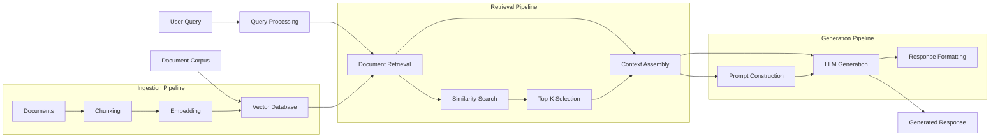

### **🧮 Understanding Embeddings**

**What are Embeddings?**
Embeddings are dense vector representations of text that capture semantic meaning in a high-dimensional space (typically 384-1536 dimensions).

**Why Embeddings are Powerful:**
- **Semantic Similarity**: Similar concepts cluster together in vector space
- **Dimension Reduction**: Compress complex text into manageable vectors
- **Mathematical Operations**: Enable similarity calculations via cosine similarity
- **Transfer Learning**: Pre-trained embeddings capture general language understanding

#### **Embedding Creation Process**

```python
from sentence_transformers import SentenceTransformer
import numpy as np
from typing import List

class EmbeddingGenerator:
    """Generate and manage document embeddings."""
    
    def __init__(self, model_name: str = "sentence-transformers/all-MiniLM-L6-v2"):
        self.model = SentenceTransformer(model_name)
        self.embedding_dim = self.model.get_sentence_embedding_dimension()
    
    def generate_embeddings(self, texts: List[str]) -> np.ndarray:
        """Generate embeddings for a list of texts."""
        embeddings = self.model.encode(
            texts,
            batch_size=32,
            show_progress_bar=True,
            normalize_embeddings=True  # L2 normalization for cosine similarity
        )
        return embeddings
    
    def calculate_similarity(self, embedding1: np.ndarray, 
                           embedding2: np.ndarray) -> float:
        """Calculate cosine similarity between two embeddings."""
        return np.dot(embedding1, embedding2) / (
            np.linalg.norm(embedding1) * np.linalg.norm(embedding2)
        )
    
    def find_most_similar(self, query_embedding: np.ndarray, 
                         candidate_embeddings: np.ndarray, 
                         top_k: int = 5) -> List[int]:
        """Find indices of most similar embeddings."""
        similarities = np.dot(candidate_embeddings, query_embedding)
        top_indices = np.argsort(similarities)[::-1][:top_k]
        return top_indices.tolist()
```

### **💾 Vector Database Operations**

#### **Qdrant Integration**

```python
from qdrant_client import QdrantClient
from qdrant_client.models import (
    Distance, VectorParams, PointStruct, Filter, 
    FieldCondition, MatchValue
)
from typing import List, Dict, Any, Optional
import uuid

class VectorDBManager:
    """Manage vector database operations with Qdrant."""
    
    def __init__(self, host: str = "localhost", port: int = 6333):
        self.client = QdrantClient(host=host, port=port)
        
    def create_collection(self, collection_name: str, 
                         vector_size: int = 384,
                         distance: Distance = Distance.COSINE):
        """Create a new collection with specified parameters."""
        self.client.create_collection(
            collection_name=collection_name,
            vectors_config=VectorParams(
                size=vector_size,
                distance=distance
            )
        )
    
    def upsert_documents(self, collection_name: str, 
                        documents: List[Dict[str, Any]],
                        embeddings: np.ndarray) -> bool:
        """Insert or update documents with their embeddings."""
        points = []
        
        for i, doc in enumerate(documents):
            point = PointStruct(
                id=str(uuid.uuid4()),
                vector=embeddings[i].tolist(),
                payload={
                    "content": doc["content"],
                    "title": doc.get("title", ""),
                    "source_url": doc["source_url"],
                    "platform": doc["platform"],
                    "author_id": str(doc["author_id"]),
                    "metadata": doc.get("metadata", {})
                }
            )
            points.append(point)
        
        operation_result = self.client.upsert(
            collection_name=collection_name,
            points=points
        )
        
        return operation_result.status == "completed"
    
    def search_similar_documents(self, collection_name: str,
                               query_vector: List[float],
                               top_k: int = 10,
                               author_filter: Optional[str] = None) -> List[Dict]:
        """Search for similar documents with optional filtering."""
        search_filter = None
        
        if author_filter:
            search_filter = Filter(
                must=[
                    FieldCondition(
                        key="author_id",
                        match=MatchValue(value=author_filter)
                    )
                ]
            )
        
        search_results = self.client.search(
            collection_name=collection_name,
            query_vector=query_vector,
            query_filter=search_filter,
            limit=top_k,
            with_payload=True
        )
        
        return [
            {
                "id": result.id,
                "score": result.score,
                "content": result.payload["content"],
                "title": result.payload.get("title", ""),
                "source_url": result.payload["source_url"],
                "platform": result.payload["platform"],
                "metadata": result.payload.get("metadata", {})
            }
            for result in search_results
        ]
```

### **🏗️ RAG Feature Pipeline Architecture**

#### **Batch vs. Streaming Pipelines**

| Aspect | Batch Pipeline | Streaming Pipeline |
|--------|----------------|-------------------|
| **Processing** | Process data in chunks at scheduled intervals | Process data continuously as it arrives |
| **Latency** | Higher latency (minutes to hours) | Lower latency (seconds to minutes) |
| **Throughput** | Higher throughput for large volumes | Lower throughput per unit time |
| **Complexity** | Simpler to implement and debug | More complex, requires stream processing |
| **Use Cases** | Daily/weekly data updates | Real-time updates, live feeds |
| **Resource Usage** | Bursty resource consumption | Steady resource consumption |

**LLM Twin Pipeline Choice:** Batch processing (daily updates sufficient for personal content)

#### **Core Pipeline Steps**

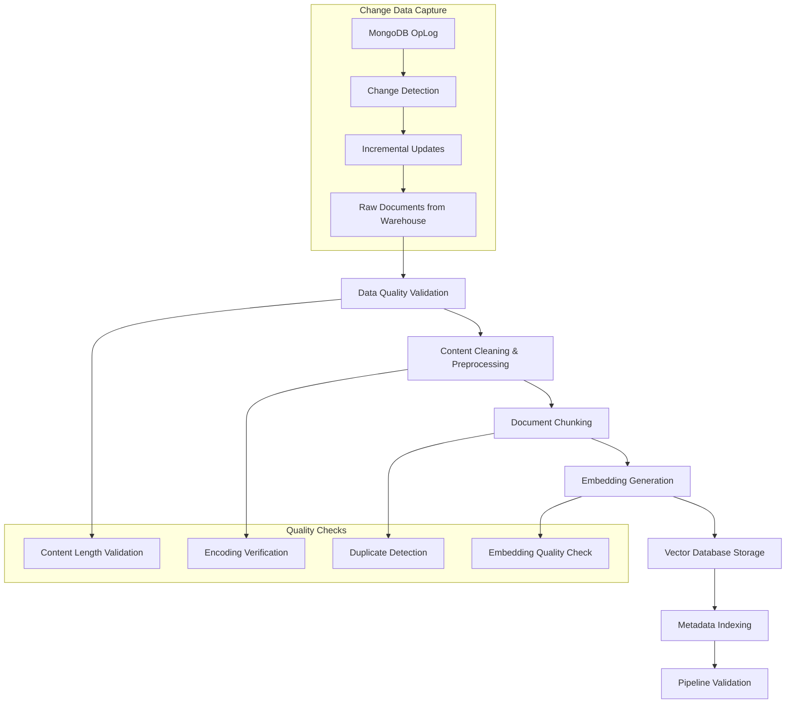

### **🔧 Implementation Details**

#### **ZenML RAG Pipeline Implementation**

```python
from zenml import pipeline, step
from typing import List, Dict, Any, Tuple
import pandas as pd

@step
def query_data_warehouse_step(
    query_params: Dict[str, Any]
) -> pd.DataFrame:
    """Query the MongoDB data warehouse for documents to process."""
    warehouse = NoSQLDataWarehouse()
    
    # Query for new or updated documents
    documents = warehouse.query_documents_since_last_run(
        last_run_timestamp=query_params.get("last_run_timestamp"),
        author_ids=query_params.get("author_ids", []),
        platforms=query_params.get("platforms", [])
    )
    
    return pd.DataFrame(documents)

@step
def clean_documents_step(raw_documents: pd.DataFrame) -> pd.DataFrame:
    """Clean and preprocess document content."""
    cleaner = DocumentCleaner()
    
    cleaned_docs = []
    for _, doc in raw_documents.iterrows():
        cleaned_doc = cleaner.clean_document(doc.to_dict())
        cleaned_docs.append(cleaned_doc)
    
    return pd.DataFrame(cleaned_docs)

@step  
def chunk_documents_step(
    clean_documents: pd.DataFrame,
    chunk_size: int = 500,
    chunk_overlap: int = 50
) -> pd.DataFrame:
    """Split documents into smaller chunks for embedding."""
    chunker = DocumentChunker(
        chunk_size=chunk_size,
        chunk_overlap=chunk_overlap
    )
    
    all_chunks = []
    for _, doc in clean_documents.iterrows():
        chunks = chunker.chunk_document(doc.to_dict())
        all_chunks.extend(chunks)
    
    return pd.DataFrame(all_chunks)

@step
def embed_chunks_step(
    chunks: pd.DataFrame,
    model_name: str = "sentence-transformers/all-MiniLM-L6-v2"
) -> Tuple[pd.DataFrame, np.ndarray]:
    """Generate embeddings for document chunks."""
    embedder = EmbeddingGenerator(model_name)
    
    # Extract content for embedding
    texts = chunks['content'].tolist()
    
    # Generate embeddings
    embeddings = embedder.generate_embeddings(texts)
    
    # Add embedding metadata
    chunks['embedding_model'] = model_name
    chunks['embedding_dim'] = embeddings.shape[1]
    
    return chunks, embeddings

@step
def load_to_vector_db_step(
    chunks: pd.DataFrame, 
    embeddings: np.ndarray,
    collection_name: str = "document_chunks"
) -> bool:
    """Load chunks and embeddings to vector database."""
    vector_db = VectorDBManager()
    
    # Ensure collection exists
    try:
        vector_db.create_collection(
            collection_name=collection_name,
            vector_size=embeddings.shape[1]
        )
    except Exception:
        # Collection might already exist
        pass
    
    # Convert DataFrame to list of dicts
    chunk_dicts = chunks.to_dict('records')
    
    # Upsert to vector database
    success = vector_db.upsert_documents(
        collection_name=collection_name,
        documents=chunk_dicts,
        embeddings=embeddings
    )
    
    return success

@pipeline
def rag_feature_pipeline():
    """Complete RAG feature processing pipeline."""
    # Query new/updated documents
    raw_docs = query_data_warehouse_step()
    
    # Clean and preprocess
    clean_docs = clean_documents_step(raw_docs)
    
    # Chunk documents
    chunks = chunk_documents_step(clean_docs)
    
    # Generate embeddings
    chunks_with_metadata, embeddings = embed_chunks_step(chunks)
    
    # Load to vector database
    success = load_to_vector_db_step(chunks_with_metadata, embeddings)
    
    return success
```

#### **Document Chunking Strategies**

```python
class DocumentChunker:
    """Advanced document chunking with multiple strategies."""
    
    def __init__(self, chunk_size: int = 500, chunk_overlap: int = 50):
        self.chunk_size = chunk_size
        self.chunk_overlap = chunk_overlap
    
    def chunk_by_tokens(self, text: str) -> List[str]:
        """Chunk document by token count."""
        import tiktoken
        
        encoder = tiktoken.get_encoding("cl100k_base")
        tokens = encoder.encode(text)
        
        chunks = []
        for i in range(0, len(tokens), self.chunk_size - self.chunk_overlap):
            chunk_tokens = tokens[i:i + self.chunk_size]
            chunk_text = encoder.decode(chunk_tokens)
            chunks.append(chunk_text)
        
        return chunks
    
    def chunk_by_sentences(self, text: str) -> List[str]:
        """Chunk document by sentence boundaries."""
        import nltk
        nltk.download('punkt', quiet=True)
        
        sentences = nltk.sent_tokenize(text)
        chunks = []
        current_chunk = []
        current_length = 0
        
        for sentence in sentences:
            sentence_length = len(sentence.split())
            
            if current_length + sentence_length > self.chunk_size and current_chunk:
                # Start new chunk
                chunks.append(' '.join(current_chunk))
                
                # Handle overlap
                overlap_sentences = current_chunk[-self.chunk_overlap//20:] if self.chunk_overlap > 0 else []
                current_chunk = overlap_sentences + [sentence]
                current_length = sum(len(s.split()) for s in current_chunk)
            else:
                current_chunk.append(sentence)
                current_length += sentence_length
        
        # Add final chunk
        if current_chunk:
            chunks.append(' '.join(current_chunk))
        
        return chunks
    
    def chunk_by_semantic_similarity(self, text: str, threshold: float = 0.7) -> List[str]:
        """Chunk document by semantic coherence."""
        sentences = nltk.sent_tokenize(text)
        embedder = EmbeddingGenerator()
        
        # Generate embeddings for all sentences
        sentence_embeddings = embedder.generate_embeddings(sentences)
        
        chunks = []
        current_chunk = [sentences[0]]
        current_embeddings = [sentence_embeddings[0]]
        
        for i in range(1, len(sentences)):
            # Calculate similarity with current chunk
            chunk_centroid = np.mean(current_embeddings, axis=0)
            similarity = embedder.calculate_similarity(
                sentence_embeddings[i], 
                chunk_centroid
            )
            
            if similarity >= threshold or len(current_chunk) < 3:
                # Add to current chunk
                current_chunk.append(sentences[i])
                current_embeddings.append(sentence_embeddings[i])
            else:
                # Start new chunk
                chunks.append(' '.join(current_chunk))
                current_chunk = [sentences[i]]
                current_embeddings = [sentence_embeddings[i]]
        
        # Add final chunk
        if current_chunk:
            chunks.append(' '.join(current_chunk))
        
        return chunks
    
    def chunk_document(self, document: Dict[str, Any], 
                      strategy: str = "tokens") -> List[Dict[str, Any]]:
        """Chunk a document using specified strategy."""
        content = document['content']
        
        # Choose chunking strategy
        if strategy == "tokens":
            chunks = self.chunk_by_tokens(content)
        elif strategy == "sentences":
            chunks = self.chunk_by_sentences(content)
        elif strategy == "semantic":
            chunks = self.chunk_by_semantic_similarity(content)
        else:
            raise ValueError(f"Unknown chunking strategy: {strategy}")
        
        # Create chunk documents
        chunk_documents = []
        for i, chunk in enumerate(chunks):
            chunk_doc = {
                **document,  # Copy all original fields
                'content': chunk,
                'chunk_index': i,
                'total_chunks': len(chunks),
                'chunk_strategy': strategy,
                'parent_document_id': document['id']
            }
            chunk_documents.append(chunk_doc)
        
        return chunk_documents
```

### **🔍 Advanced RAG Techniques Overview**

#### **Three Stages of RAG Optimization**

| Stage | Focus Area | Techniques |
|-------|------------|------------|
| **Pre-retrieval** | Data indexing & query optimization | Sliding window, metadata enhancement, query expansion |
| **Retrieval** | Embedding models & search algorithms | Dense/sparse retrieval, hybrid search, filtered search |
| **Post-retrieval** | Result refinement & context optimization | Reranking, compression, redundancy removal |

#### **Pre-retrieval Optimizations**

**1. Sliding Window Chunking:**
```python
def sliding_window_chunk(text: str, window_size: int = 500, 
                        stride: int = 250) -> List[Dict[str, Any]]:
    """Create overlapping chunks with sliding window."""
    words = text.split()
    chunks = []
    
    for i in range(0, len(words), stride):
        chunk_words = words[i:i + window_size]
        if len(chunk_words) < window_size // 2:  # Skip very small chunks
            break
            
        chunk = {
            'content': ' '.join(chunk_words),
            'start_index': i,
            'end_index': min(i + window_size, len(words)),
            'overlap_prev': i > 0,
            'overlap_next': i + window_size < len(words)
        }
        chunks.append(chunk)
    
    return chunks
```

**2. Metadata Enhancement:**
```python
def enhance_with_metadata(document: Dict[str, Any]) -> Dict[str, Any]:
    """Add rich metadata for better filtering and retrieval."""
    content = document['content']
    
    # Extract structural metadata
    metadata = {
        'word_count': len(content.split()),
        'char_count': len(content),
        'paragraph_count': len([p for p in content.split('\n\n') if p.strip()]),
        'avg_sentence_length': calculate_avg_sentence_length(content),
        'readability_score': calculate_readability(content),
        'language': detect_language(content),
        'topics': extract_topics(content),
        'entities': extract_named_entities(content),
        'sentiment': analyze_sentiment(content)
    }
    
    document['metadata'].update(metadata)
    return document
```

#### **Retrieval Optimizations**

**Hybrid Search (Dense + Sparse):**
```python
class HybridRetriever:
    """Combine dense vector search with sparse keyword search."""
    
    def __init__(self, vector_db: VectorDBManager, elastic_client):
        self.vector_db = vector_db
        self.elastic = elastic_client
        
    def hybrid_search(self, query: str, collection_name: str,
                     top_k: int = 10, alpha: float = 0.7) -> List[Dict]:
        """Combine vector and keyword search results."""
        # Dense vector search
        query_embedding = self.embed_query(query)
        vector_results = self.vector_db.search_similar_documents(
            collection_name=collection_name,
            query_vector=query_embedding,
            top_k=top_k * 2  # Get more candidates
        )
        
        # Sparse keyword search
        keyword_results = self.elastic.search(
            index=collection_name,
            body={
                "query": {
                    "multi_match": {
                        "query": query,
                        "fields": ["content", "title"],
                        "type": "best_fields"
                    }
                },
                "size": top_k * 2
            }
        )
        
        # Combine and rerank results
        combined_results = self._combine_results(
            vector_results, keyword_results, alpha
        )
        
        return combined_results[:top_k]
    
    def _combine_results(self, vector_results: List[Dict], 
                        keyword_results: Dict, alpha: float) -> List[Dict]:
        """Combine and score results from both search methods."""
        # Normalize scores and combine
        result_map = {}
        
        # Process vector results
        max_vector_score = max(r['score'] for r in vector_results) if vector_results else 1
        for result in vector_results:
            doc_id = result['id']
            normalized_score = result['score'] / max_vector_score
            result_map[doc_id] = {
                **result,
                'vector_score': normalized_score,
                'keyword_score': 0.0,
                'combined_score': alpha * normalized_score
            }
        
        # Process keyword results
        hits = keyword_results['hits']['hits']
        max_keyword_score = max(hit['_score'] for hit in hits) if hits else 1
        
        for hit in hits:
            doc_id = hit['_id']
            normalized_score = hit['_score'] / max_keyword_score
            
            if doc_id in result_map:
                # Update existing result
                result_map[doc_id]['keyword_score'] = normalized_score
                result_map[doc_id]['combined_score'] = (
                    alpha * result_map[doc_id]['vector_score'] + 
                    (1 - alpha) * normalized_score
                )
            else:
                # Add new result
                result_map[doc_id] = {
                    'id': doc_id,
                    'content': hit['_source']['content'],
                    'title': hit['_source'].get('title', ''),
                    'vector_score': 0.0,
                    'keyword_score': normalized_score,
                    'combined_score': (1 - alpha) * normalized_score
                }
        
        # Sort by combined score
        sorted_results = sorted(
            result_map.values(),
            key=lambda x: x['combined_score'],
            reverse=True
        )
        
        return sorted_results
```

### **📈 Change Data Capture (CDC)**

```python
from pymongo.change_stream import ChangeStream
import asyncio

class CDCManager:
    """Manage change data capture from MongoDB to trigger pipeline updates."""
    
    def __init__(self, mongo_client, vector_db: VectorDBManager):
        self.mongo_client = mongo_client
        self.vector_db = vector_db
        self.running = False
    
    async def watch_collection_changes(self, collection_name: str):
        """Watch for changes in MongoDB collection and update vector DB."""
        collection = self.mongo_client.get_collection(collection_name)
        
        # Define pipeline to watch for insert, update, delete operations
        pipeline = [
            {
                '$match': {
                    'operationType': {'$in': ['insert', 'update', 'delete']}
                }
            }
        ]
        
        self.running = True
        
        try:
            with collection.watch(pipeline) as change_stream:
                for change in change_stream:
                    if not self.running:
                        break
                        
                    await self._process_change(change, collection_name)
                    
        except Exception as e:
            logger.error(f"CDC error for {collection_name}: {str(e)}")
        
    async def _process_change(self, change: Dict[str, Any], collection_name: str):
        """Process individual change events."""
        operation_type = change['operationType']
        
        if operation_type == 'insert':
            await self._handle_insert(change, collection_name)
        elif operation_type == 'update':
            await self._handle_update(change, collection_name)
        elif operation_type == 'delete':
            await self._handle_delete(change, collection_name)
    
    async def _handle_insert(self, change: Dict[str, Any], collection_name: str):
        """Handle document insertion."""
        document = change['fullDocument']
        
        # Process new document through RAG pipeline
        chunks = self._chunk_document(document)
        embeddings = self._generate_embeddings(chunks)
        
        # Update vector database
        await self.vector_db.upsert_documents(
            collection_name=f"{collection_name}_chunks",
            documents=chunks,
            embeddings=embeddings
        )
        
        logger.info(f"Processed new document: {document.get('id', 'unknown')}")
    
    async def _handle_update(self, change: Dict[str, Any], collection_name: str):
        """Handle document updates."""
        document_id = change['documentKey']['_id']
        updated_fields = change.get('updateDescription', {}).get('updatedFields', {})
        
        # If content was updated, reprocess the document
        if 'content' in updated_fields:
            # Remove old chunks
            await self._remove_document_chunks(document_id, collection_name)
            
            # Process updated document
            full_document = await self._fetch_full_document(document_id, collection_name)
            await self._handle_insert({'fullDocument': full_document}, collection_name)
        
        logger.info(f"Processed document update: {document_id}")
    
    async def _handle_delete(self, change: Dict[str, Any], collection_name: str):
        """Handle document deletion."""
        document_id = change['documentKey']['_id']
        
        # Remove associated chunks from vector database
        await self._remove_document_chunks(document_id, collection_name)
        
        logger.info(f"Processed document deletion: {document_id}")
    
    def stop_watching(self):
        """Stop the CDC process."""
        self.running = False
```

---

## Chapter 5: Supervised Fine-Tuning

### **🎯 Creating Instruction Datasets**

Supervised Fine-Tuning (SFT) transforms base LLMs into instruction-following models by training on carefully curated instruction-answer pairs.

#### **General Framework for Instruction Datasets**

**Dataset Structure:**
```python
from typing import Dict, Any, List, Optional
from pydantic import BaseModel

class InstructionSample(BaseModel):
    """Schema for instruction dataset samples."""
    
    instruction: str  # Task description or question
    input: Optional[str] = None  # Additional context or data
    output: str  # Expected response or answer
    system: Optional[str] = None  # System prompt for behavior steering
    
    class Config:
        schema_extra = {
            "example": {
                "system": "You are a helpful AI assistant that provides clear explanations.",
                "instruction": "Explain the concept of supervised fine-tuning for large language models.",
                "input": "Focus on the key benefits and use cases.",
                "output": "Supervised fine-tuning (SFT) is a process where a pre-trained language model..."
            }
        }
```

#### **Data Quality Dimensions**

| Dimension | Definition | Evaluation Methods |
|-----------|------------|-------------------|
| **Accuracy** | Factual correctness and relevance | Expert review, fact-checking, cross-validation |
| **Diversity** | Coverage of different topics, styles, lengths | Topic clustering, statistical analysis |
| **Complexity** | Challenging reasoning and multi-step problems | Difficulty scoring, cognitive load assessment |

#### **Data Quantity Guidelines**

| Model Size | Minimum Samples | Recommended Samples | Notes |
|------------|----------------|-------------------|-------|
| **70B+ parameters** | 1,000 | 5,000-10,000 | High-quality samples sufficient |
| **7B-30B parameters** | 10,000 | 50,000-100,000 | Need more samples for chat template learning |
| **<7B parameters** | 50,000 | 100,000+ | Require extensive examples |

### **📊 Data Curation Pipeline**

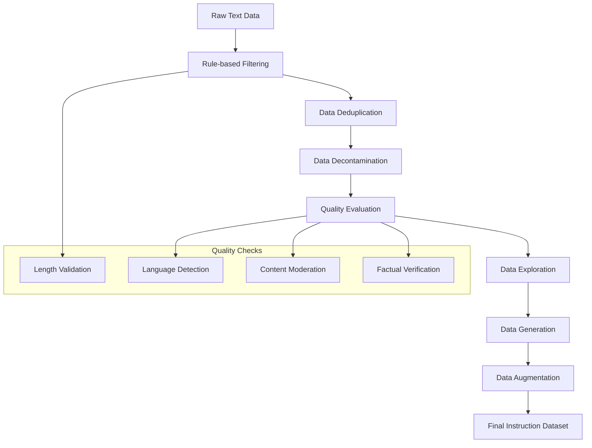

#### **Rule-based Filtering Implementation**

```python
import re
from typing import List, Dict, Any
from langdetect import detect

class InstructionDatasetFilter:
    """Comprehensive filtering for instruction datasets."""
    
    def __init__(self):
        self.min_instruction_length = 10
        self.max_instruction_length = 2000
        self.min_output_length = 5
        self.max_output_length = 4000
        
        # Content quality patterns
        self.spam_patterns = [
            r'click here',
            r'subscribe now',
            r'buy now',
            r'\$\d+\.\d+',  # Prices
            r'www\.[a-zA-Z0-9.-]+\.[a-zA-Z]{2,}'  # URLs
        ]
        
        self.low_quality_patterns = [
            r'^(yes|no|ok|sure)\.?$',  # Too short responses
            r'(.)\1{4,}',  # Repeated characters
            r'^[A-Z\s!]+$',  # All caps
        ]
    
    def filter_dataset(self, samples: List[Dict[str, Any]]) -> List[Dict[str, Any]]:
        """Apply all filters to dataset."""
        filtered_samples = []
        
        for sample in samples:
            if self._is_valid_sample(sample):
                filtered_samples.append(sample)
        
        return filtered_samples
    
    def _is_valid_sample(self, sample: Dict[str, Any]) -> bool:
        """Check if sample meets quality criteria."""
        instruction = sample.get('instruction', '')
        output = sample.get('output', '')
        
        # Length checks
        if not self._check_length(instruction, self.min_instruction_length, 
                                 self.max_instruction_length):
            return False
            
        if not self._check_length(output, self.min_output_length, 
                                 self.max_output_length):
            return False
        
        # Language detection
        try:
            if detect(instruction) != 'en' or detect(output) != 'en':
                return False
        except:
            return False  # Skip if language detection fails
        
        # Content quality checks
        if self._contains_spam(instruction) or self._contains_spam(output):
            return False
            
        if self._is_low_quality(output):
            return False
        
        # Instruction-output consistency
        if not self._check_instruction_output_consistency(instruction, output):
            return False
        
        return True
    
    def _check_length(self, text: str, min_len: int, max_len: int) -> bool:
        """Check if text length is within bounds."""
        return min_len <= len(text.split()) <= max_len
    
    def _contains_spam(self, text: str) -> bool:
        """Check for spam patterns."""
        text_lower = text.lower()
        return any(re.search(pattern, text_lower) for pattern in self.spam_patterns)
    
    def _is_low_quality(self, text: str) -> bool:
        """Check for low-quality content patterns."""
        return any(re.search(pattern, text, re.IGNORECASE) 
                  for pattern in self.low_quality_patterns)
    
    def _check_instruction_output_consistency(self, instruction: str, output: str) -> bool:
        """Basic consistency check between instruction and output."""
        # Check if output is not just repeating the instruction
        instruction_words = set(instruction.lower().split())
        output_words = set(output.lower().split())
        
        # If output is >80% same words as instruction, likely low quality
        if len(instruction_words & output_words) / len(output_words) > 0.8:
            return False
        
        return True
```

#### **Data Deduplication Strategies**

```python
import hashlib
from sklearn.feature_extraction.text import TfidfVectorizer
from sklearn.metrics.pairwise import cosine_similarity
import numpy as np

class DataDeduplicator:
    """Remove duplicate and near-duplicate samples."""
    
    def __init__(self, similarity_threshold: float = 0.85):
        self.similarity_threshold = similarity_threshold
        self.vectorizer = TfidfVectorizer(
            ngram_range=(1, 3),
            max_features=10000,
            stop_words='english'
        )
    
    def deduplicate_dataset(self, samples: List[Dict[str, Any]]) -> List[Dict[str, Any]]:
        """Remove duplicates using multiple methods."""
        # 1. Exact deduplication
        samples = self._exact_deduplication(samples)
        
        # 2. Near-duplicate detection
        samples = self._fuzzy_deduplication(samples)
        
        return samples
    
    def _exact_deduplication(self, samples: List[Dict[str, Any]]) -> List[Dict[str, Any]]:
        """Remove exact duplicates using content hashing."""
        seen_hashes = set()
        unique_samples = []
        
        for sample in samples:
            # Create content hash from instruction + output
            content = sample['instruction'] + sample['output']
            content_hash = hashlib.md5(content.encode()).hexdigest()
            
            if content_hash not in seen_hashes:
                seen_hashes.add(content_hash)
                unique_samples.append(sample)
        
        return unique_samples
    
    def _fuzzy_deduplication(self, samples: List[Dict[str, Any]]) -> List[Dict[str, Any]]:
        """Remove near-duplicates using TF-IDF similarity."""
        if len(samples) < 2:
            return samples
        
        # Combine instruction and output for similarity calculation
        texts = [sample['instruction'] + ' ' + sample['output'] for sample in samples]
        
        # Vectorize texts
        tfidf_matrix = self.vectorizer.fit_transform(texts)
        
        # Calculate pairwise similarities
        similarity_matrix = cosine_similarity(tfidf_matrix)
        
        # Find duplicates
        to_remove = set()
        for i in range(len(similarity_matrix)):
            if i in to_remove:
                continue
                
            for j in range(i + 1, len(similarity_matrix)):
                if j in to_remove:
                    continue
                    
                if similarity_matrix[i][j] >= self.similarity_threshold:
                    # Keep the shorter sample (often higher quality)
                    if len(texts[i]) <= len(texts[j]):
                        to_remove.add(j)
                    else:
                        to_remove.add(i)
                        break
        
        # Return samples not marked for removal
        return [sample for i, sample in enumerate(samples) if i not in to_remove]
```

#### **Data Generation with LLMs**

```python
from openai import OpenAI
from typing import List, Dict, Any
import asyncio
import json

class InstructionDataGenerator:
    """Generate instruction-answer pairs from raw content."""
    
    def __init__(self, openai_client: OpenAI):
        self.client = openai_client
        self.generation_prompt = """
        Based on the following content, create a high-quality instruction-answer pair that would help someone learn from this information.

        Content: {content}

        Requirements:
        1. Create a clear, specific instruction that asks for information contained in the content
        2. Provide a comprehensive answer based solely on the content
        3. Make the instruction educational and valuable
        4. Ensure the answer is accurate and well-structured

        Format your response as JSON:
        {
            "instruction": "Your instruction here",
            "output": "Your detailed answer here"
        }
        """
    
    async def generate_instruction_pairs(self, content_documents: List[Dict[str, Any]]) -> List[Dict[str, Any]]:
        """Generate instruction-answer pairs from content documents."""
        instruction_pairs = []
        
        for doc in content_documents:
            try:
                pairs = await self._generate_pairs_for_document(doc)
                instruction_pairs.extend(pairs)
            except Exception as e:
                print(f"Error generating pairs for document {doc.get('id', 'unknown')}: {e}")
                continue
        
        return instruction_pairs
    
    async def _generate_pairs_for_document(self, document: Dict[str, Any]) -> List[Dict[str, Any]]:
        """Generate multiple instruction-answer pairs from a single document."""
        content = document['content']
        
        # Split long content into chunks
        chunks = self._split_content_for_generation(content)
        
        pairs = []
        for chunk in chunks:
            try:
                response = await self.client.chat.completions.create(
                    model="gpt-4o-mini",
                    messages=[
                        {
                            "role": "system",
                            "content": "You are an expert at creating educational instruction-answer pairs from content."
                        },
                        {
                            "role": "user",
                            "content": self.generation_prompt.format(content=chunk)
                        }
                    ],
                    temperature=0.7,
                    max_tokens=1000
                )
                
                # Parse JSON response
                generated_content = response.choices[0].message.content
                pair_data = json.loads(generated_content)
                
                # Add metadata from original document
                pair = {
                    'instruction': pair_data['instruction'],
                    'output': pair_data['output'],
                    'source_document_id': document.get('id'),
                    'source_url': document.get('source_url'),
                    'platform': document.get('platform'),
                    'author_id': document.get('author_id'),
                    'generated_at': datetime.utcnow().isoformat()
                }
                
                pairs.append(pair)
                
            except Exception as e:
                print(f"Error generating pair for chunk: {e}")
                continue
        
        return pairs
    
    def _split_content_for_generation(self, content: str, max_chunk_size: int = 2000) -> List[str]:
        """Split content into manageable chunks for generation."""
        words = content.split()
        chunks = []
        
        current_chunk = []
        current_size = 0
        
        for word in words:
            if current_size + len(word) > max_chunk_size and current_chunk:
                chunks.append(' '.join(current_chunk))
                current_chunk = [word]
                current_size = len(word)
            else:
                current_chunk.append(word)
                current_size += len(word) + 1  # +1 for space
        
        if current_chunk:
            chunks.append(' '.join(current_chunk))
        
        return chunks
```

### **🔧 SFT Techniques & Implementation**

#### **When to Fine-tune vs. Alternatives**

| Scenario | Recommended Approach | Rationale |
|----------|---------------------|-----------|
| **New domain knowledge** | Fine-tuning | Incorporates specialized knowledge into model weights |
| **Style adaptation** | Fine-tuning | Changes model's inherent generation patterns |
| **Up-to-date information** | RAG | Keeps information current without retraining |
| **Factual Q&A** | RAG | Grounds responses in verifiable sources |
| **Task-specific behavior** | Fine-tuning | Teaches specific task patterns and formats |
| **Cost-sensitive applications** | RAG | Avoids expensive retraining cycles |

#### **Chat Template Formats**

**Key Chat Templates:**

| Template | Format Example | Use Cases |
|----------|----------------|-----------|
| **Alpaca** | `### Instruction: {instruction}\n### Response: {response}` | Simple, clear format |
| **ChatML** | `<\|im_start\|>user\n{message}<\|im_end\|>` | Conversational interfaces |
| **Llama 3** | `<\|begin_of_text\|><\|start_header_id\|>user<\|end_header_id\|>` | Advanced conversation handling |

**Implementation:**
```python
class ChatTemplateManager:
    """Manage different chat templates for fine-tuning."""
    
    TEMPLATES = {
        'alpaca': {
            'template': "### Instruction:\n{instruction}\n\n### Response:\n{response}",
            'eos_token': "</s>"
        },
        'chatml': {
            'template': "<|im_start|>user\n{instruction}<|im_end|>\n<|im_start|>assistant\n{response}<|im_end|>",
            'eos_token': "<|im_end|>"
        },
        'llama3': {
            'template': "<|begin_of_text|><|start_header_id|>user<|end_header_id|>\n\n{instruction}<|eot_id|><|start_header_id|>assistant<|end_header_id|>\n\n{response}<|eot_id|>",
            'eos_token': "<|eot_id|>"
        }
    }
    
    def format_sample(self, sample: Dict[str, Any], template_name: str) -> str:
        """Format instruction sample with specified template."""
        template_config = self.TEMPLATES[template_name]
        
        formatted = template_config['template'].format(
            instruction=sample['instruction'],
            response=sample['output']
        )
        
        # Add EOS token
        formatted += template_config['eos_token']
        
        return formatted
    
    def prepare_dataset_for_training(self, dataset: List[Dict[str, Any]], 
                                   template_name: str) -> List[str]:
        """Prepare entire dataset with consistent formatting."""
        return [self.format_sample(sample, template_name) for sample in dataset]
```

### **⚡ Parameter-Efficient Fine-Tuning (PEFT)**

#### **Comparison of PEFT Techniques**

| Technique | Trainable Parameters | Memory Usage | Training Speed | Performance |
|-----------|---------------------|--------------|----------------|-------------|
| **Full Fine-tuning** | 100% | Very High | Slow | Best |
| **LoRA** | 0.1-1% | Medium | Fast | Very Good |
| **QLoRA** | 0.1-1% | Low | Fast | Good |

#### **LoRA (Low-Rank Adaptation) Implementation**

```python
from peft import LoraConfig, get_peft_model, TaskType
from transformers import AutoModelForCausalLM
import torch

class LoRATrainer:
    """LoRA fine-tuning implementation."""
    
    def __init__(self, model_name: str, lora_config: Dict[str, Any]):
        self.model_name = model_name
        self.lora_config = lora_config
        
    def setup_lora_model(self) -> tuple:
        """Setup model with LoRA adapters."""
        # Load base model
        model = AutoModelForCausalLM.from_pretrained(
            self.model_name,
            torch_dtype=torch.float16,
            device_map="auto"
        )
        
        # Configure LoRA
        lora_config = LoraConfig(
            r=self.lora_config.get('rank', 16),  # Rank of adaptation
            lora_alpha=self.lora_config.get('alpha', 32),  # LoRA scaling parameter
            target_modules=self.lora_config.get('target_modules', [
                "q_proj", "k_proj", "v_proj", "o_proj",
                "gate_proj", "up_proj", "down_proj"
            ]),
            lora_dropout=self.lora_config.get('dropout', 0.1),
            bias="none",
            task_type=TaskType.CAUSAL_LM
        )
        
        # Apply LoRA to model
        model = get_peft_model(model, lora_config)
        
        # Print trainable parameters
        model.print_trainable_parameters()
        
        return model, lora_config
    
    def calculate_memory_requirements(self, model) -> Dict[str, str]:
        """Calculate approximate memory requirements."""
        # Count parameters
        total_params = sum(p.numel() for p in model.parameters())
        trainable_params = sum(p.numel() for p in model.parameters() if p.requires_grad)
        
        # Estimate memory (rough approximation)
        # Model weights + gradients + optimizer states + activations
        model_memory = total_params * 2  # FP16
        training_memory = trainable_params * 8  # Gradients + optimizer states
        
        return {
            'total_parameters': f"{total_params:,}",
            'trainable_parameters': f"{trainable_params:,}",
            'trainable_percentage': f"{100 * trainable_params / total_params:.2f}%",
            'estimated_model_memory_gb': f"{model_memory * 2 / 1e9:.2f}",
            'estimated_training_memory_gb': f"{(model_memory + training_memory) * 2 / 1e9:.2f}"
        }
```

#### **QLoRA (Quantized LoRA) Implementation**

```python
from transformers import BitsAndBytesConfig
import torch

class QLoRATrainer(LoRATrainer):
    """QLoRA implementation with 4-bit quantization."""
    
    def setup_quantized_model(self) -> tuple:
        """Setup model with 4-bit quantization and LoRA."""
        # 4-bit quantization config
        bnb_config = BitsAndBytesConfig(
            load_in_4bit=True,
            bnb_4bit_quant_type="nf4",  # Normal Float 4-bit
            bnb_4bit_compute_dtype=torch.float16,
            bnb_4bit_use_double_quant=True  # Nested quantization
        )
        
        # Load quantized model
        model = AutoModelForCausalLM.from_pretrained(
            self.model_name,
            quantization_config=bnb_config,
            device_map="auto",
            torch_dtype=torch.float16
        )
        
        # Enable gradient checkpointing for memory efficiency
        model.gradient_checkpointing_enable()
        
        # Configure LoRA for quantized model
        lora_config = LoraConfig(
            r=self.lora_config.get('rank', 16),
            lora_alpha=self.lora_config.get('alpha', 32),
            target_modules=self.lora_config.get('target_modules', [
                "q_proj", "k_proj", "v_proj", "o_proj",
                "gate_proj", "up_proj", "down_proj"
            ]),
            lora_dropout=self.lora_config.get('dropout', 0.1),
            bias="none",
            task_type=TaskType.CAUSAL_LM
        )
        
        # Apply LoRA
        model = get_peft_model(model, lora_config)
        
        return model, lora_config
```

### **📊 Training Configuration & Best Practices**

#### **Optimal Training Parameters**

```python
from dataclasses import dataclass
from typing import Optional

@dataclass
class TrainingConfig:
    """Comprehensive training configuration."""
    
    # Model and data
    model_name: str = "microsoft/DialoGPT-medium"
    dataset_path: str = "instruction_dataset.json"
    output_dir: str = "./fine_tuned_model"
    
    # Training parameters
    learning_rate: float = 2e-4  # Higher for LoRA, lower for full fine-tuning
    batch_size: int = 4  # Adjust based on GPU memory
    gradient_accumulation_steps: int = 4  # Effective batch size = batch_size * grad_accum
    num_epochs: int = 3  # Start with fewer epochs to avoid overfitting
    max_seq_length: int = 512  # Balance between context and memory
    
    # Optimization
    optimizer: str = "adamw_torch"
    weight_decay: float = 0.01
    lr_scheduler_type: str = "cosine"
    warmup_ratio: float = 0.03  # 3% of total steps for warmup
    
    # Memory optimization
    gradient_checkpointing: bool = True
    dataloader_pin_memory: bool = True
    dataloader_num_workers: int = 4
    
    # Monitoring and saving
    eval_steps: int = 100
    save_steps: int = 500
    logging_steps: int = 10
    save_total_limit: int = 3
    
    # Early stopping
    early_stopping_patience: int = 3
    early_stopping_threshold: float = 0.01
    
    # Advanced options
    packing: bool = True  # Pack multiple samples in one sequence
    response_template: str = "### Response:"  # For response-only training

class TrainingPipeline:
    """Complete training pipeline with best practices."""
    
    def __init__(self, config: TrainingConfig):
        self.config = config
        
    def setup_training(self):
        """Setup all components for training."""
        from transformers import (
            AutoTokenizer, TrainingArguments, 
            DataCollatorForLanguageModeling
        )
        from trl import SFTTrainer
        
        # Load tokenizer
        tokenizer = AutoTokenizer.from_pretrained(self.config.model_name)
        if tokenizer.pad_token is None:
            tokenizer.pad_token = tokenizer.eos_token
        
        # Setup model (LoRA or QLoRA)
        if self.config.use_qlora:
            trainer_class = QLoRATrainer(self.config.model_name, self.config.lora_config)
            model, _ = trainer_class.setup_quantized_model()
        else:
            trainer_class = LoRATrainer(self.config.model_name, self.config.lora_config)
            model, _ = trainer_class.setup_lora_model()
        
        # Training arguments
        training_args = TrainingArguments(
            output_dir=self.config.output_dir,
            num_train_epochs=self.config.num_epochs,
            per_device_train_batch_size=self.config.batch_size,
            gradient_accumulation_steps=self.config.gradient_accumulation_steps,
            learning_rate=self.config.learning_rate,
            weight_decay=self.config.weight_decay,
            lr_scheduler_type=self.config.lr_scheduler_type,
            warmup_ratio=self.config.warmup_ratio,
            logging_steps=self.config.logging_steps,
            eval_steps=self.config.eval_steps,
            save_steps=self.config.save_steps,
            save_total_limit=self.config.save_total_limit,
            gradient_checkpointing=self.config.gradient_checkpointing,
            dataloader_pin_memory=self.config.dataloader_pin_memory,
            dataloader_num_workers=self.config.dataloader_num_workers,
            fp16=True,  # Use mixed precision
            report_to="comet_ml",  # Experiment tracking
            run_name=f"llm_twin_sft_{datetime.now().strftime('%Y%m%d_%H%M%S')}"
        )
        
        # Setup trainer
        trainer = SFTTrainer(
            model=model,
            tokenizer=tokenizer,
            train_dataset=self.load_dataset(),
            args=training_args,
            max_seq_length=self.config.max_seq_length,
            packing=self.config.packing,
            response_template=self.config.response_template
        )
        
        return trainer
    
    def train(self):
        """Execute training pipeline."""
        trainer = self.setup_training()
        
        # Start training
        trainer.train()
        
        # Save final model
        trainer.save_model()
        
        # Save training metrics
        self.save_training_metrics(trainer)
        
        return trainer
    
    def save_training_metrics(self, trainer):
        """Save training metrics and model info."""
        metrics = {
            'final_loss': trainer.state.log_history[-1].get('train_loss'),
            'total_steps': trainer.state.global_step,
            'epochs_completed': trainer.state.epoch,
            'model_config': self.config.__dict__
        }
        
        with open(f"{self.config.output_dir}/training_metrics.json", 'w') as f:
            json.dump(metrics, f, indent=2)
```

#### **Monitoring Training Progress**

```python
import matplotlib.pyplot as plt
from typing import List, Dict
import pandas as pd

class TrainingMonitor:
    """Monitor and visualize training progress."""
    
    def __init__(self, log_history: List[Dict]):
        self.log_history = log_history
        self.df = pd.DataFrame(log_history)
    
    def plot_training_curves(self, save_path: str = None):
        """Plot training loss and learning rate curves."""
        fig, (ax1, ax2) = plt.subplots(1, 2, figsize=(15, 6))
        
        # Training loss
        if 'train_loss' in self.df.columns:
            ax1.plot(self.df['step'], self.df['train_loss'], label='Training Loss', color='blue')
            ax1.set_xlabel('Steps')
            ax1.set_ylabel('Loss')
            ax1.set_title('Training Loss Over Time')
            ax1.legend()
            ax1.grid(True)
        
        # Learning rate
        if 'learning_rate' in self.df.columns:
            ax2.plot(self.df['step'], self.df['learning_rate'], label='Learning Rate', color='red')
            ax2.set_xlabel('Steps')
            ax2.set_ylabel('Learning Rate')
            ax2.set_title('Learning Rate Schedule')
            ax2.legend()
            ax2.grid(True)
        
        plt.tight_layout()
        
        if save_path:
            plt.savefig(save_path, dpi=300, bbox_inches='tight')
        
        plt.show()
    
    def analyze_training_stability(self) -> Dict[str, Any]:
        """Analyze training stability and provide recommendations."""
        analysis = {}
        
        if 'train_loss' in self.df.columns:
            losses = self.df['train_loss'].dropna()
            
            # Loss trend analysis
            if len(losses) > 10:
                recent_losses = losses.tail(10)
                early_losses = losses.head(10)
                
                analysis['loss_reduction'] = early_losses.mean() - recent_losses.mean()
                analysis['loss_variance'] = recent_losses.var()
                analysis['is_converging'] = recent_losses.is_monotonic_decreasing
                
                # Recommendations
                recommendations = []
                
                if analysis['loss_variance'] > 0.1:
                    recommendations.append("High loss variance - consider reducing learning rate")
                
                if analysis['loss_reduction'] < 0.01:
                    recommendations.append("Slow convergence - consider increasing learning rate or batch size")
                
                if not analysis['is_converging']:
                    recommendations.append("Loss not consistently decreasing - check for overfitting")
                
                analysis['recommendations'] = recommendations
        
        return analysis
```

---

## Chapter 6: Fine-Tuning with Preference Alignment

### **🎯 Understanding Preference Datasets**

Preference alignment addresses limitations of SFT by incorporating human feedback to better align models with human preferences and values.

#### **Types of Preference Datasets**

| Generation Method | Evaluation Method | Description | Quality | Cost |
|------------------|-------------------|-------------|---------|------|
| **Human-generated, Human-evaluated** | Human | Highest quality, most expensive | Excellent | Very High |
| **Human-generated, LLM-evaluated** | LLM | Good quality, moderate cost | Good | Medium |
| **LLM-generated, Human-evaluated** | Human | Scalable generation, human oversight | Good | Medium |
| **LLM-generated, LLM-evaluated** | LLM | Most scalable, lowest cost | Fair | Low |

#### **Preference Dataset Structure**

```python
from typing import List, Dict, Any, Literal
from pydantic import BaseModel

class PreferenceSample(BaseModel):
    """Schema for preference dataset samples."""
    
    prompt: str  # Original instruction/query
    chosen: str  # Preferred response
    rejected: str  # Less preferred response
    reason: str  # Explanation for preference
    quality_score: float  # Quality rating (0-1)
    
    class Config:
        schema_extra = {
            "example": {
                "prompt": "Explain quantum computing in simple terms.",
                "chosen": "Quantum computing uses quantum mechanics principles to process information...",
                "rejected": "Quantum computing is very complicated and hard to understand...",
                "reason": "The chosen response provides clear explanation while rejected is vague",
                "quality_score": 0.85
            }
        }

class PreferenceDatasetGenerator:
    """Generate preference datasets for alignment training."""
    
    def __init__(self, openai_client):
        self.client = openai_client
        
    async def generate_preference_pairs(self, prompts: List[str]) -> List[PreferenceSample]:
        """Generate preference pairs for given prompts."""
        preference_samples = []
        
        for prompt in prompts:
            try:
                # Generate multiple responses
                responses = await self._generate_multiple_responses(prompt)
                
                # Evaluate and rank responses
                ranked_responses = await self._rank_responses(prompt, responses)
                
                # Create preference pairs
                pairs = self._create_preference_pairs(prompt, ranked_responses)
                preference_samples.extend(pairs)
                
            except Exception as e:
                print(f"Error generating preferences for prompt: {e}")
                continue
        
        return preference_samples
    
    async def _generate_multiple_responses(self, prompt: str, num_responses: int = 4) -> List[str]:
        """Generate multiple responses for comparison."""
        responses = []
        
        for i in range(num_responses):
            response = await self.client.chat.completions.create(
                model="gpt-4o-mini",
                messages=[
                    {"role": "system", "content": "You are a helpful assistant."},
                    {"role": "user", "content": prompt}
                ],
                temperature=0.7 + (i * 0.1),  # Vary temperature for diversity
                max_tokens=500
            )
            
            responses.append(response.choices[0].message.content)
        
        return responses
    
    async def _rank_responses(self, prompt: str, responses: List[str]) -> List[Dict[str, Any]]:
        """Rank responses by quality using LLM evaluation."""
        ranking_prompt = f"""
        Evaluate and rank the following responses to the prompt: "{prompt}"
        
        Responses:
        {chr(10).join([f"{i+1}. {resp}" for i, resp in enumerate(responses)])}
        
        Rank them from best (1) to worst ({len(responses)}) based on:
        - Accuracy and factual correctness
        - Clarity and coherence
        - Helpfulness and completeness
        - Appropriate tone and style
        
        Return as JSON with scores:
        {{
            "rankings": [
                {{"response_index": 0, "rank": 1, "score": 0.95, "reason": "explanation"}},
                ...
            ]
        }}
        """
        
        response = await self.client.chat.completions.create(
            model="gpt-4o",
            messages=[{"role": "user", "content": ranking_prompt}],
            temperature=0.1
        )
        
        ranking_data = json.loads(response.choices[0].message.content)
        
        # Combine responses with rankings
        ranked_responses = []
        for item in ranking_data['rankings']:
            ranked_responses.append({
                'content': responses[item['response_index']],
                'rank': item['rank'],
                'score': item['score'],
                'reason': item['reason']
            })
        
        return sorted(ranked_responses, key=lambda x: x['rank'])
    
    def _create_preference_pairs(self, prompt: str, ranked_responses: List[Dict]) -> List[PreferenceSample]:
        """Create preference pairs from ranked responses."""
        pairs = []
        
        # Create pairs: best vs worst, best vs second worst, etc.
        for i in range(len(ranked_responses) - 1):
            chosen = ranked_responses[i]
            rejected = ranked_responses[-(i+1)]  # Take from the end (worst responses)
            
            if chosen['rank'] < rejected['rank']:  # Ensure chosen is better
                pair = PreferenceSample(
                    prompt=prompt,
                    chosen=chosen['content'],
                    rejected=rejected['content'],
                    reason=f"Chosen (rank {chosen['rank']}): {chosen['reason']}. Rejected (rank {rejected['rank']}): {rejected['reason']}",
                    quality_score=(chosen['score'] - rejected['score']) / 2 + 0.5
                )
                pairs.append(pair)
        
        return pairs
```

### **⚡ Direct Preference Optimization (DPO)**

DPO is a more efficient alternative to RLHF that directly optimizes the policy model using preference data without requiring a separate reward model.

#### **DPO vs. RLHF Comparison**

| Aspect | RLHF | DPO |
|--------|------|-----|
| **Training Stages** | 3 stages (SFT → Reward Model → PPO) | 2 stages (SFT → DPO) |
| **Complexity** | High (requires reward model training) | Medium (direct optimization) |
| **Memory Usage** | High (multiple models) | Lower (single model) |
| **Training Stability** | Can be unstable (PPO) | More stable |
| **Performance** | Excellent | Very Good |

#### **DPO Implementation**

```python
import torch
import torch.nn.functional as F
from torch.utils.data import Dataset, DataLoader
from transformers import AutoModelForCausalLM, AutoTokenizer
from typing import Dict, List, Any

class DPODataset(Dataset):
    """Dataset for DPO training with preference pairs."""
    
    def __init__(self, preference_data: List[Dict[str, Any]], tokenizer, max_length: int = 512):
        self.data = preference_data
        self.tokenizer = tokenizer
        self.max_length = max_length
    
    def __len__(self):
        return len(self.data)
    
    def __getitem__(self, idx):
        sample = self.data[idx]
        
        # Tokenize prompt, chosen, and rejected responses
        prompt_tokens = self.tokenizer.encode(sample['prompt'], add_special_tokens=False)
        chosen_tokens = self.tokenizer.encode(sample['chosen'], add_special_tokens=False)
        rejected_tokens = self.tokenizer.encode(sample['rejected'], add_special_tokens=False)
        
        # Create full sequences
        chosen_sequence = prompt_tokens + chosen_tokens + [self.tokenizer.eos_token_id]
        rejected_sequence = prompt_tokens + rejected_tokens + [self.tokenizer.eos_token_id]
        
        # Truncate if necessary
        chosen_sequence = chosen_sequence[:self.max_length]
        rejected_sequence = rejected_sequence[:self.max_length]
        
        # Pad sequences
        chosen_padded = chosen_sequence + [self.tokenizer.pad_token_id] * (self.max_length - len(chosen_sequence))
        rejected_padded = rejected_sequence + [self.tokenizer.pad_token_id] * (self.max_length - len(rejected_sequence))
        
        return {
            'chosen_input_ids': torch.tensor(chosen_padded, dtype=torch.long),
            'rejected_input_ids': torch.tensor(rejected_padded, dtype=torch.long),
            'chosen_attention_mask': torch.tensor([1] * len(chosen_sequence) + [0] * (self.max_length - len(chosen_sequence)), dtype=torch.long),
            'rejected_attention_mask': torch.tensor([1] * len(rejected_sequence) + [0] * (self.max_length - len(rejected_sequence)), dtype=torch.long),
            'prompt_length': len(prompt_tokens)
        }

class DPOTrainer:
    """Direct Preference Optimization trainer."""
    
    def __init__(self, model, ref_model, tokenizer, beta: float = 0.1):
        self.model = model  # Policy model to train
        self.ref_model = ref_model  # Reference model (frozen)
        self.tokenizer = tokenizer
        self.beta = beta  # DPO temperature parameter
        
        # Freeze reference model
        for param in self.ref_model.parameters():
            param.requires_grad = False
    
    def compute_dpo_loss(self, batch: Dict[str, torch.Tensor]) -> torch.Tensor:
        """Compute DPO loss for a batch of preference pairs."""
        # Get model outputs
        chosen_logits = self.model(
            input_ids=batch['chosen_input_ids'],
            attention_mask=batch['chosen_attention_mask']
        ).logits
        
        rejected_logits = self.model(
            input_ids=batch['rejected_input_ids'],
            attention_mask=batch['rejected_attention_mask']
        ).logits
        
        # Get reference model outputs
        with torch.no_grad():
            chosen_ref_logits = self.ref_model(
                input_ids=batch['chosen_input_ids'],
                attention_mask=batch['chosen_attention_mask']
            ).logits
            
            rejected_ref_logits = self.ref_model(
                input_ids=batch['rejected_input_ids'],
                attention_mask=batch['rejected_attention_mask']
            ).logits
        
        # Calculate log probabilities for responses (excluding prompt)
        chosen_log_probs = self._get_response_log_probs(
            chosen_logits, batch['chosen_input_ids'], batch['prompt_length']
        )
        rejected_log_probs = self._get_response_log_probs(
            rejected_logits, batch['rejected_input_ids'], batch['prompt_length']
        )
        
        chosen_ref_log_probs = self._get_response_log_probs(
            chosen_ref_logits, batch['chosen_input_ids'], batch['prompt_length']
        )
        rejected_ref_log_probs = self._get_response_log_probs(
            rejected_ref_logits, batch['rejected_input_ids'], batch['prompt_length']
        )
        
        # Calculate DPO loss
        chosen_rewards = self.beta * (chosen_log_probs - chosen_ref_log_probs)
        rejected_rewards = self.beta * (rejected_log_probs - rejected_ref_log_probs)
        
        # DPO loss: -log(σ(r_chosen - r_rejected))
        loss = -F.logsigmoid(chosen_rewards - rejected_rewards).mean()
        
        return loss
    
    def _get_response_log_probs(self, logits: torch.Tensor, input_ids: torch.Tensor, 
                               prompt_length: int) -> torch.Tensor:
        """Calculate log probabilities for response tokens only."""
        # Shift logits and labels for next-token prediction
        shift_logits = logits[:, :-1].contiguous()
        shift_labels = input_ids[:, 1:].contiguous()
        
        # Get log probabilities
        log_probs = F.log_softmax(shift_logits, dim=-1)
        
        # Gather log probabilities for actual tokens
        token_log_probs = log_probs.gather(-1, shift_labels.unsqueeze(-1)).squeeze(-1)
        
        # Mask out prompt tokens and padding
        response_mask = torch.zeros_like(shift_labels, dtype=torch.bool)
        for i in range(len(prompt_length)):
            response_start = prompt_length[i] - 1  # -1 for shifting
            response_mask[i, response_start:] = True
        
        # Zero out padding tokens
        padding_mask = shift_labels != self.tokenizer.pad_token_id
        final_mask = response_mask & padding_mask
        
        # Sum log probabilities for response tokens
        response_log_probs = (token_log_probs * final_mask.float()).sum(dim=-1)
        
        return response_log_probs
    
    def train_epoch(self, dataloader: DataLoader, optimizer: torch.optim.Optimizer) -> float:
        """Train for one epoch."""
        self.model.train()
        total_loss = 0.0
        
        for batch in dataloader:
            # Move batch to device
            batch = {k: v.to(self.model.device) for k, v in batch.items()}
            
            # Forward pass
            loss = self.compute_dpo_loss(batch)
            
            # Backward pass
            optimizer.zero_grad()
            loss.backward()
            optimizer.step()
            
            total_loss += loss.item()
        
        return total_loss / len(dataloader)

# Complete DPO training pipeline
def train_dpo_model(model_name: str, preference_data: List[Dict[str, Any]], 
                    num_epochs: int = 3, learning_rate: float = 1e-5):
    """Complete DPO training pipeline."""
    
    # Load models and tokenizer
    tokenizer = AutoTokenizer.from_pretrained(model_name)
    if tokenizer.pad_token is None:
        tokenizer.pad_token = tokenizer.eos_token
    
    # Policy model (to be trained)
    policy_model = AutoModelForCausalLM.from_pretrained(
        model_name,
        torch_dtype=torch.float16,
        device_map="auto"
    )
    
    # Reference model (frozen)
    ref_model = AutoModelForCausalLM.from_pretrained(
        model_name,
        torch_dtype=torch.float16,
        device_map="auto"
    )
    
    # Create dataset and dataloader
    dataset = DPODataset(preference_data, tokenizer)
    dataloader = DataLoader(dataset, batch_size=4, shuffle=True)
    
    # Initialize trainer
    trainer = DPOTrainer(policy_model, ref_model, tokenizer, beta=0.1)
    
    # Setup optimizer
    optimizer = torch.optim.AdamW(policy_model.parameters(), lr=learning_rate)
    
    # Training loop
    for epoch in range(num_epochs):
        avg_loss = trainer.train_epoch(dataloader, optimizer)
        print(f"Epoch {epoch + 1}/{num_epochs}, Average Loss: {avg_loss:.4f}")
    
    return policy_model
```

---

## Chapter 7: Evaluating LLMs

### **🎯 Understanding LLM Evaluation**

LLM evaluation is crucial for assessing the performance and capabilities of language models. Unlike traditional ML models, LLMs require multifaceted evaluation approaches that consider both objective metrics and subjective quality assessments.

**Why Evaluation is Critical:**
- Select the best model for fine-tuning or deployment
- Verify that fine-tuning improved performance
- Compare different models and approaches
- Track model performance over time
- Identify areas for improvement

### **📊 ML vs. LLM Evaluation**

| Aspect | Traditional ML Evaluation | LLM Evaluation |
|--------|--------------------------|----------------|
| **Metrics** | Numerical (accuracy, precision, recall, MSE) | Qualitative + quantitative (coherence, relevance, factuality) |
| **Feature Engineering** | Critical component to evaluate | Minimal due to end-to-end learning |
| **Complexity** | Narrowly defined tasks | Multiple tasks with subjective quality dimensions |
| **Evaluation Methods** | Single metric often sufficient | Multiple evaluation frameworks needed |
| **Subjectivity** | Low - clear right/wrong answers | High - nuanced quality judgments required |

---

### **🌍 General-Purpose LLM Evaluations**

General-purpose evaluations assess a model's broad capabilities across diverse tasks. These benchmarks are crucial for understanding a model's overall competence.

#### **Key Benchmarks**

| Benchmark | Description | Focus Areas | Example Use Case |
|-----------|-------------|-------------|------------------|
| **MMLU** (Massive Multi-Task Language Understanding) | 15,000+ questions across 57 subjects | Knowledge breadth, reasoning | Selecting base model for fine-tuning |
| **Chatbot Arena** | Human preference via head-to-head comparisons | Conversational ability, helpfulness | Comparing chat models |
| **IFEval** (Instruction-Following Evaluation) | Tests instruction adherence | Instruction following, formatting | Evaluating instruct-tuned models |
| **AlpacaEval** | Automated evaluation using LLM judges | Response quality, helpfulness | Quick model comparison |
| **GAIA** (General AI Assistants) | Real-world assistant tasks | Tool use, reasoning, web search | Evaluating AI assistants |
| **MT-Bench** | Multi-turn conversation evaluation | Conversational ability, coherence | Chat model assessment |

#### **When to Use General-Purpose Evaluations**

```python
# Example: Evaluating multiple models on MMLU
from lm_evaluation_harness import evaluator

models_to_evaluate = [
    "meta-llama/Meta-Llama-3-8B",
    "mistralai/Mistral-7B-v0.1",
    "our-org/TwinLlama-3.1-8B"
]

for model_name in models_to_evaluate:
    results = evaluator.evaluate(
        model=model_name,
        tasks=["mmlu"],  # General knowledge evaluation
        num_fewshot=5
    )
    
    print(f"Model: {model_name}")
    print(f"MMLU Score: {results['mmlu']['acc']:.2%}")
```

**Limitations of General Benchmarks:**
- Public benchmarks can be gamed through data contamination
- Human evaluation has biases (length bias, formatting preferences)
- May not reflect performance on specific use cases
- Scores can saturate quickly as models improve

---

### **🏢 Domain-Specific LLM Evaluations**

Domain-specific evaluations target specialized areas where models need deeper expertise.

#### **Domain-Specific Leaderboards**

| Domain | Leaderboard | Metrics | Focus |
|--------|-------------|---------|-------|
| **Medical** | Open Medical-LLM | MedQA, PubMedQA, MedMCQA | Medical licensing exams, clinical knowledge |
| **Code** | BigCodeBench | Pass@1, code completion | Programming ability, code generation |
| **Hallucinations** | Hallucinations Leaderboard | 16 tasks across 5 categories | Factual accuracy, reliability |
| **Enterprise** | Enterprise Scenarios | Financial, legal, safety tasks | Business applications |
| **Language-Specific** | OpenKo, Portuguese, Arabic | Translated + native benchmarks | Non-English language proficiency |

#### **Creating Domain-Specific Evaluations**

```python
from typing import List, Dict, Any

class DomainEvaluator:
    """Create custom domain-specific evaluations."""
    
    def __init__(self, domain: str):
        self.domain = domain
        self.test_cases = []
    
    def add_test_case(self, question: str, correct_answer: str, 
                     options: List[str] = None):
        """Add a multiple-choice or open-ended test case."""
        test_case = {
            'question': question,
            'correct_answer': correct_answer,
            'options': options,
            'domain': self.domain
        }
        self.test_cases.append(test_case)
    
    def evaluate_model(self, model, top_k: int = 1) -> Dict[str, float]:
        """Evaluate model on domain-specific test cases."""
        correct = 0
        total = len(self.test_cases)
        
        for test_case in self.test_cases:
            response = model.generate(test_case['question'])
            
            if test_case['options']:  # Multiple choice
                # Extract answer from response
                predicted = self._extract_answer(response, test_case['options'])
            else:  # Open-ended
                predicted = response
            
            if self._is_correct(predicted, test_case['correct_answer']):
                correct += 1
        
        return {
            'accuracy': correct / total,
            'total_cases': total,
            'domain': self.domain
        }
```

---

### **🎯 Task-Specific LLM Evaluations**

Task-specific evaluations measure performance on narrow, well-defined tasks.

#### **Traditional ML Metrics for LLM Tasks**

| Task Type | Metrics | Use Case |
|-----------|---------|----------|
| **Classification** | Accuracy, Precision, Recall, F1 | Named Entity Recognition, Sentiment Analysis |
| **Summarization** | ROUGE, BLEU | Document summarization, news generation |
| **Generation** | Perplexity, BLEU | Text completion, creative writing |

#### **Multiple-Choice Question Answering**

```python
class MultipleChoiceEvaluator:
    """Evaluate models on multiple-choice questions."""
    
    def __init__(self, model):
        self.model = model
    
    def evaluate_by_generation(self, question: str, options: List[str], 
                              correct_answer: str) -> bool:
        """Generate answer and compare to options."""
        prompt = f"""
        Question: {question}
        Options:
        A. {options[0]}
        B. {options[1]}
        C. {options[2]}
        D. {options[3]}
        
        Answer with only the letter (A, B, C, or D):
        """
        
        response = self.model.generate(prompt, max_tokens=1)
        predicted_letter = response.strip().upper()
        
        # Map letter to option
        letter_to_index = {'A': 0, 'B': 1, 'C': 2, 'D': 3}
        predicted_answer = options[letter_to_index.get(predicted_letter, 0)]
        
        return predicted_answer == correct_answer
    
    def evaluate_by_logprobs(self, question: str, options: List[str], 
                            correct_answer: str) -> bool:
        """Use log probabilities to select most likely option."""
        prompt = f"Question: {question}\nAnswer:"
        
        # Get log probabilities for each option
        logprobs = []
        for option in options:
            full_prompt = f"{prompt} {option}"
            logprob = self.model.get_logprob(full_prompt)
            logprobs.append(logprob)
        
        # Select option with highest probability
        best_option_idx = logprobs.index(max(logprobs))
        predicted_answer = options[best_option_idx]
        
        return predicted_answer == correct_answer
```

---

### **🤖 LLM-as-a-Judge**

LLM-as-a-judge leverages powerful models to evaluate other models' outputs - particularly useful for open-ended generation tasks.

#### **Judge Prompt Template**

```python
class LLMJudge:
    """Use LLM to evaluate model responses."""
    
    def __init__(self, judge_model: str = "gpt-4o"):
        self.judge_model = judge_model
        
    def create_judge_prompt(self, instruction: str, response: str, 
                          criteria: List[str]) -> str:
        """Create structured evaluation prompt."""
        criteria_text = "\n".join([f"{i+1}. {c}" for i, c in enumerate(criteria)])
        
        prompt = f"""
        You are an expert evaluator assessing AI model responses.
        
        Instruction: {instruction}
        
        Response to Evaluate: {response}
        
        Evaluation Criteria:
        {criteria_text}
        
        For each criterion, provide:
        - Score (1-5 scale)
        - Brief justification
        
        Then provide an overall score (1-5) and summary.
        
        Format your response as JSON:
        {{
            "criteria_scores": {{
                "criterion_1": {{"score": X, "reason": "..."}},
                ...
            }},
            "overall_score": X,
            "summary": "..."
        }}
        """
        return prompt
    
    def evaluate_response(self, instruction: str, response: str, 
                         criteria: List[str] = None) -> Dict[str, Any]:
        """Evaluate a model response using LLM judge."""
        if criteria is None:
            criteria = [
                "Accuracy: Factual correctness and completeness",
                "Relevance: Directly addresses the instruction",
                "Clarity: Easy to understand and well-structured",
                "Coherence: Logical flow and consistency"
            ]
        
        judge_prompt = self.create_judge_prompt(instruction, response, criteria)
        evaluation = self.judge_model.generate(judge_prompt)
        
        return json.loads(evaluation)
```

#### **Mitigating LLM Judge Biases**

| Bias Type | Description | Mitigation Strategy |
|-----------|-------------|---------------------|
| **Position Bias** | Preference for first or last answer | Randomize answer order |
| **Length Bias** | Preference for longer responses | Include few-shot examples with varied lengths |
| **Family Bias** | Preference for same model family | Use diverse jury of judges |

```python
def mitigate_position_bias(question: str, answers: List[str], 
                          judge_model) -> Dict[str, float]:
    """Evaluate with randomized positions to reduce bias."""
    import random
    
    scores = {i: [] for i in range(len(answers))}
    
    # Run multiple evaluations with shuffled positions
    for _ in range(3):
        # Shuffle answers but track original positions
        shuffled_answers = list(enumerate(answers))
        random.shuffle(shuffled_answers)
        
        # Evaluate shuffled answers
        evaluation = judge_model.evaluate(question, 
                                         [a for _, a in shuffled_answers])
        
        # Map scores back to original positions
        for (orig_idx, _), score in zip(shuffled_answers, evaluation['scores']):
            scores[orig_idx].append(score)
    
    # Average scores across runs
    final_scores = {idx: sum(s)/len(s) for idx, s in scores.items()}
    return final_scores
```

---

### **🔍 RAG System Evaluation**

RAG systems require evaluation of multiple components: retrieval accuracy, context relevance, and generation quality.

#### **RAG Evaluation Framework Comparison**

| Framework | Approach | Key Metrics | Strengths | Limitations |
|-----------|----------|-------------|-----------|-------------|
| **Ragas** | LLM-assisted metrics | Faithfulness, Answer Relevancy, Context Precision/Recall | Production monitoring, synthetic data generation | Requires LLM calls (cost/latency) |
| **ARES** | Trained classifiers | Custom classification-based metrics | Consistent evaluation, faster after training | Requires training data, less flexible |

#### **Ragas Implementation**

```python
from ragas import evaluate
from ragas.metrics import (
    faithfulness,
    answer_relevancy,
    context_recall,
    context_precision
)

class RAGEvaluator:
    """Comprehensive RAG system evaluation."""
    
    def __init__(self):
        self.metrics = [
            faithfulness,
            answer_relevancy,
            context_recall,
            context_precision
        ]
    
    def create_evaluation_dataset(self, queries: List[str], 
                                 rag_system) -> Dict[str, List]:
        """Generate evaluation dataset from RAG system."""
        dataset = {
            'question': [],
            'answer': [],
            'contexts': [],
            'ground_truth': []
        }
        
        for query in queries:
            # Get RAG response
            retrieved_docs = rag_system.retrieve(query)
            answer = rag_system.generate(query, retrieved_docs)
            
            dataset['question'].append(query)
            dataset['answer'].append(answer)
            dataset['contexts'].append([doc.content for doc in retrieved_docs])
            # Ground truth would come from labeled data
            dataset['ground_truth'].append(None)  # Placeholder
        
        return dataset
    
    def evaluate_rag_system(self, dataset: Dict[str, List]) -> Dict[str, float]:
        """Evaluate RAG system using Ragas metrics."""
        results = evaluate(
            dataset=dataset,
            metrics=self.metrics
        )
        
        return {
            'faithfulness': results['faithfulness'],
            'answer_relevancy': results['answer_relevancy'],
            'context_recall': results['context_recall'],
            'context_precision': results['context_precision'],
            'overall_score': sum(results.values()) / len(results)
        }
```

#### **Key RAG Metrics Explained**

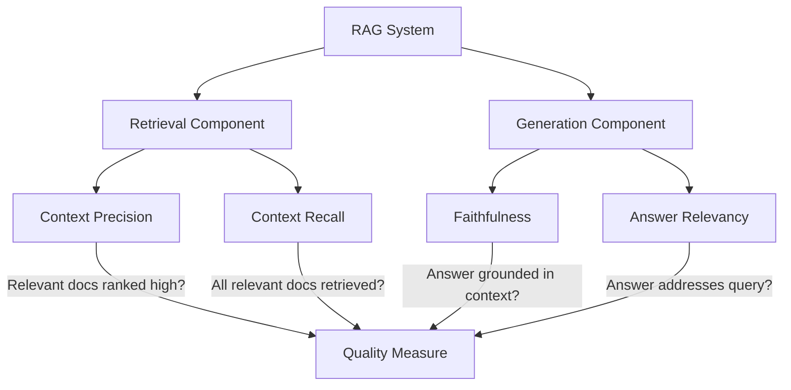

**Metric Definitions:**

1. **Faithfulness**: Measures if the generated answer can be attributed to the retrieved context
   - Formula: (Number of verifiable claims) / (Total claims in answer)
   - Example: "Paris is the capital of France" (verifiable) vs "Paris is the most beautiful city" (opinion)

2. **Answer Relevancy**: Evaluates how well the answer addresses the original question
   - Uses reverse questioning: Generate questions from answer, compare to original
   - Score based on cosine similarity of generated questions to original

3. **Context Precision**: Assesses if relevant information is ranked highly in retrieved context
   - Rewards systems that place pertinent information at the top
   - Penalizes relevant information buried deep in context

4. **Context Recall**: Measures completeness of retrieved information
   - Checks if all ground truth claims can be found in retrieved context
   - Important for ensuring no critical information is missed

---

### **💡 Evaluating TwinLlama-3.1-8B**

#### **Evaluation Setup**

```python
from openai import OpenAI
from typing import List, Dict

class TwinLlamaEvaluator:
    """Evaluate TwinLlama models on custom criteria."""
    
    def __init__(self, model_paths: Dict[str, str]):
        self.models = model_paths
        self.judge = OpenAI()  # GPT-4 as judge
        
    def generate_answers(self, instructions: List[str]) -> Dict[str, List[str]]:
        """Generate answers from all models."""
        results = {model_name: [] for model_name in self.models.keys()}
        
        for instruction in instructions:
            for model_name, model_path in self.models.items():
                model = self.load_model(model_path)
                answer = model.generate(instruction, max_tokens=500)
                results[model_name].append(answer)
        
        return results
    
    def evaluate_with_judge(self, instruction: str, answer: str) -> Dict[str, float]:
        """Evaluate answer using GPT-4 as judge."""
        judge_prompt = f"""
        Evaluate this answer on a 1-3 scale for each criterion:
        
        **Accuracy** (1-3): Factual correctness and completeness
        1 = Incorrect or incomplete
        2 = Mostly correct with minor issues
        3 = Accurate and comprehensive
        
        **Style** (1-3): Writing style appropriateness
        1 = Overly formal or academic
        2 = Somewhat natural but could be more casual
        3 = Natural, accessible, blog-appropriate
        
        Instruction: {instruction}
        Answer: {answer}
        
        Respond in JSON format:
        {{"accuracy": X, "style": Y, "justification": "..."}}
        """
        
        response = self.judge.chat.completions.create(
            model="gpt-4o",
            messages=[{"role": "user", "content": judge_prompt}],
            temperature=0.1
        )
        
        return json.loads(response.choices[0].message.content)
```

#### **Comparative Results Analysis**

| Model | Accuracy Score | Style Score | Key Observations |
|-------|----------------|-------------|------------------|
| **Llama-3.1-8B-Instruct** | 2.34 | 1.86 | Strong accuracy, overly formal style |
| **TwinLlama-3.1-8B (SFT)** | 2.28 | 2.04 | Good balance, slight formality remaining |
| **TwinLlama-3.1-8B-DPO** | 2.26 | **2.12** | Best style, maintains strong accuracy |

**Key Insights:**
- DPO successfully reduced formal language while maintaining factual accuracy
- SFT alone improved style but couldn't fully eliminate AI-like patterns
- Small accuracy tradeoff (0.08 points) worth the significant style improvement (0.26 points)

```python
def analyze_results(evaluation_data: List[Dict]) -> Dict[str, Any]:
    """Statistical analysis of evaluation results."""
    import numpy as np
    
    analysis = {}
    
    for model_name in evaluation_data[0].keys():
        accuracy_scores = [e[model_name]['accuracy'] for e in evaluation_data]
        style_scores = [e[model_name]['style'] for e in evaluation_data]
        
        analysis[model_name] = {
            'accuracy': {
                'mean': np.mean(accuracy_scores),
                'std': np.std(accuracy_scores),
                'median': np.median(accuracy_scores)
            },
            'style': {
                'mean': np.mean(style_scores),
                'std': np.std(style_scores),
                'median': np.median(style_scores)
            },
            'composite_score': np.mean(accuracy_scores) + np.mean(style_scores)
        }
    
    return analysis
```

---

### **✅ Evaluation Best Practices Summary**

| Practice | Rationale | Implementation |
|----------|-----------|----------------|
| **Multiple Evaluations** | Single metric insufficient for LLMs | Use 3-5 complementary metrics |
| **Domain-Specific Tests** | General benchmarks miss task nuances | Create custom test sets for your use case |
| **Iterative Improvement** | Evaluation guides development | Use results to refine data and training |
| **Human Validation** | Automated metrics have limitations | Sample manual review of edge cases |
| **Version Control** | Track evaluation over time | Log all evaluation results with model versions |

---

## Chapter 8: Inference Optimization

### **🎯 Understanding Inference Challenges**

Deploying LLMs efficiently requires optimization at multiple levels due to their computational and memory requirements.

**Core Inference Bottlenecks:**
1. **Sequential Token Generation** - Autoregressive nature prevents parallelization
2. **Memory Bandwidth** - Moving data between memory and compute
3. **Large Model Size** - Multi-billion parameters require significant VRAM
4. **Attention Complexity** - Quadratic scaling with sequence length

### **⚙️ Decoder-Only Model Inference Process**

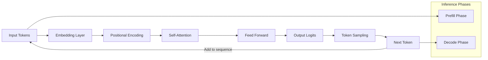

**Inference Phases:**
- **Prefill**: Process entire input prompt (parallelizable)
- **Decode**: Generate tokens one-by-one (sequential bottleneck)

---

### **💾 KV Cache: Core Optimization**

The KV (Key-Value) cache stores attention computations to avoid redundant calculations.

#### **Without KV Cache (Inefficient)**

```
Generating token 100: Compute attention for tokens 1-99
Generating token 101: Compute attention for tokens 1-100 (redundant!)
Generating token 102: Compute attention for tokens 1-101 (redundant!)
```

#### **With KV Cache (Efficient)**

```
Generating token 100: Compute attention using cached tokens 1-99
Generating token 101: Only compute attention for token 100, cache it
Generating token 102: Only compute attention for token 101, cache it
```

#### **KV Cache Size Calculation**

```python
def calculate_kv_cache_size(
    n_layers: int,
    n_heads: int, 
    head_dim: int,
    seq_length: int,
    precision_bytes: int = 2  # FP16
) -> float:
    """
    Calculate KV cache memory requirements.
    
    Formula: 2 * n_tokens * n_layers * n_heads * head_dim * precision_bytes
    (Factor of 2 for both Key and Value caches)
    """
    size_bytes = 2 * seq_length * n_layers * n_heads * head_dim * precision_bytes
    size_gb = size_bytes / (1024**3)
    
    return size_gb

# Example: Llama 3.1 8B
cache_size = calculate_kv_cache_size(
    n_layers=32,
    n_heads=32,
    head_dim=128,
    seq_length=2048,
    precision_bytes=2
)
print(f"KV Cache size: {cache_size:.2f} GB")  # ~2.1 GB for 2K context
```

#### **Static KV Cache Implementation**

```python
import torch
from transformers import AutoModelForCausalLM, AutoTokenizer

def setup_static_cache_inference():
    """Configure model with static cache for torch.compile optimization."""
    # Load model
    model = AutoModelForCausalLM.from_pretrained(
        "meta-llama/Meta-Llama-3-8B",
        device_map="auto"
    )
    
    # Enable static cache (pre-allocated, fixed size)
    model.generation_config.cache_implementation = "static"
    
    # Compile model for speed boost (requires static cache)
    compiled_model = torch.compile(
        model,
        mode="reduce-overhead",
        fullgraph=True
    )
    
    return compiled_model

# Usage
model = setup_static_cache_inference()
tokenizer = AutoTokenizer.from_pretrained("meta-llama/Meta-Llama-3-8B")

inputs = tokenizer("What is 2+2?", return_tensors="pt").to("cuda")
outputs = model.generate(**inputs, max_new_tokens=64)
print(tokenizer.decode(outputs[0]))
```

---

### **🔄 Continuous Batching**

Traditional batching wastes compute waiting for the longest sequence. Continuous batching maximizes GPU utilization by immediately filling freed slots.

#### **Traditional vs. Continuous Batching**

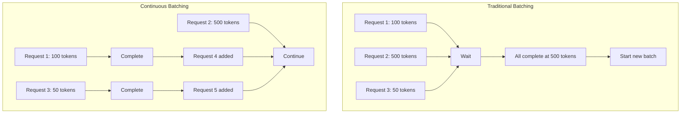

**Benefits:**
- **Higher Throughput**: No idle time waiting for batch completion
- **Better Latency**: Shorter requests finish faster
- **Improved Utilization**: GPU always processing full batch

**Implementation Note**: Continuous batching is natively supported in TGI, vLLM, and TensorRT-LLM.

---

### **🚀 Speculative Decoding**

Generate multiple tokens per step using a small draft model, then verify with the large model.

#### **Process Flow**

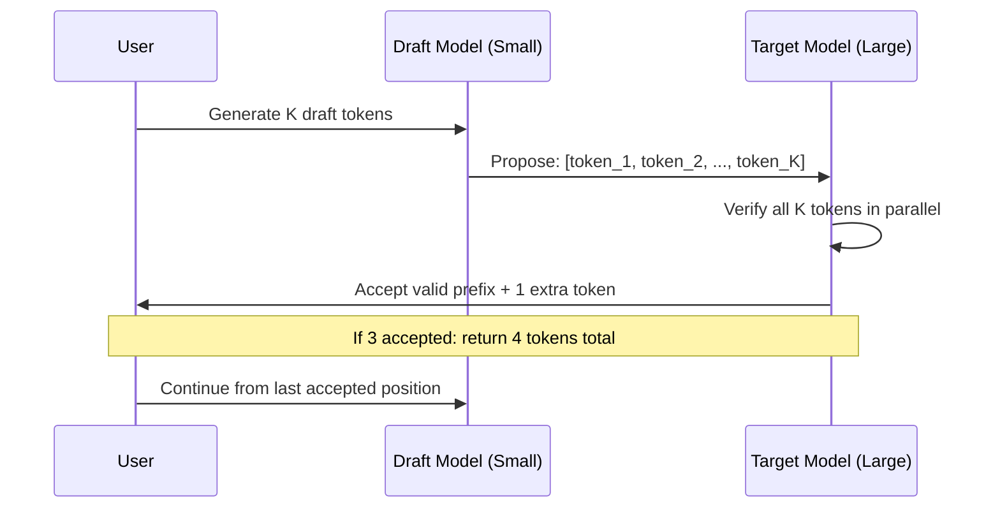

#### **Implementation Example**

```python
from transformers import AutoModelForCausalLM, AutoTokenizer

class SpeculativeDecoder:
    """Speculative decoding with draft model."""
    
    def __init__(self, target_model: str, draft_model: str):
        self.target_model = AutoModelForCausalLM.from_pretrained(
            target_model,
            device_map="auto"
        )
        self.draft_model = AutoModelForCausalLM.from_pretrained(
            draft_model,
            device_map="auto"
        )
        self.tokenizer = AutoTokenizer.from_pretrained(target_model)
    
    def generate_with_speculation(self, prompt: str, max_tokens: int = 100) -> str:
        """Generate using speculative decoding."""
        inputs = self.tokenizer(prompt, return_tensors="pt").to("cuda")
        
        # Use draft model for speculation
        outputs = self.target_model.generate(
            **inputs,
            assistant_model=self.draft_model,  # Enable speculation
            max_new_tokens=max_tokens,
            do_sample=True,
            temperature=0.7
        )
        
        return self.tokenizer.decode(outputs[0], skip_special_tokens=True)

# Example usage
decoder = SpeculativeDecoder(
    target_model="Qwen/Qwen1.5-1.8B-Chat",
    draft_model="Qwen/Qwen1.5-0.5B-Chat"
)

answer = decoder.generate_with_speculation("What is 2+2?")
print(answer)  # Faster generation with same quality
```

**Performance Gains:**
- 2-4x speedup typical with good draft model
- No quality degradation (outputs identical to non-speculative)
- Effectiveness depends on draft model alignment with target model

**Key Insight**: Speculative decoding turns sequential decoding into parallelizable verification, utilizing idle FLOPs during memory-bound operations.

---

### **⚡ Optimized Attention Mechanisms**

#### **PagedAttention**

Inspired by OS virtual memory, PagedAttention partitions the KV cache into blocks, eliminating contiguous memory requirements.

```python
# Conceptual illustration of PagedAttention
class PagedKVCache:
    """Block-based KV cache management."""
    
    def __init__(self, block_size: int = 16):
        self.block_size = block_size
        self.blocks = {}  # Block ID -> cached KV tensors
        self.free_blocks = set()
        
    def allocate_blocks(self, num_tokens: int) -> List[int]:
        """Allocate blocks for sequence (non-contiguous)."""
        num_blocks = (num_tokens + self.block_size - 1) // self.block_size
        allocated = []
        
        for _ in range(num_blocks):
            if self.free_blocks:
                block_id = self.free_blocks.pop()
            else:
                block_id = len(self.blocks)
                self.blocks[block_id] = self._create_block()
            
            allocated.append(block_id)
        
        return allocated
    
    def get_kv_for_sequence(self, block_ids: List[int]) -> torch.Tensor:
        """Retrieve KV cache from potentially non-contiguous blocks."""
        kv_tensors = [self.blocks[bid] for bid in block_ids]
        return torch.cat(kv_tensors, dim=0)
```

**Benefits:**
- Reduces memory fragmentation
- Enables efficient memory sharing across sequences
- Improves memory utilization by up to 2x

#### **FlashAttention-2**

Optimized attention kernel that reduces memory I/O through tiling and recomputation.

```python
# Using FlashAttention-2 with HuggingFace
from transformers import AutoModelForCausalLM

model = AutoModelForCausalLM.from_pretrained(
    "meta-llama/Meta-Llama-3-8B",
    attn_implementation="flash_attention_2",  # Enable FlashAttention
    torch_dtype=torch.float16,
    device_map="auto"
)

# FlashAttention provides:
# - 2-4x faster attention computation
# - Reduced memory usage
# - Identical outputs to standard attention
```

---

### **🔢 Model Quantization**

Reduce model size and inference cost by using lower precision representations.

#### **Quantization Comparison**

| Method | Precision | Memory Reduction | Speed Improvement | Quality | Use Case |
|--------|-----------|------------------|-------------------|---------|----------|
| **FP16** | 16-bit | 2x vs FP32 | 2-3x | Identical | Default for GPUs |
| **INT8** | 8-bit | 4x vs FP32 | 2-4x | Minimal loss | Production deployment |
| **NF4** | 4-bit | 8x vs FP32 | 3-5x | Small loss | Fine-tuning (QLoRA) |
| **GGUF Q4** | 4-bit | 8x vs FP32 | 3-5x | Good for large models | CPU/edge deployment |
| **GPTQ** | 3-4 bit | 8-10x vs FP32 | 3-6x | Minimal loss | GPU inference |

#### **INT8 Quantization (LLM.int8())**

```python
from transformers import AutoModelForCausalLM

# Load model in 8-bit precision
model = AutoModelForCausalLM.from_pretrained(
    "meta-llama/Meta-Llama-3-8B-Instruct",
    device_map="auto",
    load_in_8bit=True,  # Enable INT8 quantization
    max_memory={0: "20GB", "cpu": "30GB"}  # Memory constraints
)

# Benefits:
# - 2x memory reduction vs FP16
# - ~20% slower than FP16 (but worth the memory savings)
# - Minimal quality degradation
```

#### **4-bit NF4 Quantization (QLoRA)**

```python
from transformers import AutoModelForCausalLM, BitsAndBytesConfig

# Configure 4-bit quantization
bnb_config = BitsAndBytesConfig(
    load_in_4bit=True,
    bnb_4bit_quant_type="nf4",  # Normal Float 4-bit
    bnb_4bit_compute_dtype=torch.float16,
    bnb_4bit_use_double_quant=True  # Nested quantization
)

model = AutoModelForCausalLM.from_pretrained(
    "meta-llama/Meta-Llama-3-8B-Instruct",
    quantization_config=bnb_config,
    device_map="auto"
)

# Benefits:
# - 4x memory reduction vs FP16
# - Enables fine-tuning large models on consumer GPUs
# - Good quality retention
```

#### **GGUF Quantization (llama.cpp)**

```python
# GGUF quantization for CPU/edge deployment
# Format: <bits>_<variant>

quantization_options = {
    'Q2_K': '2-bit, low quality (experimental)',
    'Q3_K_M': '3-bit, acceptable for large models',
    'Q4_K_M': '4-bit, good quality (recommended)',
    'Q5_K_M': '5-bit, high quality',
    'Q6_K': '6-bit, very high quality',
    'Q8_0': '8-bit, essentially lossless'
}

# Using llama.cpp with GGUF
from llama_cpp import Llama

model = Llama(
    model_path="./models/llama-3-8b-Q4_K_M.gguf",
    n_ctx=2048,  # Context window
    n_gpu_layers=0,  # Run on CPU
    verbose=False
)

response = model("What is 2+2?", max_tokens=100)
print(response['choices'][0]['text'])
```

#### **GPTQ Quantization**

```python
# GPTQ for GPU inference (3-4 bit)
from transformers import AutoModelForCausalLM, GPTQConfig

gptq_config = GPTQConfig(
    bits=4,  # 4-bit quantization
    dataset="c4",  # Calibration dataset
    tokenizer=tokenizer
)

model = AutoModelForCausalLM.from_pretrained(
    "meta-llama/Meta-Llama-3-8B-Instruct",
    quantization_config=gptq_config,
    device_map="auto"
)

# Benefits:
# - Faster than GGUF on GPUs
# - Better quality than naive quantization
# - Requires calibration data for optimal results
```

---

### **🔀 Model Parallelism**

Split models across multiple GPUs when a single GPU cannot hold the entire model.

#### **Parallelism Strategies**

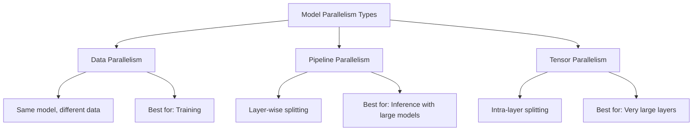

#### **Data Parallelism (DP)**

```python
import torch.nn as nn
from torch.nn.parallel import DataParallel

# Replicate model across GPUs
model = AutoModelForCausalLM.from_pretrained("meta-llama/Meta-Llama-3-8B")
model = DataParallel(model, device_ids=[0, 1, 2, 3])

# Each GPU processes different batch samples
# Best for training, less useful for inference
```

#### **Pipeline Parallelism (PP)**

```python
# Split model layers across GPUs
from torch.distributed.pipeline.sync import Pipe

# Conceptual example - split model into chunks
model_chunks = [
    model.layers[0:8],   # GPU 0
    model.layers[8:16],  # GPU 1
    model.layers[16:24], # GPU 2
    model.layers[24:32]  # GPU 3
]

pipeline_model = Pipe(nn.Sequential(*model_chunks), chunks=8)

# Benefits:
# - Each GPU only holds part of the model
# - Suitable for inference with large models
# - Some idle time (bubbles) between pipeline stages
```

#### **Tensor Parallelism (TP)**

```python
# Split individual layers across GPUs
# Example: Attention layer with 4096 hidden size

# Split query/key/value projections across 4 GPUs:
# GPU 0: Hidden[0:1024]
# GPU 1: Hidden[1024:2048]
# GPU 2: Hidden[2048:3072]
# GPU 3: Hidden[3072:4096]

# Implemented by frameworks like Megatron-LM
from megatron import mpu

# Initialize tensor model parallelism
mpu.initialize_model_parallel(tensor_model_parallel_size=4)

# Benefits:
# - All GPUs active simultaneously (no idle time)
# - Best for very large hidden dimensions
# - Requires high-bandwidth GPU interconnect
```

#### **Combining Parallelism Strategies**

```python
# 3D Parallelism: DP + PP + TP
configuration = {
    'data_parallel_size': 2,      # 2 data replicas
    'pipeline_parallel_size': 2,  # 2 pipeline stages
    'tensor_parallel_size': 4,    # 4-way tensor split
    'total_gpus': 2 * 2 * 4       # = 16 GPUs
}

# Use case: Training 70B+ models
# - TP for large layers
# - PP for model splitting
# - DP for batch processing
```

---

### **🔧 Inference Engines Comparison**

| Engine | Continuous Batching | Speculative Decoding | FlashAttention | PagedAttention | Quantization Support | Best For |
|--------|--------------------|--------------------|----------------|----------------|---------------------|----------|
| **TGI** | ✓ | ✓ | ✓ | ✓ | GPTQ, AWQ | General purpose |
| **vLLM** | ✓ | Limited | ✓ | ✓ | AWQ, GPTQ | High throughput |
| **TensorRT-LLM** | ✓ | - | ✓ | ✓ | AWQ, INT8/FP8 | NVIDIA GPUs, max performance |
| **llama.cpp** | Limited | ✓ | ✓ | - | GGUF (all variants) | CPU, Apple Silicon |

---

### **💡 Optimization Strategy Selection**

```python
class InferenceOptimizer:
    """Select optimal inference strategy based on constraints."""
    
    def recommend_strategy(self, 
                          model_size_gb: float,
                          available_memory_gb: float,
                          latency_requirement_ms: int,
                          throughput_requirement: int) -> Dict[str, Any]:
        """Recommend optimization strategies."""
        
        recommendations = {
            'quantization': None,
            'batching': None,
            'parallelism': None,
            'other_optimizations': []
        }
        
        # Memory-constrained?
        if model_size_gb > available_memory_gb:
            if model_size_gb / 2 <= available_memory_gb:
                recommendations['quantization'] = 'INT8'
            elif model_size_gb / 4 <= available_memory_gb:
                recommendations['quantization'] = 'NF4 or GPTQ'
            else:
                recommendations['parallelism'] = 'Pipeline or Tensor Parallelism'
        
        # Latency-critical?
        if latency_requirement_ms < 100:
            recommendations['other_optimizations'].extend([
                'Static KV Cache',
                'torch.compile',
                'Speculative Decoding'
            ])
        
        # High throughput needed?
        if throughput_requirement > 100:
            recommendations['batching'] = 'Continuous Batching'
            recommendations['other_optimizations'].append('vLLM or TGI')
        
        return recommendations

# Example usage
optimizer = InferenceOptimizer()
strategy = optimizer.recommend_strategy(
    model_size_gb=16,  # Llama 3 8B in FP16
    available_memory_gb=12,  # GPU memory
    latency_requirement_ms=50,
    throughput_requirement=200
)

print(strategy)
# {
#     'quantization': 'INT8',
#     'batching': 'Continuous Batching',
#     'other_optimizations': ['Static KV Cache', 'torch.compile', 'vLLM or TGI']
# }
```

---

## Chapter 9: Advanced RAG Techniques

### **🔄 RAG Inference Pipeline Architecture**

The RAG inference pipeline integrates retrieval, augmentation, and generation components into a cohesive system for enhanced LLM responses.

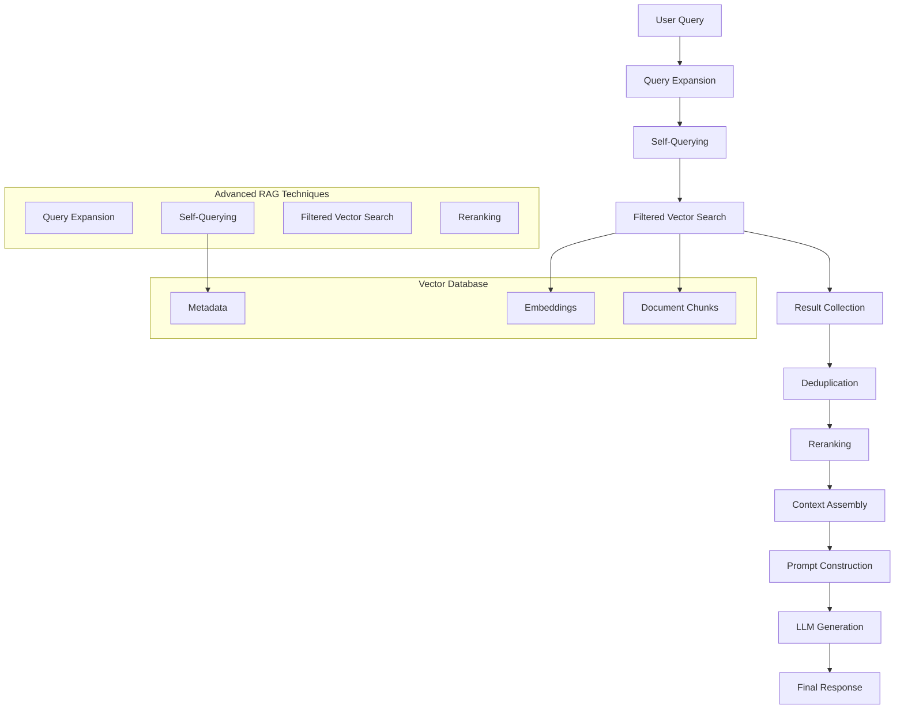

**RAG Flow Steps:**
1. **User Query** → User submits question/request
2. **Query Expansion** → Generate multiple query variants
3. **Self-Querying** → Extract metadata filters from query
4. **Filtered Vector Search** → Search with metadata constraints
5. **Collect Results** → Aggregate N × K chunks
6. **Reranking** → Score and select top K chunks
7. **Prompt Construction** → Build augmented prompt
8. **LLM Call** → Generate final answer


### **🎯 Advanced RAG Pre-Retrieval Optimizations**

#### **Query Expansion**

```python
from typing import List, Dict, Any
from openai import OpenAI

class QueryExpander:
    """Expand user queries to improve retrieval coverage."""
    
    def __init__(self, openai_client: OpenAI):
        self.client = openai_client
        
    async def expand_query(self, original_query: str, num_variations: int = 3) -> List[str]:
        """Generate multiple query variations for comprehensive retrieval."""
        
        expansion_prompt = f"""
        Given the original query: "{original_query}"
        
        Generate {num_variations} different ways to express this query that would help find relevant information.
        Each variation should:
        1. Capture different aspects of the original intent
        2. Use different keywords and phrasing
        3. Be specific enough to find relevant content
        
        Return only the query variations, one per line.
        """
        
        response = await self.client.chat.completions.create(
            model="gpt-4o-mini",
            messages=[
                {"role": "system", "content": "You are a search query optimization expert."},
                {"role": "user", "content": expansion_prompt}
            ],
            temperature=0.7
        )
        
        variations = response.choices[0].message.content.strip().split('\n')
        
        # Include original query
        expanded_queries = [original_query] + [v.strip() for v in variations if v.strip()]
        
        return expanded_queries[:num_variations + 1]  # +1 for original
    
    def expand_query_semantic(self, original_query: str) -> List[str]:
        """Expand query using semantic techniques."""
        
        # Synonym expansion
        synonyms = self._get_synonyms(original_query)
        
        # Add/remove specific terms
        generalizations = self._generalize_query(original_query)
        specifications = self._specify_query(original_query)
        
        # Domain-specific expansions
        domain_expansions = self._expand_domain_terms(original_query)
        
        all_expansions = [original_query] + synonyms + generalizations + specifications + domain_expansions
        
        # Remove duplicates and empty strings
        return list(filter(None, list(set(all_expansions))))
    
    def _get_synonyms(self, query: str) -> List[str]:
        """Generate synonym-based query variations."""
        # Simple keyword substitution approach
        synonym_map = {
            'machine learning': ['ML', 'artificial intelligence', 'AI'],
            'neural network': ['deep learning', 'NN', 'neural net'],
            'transformer': ['attention model', 'encoder-decoder'],
            'fine-tuning': ['training', 'adaptation', 'customization']
        }
        
        variations = []
        for term, synonyms in synonym_map.items():
            if term.lower() in query.lower():
                for synonym in synonyms:
                    variations.append(query.replace(term, synonym))
        
        return variations
```

#### **Self-Querying**

```python
import re
import json
from typing import Dict, Optional, List

class SelfQueryExtractor:
    """Extract metadata and filters from user queries."""
    
    def __init__(self, openai_client: OpenAI):
        self.client = openai_client
        
    async def extract_metadata(self, query: str) -> Dict[str, Any]:
        """Extract structured metadata from natural language query."""
        
        extraction_prompt = f"""
        Analyze the following query and extract any metadata that could be used for filtering:
        
        Query: "{query}"
        
        Extract information about:
        - Author names or usernames
        - Platforms (LinkedIn, Medium, GitHub, etc.)
        - Content types (article, post, code, etc.)
        - Date ranges or time periods
        - Topics or domains
        - Any other filtering criteria
        
        Return as JSON:
        {{
            "author": "extracted author name or null",
            "platform": "extracted platform or null", 
            "content_type": "extracted type or null",
            "date_filter": "extracted date info or null",
            "topics": ["list", "of", "topics"],
            "other_filters": {{"key": "value"}}
        }}
        """
        
        response = await self.client.chat.completions.create(
            model="gpt-4o-mini",
            messages=[
                {"role": "system", "content": "You are a metadata extraction expert."},
                {"role": "user", "content": extraction_prompt}
            ],
            temperature=0.1
        )
        
        try:
            metadata = json.loads(response.choices[0].message.content)
            return self._clean_metadata(metadata)
        except json.JSONDecodeError:
            return self._extract_metadata_rules_based(query)
    
    def _extract_metadata_rules_based(self, query: str) -> Dict[str, Any]:
        """Fallback rule-based metadata extraction."""
        metadata = {
            "author": None,
            "platform": None,
            "content_type": None,
            "date_filter": None,
            "topics": [],
            "other_filters": {}
        }
        
        # Author extraction patterns
        author_patterns = [
            r"by ([A-Z][a-z]+ [A-Z][a-z]+)",
            r"from ([A-Z][a-z]+ [A-Z][a-z]+)",
            r"([A-Z][a-z]+ [A-Z][a-z]+)'s",
        ]
        
        for pattern in author_patterns:
            match = re.search(pattern, query)
            if match:
                metadata["author"] = match.group(1)
                break
        
        # Platform detection
        platforms = ["linkedin", "medium", "github", "twitter", "substack"]
        for platform in platforms:
            if platform.lower() in query.lower():
                metadata["platform"] = platform.lower()
                break
        
        # Content type detection
        content_types = ["article", "post", "code", "repository", "tutorial", "guide"]
        for content_type in content_types:
            if content_type.lower() in query.lower():
                metadata["content_type"] = content_type.lower()
                break
        
        return metadata
    
    def _clean_metadata(self, metadata: Dict[str, Any]) -> Dict[str, Any]:
        """Clean and validate extracted metadata."""
        # Remove null values
        cleaned = {k: v for k, v in metadata.items() if v is not None and v != "null"}
        
        # Standardize platform names
        if "platform" in cleaned:
            platform_mapping = {
                "linkedin": "linkedin",
                "medium": "medium", 
                "github": "github",
                "git": "github",
                "substack": "substack"
            }
            platform = cleaned["platform"].lower()
            cleaned["platform"] = platform_mapping.get(platform, platform)
        
        return cleaned
```

### **🔍 Advanced RAG Retrieval Optimization**

#### **Filtered Vector Search**

```python
from qdrant_client.models import Filter, FieldCondition, MatchValue
from typing import List, Dict, Any, Optional

class FilteredVectorSearch:
    """Implement advanced filtered vector search with metadata."""
    
    def __init__(self, qdrant_client, embedding_model):
        self.qdrant_client = qdrant_client
        self.embedding_model = embedding_model
        
    async def search_with_filters(
        self, 
        collection_name: str,
        query: str, 
        metadata_filters: Dict[str, Any],
        top_k: int = 10
    ) -> List[Dict[str, Any]]:
        """Search with metadata-based filtering."""
        
        # Generate query embedding
        query_embedding = self.embedding_model.encode([query])[0].tolist()
        
        # Build filter conditions
        filter_conditions = self._build_filter_conditions(metadata_filters)
        
        # Perform filtered search
        search_results = self.qdrant_client.search(
            collection_name=collection_name,
            query_vector=query_embedding,
            query_filter=filter_conditions,
            limit=top_k,
            with_payload=True
        )
        
        return self._format_search_results(search_results)
    
    def _build_filter_conditions(self, metadata: Dict[str, Any]) -> Optional[Filter]:
        """Build Qdrant filter conditions from metadata."""
        conditions = []
        
        # Author filter
        if metadata.get("author"):
            conditions.append(
                FieldCondition(
                    key="author_full_name",
                    match=MatchValue(value=metadata["author"])
                )
            )
        
        # Platform filter
        if metadata.get("platform"):
            conditions.append(
                FieldCondition(
                    key="platform",
                    match=MatchValue(value=metadata["platform"])
                )
            )
        
        # Content type filter
        if metadata.get("content_type"):
            # Map content types to document categories
            type_mapping = {
                "article": ["articles"],
                "post": ["posts"], 
                "code": ["repositories"],
                "repository": ["repositories"]
            }
            
            categories = type_mapping.get(metadata["content_type"], [metadata["content_type"]])
            
            for category in categories:
                conditions.append(
                    FieldCondition(
                        key="document_type",
                        match=MatchValue(value=category)
                    )
                )
        
        if not conditions:
            return None
            
        return Filter(must=conditions)
    
    def _format_search_results(self, results) -> List[Dict[str, Any]]:
        """Format search results into standard structure."""
        formatted_results = []
        
        for result in results:
            formatted_result = {
                "id": result.id,
                "score": result.score,
                "content": result.payload.get("content", ""),
                "title": result.payload.get("title", ""),
                "source_url": result.payload.get("source_url", ""),
                "platform": result.payload.get("platform", ""),
                "author": result.payload.get("author_full_name", ""),
                "metadata": result.payload.get("metadata", {})
            }
            formatted_results.append(formatted_result)
        
        return formatted_results
```

### **📈 Advanced RAG Post-Retrieval Optimization**

#### **Reranking Implementation**

```python
from sentence_transformers import CrossEncoder
import numpy as np

class DocumentReranker:
    """Rerank retrieved documents for improved relevance."""
    
    def __init__(self, model_name: str = "cross-encoder/ms-marco-MiniLM-L-6-v2"):
        self.reranker = CrossEncoder(model_name)
        
    def rerank_documents(
        self, 
        query: str, 
        documents: List[Dict[str, Any]], 
        top_k: int = 5
    ) -> List[Dict[str, Any]]:
        """Rerank documents based on query-document relevance."""
        
        if not documents:
            return []
        
        # Prepare query-document pairs
        pairs = []
        for doc in documents:
            content = doc.get("content", "")
            # Combine title and content for better context
            full_text = f"{doc.get('title', '')} {content}".strip()
            pairs.append([query, full_text])
        
        # Get relevance scores
        scores = self.reranker.predict(pairs)
        
        # Add scores to documents
        for i, doc in enumerate(documents):
            doc["rerank_score"] = float(scores[i])
        
        # Sort by rerank score (descending)
        reranked_docs = sorted(documents, key=lambda x: x["rerank_score"], reverse=True)
        
        return reranked_docs[:top_k]
    
    def hybrid_rerank(
        self, 
        query: str, 
        documents: List[Dict[str, Any]],
        vector_weight: float = 0.6,
        rerank_weight: float = 0.4,
        top_k: int = 5
    ) -> List[Dict[str, Any]]:
        """Combine vector similarity and reranking scores."""
        
        # Get reranking scores
        reranked_docs = self.rerank_documents(query, documents, len(documents))
        
        # Normalize scores
        vector_scores = [doc.get("score", 0) for doc in reranked_docs]
        rerank_scores = [doc.get("rerank_score", 0) for doc in reranked_docs]
        
        # Min-max normalization
        if max(vector_scores) > min(vector_scores):
            vector_scores = [(s - min(vector_scores)) / (max(vector_scores) - min(vector_scores)) 
                           for s in vector_scores]
        
        if max(rerank_scores) > min(rerank_scores):
            rerank_scores = [(s - min(rerank_scores)) / (max(rerank_scores) - min(rerank_scores)) 
                           for s in rerank_scores]
        
        # Combine scores
        for i, doc in enumerate(reranked_docs):
            hybrid_score = (vector_weight * vector_scores[i] + 
                          rerank_weight * rerank_scores[i])
            doc["hybrid_score"] = hybrid_score
        
        # Sort by hybrid score
        final_ranking = sorted(reranked_docs, key=lambda x: x["hybrid_score"], reverse=True)
        
        return final_ranking[:top_k]
```

### **🔧 Complete RAG Inference Pipeline**

#### **Context Retriever Implementation**

```python
class ContextRetriever:
    """Orchestrate all advanced RAG retrieval techniques."""
    
    def __init__(self, qdrant_client, embedding_model, openai_client):
        self.query_expander = QueryExpander(openai_client)
        self.self_query_extractor = SelfQueryExtractor(openai_client)
        self.filtered_search = FilteredVectorSearch(qdrant_client, embedding_model)
        self.reranker = DocumentReranker()
        
    async def search(self, query: str, k: int = 5) -> List[Dict[str, Any]]:
        """Execute complete advanced RAG retrieval pipeline."""
        
        # Step 1: Query expansion
        expanded_queries = await self.query_expander.expand_query(query, num_variations=2)
        
        # Step 2: Self-querying metadata extraction
        metadata_filters = await self.self_query_extractor.extract_metadata(query)
        
        # Step 3: Filtered vector search for each expanded query
        all_documents = []
        
        for expanded_query in expanded_queries:
            # Search across different document categories
            for collection in ["articles", "posts", "repositories"]:
                try:
                    docs = await self.filtered_search.search_with_filters(
                        collection_name=collection,
                        query=expanded_query,
                        metadata_filters=metadata_filters,
                        top_k=k // 3  # Distribute searches across categories
                    )
                    all_documents.extend(docs)
                except Exception as e:
                    logger.warning(f"Search failed for {collection}: {e}")
                    continue
        
        # Step 4: Deduplication
        unique_documents = self._deduplicate_documents(all_documents)
        
        # Step 5: Reranking
        final_documents = self.reranker.hybrid_rerank(
            query=query,
            documents=unique_documents,
            top_k=k
        )
        
        return final_documents
    
    def _deduplicate_documents(self, documents: List[Dict[str, Any]]) -> List[Dict[str, Any]]:
        """Remove duplicate documents based on content similarity."""
        if not documents:
            return []
        
        # Use document IDs if available
        seen_ids = set()
        unique_docs = []
        
        for doc in documents:
            doc_id = doc.get("id")
            if doc_id and doc_id not in seen_ids:
                seen_ids.add(doc_id)
                unique_docs.append(doc)
            elif not doc_id:
                # Fallback: use content hash for deduplication
                content_hash = hash(doc.get("content", "")[:200])  # First 200 chars
                if content_hash not in seen_ids:
                    seen_ids.add(content_hash)
                    unique_docs.append(doc)
        
        return unique_docs
```

#### **Complete RAG Pipeline**

```python
class RAGInferencePipeline:
    """Complete RAG inference pipeline with context retrieval and LLM generation."""
    
    def __init__(self, context_retriever: ContextRetriever, llm_client):
        self.context_retriever = context_retriever
        self.llm_client = llm_client
        
    async def generate_response(self, query: str, max_context_length: int = 4000) -> Dict[str, Any]:
        """Generate response using RAG pipeline."""
        
        # Step 1: Retrieve relevant context
        retrieved_documents = await self.context_retriever.search(query, k=5)
        
        # Step 2: Build context from retrieved documents
        context = self._build_context(retrieved_documents, max_context_length)
        
        # Step 3: Construct prompt
        prompt = self._construct_prompt(query, context)
        
        # Step 4: Generate response
        response = await self._call_llm(prompt)
        
        # Step 5: Format final response
        return {
            "query": query,
            "response": response,
            "context_used": context,
            "sources": self._extract_sources(retrieved_documents),
            "metadata": {
                "num_documents_retrieved": len(retrieved_documents),
                "context_length": len(context),
                "prompt_length": len(prompt)
            }
        }
    
    def _build_context(self, documents: List[Dict[str, Any]], max_length: int) -> str:
        """Build context string from retrieved documents."""
        context_parts = []
        current_length = 0
        
        for doc in documents:
            content = doc.get("content", "")
            title = doc.get("title", "")
            source = doc.get("source_url", "")
            
            # Format document entry
            doc_text = f"Title: {title}\nContent: {content}\nSource: {source}\n\n"
            
            # Check if adding this document exceeds length limit
            if current_length + len(doc_text) > max_length and context_parts:
                break
            
            context_parts.append(doc_text)
            current_length += len(doc_text)
        
        return "".join(context_parts)
    
    def _construct_prompt(self, query: str, context: str) -> str:
        """Construct the final prompt for the LLM."""
        
        prompt_template = """
        You are an AI assistant that answers questions based on the provided context.
        Use the context below to answer the user's question accurately and comprehensively.
        
        Context:
        {context}
        
        Question: {query}
        
        Instructions:
        - Base your answer primarily on the provided context
        - If the context doesn't contain enough information, acknowledge this
        - Cite specific sources when possible
        - Maintain the writing style consistent with the context when appropriate
        
        Answer:
        """
        
        return prompt_template.format(context=context, query=query)
    
    async def _call_llm(self, prompt: str) -> str:
        """Call the LLM service with the constructed prompt."""
        try:
            # This would call your deployed LLM (e.g., SageMaker endpoint)
            response = await self.llm_client.generate(
                prompt=prompt,
                max_new_tokens=500,
                temperature=0.7
            )
            return response.get("generated_text", "")
        except Exception as e:
            logger.error(f"LLM generation failed: {e}")
            return "I apologize, but I'm unable to generate a response at this time."
    
    def _extract_sources(self, documents: List[Dict[str, Any]]) -> List[str]:
        """Extract source URLs from retrieved documents."""
        sources = []
        for doc in documents:
            source_url = doc.get("source_url")
            title = doc.get("title", "Untitled")
            if source_url:
                sources.append(f"{title}: {source_url}")
        return sources
```

---

## Chapter 10: Inference Pipeline Deployment

### **🎯 Deployment Strategy Selection**

Before deploying ML models, evaluate key criteria to choose the optimal deployment type.

#### **Critical Decision Factors**

| Factor | Considerations | Impact on Architecture |
|--------|----------------|----------------------|
| **Latency** | Response time requirements | Real-time vs batch processing |
| **Throughput** | Requests per second | Single vs multiple instances |
| **Data** | Input size, frequency, volume | Streaming vs batch ingestion |
| **Infrastructure** | Available compute resources | GPU vs CPU, cloud vs on-premise |

---

### **📊 Inference Deployment Types**

#### **Comparison Matrix**

| Type | Latency | Throughput | Cost | Use Case |
|------|---------|------------|------|----------|
| **Online Real-Time** | <100ms | Medium | High | Chatbots, code completion |
| **Asynchronous** | Seconds to minutes | High | Medium | Email generation, document processing |
| **Offline Batch** | Hours | Very High | Low | Bulk data processing, analytics |

---

### **🌐 Online Real-Time Inference**

Synchronous request-response pattern for interactive applications.

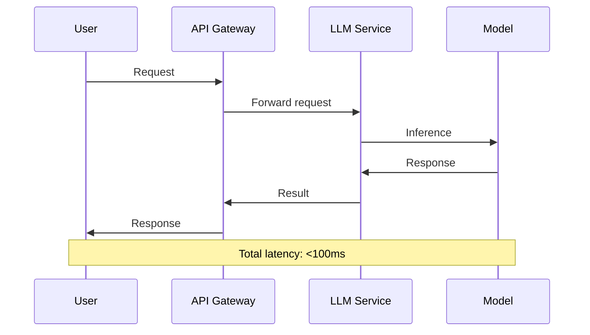

**Characteristics:**
- **Immediate response** required
- **User waiting** for result
- **Higher cost** per request (always-on servers)
- **Auto-scaling** critical for spikes

**Implementation Example:**

```python
from fastapi import FastAPI, HTTPException
from pydantic import BaseModel

app = FastAPI()

class InferenceRequest(BaseModel):
    prompt: str
    max_tokens: int = 100

class InferenceResponse(BaseModel):
    generated_text: str
    latency_ms: float

@app.post("/generate", response_model=InferenceResponse)
async def generate_text(request: InferenceRequest):
    """Real-time inference endpoint."""
    start_time = time.time()
    
    try:
        # Call LLM service
        result = await llm_client.generate(
            prompt=request.prompt,
            max_tokens=request.max_tokens
        )
        
        latency = (time.time() - start_time) * 1000
        
        return InferenceResponse(
            generated_text=result,
            latency_ms=latency
        )
    except Exception as e:
        raise HTTPException(status_code=500, detail=str(e))

# Run with: uvicorn main:app --host 0.0.0.0 --port 8000
```

---

### **⏱️ Asynchronous Inference**

Decouple request submission from result retrieval for longer-running tasks.

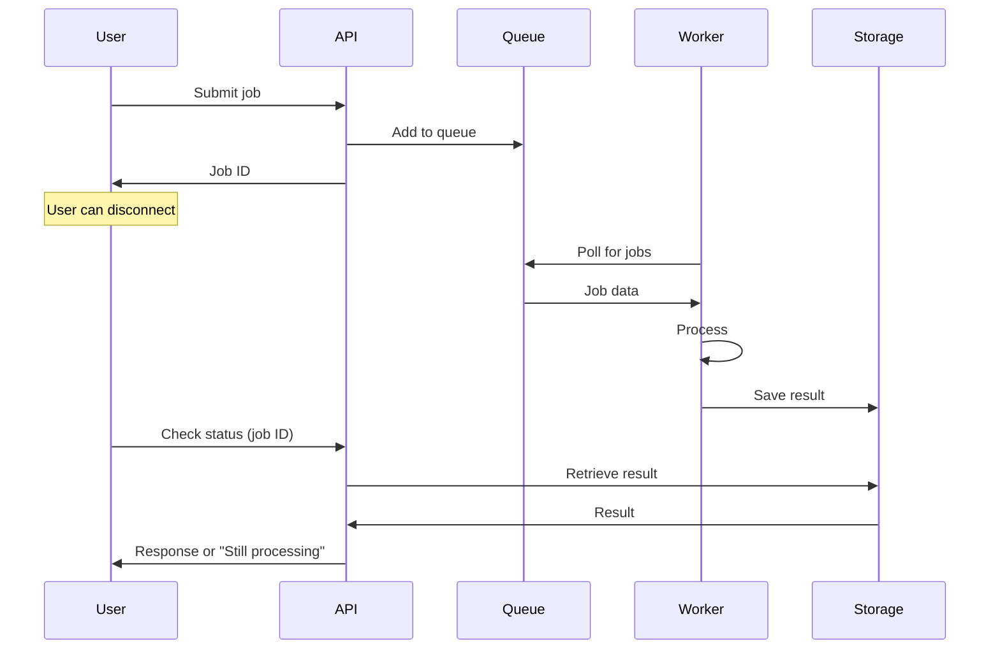

**When to Use:**
- Processing time > 30 seconds
- User doesn't need immediate response
- Batch requests with varying completion times
- Resource-intensive tasks

**Implementation Example:**

```python
from fastapi import FastAPI, BackgroundTasks
from typing import Dict
import uuid

app = FastAPI()
job_storage: Dict[str, Dict] = {}

class AsyncRequest(BaseModel):
    prompt: str
    max_tokens: int = 500

class JobStatus(BaseModel):
    job_id: str
    status: str  # pending, processing, completed, failed
    result: Optional[str] = None

async def process_job(job_id: str, prompt: str, max_tokens: int):
    """Background task for async processing."""
    try:
        job_storage[job_id]['status'] = 'processing'
        
        # Long-running inference
        result = await llm_client.generate(prompt, max_tokens)
        
        job_storage[job_id].update({
            'status': 'completed',
            'result': result
        })
    except Exception as e:
        job_storage[job_id].update({
            'status': 'failed',
            'error': str(e)
        })

@app.post("/async-generate", response_model=JobStatus)
async def submit_async_job(request: AsyncRequest, background_tasks: BackgroundTasks):
    """Submit asynchronous inference job."""
    job_id = str(uuid.uuid4())
    
    job_storage[job_id] = {
        'status': 'pending',
        'result': None
    }
    
    # Add to background processing
    background_tasks.add_task(
        process_job,
        job_id,
        request.prompt,
        request.max_tokens
    )
    
    return JobStatus(job_id=job_id, status='pending')

@app.get("/job/{job_id}", response_model=JobStatus)
async def check_job_status(job_id: str):
    """Check job status and retrieve result."""
    if job_id not in job_storage:
        raise HTTPException(status_code=404, detail="Job not found")
    
    job = job_storage[job_id]
    return JobStatus(
        job_id=job_id,
        status=job['status'],
        result=job.get('result')
    )
```

---

### **📦 Offline Batch Transform**

Process large volumes of data in scheduled batches.

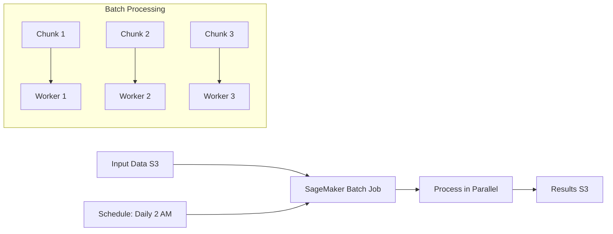

**When to Use:**
- Process thousands+ records
- No real-time requirement
- Cost optimization priority
- Periodic/scheduled processing

**AWS SageMaker Batch Transform Example:**

```python
import boto3
from sagemaker.transformer import Transformer

class BatchInferenceManager:
    """Manage SageMaker batch transform jobs."""
    
    def __init__(self, model_name: str):
        self.sagemaker_client = boto3.client('sagemaker')
        self.model_name = model_name
    
    def create_batch_job(self,
                        input_path: str,
                        output_path: str,
                        instance_type: str = "ml.g4dn.xlarge",
                        instance_count: int = 2):
        """Create batch transform job."""
        
        transformer = Transformer(
            model_name=self.model_name,
            instance_count=instance_count,
            instance_type=instance_type,
            output_path=output_path,
            accept='application/json',
            assemble_with='Line',
            max_payload=6  # MB
        )
        
        # Start batch job
        transformer.transform(
            data=input_path,
            content_type='application/json',
            split_type='Line',
            wait=False  # Don't block
        )
        
        return transformer.latest_transform_job.name
    
    def monitor_job(self, job_name: str) -> Dict:
        """Check batch job status."""
        response = self.sagemaker_client.describe_transform_job(
            TransformJobName=job_name
        )
        
        return {
            'status': response['TransformJobStatus'],
            'progress': response.get('DataProcessing', {}).get('InputFilter'),
            'failure_reason': response.get('FailureReason')
        }

# Usage
batch_manager = BatchInferenceManager(model_name="llm-twin-model")

job_name = batch_manager.create_batch_job(
    input_path="s3://bucket/input/prompts.jsonl",
    output_path="s3://bucket/output/",
    instance_count=5  # Parallel processing
)

print(f"Batch job started: {job_name}")
```

---

### **🏗️ Monolithic vs. Microservices Architecture**

#### **Architectural Comparison**

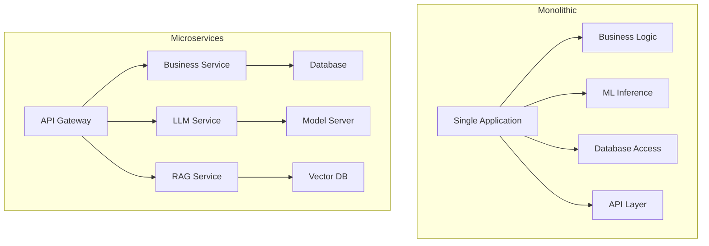

| Aspect | Monolithic | Microservices |
|--------|-----------|---------------|
| **Deployment** | Single unit | Independent services |
| **Scaling** | Scale entire app | Scale components individually |
| **Development** | Simpler initially | More complex |
| **Failure Impact** | Entire system down | Isolated failures |
| **Technology Stack** | Single stack | Different stacks per service |
| **Resource Efficiency** | Lower overhead | Higher overhead |

---

### **🚀 LLM Twin Deployment Strategy**

#### **Architecture Overview**

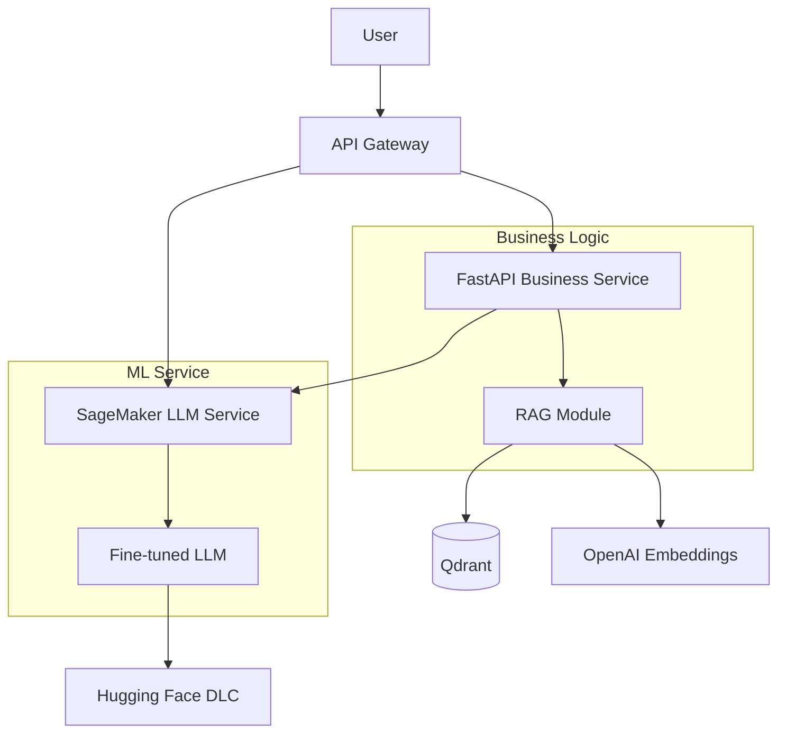

**Design Decisions:**

1. **Microservices Approach**
   - Business logic (FastAPI) separate from LLM inference
   - Reason: Different scaling needs (CPU vs GPU)

2. **Online Real-Time Inference**
   - Chatbot requires low latency (<100ms target)
   - User expects immediate response

3. **AWS SageMaker for LLM**
   - Managed infrastructure
   - Auto-scaling support
   - Optimized for ML workloads

---

### **⚙️ AWS SageMaker Deployment**

#### **SageMaker Components**

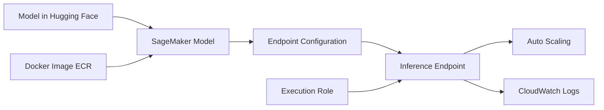

**Component Definitions:**

| Component | Purpose | Configuration |
|-----------|---------|---------------|
| **SageMaker Model** | Model artifact + inference code | Points to model in Hugging Face + Docker image |
| **Endpoint Config** | Hardware specs, scaling rules | Instance type, count, accelerators |
| **Endpoint** | Live inference API | URL for model serving |
| **Execution Role** | AWS permissions | Access to S3, CloudWatch, ECR |

#### **Deployment Implementation**

```python
import boto3
from sagemaker.huggingface.model import HuggingFaceModel

class SageMakerDeploymentManager:
    """Deploy LLM to SageMaker endpoint."""
    
    def __init__(self, role_arn: str):
        self.sagemaker_client = boto3.client('sagemaker')
        self.role_arn = role_arn
    
    def deploy_model(self,
                     model_id: str,
                     endpoint_name: str,
                     instance_type: str = "ml.g5.2xlarge"):
        """Deploy Hugging Face model to SageMaker."""
        
        # Create Hugging Face Model
        huggingface_model = HuggingFaceModel(
            model_data={'S3DataSource': {
                'S3Uri': f's3://bucket/models/{model_id}',
                'S3DataType': 'S3Prefix',
                'CompressionType': 'None'
            }},
            role=self.role_arn,
            transformers_version='4.37',
            pytorch_version='2.1',
            py_version='py310',
            model_server_workers=1
        )
        
        # Deploy to endpoint
        predictor = huggingface_model.deploy(
            initial_instance_count=1,
            instance_type=instance_type,
            endpoint_name=endpoint_name,
            container_startup_health_check_timeout=600
        )
        
        return predictor
    
    def create_autoscaling_policy(self,
                                 endpoint_name: str,
                                 min_instances: int = 1,
                                 max_instances: int = 5,
                                 target_invocations: int = 1000):
        """Configure auto-scaling for endpoint."""
        
        autoscaling_client = boto3.client('application-autoscaling')
        
        # Register scalable target
        autoscaling_client.register_scalable_target(
            ServiceNamespace='sagemaker',
            ResourceId=f'endpoint/{endpoint_name}/variant/AllTraffic',
            ScalableDimension='sagemaker:variant:DesiredInstanceCount',
            MinCapacity=min_instances,
            MaxCapacity=max_instances
        )
        
        # Create scaling policy
        autoscaling_client.put_scaling_policy(
            PolicyName=f'{endpoint_name}-scaling-policy',
            ServiceNamespace='sagemaker',
            ResourceId=f'endpoint/{endpoint_name}/variant/AllTraffic',
            ScalableDimension='sagemaker:variant:DesiredInstanceCount',
            PolicyType='TargetTrackingScaling',
            TargetTrackingScalingPolicyConfiguration={
                'TargetValue': target_invocations,
                'PredefinedMetricSpecification': {
                    'PredefinedMetricType': 'SageMakerVariantInvocationsPerInstance'
                },
                'ScaleInCooldown': 300,  # 5 minutes
                'ScaleOutCooldown': 60   # 1 minute
            }
        )

# Deploy model
deployer = SageMakerDeploymentManager(role_arn="arn:aws:iam::...")

predictor = deployer.deploy_model(
    model_id="TwinLlama-3.1-8B",
    endpoint_name="llm-twin-endpoint",
    instance_type="ml.g5.2xlarge"
)

# Configure auto-scaling
deployer.create_autoscaling_policy(
    endpoint_name="llm-twin-endpoint",
    min_instances=1,
    max_instances=5,
    target_invocations=1000
)
```

---

### **🔌 Inference Client Implementation**

```python
import boto3
import json

class SageMakerInferenceClient:
    """Client for calling SageMaker inference endpoint."""
    
    def __init__(self, endpoint_name: str):
        self.runtime_client = boto3.client('sagemaker-runtime')
        self.endpoint_name = endpoint_name
    
    def generate(self, 
                prompt: str,
                max_tokens: int = 100,
                temperature: float = 0.7) -> str:
        """Call SageMaker endpoint for inference."""
        
        payload = {
            'inputs': prompt,
            'parameters': {
                'max_new_tokens': max_tokens,
                'temperature': temperature,
                'do_sample': True,
                'top_p': 0.9
            }
        }
        
        response = self.runtime_client.invoke_endpoint(
            EndpointName=self.endpoint_name,
            ContentType='application/json',
            Body=json.dumps(payload)
        )
        
        result = json.loads(response['Body'].read().decode())
        return result[0]['generated_text']

# Usage
llm_client = SageMakerInferenceClient(endpoint_name="llm-twin-endpoint")

answer = llm_client.generate(
    prompt="Write an article about MLOps best practices",
    max_tokens=500
)
print(answer)
```

---

### **🌐 FastAPI Business Service**

Complete RAG service exposing LLM functionality.

```python
from fastapi import FastAPI, HTTPException
from pydantic import BaseModel

app = FastAPI(title="LLM Twin Service")

class RAGRequest(BaseModel):
    query: str
    k: int = 5

class RAGResponse(BaseModel):
    answer: str
    sources: List[str]

# Initialize components
retriever = ContextRetriever()
llm_client = SageMakerInferenceClient(endpoint_name="llm-twin-endpoint")

@app.post("/rag", response_model=RAGResponse)
async def rag_endpoint(request: RAGRequest):
    """RAG inference endpoint."""
    try:
        # 1. Retrieve context
        documents = retriever.search(request.query, k=request.k)
        
        # 2. Format context
        context = "\n\n".join([doc['content'] for doc in documents])
        sources = [doc['source_url'] for doc in documents]
        
        # 3. Build prompt
        prompt = f"""
        Context:
        {context}
        
        Question: {request.query}
        
        Answer:
        """
        
        # 4. Generate answer
        answer = llm_client.generate(prompt, max_tokens=500)
        
        return RAGResponse(answer=answer, sources=sources)
        
    except Exception as e:
        raise HTTPException(status_code=500, detail=str(e))

@app.get("/health")
async def health_check():
    """Health check endpoint."""
    return {"status": "healthy"}

# Run: uvicorn main:app --host 0.0.0.0 --port 8000
```

---

### **📈 Auto-Scaling Configuration**

#### **Scaling Policy Components**

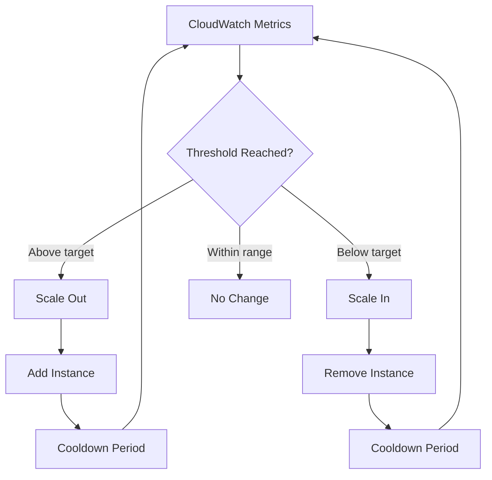

**Key Parameters:**

| Parameter | Purpose | Typical Values |
|-----------|---------|----------------|
| **Min Instances** | Always-on capacity | 1-2 |
| **Max Instances** | Peak capacity limit | 5-10 |
| **Target Metric** | Scaling trigger | InvocationsPerInstance, CPUUtilization |
| **Target Value** | Desired metric value | 1000 invocations/min |
| **Scale Out Cooldown** | Wait before adding more | 60-120 seconds |
| **Scale In Cooldown** | Wait before removing | 300-600 seconds |

**Cost Optimization Strategy:**

```python
def calculate_cost_optimal_scaling(
    expected_requests_per_hour: int,
    instance_cost_per_hour: float,
    latency_requirement_ms: int
) -> Dict[str, int]:
    """Calculate optimal instance configuration."""
    
    # Estimate capacity per instance (throughput)
    requests_per_instance = 60000 / latency_requirement_ms  # requests/min
    
    # Calculate required instances
    required_instances = expected_requests_per_hour / (requests_per_instance * 60)
    
    # Add buffer for spikes (20%)
    min_instances = max(1, int(required_instances * 0.8))
    max_instances = int(required_instances * 1.5)
    
    estimated_cost = max_instances * instance_cost_per_hour
    
    return {
        'min_instances': min_instances,
        'max_instances': max_instances,
        'estimated_hourly_cost': estimated_cost
    }

# Example
config = calculate_cost_optimal_scaling(
    expected_requests_per_hour=60000,  # 1000/min average
    instance_cost_per_hour=1.5,  # ml.g5.2xlarge
    latency_requirement_ms=50
)

print(config)
# {
#     'min_instances': 1,
#     'max_instances': 2,
#     'estimated_hourly_cost': 3.0
# }
```

---

## Chapter 11: MLOps and LLMOps

### **🎯 The Evolution: DevOps → MLOps → LLMOps**

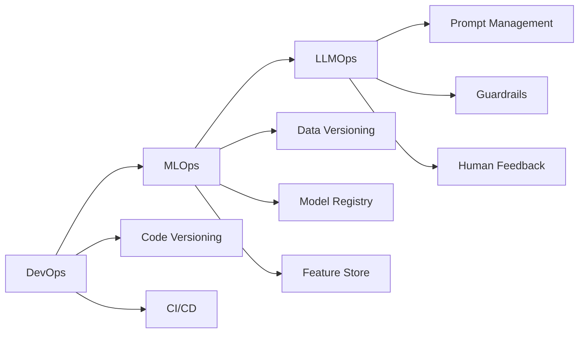

#### **Comparative Overview**

| Aspect | DevOps | MLOps | LLMOps |
|--------|--------|-------|--------|
| **Primary Assets** | Code | Code + Data + Models | Code + Data + Models + Prompts |
| **Versioning** | Git | Git + DVC + Model Registry | Git + DVC + Model Registry + Prompt Versioning |
| **Testing** | Unit, Integration | + Data tests, Model tests | + Prompt tests, Safety tests |
| **Monitoring** | Logs, Uptime | + Model drift, Performance | + Hallucinations, Toxicity, Prompt traces |
| **Deployment** | Blue/Green, Canary | + A/B testing, Shadow mode | + Prompt engineering, Fine-tuning cycles |

---

### **🔄 DevOps Lifecycle**

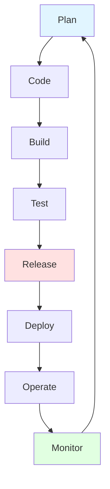

**Core DevOps Principles:**

1. **Version Control** - Track all code changes (Git)
2. **Continuous Integration** - Automated testing on code changes
3. **Continuous Deployment** - Automated deployment to environments
4. **Deployment Environments** - Dev → Staging → Production
5. **Monitoring & Feedback** - Track performance, errors, usage

---

### **🤖 MLOps: Extending DevOps**

```mermaid
graph TD
    A[Code Changes] --> D[Trigger Build]
    B[Data Changes] --> D
    C[Model Changes] --> D
    
    D --> E[CI Pipeline]
    E --> F[CD Pipeline]
    E --> G[CT Pipeline]
    
    F --> H[Deploy Code]
    G --> I[Retrain Model]
    
    I --> J[Model Registry]
    J --> H
```

**The Three Dimensions:**
- **Code** - Application logic, pipelines
- **Data** - Training data, features
- **Model** - Trained weights, architecture

**Why MLOps is Complex:**

```python
# Traditional Software
if code_changes:
    run_ci_cd()

# ML Systems  
if code_changes or data_changes or model_degrades:
    run_ci_cd_ct()  # Much more complex!
```

---

### **📦 MLOps Core Components**

| Component | Purpose | Tools |
|-----------|---------|-------|
| **Model Registry** | Version and store models | Hugging Face, MLflow, Comet ML |
| **Feature Store** | Manage feature pipelines | Hopsworks, Tecton, Feast |
| **ML Metadata Store** | Track experiments, lineage | MLflow, W&B, Comet ML |
| **Orchestrator** | Automate pipelines | ZenML, Airflow, Prefect |

---

### **⚙️ The Six MLOps Principles**

#### **1. Automation / Operationalization**

Three-tier maturity model:

```mermaid
graph LR
    A[Manual Process] --> B[Continuous Training]
    B --> C[CI/CD/CT]
    
    A --> D[Jupyter Notebooks]
    B --> E[Automated Pipelines]
    C --> F[Full Automation]
```

| Tier | Characteristics | Example |
|------|----------------|---------|
| **Manual** | Notebooks, manual steps | Data scientist trains model locally |
| **CT** | Automated training | Scheduled retraining pipeline |
| **CI/CD/CT** | Full automation | Code commit → test → train → deploy |

---

#### **2. Versioning**

**Semantic Versioning (SemVer):**
```
v<MAJOR>.<MINOR>.<PATCH>
  ↓       ↓       ↓
  1   .   2   .   3

MAJOR: Breaking changes
MINOR: New features (backward compatible)
PATCH: Bug fixes
```

**Versioning Strategy:**

```python
class VersionManager:
    """Manage versions across code, data, and models."""
    
    def __init__(self):
        self.git = GitRepo()
        self.model_registry = ModelRegistry()
        self.data_versioning = DVCManager()
    
    def create_release(self,
                      code_version: str,
                      model_id: str,
                      dataset_version: str) -> Dict:
        """Create coordinated release."""
        
        release = {
            'release_id': f"release-{code_version}",
            'code_version': code_version,
            'model_version': model_id,
            'data_version': dataset_version,
            'timestamp': datetime.utcnow(),
            'git_commit': self.git.current_commit(),
            'reproducible': True
        }
        
        # Tag in Git
        self.git.create_tag(code_version)
        
        # Version model
        self.model_registry.tag_model(model_id, code_version)
        
        # Version data
        self.data_versioning.tag_dataset(dataset_version, code_version)
        
        return release
```

---

#### **3. Experiment Tracking**

Track hyperparameters, metrics, and artifacts for every training run.

```python
import comet_ml

class ExperimentTracker:
    """Track ML experiments systematically."""
    
    def __init__(self, project_name: str):
        self.experiment = comet_ml.Experiment(
            project_name=project_name,
            workspace="llm-twin"
        )
    
    def log_training_run(self,
                        model_config: Dict,
                        dataset_info: Dict,
                        training_args: Dict):
        """Log complete training run."""
        
        # Log parameters
        self.experiment.log_parameters(model_config)
        self.experiment.log_parameters(training_args)
        
        # Log dataset metadata
        self.experiment.log_parameter("dataset_size", dataset_info['size'])
        self.experiment.log_parameter("dataset_version", dataset_info['version'])
        
        # Log model architecture
        self.experiment.set_model_graph(model)
    
    def log_metrics(self, metrics: Dict, step: int):
        """Log training metrics."""
        for metric_name, value in metrics.items():
            self.experiment.log_metric(metric_name, value, step=step)
    
    def log_model(self, model_path: str, model_name: str):
        """Log trained model."""
        self.experiment.log_model(model_name, model_path)

# Usage
tracker = ExperimentTracker(project_name="llm-twin-training")

tracker.log_training_run(
    model_config={'model_name': 'meta-llama/Meta-Llama-3-8B', 'lora_r': 16},
    dataset_info={'size': 10000, 'version': 'v1.2.0'},
    training_args={'learning_rate': 2e-4, 'epochs': 3}
)

# During training
for epoch in range(epochs):
    for step, batch in enumerate(dataloader):
        loss = train_step(batch)
        
        tracker.log_metrics({'loss': loss}, step=step)
```

---

#### **4. Testing**

**Test Pyramid for ML:**

```mermaid
graph TD
    A[Unit Tests] --> B[Integration Tests]
    B --> C[Model Tests]
    C --> D[Data Tests]
    
    A --> E[Code functions]
    B --> F[Pipeline components]
    C --> G[Model performance]
    D --> H[Data quality]
```

**Comprehensive Testing Suite:**

```python
import pytest
import pandas as pd

# 1. Code Tests
def test_data_preprocessing():
    """Test preprocessing function."""
    input_data = pd.DataFrame({'text': ['Hello World!', 'Test']})
    result = preprocess_data(input_data)
    
    assert len(result) == 2
    assert 'text' in result.columns
    assert result['text'].iloc[0] == 'hello world'  # lowercase

# 2. Data Tests
def test_data_quality():
    """Test dataset quality."""
    df = load_training_data()
    
    # Check for nulls
    assert df.isnull().sum().sum() == 0
    
    # Check data types
    assert df['text'].dtype == 'object'
    assert df['label'].dtype == 'int64'
    
    # Check value ranges
    assert df['label'].min() >= 0
    assert df['label'].max() < NUM_CLASSES

# 3. Model Tests
def test_model_inference():
    """Test model inference."""
    model = load_trained_model()
    
    test_input = "Write an article about MLOps"
    output = model.generate(test_input)
    
    # Invariance test
    assert len(output) > 0
    assert len(output.split()) < 1000  # Reasonable length
    
    # Output format test
    assert isinstance(output, str)

# 4. Behavioral Tests (CheckList framework)
def test_model_invariance():
    """Test that minor input changes don't affect output."""
    model = load_trained_model()
    
    original = "The ML model performs well"
    synonym = "The ML model performs effectively"
    
    output1 = model.predict(original)
    output2 = model.predict(synonym)
    
    # Predictions should be similar for synonyms
    assert output1 == output2

# 5. Integration Tests
def test_end_to_end_pipeline():
    """Test complete pipeline."""
    # Load data
    data = load_raw_data()
    
    # Process through pipeline
    processed = preprocess_data(data)
    features = extract_features(processed)
    predictions = model.predict(features)
    
    # Verify output
    assert len(predictions) == len(data)
    assert all(0 <= p <= 1 for p in predictions)
```

---

#### **5. Monitoring**

Track system health, model performance, and data drift in production.

```python
class ProductionMonitor:
    """Monitor ML system in production."""
    
    def __init__(self):
        self.metrics_store = MetricsDatabase()
        self.alert_manager = AlertManager()
    
    def log_prediction(self,
                      input_data: Dict,
                      prediction: Any,
                      latency_ms: float):
        """Log individual prediction."""
        
        self.metrics_store.insert({
            'timestamp': datetime.utcnow(),
            'input': input_data,
            'prediction': prediction,
            'latency_ms': latency_ms
        })
    
    def calculate_drift(self, 
                       window_size: int = 1000) -> Dict[str, float]:
        """Detect data drift."""
        
        # Get recent data
        recent_data = self.metrics_store.get_recent(window_size)
        
        # Compare to training distribution
        training_stats = self.load_training_stats()
        
        drift_scores = {}
        
        # KL divergence for numerical features
        for feature in training_stats['numerical_features']:
            current_dist = recent_data[feature].values
            train_dist = training_stats[feature]['distribution']
            
            kl_div = self.calculate_kl_divergence(current_dist, train_dist)
            drift_scores[feature] = kl_div
            
            # Alert if drift detected
            if kl_div > 0.5:  # threshold
                self.alert_manager.send_alert(
                    f"Drift detected in {feature}: KL={kl_div:.3f}"
                )
        
        return drift_scores
    
    def monitor_model_performance(self):
        """Track model metrics."""
        
        # System metrics
        self.log_metric('cpu_utilization', get_cpu_usage())
        self.log_metric('memory_usage', get_memory_usage())
        self.log_metric('gpu_utilization', get_gpu_usage())
        
        # Model metrics (requires ground truth)
        if ground_truth_available():
            predictions = self.get_recent_predictions()
            ground_truth = self.get_ground_truth()
            
            accuracy = calculate_accuracy(predictions, ground_truth)
            self.log_metric('accuracy', accuracy)
            
            # Alert if performance drops
            if accuracy < 0.85:  # threshold
                self.alert_manager.send_alert(
                    f"Model accuracy dropped to {accuracy:.2%}"
                )
```

**Types of Drift:**

| Drift Type | Definition | Example | Detection Method |
|------------|-----------|---------|------------------|
| **Data Drift** | Input distribution changes | User behavior shifts | KS test, KL divergence |
| **Concept Drift** | Input-output relationship changes | Market dynamics change | Performance monitoring |
| **Target Drift** | Output distribution changes | Label distribution shifts | Chi-square test |

---

#### **6. Reproducibility**

Ensure identical results given the same inputs.

```python
import random
import numpy as np
import torch

class ReproducibilityManager:
    """Ensure reproducible ML experiments."""
    
    @staticmethod
    def set_seed(seed: int = 42):
        """Set all random seeds."""
        random.seed(seed)
        np.random.seed(seed)
        torch.manual_seed(seed)
        torch.cuda.manual_seed_all(seed)
        
        # Ensure deterministic behavior
        torch.backends.cudnn.deterministic = True
        torch.backends.cudnn.benchmark = False
    
    def save_experiment_state(self,
                             config: Dict,
                             model_state: Dict,
                             optimizer_state: Dict,
                             random_state: Dict):
        """Save complete experiment state."""
        
        checkpoint = {
            'config': config,
            'model_state_dict': model_state,
            'optimizer_state_dict': optimizer_state,
            'random_state': {
                'python': random.getstate(),
                'numpy': np.random.get_state(),
                'torch': torch.get_rng_state(),
                'torch_cuda': torch.cuda.get_rng_state_all()
            },
            'git_commit': get_git_commit(),
            'dependencies': get_installed_packages()
        }
        
        torch.save(checkpoint, 'experiment_checkpoint.pt')
        return checkpoint
    
    def restore_experiment_state(self, checkpoint_path: str):
        """Restore experiment to reproduce results."""
        checkpoint = torch.load(checkpoint_path)
        
        # Restore random states
        random.setstate(checkpoint['random_state']['python'])
        np.random.set_state(checkpoint['random_state']['numpy'])
        torch.set_rng_state(checkpoint['random_state']['torch'])
        torch.cuda.set_rng_state_all(checkpoint['random_state']['torch_cuda'])
        
        # Restore model and optimizer
        model.load_state_dict(checkpoint['model_state_dict'])
        optimizer.load_state_dict(checkpoint['optimizer_state_dict'])
        
        return checkpoint['config']

# Usage
repro_manager = ReproducibilityManager()
repro_manager.set_seed(42)

# Train model...
checkpoint = repro_manager.save_experiment_state(
    config=training_config,
    model_state=model.state_dict(),
    optimizer_state=optimizer.state_dict(),
    random_state={}
)

# Later, reproduce exact results
repro_manager.restore_experiment_state('experiment_checkpoint.pt')
```

---

### **🚀 LLMOps: Unique Challenges**

#### **Key Differences from MLOps**

| Aspect | Traditional MLOps | LLMOps |
|--------|------------------|--------|
| **Model Size** | MB to GB | GB to TB |
| **Training Data** | Thousands to millions | Billions to trillions of tokens |
| **Training Cost** | $100s | $10,000s to $millions |
| **Deployment** | Single server often sufficient | Multi-GPU clusters required |
| **Prompt Engineering** | Not applicable | Critical optimization lever |
| **Human Feedback** | Limited role | Central to alignment |

#### **LLMOps-Specific Components**

**1. Prompt Management & Versioning**

```python
class PromptManager:
    """Manage and version prompts."""
    
    def __init__(self):
        self.prompts = {}
        self.version_history = []
    
    def register_prompt(self,
                       name: str,
                       template: str,
                       version: str,
                       metadata: Dict = None):
        """Register versioned prompt template."""
        
        prompt_id = f"{name}-{version}"
        
        self.prompts[prompt_id] = {
            'name': name,
            'template': template,
            'version': version,
            'created_at': datetime.utcnow(),
            'metadata': metadata or {},
            'performance_metrics': {}
        }
        
        self.version_history.append(prompt_id)
    
    def get_prompt(self, name: str, version: str = "latest") -> str:
        """Retrieve prompt by name and version."""
        
        if version == "latest":
            # Get most recent version
            matching = [p for p in self.prompts if p.startswith(name)]
            if not matching:
                raise ValueError(f"No prompt found: {name}")
            prompt_id = sorted(matching)[-1]
        else:
            prompt_id = f"{name}-{version}"
        
        return self.prompts[prompt_id]['template']
    
    def A_B_test_prompts(self,
                        prompt_a: str,
                        prompt_b: str,
                        test_inputs: List[str]) -> Dict:
        """Compare two prompt versions."""
        
        results = {'prompt_a': [], 'prompt_b': []}
        
        for input_text in test_inputs:
            # Test both prompts
            response_a = llm.generate(prompt_a.format(input=input_text))
            response_b = llm.generate(prompt_b.format(input=input_text))
            
            # Evaluate (using LLM judge or human feedback)
            score_a = evaluate_response(response_a)
            score_b = evaluate_response(response_b)
            
            results['prompt_a'].append(score_a)
            results['prompt_b'].append(score_b)
        
        return {
            'prompt_a_avg': np.mean(results['prompt_a']),
            'prompt_b_avg': np.mean(results['prompt_b']),
            'winner': 'A' if np.mean(results['prompt_a']) > np.mean(results['prompt_b']) else 'B'
        }
```

**2. Guardrails**

```python
class ContentGuardrails:
    """Input/output safety checks."""
    
    def __init__(self):
        self.toxicity_model = ToxicityClassifier()
        self.pii_detector = PIIDetector()
    
    def check_input(self, user_input: str) -> Dict[str, Any]:
        """Validate input before processing."""
        
        checks = {
            'safe': True,
            'violations': []
        }
        
        # Check for PII
        if self.pii_detector.contains_pii(user_input):
            checks['safe'] = False
            checks['violations'].append('Contains PII')
        
        # Check for prompt injection attempts
        if self.detect_prompt_injection(user_input):
            checks['safe'] = False
            checks['violations'].append('Prompt injection detected')
        
        # Check toxicity
        toxicity_score = self.toxicity_model.score(user_input)
        if toxicity_score > 0.7:
            checks['safe'] = False
            checks['violations'].append(f'Toxic input: {toxicity_score:.2f}')
        
        return checks
    
    def check_output(self, generated_text: str) -> Dict[str, Any]:
        """Validate output before returning to user."""
        
        checks = {
            'safe': True,
            'violations': []
        }
        
        # Check for hallucinations (fact-checking)
        if self.detect_hallucination(generated_text):
            checks['safe'] = False
            checks['violations'].append('Potential hallucination')
        
        # Check for leaked training data
        if self.detect_memorization(generated_text):
            checks['safe'] = False
            checks['violations'].append('Memorized training data')
        
        # Check toxicity
        toxicity_score = self.toxicity_model.score(generated_text)
        if toxicity_score > 0.7:
            checks['safe'] = False
            checks['violations'].append(f'Toxic output: {toxicity_score:.2f}')
        
        return checks
    
    def detect_prompt_injection(self, text: str) -> bool:
        """Detect prompt injection attempts."""
        injection_patterns = [
            r'ignore previous instructions',
            r'disregard.*above',
            r'pretend you are',
            r'system:.*admin'
        ]
        
        return any(re.search(pattern, text, re.IGNORECASE) 
                  for pattern in injection_patterns)
```

**3. Prompt Monitoring**

```python
from opik import track

class PromptMonitor:
    """Monitor prompts and responses in production."""
    
    @track(project_name="llm-twin")
    def log_interaction(self,
                       user_query: str,
                       retrieved_context: List[str],
                       final_prompt: str,
                       generated_response: str,
                       latency_ms: float,
                       tokens_used: int):
        """Log complete RAG interaction."""
        
        trace = {
            'timestamp': datetime.utcnow(),
            'user_query': user_query,
            'context': retrieved_context,
            'prompt': final_prompt,
            'response': generated_response,
            'latency_ms': latency_ms,
            'tokens': tokens_used,
            'cost': self.calculate_cost(tokens_used)
        }
        
        # Automatically logged by Opik decorator
        return trace
    
    def analyze_traces(self, time_window: str = "24h") -> Dict:
        """Analyze recent traces for insights."""
        
        traces = self.get_traces(time_window)
        
        analysis = {
            'total_requests': len(traces),
            'avg_latency': np.mean([t['latency_ms'] for t in traces]),
            'avg_tokens': np.mean([t['tokens'] for t in traces]),
            'total_cost': sum([t['cost'] for t in traces]),
            'error_rate': len([t for t in traces if t.get('error')]) / len(traces)
        }
        
        # Identify problematic patterns
        long_latency = [t for t in traces if t['latency_ms'] > 1000]
        if long_latency:
            analysis['high_latency_count'] = len(long_latency)
        
        return analysis

# Usage in RAG pipeline
monitor = PromptMonitor()

@app.post("/rag")
async def rag_endpoint(query: str):
    start_time = time.time()
    
    # RAG process
    context = retriever.search(query)
    prompt = build_prompt(query, context)
    response = llm.generate(prompt)
    
    latency = (time.time() - start_time) * 1000
    
    # Log interaction
    monitor.log_interaction(
        user_query=query,
        retrieved_context=context,
        final_prompt=prompt,
        generated_response=response,
        latency_ms=latency,
        tokens_used=count_tokens(response)
    )
    
    return response
```

---

### **🔄 CI/CD/CT Pipeline Implementation**

#### **GitHub Actions CI Pipeline**

```yaml
name: CI Pipeline

on:
  pull_request:
    branches: [main, staging]

jobs:
  qa:
    runs-on: ubuntu-latest
    steps:
      - uses: actions/checkout@v3
      
      - name: Set up Python
        uses: actions/setup-python@v4
        with:
          python-version: '3.11'
      
      - name: Install dependencies
        run: |
          pip install poetry
          poetry install --only dev
      
      - name: Check for secrets
        run: poetry poe gitleaks-check
      
      - name: Lint code
        run: poetry poe lint-check
      
      - name: Format check
        run: poetry poe format-check
  
  test:
    runs-on: ubuntu-latest
    needs: qa
    steps:
      - uses: actions/checkout@v3
      
      - name: Install dependencies
        run: poetry install
      
      - name: Run tests
        run: poetry poe test
      
      - name: Upload coverage
        uses: codecov/codecov-action@v3
```

#### **CD Pipeline (Docker → AWS ECR)**

```yaml
name: CD Pipeline

on:
  push:
    branches: [main]

jobs:
  build-and-push:
    runs-on: ubuntu-latest
    steps:
      - uses: actions/checkout@v3
      
      - name: Configure AWS credentials
        uses: aws-actions/configure-aws-credentials@v1
        with:
          aws-access-key-id: ${{ secrets.AWS_ACCESS_KEY_ID }}
          aws-secret-access-key: ${{ secrets.AWS_SECRET_ACCESS_KEY }}
          aws-region: ${{ secrets.AWS_REGION }}
      
      - name: Login to Amazon ECR
        id: login-ecr
        uses: aws-actions/amazon-ecr-login@v1
      
      - name: Build and push Docker image
        run: |
          docker build -t llm-twin .
          docker tag llm-twin:latest ${{ steps.login-ecr.outputs.registry }}/llm-twin:latest
          docker tag llm-twin:latest ${{ steps.login-ecr.outputs.registry }}/llm-twin:${{ github.sha }}
          docker push ${{ steps.login-ecr.outputs.registry }}/llm-twin:latest
          docker push ${{ steps.login-ecr.outputs.registry }}/llm-twin:${{ github.sha }}
```

#### **CT Pipeline (ZenML)**

```python
from zenml import pipeline, step
from zenml.integrations.slack.alerters import SlackAlerter

@step
def check_data_quality() -> bool:
    """Validate new data quality."""
    new_data = load_new_data()
    
    quality_checks = {
        'null_check': new_data.isnull().sum().sum() == 0,
        'format_check': validate_format(new_data),
        'volume_check': len(new_data) > MIN_SAMPLES
    }
    
    return all(quality_checks.values())

@step
def train_model(data_quality_passed: bool):
    """Train model if data quality passed."""
    if not data_quality_passed:
        raise ValueError("Data quality checks failed")
    
    # Training logic
    model = train_llm(...)
    return model

@step
def deploy_model(model):
    """Deploy trained model to production."""
    deployer = ModelDeployer()
    deployer.deploy(model, endpoint_name="llm-twin-prod")

@pipeline(on_failure=SlackAlerter())
def continuous_training_pipeline():
    """Automated retraining pipeline."""
    quality_ok = check_data_quality()
    model = train_model(quality_ok)
    deploy_model(model)

# Schedule or trigger
if __name__ == "__main__":
    continuous_training_pipeline()
```

---

### **🔔 Alerting System**

```python
from zenml.alerters import BaseAlerter

class AlertingManager:
    """Centralized alerting for ML systems."""
    
    def __init__(self, slack_webhook: str):
        self.slack_webhook = slack_webhook
        self.alert_thresholds = {
            'accuracy_drop': 0.85,
            'latency_spike': 500,  # ms
            'error_rate': 0.05,
            'drift_score': 0.5
        }
    
    def send_alert(self, 
                   alert_type: str,
                   severity: str,
                   message: str,
                   metrics: Dict = None):
        """Send alert to configured channels."""
        
        alert = {
            'type': alert_type,
            'severity': severity,  # critical, warning, info
            'message': message,
            'timestamp': datetime.utcnow().isoformat(),
            'metrics': metrics or {}
        }
        
        # Send to Slack
        self.send_slack_alert(alert)
        
        # Log to monitoring system
        self.log_alert(alert)
        
        # If critical, page on-call
        if severity == 'critical':
            self.page_oncall(alert)
    
    def check_and_alert(self, current_metrics: Dict):
        """Check metrics against thresholds and alert."""
        
        for metric_name, threshold in self.alert_thresholds.items():
            if metric_name not in current_metrics:
                continue
            
            value = current_metrics[metric_name]
            
            # Check if threshold violated
            if metric_name == 'accuracy_drop' and value < threshold:
                self.send_alert(
                    alert_type='model_performance',
                    severity='critical',
                    message=f'Accuracy dropped to {value:.2%}',
                    metrics={'accuracy': value}
                )
            
            elif metric_name == 'latency_spike' and value > threshold:
                self.send_alert(
                    alert_type='system_performance',
                    severity='warning',
                    message=f'Latency spiked to {value}ms',
                    metrics={'latency_ms': value}
                )

# Usage
alerter = AlertingManager(slack_webhook="https://hooks.slack.com/...")

# In monitoring loop
current_metrics = {
    'accuracy_drop': 0.82,  # Below threshold!
    'latency_spike': 600,    # Above threshold!
    'error_rate': 0.02
}

alerter.check_and_alert(current_metrics)
```

---

## Appendix: MLOps Principles Summary

### **Quick Reference Guide**

```mermaid
mindmap
  root((MLOps))
    Automation
      Manual Process
      CT
      CI/CD/CT
    Versioning
      Code (Git)
      Data (DVC)
      Models (Registry)
    Experiment Tracking
      Parameters
      Metrics
      Artifacts
    Testing
      Unit Tests
      Data Tests
      Model Tests
    Monitoring
      Logs
      Metrics
      Drift Detection
    Reproducibility
      Seeds
      Environments
      Checkpoints
```

---

### **Checklist for Production ML Systems**

#### **✅ Before Deployment**

- [ ] All code in version control (Git)
- [ ] Automated tests passing (>80% coverage)
- [ ] Model versioned in registry
- [ ] Training data versioned
- [ ] Experiment tracked with full lineage
- [ ] Performance meets requirements on test set
- [ ] Inference latency tested
- [ ] Resource requirements documented
- [ ] Deployment rollback plan exists

#### **✅ After Deployment**

- [ ] Monitoring dashboard active
- [ ] Alerts configured
- [ ] Drift detection running
- [ ] Performance metrics tracked
- [ ] Logs aggregated and searchable
- [ ] CI/CD pipeline functional
- [ ] CT pipeline scheduled
- [ ] Documentation updated
- [ ] Team trained on operations

---

### **Common Pitfalls & Solutions**

| Pitfall | Consequence | Solution |
|---------|-------------|----------|
| **No data versioning** | Can't reproduce results | Use DVC or artifact stores |
| **Manual testing** | Bugs in production | Implement automated test suite |
| **No monitoring** | Blind to failures | Set up comprehensive monitoring |
| **Single deployment environment** | Production bugs | Use Dev/Staging/Prod environments |
| **Hard-coded configurations** | Inflexible system | Use config files and environment variables |
| **No rollback plan** | Prolonged outages | Implement blue-green or canary deployments |
| **Insufficient logging** | Difficult debugging | Add structured logging throughout |

---

## Key Diagrams & Architectures

### 🏗️ **Core System Architectures**

#### **1. FTI (Feature/Training/Inference) Pipeline Architecture**

```mermaid
graph TB
    subgraph "Feature Pipeline"
        A[Data Sources] --> B[Data Collection]
        B --> C[Cleaning & Validation]
        C --> D[Chunking & Embedding]
        D --> E[(Feature Store)]
        D --> F[(Vector DB)]
    end
    
    subgraph "Training Pipeline"
        E --> G[Dataset Creation]
        G --> H[Fine-tuning SFT]
        H --> I[Preference Alignment DPO]
        I --> J[Model Registry]
    end
    
    subgraph "Inference Pipeline"
        K[User Query] --> L[RAG Retrieval]
        F --> L
        L --> M[Prompt Construction]
        J --> N[LLM Service]
        M --> N
        N --> O[Response]
    end
    
    P[Orchestrator ZenML] -.-> B
    P -.-> G
    P -.-> K
    
    Q[Monitoring Opik] -.-> N
    R[Experiment Tracking Comet] -.-> H
```

**Key Benefits:**
- **Modularity**: Each pipeline independent
- **Scalability**: Different compute requirements (CPU vs GPU)
- **Maintainability**: Clear separation of concerns
- **Testability**: Each component tested independently

---

#### **2. RAG System Architecture (Vanilla)**

```mermaid
graph LR
    A[Documents] --> B[Chunking]
    B --> C[Embedding Model]
    C --> D[(Vector DB)]
    
    E[User Query] --> F[Embed Query]
    F --> G[Vector Search]
    D --> G
    
    G --> H[Retrieved Context]
    E --> I[Prompt Template]
    H --> I
    
    I --> J[LLM]
    J --> K[Generated Answer]
```

**Critical Components:**
- **Chunking Strategy**: 500 tokens with 50 token overlap
- **Embedding Model**: sentence-transformers/all-MiniLM-L6-v2
- **Vector DB**: Qdrant with cosine similarity
- **Top-K Retrieval**: Typically 3-10 chunks

---

#### **3. Advanced RAG Architecture (LLM Twin)**

```mermaid
graph TB
    A[User Query] --> B[Self-Query Extraction]
    A --> C[Query Expansion]
    
    B --> D[Extract: Author, Date, Type]
    C --> E[Generate N Query Variants]
    
    D --> F[Filtered Vector Search]
    E --> F
    G[(Vector DB)] --> F
    
    F --> H[N × K Results]
    H --> I[Deduplication]
    I --> J[Reranking]
    
    J --> K[Top K Chunks]
    K --> L[Context Assembly]
    A --> L
    
    L --> M[Augmented Prompt]
    M --> N[LLM Generation]
    N --> O[Final Answer]
    
    style B fill:#e1f5ff
    style C fill:#e1f5ff
    style J fill:#ffe1e1
```

**Advanced Techniques:**
- **Pre-Retrieval**: Query expansion, self-querying
- **Retrieval**: Filtered vector search with metadata
- **Post-Retrieval**: Cross-encoder reranking

---

#### **4. Training Pipeline Architecture**

```mermaid
graph TD
    A[Instruction Dataset] --> B[Data Validation]
    B --> C[Train/Test Split]
    
    C --> D[Tokenization]
    D --> E[Model Loading]
    
    E --> F{Fine-tuning Type}
    F -->|Full FT| G[Train All Parameters]
    F -->|LoRA| H[Train Adapters Only]
    F -->|QLoRA| I[4-bit + Adapters]
    
    G --> J[Training Loop]
    H --> J
    I --> J
    
    J --> K[Validation]
    K --> L{Converged?}
    L -->|No| J
    L -->|Yes| M[Save Model]
    
    M --> N[Model Registry]
    
    O[Experiment Tracker] -.-> J
    P[Checkpointing] -.-> J
    
    style H fill:#90EE90
    style I fill:#90EE90
```

**Training Configurations:**
- **Full Fine-Tuning**: All 8B parameters (~16GB VRAM)
- **LoRA**: ~0.1-1% parameters (~8GB VRAM)
- **QLoRA**: 4-bit quantization (~6GB VRAM)

---

#### **5. Inference Optimization Stack**

```mermaid
graph TB
    subgraph "Model Optimizations"
        A[Base Model] --> B[KV Cache]
        B --> C[Quantization]
        C --> D[Speculative Decoding]
    end
    
    subgraph "Attention Optimizations"
        E[Standard Attention] --> F[FlashAttention-2]
        F --> G[PagedAttention]
    end
    
    subgraph "Serving Optimizations"
        H[Single Request] --> I[Continuous Batching]
        I --> J[Auto-scaling]
    end
    
    subgraph "Parallelism"
        K[Single GPU] --> L[Pipeline Parallel]
        L --> M[Tensor Parallel]
        M --> N[Data Parallel]
    end
    
    D --> O[Optimized Inference]
    G --> O
    J --> O
    N --> O
    
    O --> P[2-4x Speedup]
```

**Performance Improvements:**
- **KV Cache**: 2-3x faster generation
- **Continuous Batching**: 2-10x throughput
- **Speculative Decoding**: 2-4x speedup
- **FlashAttention-2**: 2-4x faster attention

---

#### **6. MLOps/LLMOps Pipeline Architecture**

```mermaid
graph TB
    subgraph "Development"
        A[Feature Branch] --> B[Local Testing]
        B --> C[Create PR]
    end
    
    subgraph "CI Pipeline"
        C --> D[Lint & Format Check]
        D --> E[Unit Tests]
        E --> F[Integration Tests]
        F --> G{All Pass?}
        G -->|Yes| H[Approve PR]
        G -->|No| I[Fix Issues]
        I --> B
    end
    
    subgraph "CD Pipeline"
        H --> J[Merge to Main]
        J --> K[Build Docker Image]
        K --> L[Push to ECR]
        L --> M[Deploy to Staging]
        M --> N[QA Testing]
        N --> O{Approve?}
        O -->|Yes| P[Deploy to Production]
    end
    
    subgraph "CT Pipeline"
        Q[Data Drift Detected] --> R[Trigger Retraining]
        S[Scheduled: Daily] --> R
        T[Manual Trigger] --> R
        R --> U[Validate Data]
        U --> V[Train Model]
        V --> W[Evaluate]
        W --> X{Better?}
        X -->|Yes| Y[Update Production]
        X -->|No| Z[Keep Current]
    end
    
    subgraph "Monitoring"
        P --> AA[Logs]
        P --> AB[Metrics]
        P --> AC[Traces]
        AA --> AD[Alerting]
        AB --> AD
        AC --> AD
        AD --> Q
    end
    
    style G fill:#FFD700
    style O fill:#FFD700
    style X fill:#FFD700
```

**Automation Levels:**
- **Manual**: Jupyter notebooks, manual deployments
- **CT**: Automated training triggers
- **CI/CD/CT**: Full automation with monitoring

---

#### **7. Deployment Architecture (Microservices)**

```mermaid
graph TB
    A[Load Balancer] --> B[API Gateway]
    
    B --> C[FastAPI Business Service]
    B --> D[SageMaker LLM Service]
    
    C --> E[RAG Module]
    E --> F[(Vector DB<br/>Qdrant)]
    E --> G[Embedding API<br/>OpenAI]
    
    C --> D
    
    D --> H[Model Server<br/>TGI/vLLM]
    H --> I[Fine-tuned Model<br/>8B params]
    
    J[CloudWatch] -.-> C
    J -.-> D
    J -.-> H
    
    K[Auto Scaling] -.-> D
    K -.-> H
    
    L[Opik Monitoring] -.-> C
    L -.-> D
    
    style C fill:#87CEEB
    style D fill:#FFB6C1
    style E fill:#98FB98
```

**Scaling Strategy:**
- **Business Service**: CPU-bound, scales 1-5 instances
- **LLM Service**: GPU-bound, scales 1-5 instances
- **Auto-scaling Metric**: InvocationsPerInstance > 1000

---

#### **8. Data Collection & Processing Pipeline**

```mermaid
graph LR
    A[LinkedIn] --> E[Crawler Dispatcher]
    B[Medium] --> E
    C[GitHub] --> E
    D[Substack] --> E
    
    E --> F[Data Cleaning]
    F --> G[Standardization]
    G --> H[(MongoDB<br/>Data Warehouse)]
    
    H --> I[Feature Pipeline]
    I --> J[Chunking]
    J --> K[Embedding]
    K --> L[(Qdrant<br/>Vector DB)]
    
    H --> M[Training Pipeline]
    M --> N[Instruction Generation]
    N --> O[Dataset Curation]
    O --> P[Fine-tuning]
    
    Q[CDC Change Data Capture] -.-> H
    Q -.-> I
    
    style H fill:#FFDAB9
    style L fill:#E6E6FA
```

**Data Flow:**
1. **Collection**: 4 sources → MongoDB
2. **Feature Pipeline**: MongoDB → Qdrant (for RAG)
3. **Training Pipeline**: MongoDB → Datasets (for fine-tuning)

---

#### **9. Evaluation Framework Architecture**

```mermaid
graph TB
    A[Test Dataset] --> B{Evaluation Type}
    
    B -->|General| C[MMLU, IFEval, Arena]
    B -->|Domain| D[Custom Benchmarks]
    B -->|Task| E[Task-Specific Metrics]
    
    C --> F[Benchmark Suite]
    D --> G[Domain Tests]
    E --> H[Performance Metrics]
    
    F --> I[Multiple-Choice]
    F --> J[Generation-Based]
    
    G --> K[LLM-as-Judge]
    
    H --> L[Accuracy, F1, ROUGE]
    
    I --> M[Results]
    J --> M
    K --> M
    L --> M
    
    M --> N[Comparative Analysis]
    N --> O[Model Selection]
    
    P[RAG System] --> Q[Ragas Metrics]
    Q --> R[Faithfulness]
    Q --> S[Context Recall]
    Q --> T[Answer Relevancy]
    
    R --> U[RAG Evaluation]
    S --> U
    T --> U
    
    style K fill:#FFE4B5
    style Q fill:#F0E68C
```

**Evaluation Levels:**
- **Model-Only**: Benchmarks + LLM-as-judge
- **RAG System**: Ragas/ARES frameworks
- **Production**: A/B testing + user feedback

---

## Implementation Code Patterns

### 🔧 **Essential Design Patterns**

#### **1. Repository Pattern (Data Access)**

```python
from abc import ABC, abstractmethod
from typing import List, Optional, Generic, TypeVar
from pydantic import BaseModel

T = TypeVar('T', bound=BaseModel)

class BaseRepository(ABC, Generic[T]):
    """Abstract repository for data access."""
    
    @abstractmethod
    def get_by_id(self, id: str) -> Optional[T]:
        """Retrieve single item by ID."""
        pass
    
    @abstractmethod
    def list(self, filters: dict = None) -> List[T]:
        """List items with optional filters."""
        pass
    
    @abstractmethod
    def create(self, item: T) -> T:
        """Create new item."""
        pass
    
    @abstractmethod
    def update(self, id: str, item: T) -> T:
        """Update existing item."""
        pass
    
    @abstractmethod
    def delete(self, id: str) -> bool:
        """Delete item."""
        pass


class MongoRepository(BaseRepository[T]):
    """Concrete MongoDB implementation."""
    
    def __init__(self, collection_name: str):
        self.collection = mongodb_client[collection_name]
    
    def get_by_id(self, id: str) -> Optional[T]:
        doc = self.collection.find_one({"_id": id})
        return self.model_class(**doc) if doc else None
    
    def list(self, filters: dict = None) -> List[T]:
        cursor = self.collection.find(filters or {})
        return [self.model_class(**doc) for doc in cursor]
    
    def create(self, item: T) -> T:
        result = self.collection.insert_one(item.dict())
        item.id = str(result.inserted_id)
        return item
    
    # ... implement update, delete


# Usage
class Article(BaseModel):
    id: Optional[str] = None
    title: str
    content: str
    author_id: str

article_repo = MongoRepository[Article]("articles")
article = article_repo.get_by_id("123")
```

---

#### **2. Factory Pattern (Model/Service Creation)**

```python
from typing import Protocol, Dict, Type

class LLMService(Protocol):
    """Protocol for LLM services."""
    def generate(self, prompt: str, **kwargs) -> str: ...

class OpenAIService:
    def __init__(self, api_key: str):
        self.client = OpenAI(api_key=api_key)
    
    def generate(self, prompt: str, **kwargs) -> str:
        response = self.client.chat.completions.create(
            model="gpt-4",
            messages=[{"role": "user", "content": prompt}],
            **kwargs
        )
        return response.choices[0].message.content

class SageMakerService:
    def __init__(self, endpoint_name: str):
        self.endpoint = endpoint_name
        self.client = boto3.client('sagemaker-runtime')
    
    def generate(self, prompt: str, **kwargs) -> str:
        payload = {"inputs": prompt, "parameters": kwargs}
        response = self.client.invoke_endpoint(
            EndpointName=self.endpoint,
            Body=json.dumps(payload)
        )
        return json.loads(response['Body'].read())['generated_text']


class LLMServiceFactory:
    """Factory for creating LLM services."""
    
    _services: Dict[str, Type[LLMService]] = {
        'openai': OpenAIService,
        'sagemaker': SageMakerService
    }
    
    @classmethod
    def create(cls, service_type: str, **config) -> LLMService:
        """Create LLM service by type."""
        if service_type not in cls._services:
            raise ValueError(f"Unknown service type: {service_type}")
        
        service_class = cls._services[service_type]
        return service_class(**config)
    
    @classmethod
    def register(cls, name: str, service_class: Type[LLMService]):
        """Register new service type."""
        cls._services[name] = service_class


# Usage
llm = LLMServiceFactory.create(
    'sagemaker',
    endpoint_name='llm-twin-endpoint'
)

response = llm.generate("Write an article about MLOps")
```

---

#### **3. Strategy Pattern (Interchangeable Algorithms)**

```python
from abc import ABC, abstractmethod
from typing import List

class ChunkingStrategy(ABC):
    """Abstract chunking strategy."""
    
    @abstractmethod
    def chunk(self, text: str) -> List[str]:
        """Split text into chunks."""
        pass


class FixedSizeChunking(ChunkingStrategy):
    """Fixed-size token chunking."""
    
    def __init__(self, chunk_size: int = 500, overlap: int = 50):
        self.chunk_size = chunk_size
        self.overlap = overlap
    
    def chunk(self, text: str) -> List[str]:
        tokens = text.split()
        chunks = []
        
        for i in range(0, len(tokens), self.chunk_size - self.overlap):
            chunk = tokens[i:i + self.chunk_size]
            chunks.append(' '.join(chunk))
        
        return chunks


class SemanticChunking(ChunkingStrategy):
    """Semantic similarity-based chunking."""
    
    def __init__(self, model, threshold: float = 0.7):
        self.model = model
        self.threshold = threshold
    
    def chunk(self, text: str) -> List[str]:
        sentences = sent_tokenize(text)
        embeddings = self.model.encode(sentences)
        
        chunks = []
        current_chunk = [sentences[0]]
        
        for i in range(1, len(sentences)):
            similarity = cosine_similarity(
                embeddings[i],
                np.mean([embeddings[j] for j in current_chunk], axis=0)
            )
            
            if similarity >= self.threshold:
                current_chunk.append(sentences[i])
            else:
                chunks.append(' '.join(current_chunk))
                current_chunk = [sentences[i]]
        
        if current_chunk:
            chunks.append(' '.join(current_chunk))
        
        return chunks


class DocumentProcessor:
    """Context for chunking strategy."""
    
    def __init__(self, strategy: ChunkingStrategy):
        self.strategy = strategy
    
    def set_strategy(self, strategy: ChunkingStrategy):
        """Change strategy at runtime."""
        self.strategy = strategy
    
    def process(self, text: str) -> List[str]:
        """Process document using current strategy."""
        return self.strategy.chunk(text)


# Usage
processor = DocumentProcessor(FixedSizeChunking(chunk_size=500))
chunks = processor.process(long_text)

# Switch strategy
processor.set_strategy(SemanticChunking(model=embedding_model))
semantic_chunks = processor.process(long_text)
```

---

#### **4. Singleton Pattern (Shared Resources)**

```python
from threading import Lock
from typing import Optional

class ModelSingleton:
    """Thread-safe singleton for expensive model loading."""
    
    _instance: Optional['ModelSingleton'] = None
    _lock: Lock = Lock()
    
    def __new__(cls, *args, **kwargs):
        if cls._instance is None:
            with cls._lock:
                # Double-checked locking
                if cls._instance is None:
                    cls._instance = super().__new__(cls)
        return cls._instance
    
    def __init__(self, model_name: str = "default"):
        # Only initialize once
        if not hasattr(self, 'initialized'):
            self.model = self._load_model(model_name)
            self.initialized = True
    
    def _load_model(self, model_name: str):
        """Load model (expensive operation)."""
        print(f"Loading model: {model_name}")
        # Simulate expensive loading
        return SentenceTransformer(model_name)
    
    def encode(self, texts: List[str]) -> np.ndarray:
        """Use model."""
        return self.model.encode(texts)


# Usage (anywhere in codebase)
model1 = ModelSingleton("sentence-transformers/all-MiniLM-L6-v2")
model2 = ModelSingleton("sentence-transformers/all-MiniLM-L6-v2")

assert model1 is model2  # Same instance
# Model only loaded once!
```

---

#### **5. Pipeline Pattern (Data Processing)**

```python
from typing import Callable, List, Any

class Pipeline:
    """Sequential data processing pipeline."""
    
    def __init__(self):
        self.steps: List[Callable] = []
    
    def add_step(self, step: Callable, name: str = None):
        """Add processing step."""
        self.steps.append(step)
        return self
    
    def process(self, data: Any) -> Any:
        """Execute pipeline."""
        result = data
        
        for step in self.steps:
            result = step(result)
        
        return result


# Define processing steps
def clean_text(text: str) -> str:
    """Remove special characters."""
    return re.sub(r'[^a-zA-Z0-9\s]', '', text)

def lowercase(text: str) -> str:
    """Convert to lowercase."""
    return text.lower()

def remove_extra_spaces(text: str) -> str:
    """Remove extra whitespace."""
    return ' '.join(text.split())

def tokenize(text: str) -> List[str]:
    """Split into tokens."""
    return text.split()


# Build pipeline
text_pipeline = (Pipeline()
    .add_step(clean_text, "clean")
    .add_step(lowercase, "lowercase")
    .add_step(remove_extra_spaces, "spaces")
    .add_step(tokenize, "tokenize")
)

# Process data
raw_text = "Hello, World!   This is   a TEST."
tokens = text_pipeline.process(raw_text)
print(tokens)  # ['hello', 'world', 'this', 'is', 'a', 'test']
```

---

#### **6. Decorator Pattern (Cross-Cutting Concerns)**

```python
import time
import functools
from typing import Callable

def retry(max_attempts: int = 3, delay: float = 1.0):
    """Retry decorator for resilient operations."""
    def decorator(func: Callable) -> Callable:
        @functools.wraps(func)
        def wrapper(*args, **kwargs):
            for attempt in range(max_attempts):
                try:
                    return func(*args, **kwargs)
                except Exception as e:
                    if attempt == max_attempts - 1:
                        raise
                    print(f"Attempt {attempt + 1} failed: {e}. Retrying...")
                    time.sleep(delay * (2 ** attempt))  # Exponential backoff
            return None
        return wrapper
    return decorator


def log_execution(func: Callable) -> Callable:
    """Logging decorator."""
    @functools.wraps(func)
    def wrapper(*args, **kwargs):
        print(f"Executing {func.__name__}")
        start = time.time()
        
        result = func(*args, **kwargs)
        
        duration = time.time() - start
        print(f"{func.__name__} completed in {duration:.2f}s")
        
        return result
    return wrapper


def cache_result(ttl: int = 300):
    """Caching decorator with TTL."""
    cache = {}
    
    def decorator(func: Callable) -> Callable:
        @functools.wraps(func)
        def wrapper(*args, **kwargs):
            # Create cache key
            key = str(args) + str(kwargs)
            
            # Check cache
            if key in cache:
                cached_time, cached_result = cache[key]
                if time.time() - cached_time < ttl:
                    print(f"Cache hit for {func.__name__}")
                    return cached_result
            
            # Execute and cache
            result = func(*args, **kwargs)
            cache[key] = (time.time(), result)
            
            return result
        return wrapper
    return decorator


# Usage (stack decorators)
@log_execution
@retry(max_attempts=3, delay=2.0)
@cache_result(ttl=600)
def expensive_api_call(url: str) -> dict:
    """Expensive operation with multiple concerns."""
    response = requests.get(url)
    response.raise_for_status()
    return response.json()


# All concerns handled automatically
data = expensive_api_call("https://api.example.com/data")
```

---

#### **7. Observer Pattern (Event-Driven Architecture)**

```python
from typing import List, Callable
from dataclasses import dataclass

@dataclass
class ModelEvent:
    """Model lifecycle event."""
    event_type: str  # 'training_started', 'epoch_completed', 'training_finished'
    data: dict

class EventObserver:
    """Observer interface."""
    def update(self, event: ModelEvent):
        pass

class MetricsLogger(EventObserver):
    """Log metrics to tracking system."""
    def update(self, event: ModelEvent):
        if event.event_type == 'epoch_completed':
            print(f"Logging metrics: {event.data['metrics']}")
            # Log to Comet ML, W&B, etc.

class CheckpointSaver(EventObserver):
    """Save model checkpoints."""
    def update(self, event: ModelEvent):
        if event.event_type == 'epoch_completed':
            epoch = event.data['epoch']
            print(f"Saving checkpoint for epoch {epoch}")
            # Save model state

class AlertManager(EventObserver):
    """Send alerts on important events."""
    def update(self, event: ModelEvent):
        if event.event_type == 'training_finished':
            accuracy = event.data.get('final_accuracy')
            if accuracy < 0.8:
                print(f"ALERT: Low accuracy {accuracy:.2%}")


class TrainingOrchestrator:
    """Observable training process."""
    
    def __init__(self):
        self._observers: List[EventObserver] = []
    
    def attach(self, observer: EventObserver):
        """Add observer."""
        self._observers.append(observer)
    
    def detach(self, observer: EventObserver):
        """Remove observer."""
        self._observers.remove(observer)
    
    def notify(self, event: ModelEvent):
        """Notify all observers."""
        for observer in self._observers:
            observer.update(event)
    
    def train(self, epochs: int):
        """Training loop with events."""
        self.notify(ModelEvent('training_started', {'epochs': epochs}))
        
        for epoch in range(epochs):
            # Training logic...
            metrics = {'loss': 0.5, 'accuracy': 0.85}
            
            self.notify(ModelEvent('epoch_completed', {
                'epoch': epoch,
                'metrics': metrics
            }))
        
        self.notify(ModelEvent('training_finished', {
            'final_accuracy': 0.85
        }))


# Usage
trainer = TrainingOrchestrator()

# Attach observers
trainer.attach(MetricsLogger())
trainer.attach(CheckpointSaver())
trainer.attach(AlertManager())

# Train (observers notified automatically)
trainer.train(epochs=10)
```

---

#### **8. Adapter Pattern (Interface Compatibility)**

```python
class VectorDB(ABC):
    """Target interface."""
    @abstractmethod
    def search(self, query_vector: List[float], top_k: int) -> List[dict]:
        pass

class QdrantAdapter(VectorDB):
    """Adapter for Qdrant."""
    def __init__(self, client):
        self.client = client
    
    def search(self, query_vector: List[float], top_k: int) -> List[dict]:
        """Adapt Qdrant's API to our interface."""
        results = self.client.search(
            collection_name="documents",
            query_vector=query_vector,
            limit=top_k
        )
        
        # Convert to standard format
        return [
            {
                'id': r.id,
                'score': r.score,
                'content': r.payload['content']
            }
            for r in results
        ]

class PineconeAdapter(VectorDB):
    """Adapter for Pinecone."""
    def __init__(self, index):
        self.index = index
    
    def search(self, query_vector: List[float], top_k: int) -> List[dict]:
        """Adapt Pinecone's API to our interface."""
        results = self.index.query(
            vector=query_vector,
            top_k=top_k,
            include_metadata=True
        )
        
        # Convert to standard format
        return [
            {
                'id': match['id'],
                'score': match['score'],
                'content': match['metadata']['content']
            }
            for match in results['matches']
        ]


# Usage (switch vector DBs without changing code)
vector_db: VectorDB = QdrantAdapter(qdrant_client)
# or
vector_db: VectorDB = PineconeAdapter(pinecone_index)

# Same interface regardless of underlying DB
results = vector_db.search(query_vector=[0.1, 0.2, ...], top_k=5)
```

---

## Best Practices Summary

### 📋 **Comprehensive Best Practices Checklist**

#### **🏗️ Architecture & Design**

| Practice | Why It Matters | Implementation |
|----------|----------------|----------------|
| **Use FTI Pattern** | Separates concerns, enables independent scaling | Feature/Training/Inference pipelines |
| **Microservices for ML** | GPU-heavy models separate from CPU logic | LLM service vs Business service |
| **API-First Design** | Enables flexibility, testing, integration | RESTful APIs with FastAPI |
| **Configuration Management** | Avoid hardcoded values, environment-specific configs | Use .env files, config objects |
| **Dependency Injection** | Testable, flexible components | Pass dependencies vs global state |

---

#### **📊 Data Management**

| Practice | Why It Matters | Implementation |
|----------|----------------|----------------|
| **Version Everything** | Reproducibility, debugging | Git (code), DVC (data), Registry (models) |
| **Schema Validation** | Catch errors early | Pydantic models for all data |
| **Data Quality Checks** | Garbage in = garbage out | Automated validation in pipelines |
| **Incremental Processing** | Efficiency, cost savings | CDC (Change Data Capture) |
| **Immutable Data** | Audit trail, rollback capability | Never modify raw data |

**Data Versioning Example:**
```python
# DO: Version all datasets
dataset_v1 = load_dataset("training_data", version="v1.2.0")

# DON'T: Use unversioned data
dataset = load_dataset("training_data")  # Which version?
```

---

#### **🤖 Model Training**

| Practice | Why It Matters | Implementation |
|----------|----------------|----------------|
| **Experiment Tracking** | Compare approaches systematically | Comet ML, W&B, MLflow |
| **Hyperparameter Logging** | Reproduce best results | Log all configs with experiments |
| **Set Random Seeds** | Reproducible results | seed=42 for all random operations |
| **Save Checkpoints** | Resume training, rollback | Save every N steps |
| **Use LoRA/QLoRA** | Memory efficiency | Train adapters vs full model |
| **Monitor GPU Usage** | Optimize costs | Track utilization, adjust batch size |

**Training Best Practices:**
```python
# DO: Complete experiment setup
experiment.log_parameters({
    'model': 'meta-llama/Llama-3-8B',
    'learning_rate': 2e-4,
    'lora_r': 16,
    'dataset_version': 'v1.2.0',
    'random_seed': 42
})

set_seed(42)  # Reproducibility

# Train with checkpointing
trainer = Trainer(
    save_steps=500,
    save_total_limit=3  # Keep only recent checkpoints
)
```

---

#### **🔍 RAG Systems**

| Practice | Why It Matters | Implementation |
|----------|----------------|----------------|
| **Optimize Chunk Size** | Balance context vs noise | Test 256-1024 tokens, typical: 500 |
| **Use Overlapping Chunks** | Preserve context across boundaries | 10-20% overlap (50-100 tokens) |
| **Implement Reranking** | Improve relevance | Cross-encoder after retrieval |
| **Add Metadata Filters** | Faster, more accurate search | Filter by author, date, type |
| **Query Expansion** | Capture multiple angles | Generate 2-5 query variants |
| **Cache Embeddings** | Reduce cost & latency | Store computed embeddings |
| **Monitor Retrieval Quality** | Detect degradation | Log precision@K, recall@K |

**RAG Configuration:**
```python
# DO: Comprehensive RAG setup
rag_config = {
    'chunk_size': 500,
    'chunk_overlap': 50,
    'top_k': 5,
    'rerank': True,
    'rerank_top_k': 3,
    'use_query_expansion': True,
    'n_queries': 3,
    'metadata_filters': ['author_id', 'content_type']
}

# DON'T: Use defaults without testing
retriever = VectorSearch()  # Unknown chunk size, no reranking
```

---

#### **⚡ Inference Optimization**

| Practice | Why It Matters | Implementation |
|----------|----------------|----------------|
| **Enable KV Cache** | 2-3x faster generation | Always on for production |
| **Use Quantization** | Reduce memory 2-8x | INT8 or NF4 for deployment |
| **Continuous Batching** | Maximize GPU utilization | TGI, vLLM, TensorRT-LLM |
| **Speculative Decoding** | 2-4x speedup | Draft model + target model |
| **Monitor Latency** | Meet SLA requirements | P50, P95, P99 metrics |
| **Profile Bottlenecks** | Optimize critical paths | Use NVIDIA Nsight, PyTorch Profiler |

**Inference Setup:**
```python
# DO: Optimize for production
model = AutoModelForCausalLM.from_pretrained(
    "meta-llama/Llama-3-8B",
    device_map="auto",
    load_in_8bit=True,  # Quantization
    torch_dtype=torch.float16,
    attn_implementation="flash_attention_2"  # Optimized attention
)

model.generation_config.cache_implementation = "static"  # KV cache
compiled_model = torch.compile(model)  # Compilation
```

---

#### **🧪 Testing**

| Practice | Why It Matters | Implementation |
|----------|----------------|----------------|
| **Test Data Quality** | Prevent training on bad data | Schema validation, null checks |
| **Test Model Outputs** | Catch regressions | Invariance, directional, minimum functionality |
| **Integration Tests** | Verify pipeline end-to-end | Test feature → training → inference |
| **Performance Tests** | Ensure latency SLAs | Load testing with realistic traffic |
| **CI/CD for ML** | Automate quality gates | GitHub Actions, GitLab CI |

**Testing Pyramid:**
```python
# 1. Unit Tests (Fast, Many)
def test_preprocessing():
    input_text = "Hello, World!"
    result = preprocess(input_text)
    assert result == "hello world"

# 2. Integration Tests (Medium, Some)
def test_rag_pipeline():
    query = "What is RAG?"
    docs = retriever.search(query)
    assert len(docs) > 0
    assert all('content' in doc for doc in docs)

# 3. E2E Tests (Slow, Few)
def test_full_system():
    response = client.post("/rag", json={"query": "Test query"})
    assert response.status_code == 200
    assert 'answer' in response.json()
```

---

#### **📈 Monitoring & Observability**

| Practice | Why It Matters | Implementation |
|----------|----------------|----------------|
| **Log Everything** | Debug issues, audit trail | Structured logging (JSON) |
| **Track Metrics** | Measure system health | Prometheus, CloudWatch |
| **Monitor Drift** | Detect model degradation | KL divergence, KS test |
| **Trace Requests** | Debug complex flows | OpenTelemetry, Opik |
| **Set Up Alerts** | React to issues quickly | PagerDuty, Slack alerts |
| **Dashboard Creation** | Visualize key metrics | Grafana, CloudWatch |

**Monitoring Setup:**
```python
# DO: Comprehensive monitoring
class ProductionMonitor:
    def log_request(self, request_data: dict):
        # Log inputs
        logger.info("request", extra={
            'query': request_data['query'],
            'timestamp': datetime.utcnow(),
            'user_id': request_data.get('user_id')
        })
    
    def log_response(self, response_data: dict, latency: float):
        # Log outputs + metrics
        logger.info("response", extra={
            'answer': response_data['answer'],
            'latency_ms': latency,
            'tokens': count_tokens(response_data['answer']),
            'sources': response_data.get('sources', [])
        })
    
    def check_drift(self):
        # Monitor data distribution
        if self.detect_drift():
            self.alert("Data drift detected")
```

---

#### **🔐 Security & Safety**

| Practice | Why It Matters | Implementation |
|----------|----------------|----------------|
| **Input Validation** | Prevent prompt injection | Sanitize user inputs |
| **Output Filtering** | Block toxic/harmful content | Content moderation APIs |
| **PII Detection** | Protect user privacy | Remove emails, phones, etc. |
| **Rate Limiting** | Prevent abuse | API throttling |
| **Access Control** | Secure endpoints | API keys, OAuth |
| **Secrets Management** | Avoid credential leaks | AWS Secrets Manager, Vault |

**Safety Implementation:**
```python
# DO: Comprehensive guardrails
class SafetyGuardrails:
    def validate_input(self, user_input: str) -> bool:
        # Check for prompt injection
        if self.detect_injection(user_input):
            raise ValueError("Suspicious input detected")
        
        # Check for PII
        if self.contains_pii(user_input):
            raise ValueError("PII detected in input")
        
        return True
    
    def validate_output(self, generated_text: str) -> bool:
        # Check toxicity
        toxicity_score = self.toxicity_model.predict(generated_text)
        if toxicity_score > 0.7:
            raise ValueError("Toxic content detected")
        
        return True

# DON'T: Trust inputs/outputs blindly
response = llm.generate(user_input)  # No validation!
```

---

#### **💰 Cost Optimization**

| Practice | Why It Matters | Implementation |
|----------|----------------|----------------|
| **Use Spot Instances** | 70-90% cost savings | For batch/training jobs |
| **Right-Size Instances** | Pay only for what you need | Profile before scaling up |
| **Cache Aggressively** | Reduce API calls | Cache embeddings, responses |
| **Batch Requests** | Better throughput/$ | Group similar requests |
| **Monitor Spend** | Avoid bill shock | AWS Cost Explorer, alerts |
| **Use Reserved Capacity** | Predictable workloads | Reserved instances for prod |

**Cost Optimization Example:**
```python
# DO: Optimize costs
@cache_result(ttl=3600)  # Cache for 1 hour
def generate_embedding(text: str) -> List[float]:
    """Cache embeddings to reduce API costs."""
    return openai_client.embeddings.create(
        input=text,
        model="text-embedding-ada-002"
    )

# Use spot instances for training
training_config = {
    'instance_type': 'ml.g5.2xlarge',
    'use_spot_instances': True,  # 70% cheaper
    'max_wait_time': 7200  # Wait up to 2hrs for spot
}
```

---

#### **📚 Documentation**

| Practice | Why It Matters | Implementation |
|----------|----------------|----------------|
| **README for Every Repo** | Quick onboarding | Setup, usage, examples |
| **API Documentation** | Developer experience | OpenAPI/Swagger specs |
| **Architecture Diagrams** | System understanding | Mermaid, diagrams.net |
| **Runbooks** | Incident response | Common issues + solutions |
| **Change Logs** | Track evolution | CHANGELOG.md |
| **Code Comments** | Explain why, not what | Docstrings for all functions |

**Documentation Template:**
```markdown
# Component Name

## Overview
Brief description of what this does.

## Architecture
[Diagram showing how it fits in system]

## Setup
```bash
poetry install
export API_KEY=...
```

## Usage
```python
from module import Component
component = Component()
result = component.process(data)
```

## Configuration
- `param1`: Description (default: value)
- `param2`: Description (required)

## Troubleshooting
**Issue**: Error message
**Solution**: How to fix

## References
- [Related docs](url)
```

---

#### **⚙️ Deployment**

| Practice | Why It Matters | Implementation |
|----------|----------------|----------------|
| **Blue-Green Deployment** | Zero-downtime updates | Maintain 2 environments |
| **Canary Releases** | Gradual rollout, quick rollback | Route 5% traffic → 100% |
| **Health Checks** | Auto-recovery | `/health` endpoint |
| **Graceful Shutdown** | Complete in-flight requests | Signal handling |
| **Auto-Scaling** | Handle traffic spikes | Target metrics-based |
| **Disaster Recovery** | Business continuity | Regular backups, DR plan |

**Deployment Checklist:**
```markdown
## Pre-Deployment
- [ ] All tests passing
- [ ] Performance benchmarks met
- [ ] Security scan completed
- [ ] Documentation updated
- [ ] Rollback plan documented

## Deployment
- [ ] Deploy to staging
- [ ] Run smoke tests
- [ ] Monitor metrics (15 min)
- [ ] Deploy to production (canary 10%)
- [ ] Monitor metrics (30 min)
- [ ] Scale to 100%

## Post-Deployment
- [ ] Verify metrics baseline
- [ ] Check error rates
- [ ] Validate user experience
- [ ] Update status page
```

---

#### **🎯 Project Management**

| Practice | Why It Matters | Implementation |
|----------|----------------|----------------|
| **Start with MVP** | Ship quickly, iterate | Minimum viable features |
| **Measure Everything** | Data-driven decisions | Define metrics upfront |
| **Iterate Based on Feedback** | Build what users need | Collect feedback early |
| **Technical Debt Management** | Long-term maintainability | Allocate time for refactoring |
| **Blameless Postmortems** | Learn from failures | Focus on systems, not people |

---

#### **📊 Quick Reference: Tool Selection**

| Category | Tool | Use Case |
|----------|------|----------|
| **Orchestration** | ZenML, Airflow | Pipeline automation |
| **Experiment Tracking** | Comet ML, W&B | Compare models |
| **Model Registry** | Hugging Face, MLflow | Version models |
| **Vector DB** | Qdrant, Pinecone | RAG retrieval |
| **Monitoring** | Opik, Langfuse | Prompt tracing |
| **Serving** | TGI, vLLM | Inference optimization |
| **CI/CD** | GitHub Actions | Automation |
| **Cloud** | AWS SageMaker | Training & serving |

---
