

    <a href="https://kranthib.github.io/tech-pulse/" style="display: inline-block; padding: 6px 14px; background-color: #2054a6; color: white; text-decoration: none; border-radius: 3px; font-size: 14px; font-weight: 500; transition: background-color 0.3s;">Back to Home →</a>

# The Complete Guide to Digital Strategies for Business Transformation

## Table of Contents

1. [Introduction](#introduction)
2. [The Five Domains of Digital Transformation](#the-five-domains-of-digital-transformation)
3. [Domain 1: Customers - Harnessing Customer Networks](#domain-1-customers---harnessing-customer-networks)
4. [Platform Business Models](#platform-business-models)
5. [Domain 2: Competition - Understanding Asymmetric Competition](#domain-2-competition---understanding-asymmetric-competition)
6. [Domain 3: Data - Turning Data Into Strategic Assets](#domain-3-data---turning-data-into-strategic-assets)
7. [Domain 4: Innovation - Rapid Experimentation Framework](#domain-4-innovation---rapid-experimentation-framework)
8. [Domain 5: Value - Adapting Your Value Proposition](#domain-5-value---adapting-your-value-proposition)
9. [Mastering Disruptive Business Models](#mastering-disruptive-business-models)
10. [Key Takeaways and Implementation Roadmap](#key-takeaways-and-implementation-roadmap)
11. [References](#references)
---

## Introduction

Digital transformation represents one of the most significant strategic challenges facing established enterprises today. While technology serves as an enabler, the fundamental challenge lies in reimagining business models, operational paradigms, and value creation mechanisms for an era defined by exponential technological change and evolving customer expectations.

This comprehensive guide presents a systematic approach to digital transformation through five interconnected strategic domains. Rather than offering superficial tactical advice, this framework addresses the core strategic questions that determine transformation success: how to fundamentally rethink customer relationships, competitive positioning, data utilization, innovation processes, and value propositions.

**The central thesis: Digital transformation is primarily a strategic and organizational challenge that requires systematic rethinking of core business assumptions rather than merely adopting new technologies.**

### Defining Digital Transformation

Digital transformation constitutes **the systematic adaptation of established business models, operational processes, and organizational capabilities to create sustainable competitive advantage in digitally-mediated markets**. This definition emphasizes three critical elements:

1. **Systematic Adaptation**: Not ad-hoc technology adoption, but coordinated transformation across multiple business domains
2. **Established Businesses**: Focus on incumbent organizations rather than digital natives
3. **Sustainable Competitive Advantage**: Emphasis on creating lasting differentiation, not short-term efficiency gains

### Strategic Exemplars of Digital Transformation

**The New York Times (Media Industry)**
- **Challenge**: Declining print advertising revenue and changing information consumption patterns
- **Strategic Response**: Fundamental business model pivot from advertising-dependent to subscriber-centric revenue
- **Key Innovation**: Investment in digital journalism capabilities and subscription technology infrastructure
- **Outcome**: Achieved over 8 million digital subscribers and sustainable digital revenue growth

**Walmart (Retail Industry)**
- **Challenge**: Amazon's e-commerce dominance threatening traditional retail model
- **Strategic Response**: Omnichannel strategy leveraging physical store network as competitive advantage
- **Key Innovation**: Integration of digital and physical assets through services like curbside pickup and same-day delivery
- **Outcome**: Successfully competed with pure-play digital retailers by creating unique value propositions

**Mastercard (Financial Services)**
- **Challenge**: Commoditization of traditional payment processing
- **Strategic Response**: Expansion into adjacent high-value services using data and network advantages
- **Key Innovation**: Development of cybersecurity, analytics, and consulting services leveraging transaction data
- **Outcome**: Diversified revenue streams and higher-margin service offerings beyond core payments

---

## The Five Domains of Digital Transformation

Digital transformation requires orchestrated change across five interconnected strategic domains. These domains represent fundamental areas where digital technologies are reshaping competitive dynamics and creating new sources of value creation. Organizations that successfully navigate transformation address all five domains systematically rather than pursuing isolated technology initiatives.

### Strategic Framework Overview

The five-domain framework provides a comprehensive lens for analyzing and implementing digital transformation initiatives:

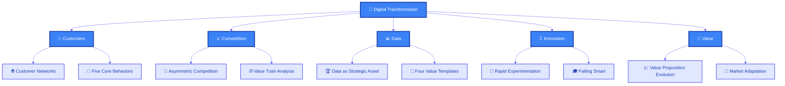

### The Five Domains Explained

**1. Customers Domain: From Mass Markets to Dynamic Networks**
Traditional marketing assumed customers were passive recipients of standardized messages and products. Digital transformation requires understanding customers as active participants in dynamic networks that shape brand perceptions, influence purchase decisions, and co-create value through digital platforms.

**2. Competition Domain: Asymmetric Threats and Value Chain Reconfiguration**  
Digital technologies enable new forms of competition where challengers attack incumbents not through direct competition but by fundamentally different business models. Understanding competitive dynamics requires analysis of entire value chains rather than traditional competitor benchmarking.

**3. Data Domain: Strategic Asset Development and Monetization**
Data transforms from operational byproduct to strategic asset that enables new business models, customer insights, and operational efficiencies. Organizations must develop explicit data strategies that treat data as a core competitive differentiator.

**4. Innovation Domain: Experimentation-Driven Development**
Traditional innovation relied on extensive planning and linear development processes. Digital transformation requires rapid experimentation methodologies that enable fast learning, early failure detection, and iterative improvement of products and services.

**5. Value Domain: Continuous Value Proposition Evolution**  
Digital markets punish organizations that maintain static value propositions. Success requires continuous adaptation of customer value propositions based on changing market conditions, customer needs, and competitive dynamics.

### Strategic Interdependencies

The five domains are not independent; they form an interconnected system where progress in one domain enables and requires progress in others:

- **Customer insights** inform **competitive strategy** and **value proposition** development
- **Data capabilities** enable **innovation** processes and **customer** personalization
- **Competitive pressures** drive **innovation** requirements and **value proposition** evolution
- **Value proposition** changes require new **customer** engagement models and **data** strategies

### Implementation Imperative

Organizations attempting digital transformation often fail because they approach domains in isolation or focus exclusively on technology implementation. Sustainable transformation requires orchestrated change across all five domains, supported by leadership commitment, cultural transformation, and systematic capability development.

---

## Domain 1: Customers - Harnessing Customer Networks

### The Strategic Imperative: Network Effects in Customer Relationships

The first domain addresses a fundamental shift in customer behavior and market dynamics. Traditional business models assumed customers operated as discrete, independent actors who could be reached through mass marketing and persuaded through standardized messaging. This paradigm has been fundamentally disrupted by digital technologies that enable customers to form dynamic networks, share information instantaneously, and collectively influence market outcomes.

**Strategic Insight**: Organizations must transition from mass market thinking to network-centric customer strategies that leverage the interconnected nature of modern customer behavior.

### From Mass Markets to Customer Networks

#### Traditional Mass Market Model
- **Assumption**: Customers as isolated decision-makers
- **Approach**: Standardized products and messaging for maximum efficiency
- **Communication**: One-to-many broadcast model
- **Value Creation**: Internal value creation with external value delivery

#### Network-Centric Model  
- **Reality**: Customers as interconnected network participants
- **Approach**: Personalized experiences that leverage network effects
- **Communication**: Many-to-many conversation facilitation
- **Value Creation**: Co-creation and collaboration with customer networks

### The Evolution of Customer Journey Architecture

Modern customer journeys are significantly more complex than traditional funnel models, requiring sophisticated understanding of network-mediated decision-making processes:

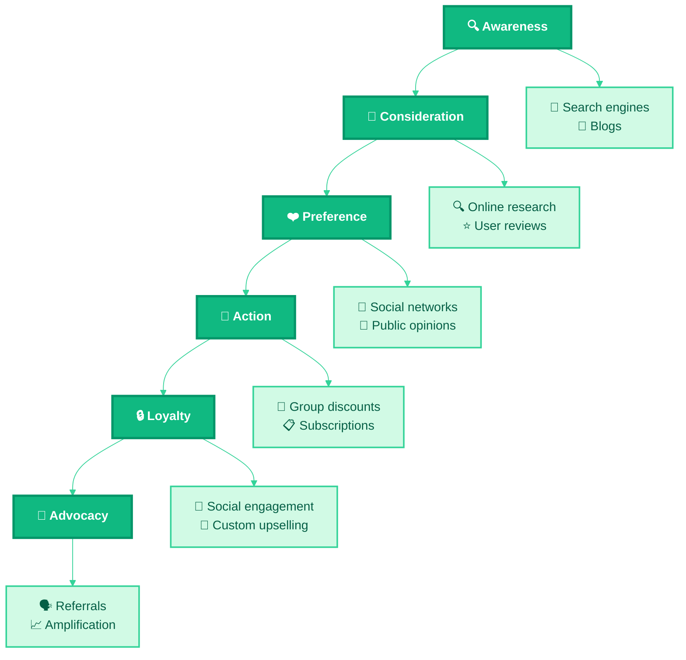

### B2B Customer Network Characteristics

Business-to-business customer networks exhibit distinct characteristics that require specialized strategic approaches:

**Extended Decision Cycles**
- Multiple stakeholders with varying influence and decision criteria
- Complex approval processes requiring sustained engagement
- Higher stakes driving more thorough evaluation processes

**Information-Intensive Behavior**
- Emphasis on detailed technical specifications and case studies
- Peer validation through professional networks and industry associations
- Risk mitigation through reference checking and pilot programs

**Relationship-Centric Value Creation**
- Long-term partnership orientation rather than transactional relationships
- Co-creation of solutions through collaborative development processes
- Integration of business processes requiring ongoing interaction

### Strategic Customer Behavior Models

Organizations require multiple analytical frameworks to understand and predict customer network behavior:

#### 1. Path-to-Purchase Analysis
- **Purpose**: Map specific touchpoints and interaction sequences
- **Application**: Optimize conversion rates and reduce friction points
- **Metrics**: Touchpoint effectiveness, conversion attribution, channel performance

#### 2. Micro-Moments Strategy  
- **Purpose**: Identify and capitalize on intent-rich moments
- **Application**: Real-time personalization and contextual engagement
- **Metrics**: Moment identification accuracy, response relevance, engagement quality

#### 3. Customer Journey Orchestration
- **Purpose**: Design comprehensive experience architecture
- **Application**: Cross-channel consistency and experience optimization  
- **Metrics**: Journey completion rates, satisfaction scores, lifetime value

### Five Core Behaviors of Customer Networks

Modern customer networks demonstrate five fundamental behaviors that organizations must understand and leverage for competitive advantage:

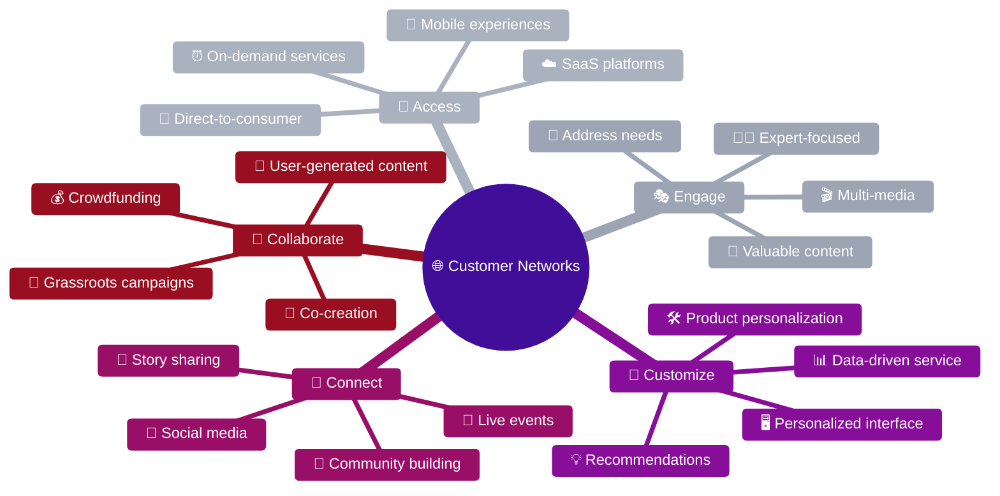

#### Strategic Implementation of the Five Behaviors

**1. Access Strategy: Frictionless Value Delivery**
Organizations must eliminate barriers between customer intent and value realization:

- **Mobile-First Architecture**: Design experiences for mobile-native user behavior
- **Omnichannel Integration**: Seamless transitions between digital and physical touchpoints  
- **API-First Platforms**: Enable third-party integrations and ecosystem development
- **Direct Customer Relationships**: Reduce intermediary dependencies through direct channels

**2. Engage Strategy: Content-Driven Relationship Development**
Customer engagement requires valuable content that addresses specific needs and interests:

- **Educational Content Marketing**: Establish thought leadership through valuable insights
- **Interactive Media Experiences**: Multi-format content adapted to customer preferences
- **Personalized Communication**: Tailored messaging based on behavioral and demographic data
- **Community-Driven Conversations**: Facilitate customer-to-customer knowledge sharing

**3. Customize Strategy: Adaptive Experience Design**
Mass customization enables personalized experiences at scale:

- **AI-Powered Recommendations**: Machine learning algorithms for predictive personalization
- **Dynamic Interface Adaptation**: User interface optimization based on individual behavior patterns
- **Flexible Product Configuration**: Modular offerings that adapt to specific customer requirements
- **Personalized Service Delivery**: Data-driven customization of service experiences

**4. Connect Strategy: Community and Network Development**
Organizations must facilitate connections between customers and between customers and the brand:

- **Social Platform Integration**: Leverage existing social networks for customer engagement
- **Event-Driven Community Building**: Create opportunities for customer interaction and networking
- **User-Generated Content Programs**: Enable customers to create and share brand-related content
- **Peer-to-Peer Support Systems**: Facilitate customer-to-customer problem solving and knowledge transfer

**5. Collaborate Strategy: Co-Creation and Partnership**
Advanced customer relationships involve customers as partners in value creation:

- **Product Co-Development**: Include customers in product design and development processes
- **Innovation Partnerships**: Collaborate with customers on breakthrough innovations
- **Crowdsourcing Initiatives**: Harness collective intelligence for problem-solving
- **Ecosystem Development**: Build platforms that enable customer-driven innovation

---

## Platform Business Models

### Strategic Foundation: Multi-Sided Markets and Network Effects

Platform business models represent one of the most significant innovations in contemporary business strategy. Unlike traditional linear value chains where companies create value through sequential processes, platforms create value by facilitating exchanges between multiple distinct customer segments. This fundamental difference in value creation logic enables platforms to achieve exponential growth rates and capture disproportionate market value.

**Definition**: A platform business model creates value by facilitating direct interactions between two or more distinct types of customers, leveraging network effects to build sustainable competitive advantages.

### Theoretical Foundations and Economic Principles

Platform theory emerges from economic research on two-sided markets, pioneered by economists Jean-Charles Rochet, Jean Tirole, and others. Their work reveals that successful platforms often exhibit asymmetric pricing strategies where one customer segment subsidizes another, creating positive feedback loops that drive adoption and engagement.

**Core Platform Elements**:
1. **Multiple Distinct Customer Segments**: Different user types with complementary needs
2. **Direct Interaction Facilitation**: Platform enables direct value exchange between segments
3. **Network Effects**: Value increases as more participants join each segment

### Platform Taxonomy and Business Model Variations

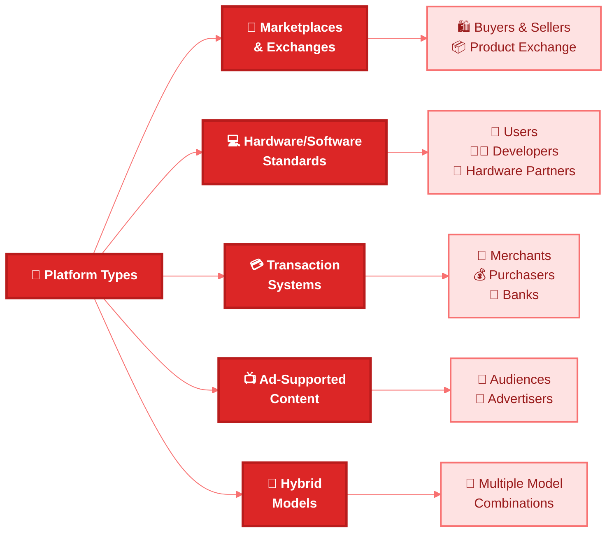

#### 1. Marketplace and Exchange Platforms
**Characteristics**: Facilitate direct transactions between buyers and sellers
- **Value Proposition**: Reduced search costs, transaction facilitation, trust mechanisms
- **Examples**: Amazon Marketplace, eBay, Alibaba, Airbnb, Uber
- **Revenue Model**: Transaction fees, listing fees, subscription services

#### 2. Technology Platform Standards  
**Characteristics**: Enable developers to create complementary products and services
- **Value Proposition**: Reduced development costs, market access, technical infrastructure
- **Examples**: iOS App Store, Android, Windows OS, Salesforce Platform
- **Revenue Model**: Revenue sharing, licensing fees, development tool subscriptions

#### 3. Payment and Transaction Systems
**Characteristics**: Enable financial transactions between multiple parties
- **Value Proposition**: Payment processing, fraud protection, regulatory compliance
- **Examples**: Visa, Mastercard, PayPal, Square
- **Revenue Model**: Transaction processing fees, subscription services

#### 4. Advertising-Supported Content Platforms
**Characteristics**: Connect content consumers with advertisers through audience aggregation
- **Value Proposition**: Content access for audiences, targeted reach for advertisers
- **Examples**: Google Search, Facebook, YouTube, LinkedIn
- **Revenue Model**: Advertising fees, premium subscriptions, data services

### Digital Enablers of Platform Growth

Digital technologies have solved critical challenges that historically limited platform adoption and scale:

**Frictionless Customer Acquisition**
- Low-cost customer onboarding through digital channels
- Viral growth mechanisms through social sharing
- Automated matchmaking and recommendation systems

**Infinite Scalability Potential**
- Cloud infrastructure enabling rapid scaling
- Software-based service delivery with minimal marginal costs
- Global market access through internet connectivity

**Enhanced Trust and Security**
- Digital reputation systems and peer review mechanisms
- Sophisticated fraud detection and prevention capabilities
- Transparent pricing and service comparison tools

**Real-Time Market Dynamics**  
- Instant price discovery and dynamic pricing optimization
- Real-time supply and demand balancing
- Immediate transaction processing and settlement

### Network Effects: The Strategic Foundation

Network effects constitute the primary source of competitive advantage for platform businesses. Understanding different types of network effects enables strategic decision-making about platform design and growth strategies:

#### Direct Network Effects (Same-Side Benefits)
**Mechanism**: Value increases as more users of the same type join the platform
- **Examples**: Communication platforms (WhatsApp, Slack)
- **Strategic Implication**: Focus on achieving critical mass within single user segment
- **Growth Strategy**: Viral mechanisms and user incentives for network expansion

#### Indirect Network Effects (Cross-Side Benefits)  
**Mechanism**: Value increases as more users join complementary segments
- **Examples**: Operating systems (more developers attract more users and vice versa)
- **Strategic Implication**: Balance growth across multiple user segments
- **Growth Strategy**: Subsidize one side to attract the other, creating positive feedback loops

#### Data Network Effects
**Mechanism**: Platform improves as it collects more data from user interactions
- **Examples**: Search engines, recommendation systems
- **Strategic Implication**: Data quality and algorithm sophistication become competitive moats
- **Growth Strategy**: Encourage data-generating behaviors through user engagement

### Platform Business Model Design Framework

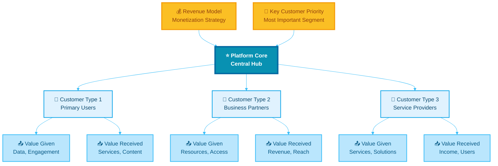

### Strategic Platform Design Considerations

**Customer Segment Identification**
- Define distinct user types with complementary needs
- Analyze interaction patterns and value exchange opportunities
- Assess willingness to pay and price sensitivity across segments

**Value Exchange Architecture**
- Map what each segment gives and receives from platform participation
- Ensure balanced value creation across all segments
- Design mechanisms to facilitate valuable interactions

**Monetization Strategy Development**
- Identify which segments can sustain revenue generation
- Determine optimal pricing models (transaction fees, subscriptions, advertising)
- Balance revenue optimization with network growth objectives

**Core Customer Prioritization**  
- Identify which customer segment is most critical for platform success
- Design platform experience to optimize for core customer needs
- Develop strategies to attract and retain core customer segment

### Six Strategic Affordances of Platform Business Models

Platform architectures provide unique strategic advantages that traditional business models cannot easily replicate:

#### 1. Economic Efficiency Through Market Mechanisms
Platforms leverage market forces rather than internal processes to optimize resource allocation, reducing operational complexity and improving efficiency.

#### 2. Exponential Value Creation Potential  
Network effects enable platforms to create value that increases exponentially with user adoption, rather than linearly as in traditional businesses.

#### 3. Asset-Light Operations
Platforms often avoid owning physical assets, instead facilitating exchanges between asset owners and users, improving capital efficiency.

#### 4. Exceptional Organizational Agility
Platform architectures enable rapid adaptation to market changes through ecosystem innovation rather than internal development.

#### 5. Exponential Growth Rate Potential
Network effects and viral mechanisms enable platforms to achieve growth rates that exceed traditional business models.

#### 6. Winner-Take-All Market Dynamics
Strong network effects often lead to market concentration where dominant platforms capture disproportionate value.

### Platform Strategy Implementation Framework

**Phase 1: Market and Ecosystem Analysis**
- Identify multi-sided market opportunities with strong interaction potential
- Analyze existing solutions and competitive dynamics
- Assess technology infrastructure requirements and scalability challenges

**Phase 2: Platform Architecture Design**  
- Define customer segments and value propositions for each segment
- Design interaction mechanisms and user experience flows
- Develop trust and safety systems to ensure platform integrity

**Phase 3: Growth Strategy Execution**
- Launch with focus on achieving critical mass in core customer segment
- Implement viral growth mechanisms and referral programs
- Monitor network effects and adjust strategy based on user behavior

**Phase 4: Ecosystem Development and Optimization**
- Expand platform capabilities through partnerships and developer programs
- Implement data analytics to improve matching and recommendation algorithms
- Develop advanced monetization strategies and premium service offerings

---

## Domain 2: Competition - Understanding Asymmetric Competition

### Symmetric vs. Asymmetric Competition

#### Symmetric Competitors
- **Same value proposition**
- **Same business model**
- Example: Honda, Ford, GM, Tesla vs. Toyota

#### Asymmetric Competitors
- **Competing value proposition**
- **Different business models**
- Example: Uber vs. Toyota (different investments, skills, technologies, revenue models)

### The Competitive Value Train

The competitive value train helps understand the mix of competition and cooperation between business partners and identifies who has leverage in delivering value to customers.

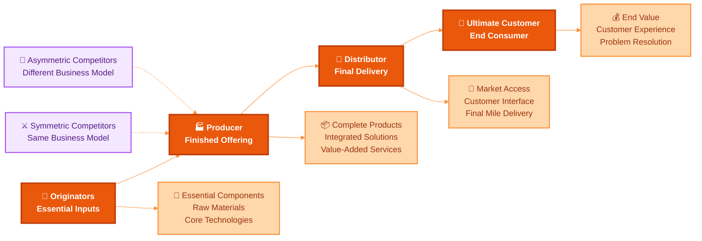

### Applications of Value Train Analysis

#### Disintermediation
- **Definition**: Cutting out the middleman
- **Example**: Streaming services bypassing cable distributors
- **Example**: Google allowing direct airline ticket purchases

#### Intermediation
- **Definition**: New entrants inserting themselves into existing value chains
- **Example**: Mobile wallets between credit cards and purchasers
- **Example**: Facebook in newspaper industry value chain

### Rules of Power in Value Trains

1. **Power goes to unique value creators**
2. **Power tends to go to the edges** (closest to customer or originator)

### Managing Competition Challenges

#### Channel Conflict
- Exploring new strategies that conflict with existing distribution channels
- Requires careful balance between innovation and current partnerships

#### Zero-Sum Mentality
- Moving beyond win-lose thinking
- Recognizing that multiple players can thrive simultaneously
- Understanding complex modern competitive dynamics

---

## Domain 3: Data - Turning Data Into Strategic Assets

### Data as Core Strategic Asset

**Every organization should have its own explicit data strategy.** Data is not just operational—it's a fundamental driver of competitive advantage and business growth.

### Different Types of Data

| Data Type | Examples | Utility |
|-----------|----------|---------|
| **Business Process Data** | Inventory, sales, billing, HR | Optimize operations, reduce risk, external reporting |
| **Customer Data** | Purchases, behavior, reviews, demographics | Complete customer picture, relevant interactions |
| **Product/Service Data** | Maps (Google), business data (Bloomberg), weather (TWC) | Core value proposition delivery |

### Data Strategy Application Framework

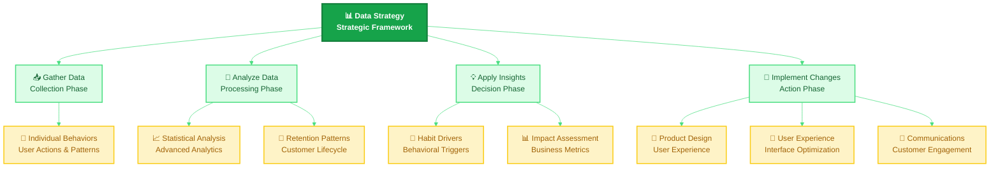

### Principles of Explicit Data Strategy

#### Get the Data
- **Combine data across silos** for holistic view
- **Gather diverse new data types** beyond traditional sources
- **Watch customer actions**, not just stated preferences

#### Use the Data
- **Develop 360-degree organizational picture**
- **Use data as predictive layer** in decision making
- **Design data into product experience** from the ground up

### Four Templates for Value Creation from Data

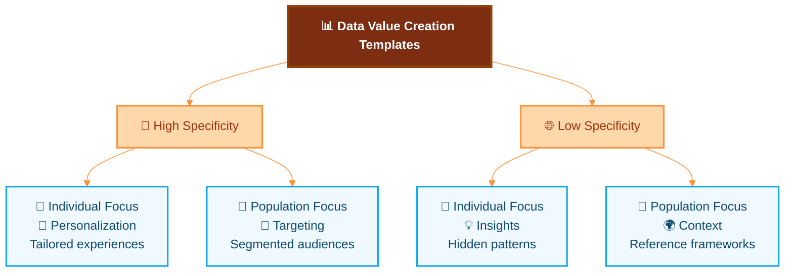

#### 1. Insights: Revealing the Invisible
- **Purpose**: Understanding customer psychology and behavior patterns
- **Applications**: Brand perception analysis, behavior prediction, impact measurement
- **Example**: Text-mining customer discussions to identify brand attributes

#### 2. Targeting: Narrowing the Field
- **Purpose**: Advanced segmentation and audience identification
- **Applications**: Customer acquisition, campaign optimization, resource allocation
- **Example**: Identifying high-value customer segments for focused marketing

#### 3. Personalization: Tailoring to Fit
- **Purpose**: Individual customer experience customization
- **Applications**: Product recommendations, interface adaptation, service customization
- **Example**: Netflix content recommendations based on viewing history

#### 4. Context: Providing a Frame of Reference
- **Purpose**: Using population data to provide individual context
- **Applications**: Benchmarking, social proof, behavioral nudging
- **Example**: Energy usage comparison with neighborhood averages

### Data Strategy Implementation Process

1. **Area of Impact and KPIs**: Define measurable business objectives
2. **Value Template Selection**: Choose most relevant approach
3. **Concept Generation**: Ideate specific data applications
4. **Data Audit**: Assess current data and identify gaps
5. **Execution Plan**: Technical solution and business process changes

### Organizational Issues in Data-Driven Organizations

- **Centralization vs. Decentralization**: Balancing control and agility
- **Data Governance**: Ensuring quality, security, and compliance
- **Job Redefinition**: Adapting roles for data-driven decision making
- **Decision-Making Evolution**: From intuition to evidence-based choices

---

## Domain 4: Innovation - Rapid Experimentation Framework

### The Shift from Planning to Learning

**Innovation in the digital era has shifted from extensive planning to rapid experimentation.** The focus is on iterative learning through testing and validation.

### Experimentation-Centered Methodologies

Modern innovation draws from several experimentation-focused approaches:
- **Lean Startup**: Build-measure-learn cycles
- **Agile Software Development**: Iterative development
- **Design Thinking**: Human-centered problem solving
- **Product Management**: Data-driven feature development

### Types of Experimentation

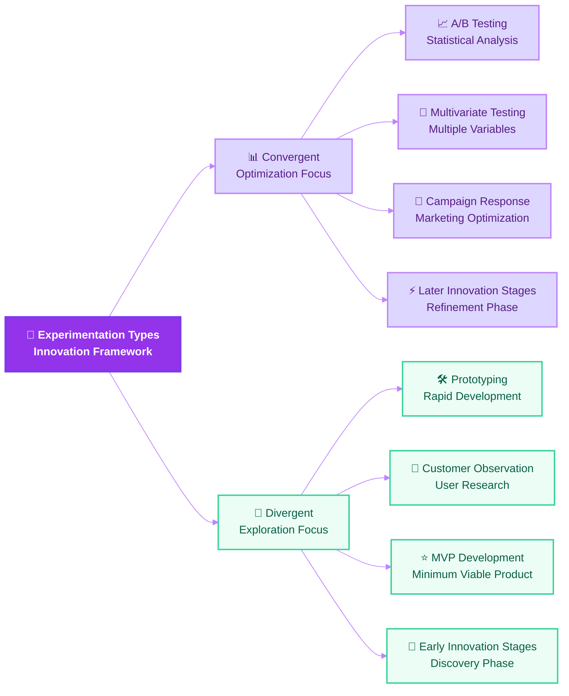

#### Convergent Experimentation
- **Purpose**: Optimize existing processes and products
- **Methods**: A/B testing, multivariate analysis
- **Usage**: Later stages of innovation, quantitative predictions
- **Timeline**: Often quick (hours to days)

#### Divergent Experimentation
- **Purpose**: Explore new ideas and opportunities
- **Methods**: Prototyping, MVP development, customer observation
- **Usage**: Early innovation stages, open-ended questions
- **Process**: Lesser to greater fidelity and completeness

### The Convergent Experimental Method

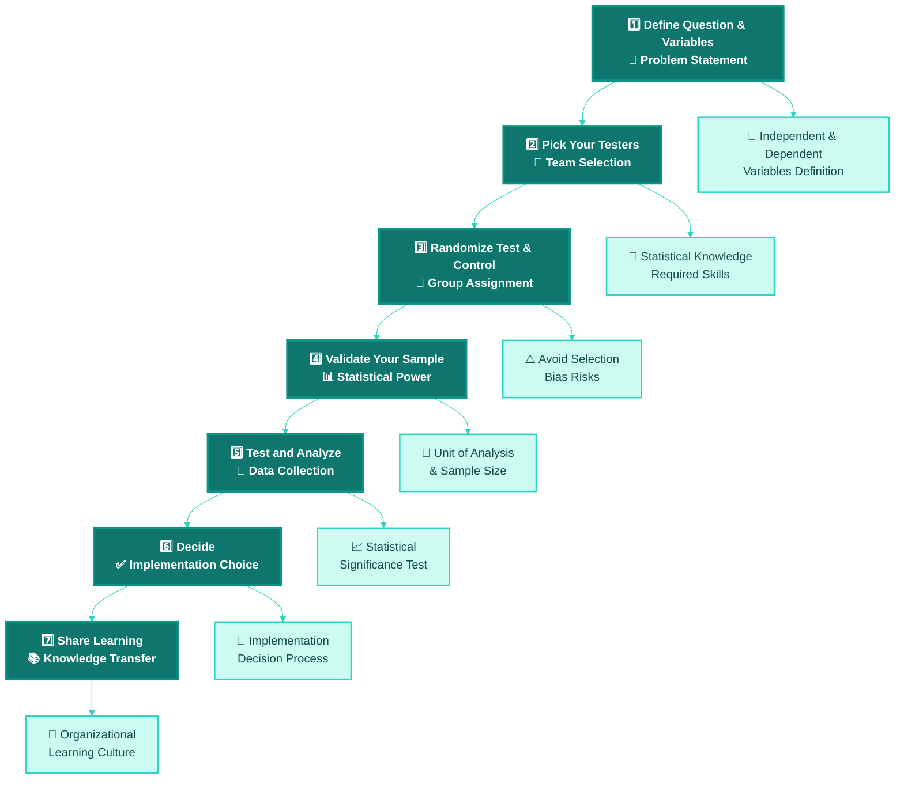

### The Divergent Experimental Method (MVP Approach)

**Minimum Viable Product (MVP)**: A bare-bones creation with just enough features to allow useful feedback from early adopters.

**MVP Formula: Minimal Cost + Maximum Learning**

### Six Principles of Experimentation

1. **Fall in love with the problem**, not the solution
2. **Learn early** to reduce risk and cost
3. **Test your assumptions** systematically
4. **Focus on speed of learning** over perfection
5. **Measure what matters now** for current decisions
6. **Fail smart** to maximize learning from failures

### The Four Parts of Failing Smart

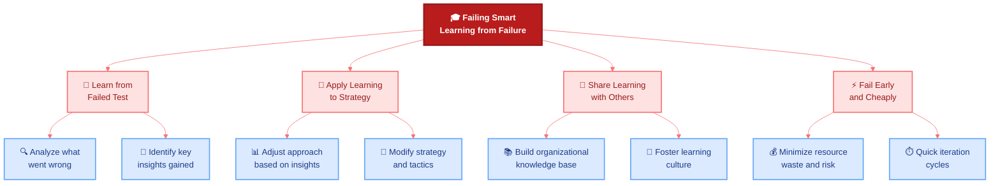

### Overcoming Organizational Challenges

- **Decision-making culture**: Build test-and-learn mindset at all levels
- **Leadership support**: Look beyond top leadership for culture change
- **Celebrate smart failures**: Recognize valuable learning from failures
- **Resource allocation**: Balance experimentation with operational needs

---

## Domain 5: Value - Adapting Your Value Proposition

### From Sustaining to Adapting

**Value represents a shift from sustaining your current value proposition to adapting to changing market needs.** In the digital age, maintaining an unchanging value proposition invites disruption.

### Recognizing Value from Customer's Perspective

Understanding how customer needs evolve is crucial for value proposition adaptation:

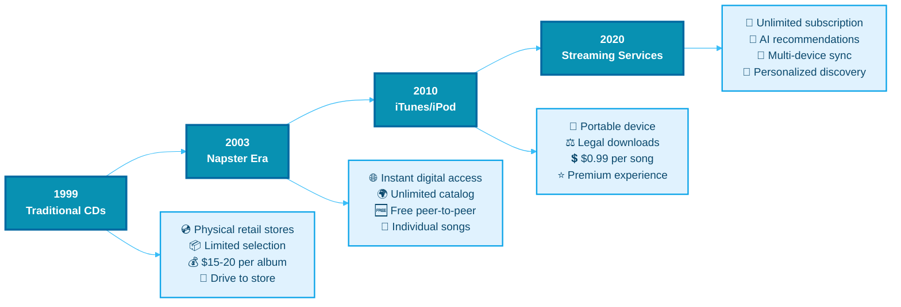

### Three Routes Out of a Shrinking Market

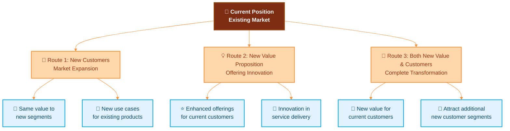

#### Route 1: New Customers/Use Cases
- Maintain current value proposition
- Target different customer segments
- Explore new use cases for existing offerings

#### Route 2: New Value Proposition
- Develop enhanced offerings for current customers
- Adapt to changing customer needs
- Innovation in service delivery

#### Route 3: Combined Approach
- Create new value propositions for current customers
- Use enhanced offerings to attract new customer segments
- Maximum growth potential but higher complexity

### Value Proposition Expansion Framework

#### Part A: Current State Analysis
1. **Industry and organization selection**
2. **Core product/service definition**
3. **Customer value analysis**
4. **Revenue model assessment**

#### Part B: Future Value Creation
1. **New value proposition ideation**
2. **Customer benefit analysis**
3. **Revenue model innovation**
4. **Partnership ecosystem development**

#### Part C: Competitive Defense
1. **Barrier creation strategies**
2. **Competitive response planning**
3. **Market positioning**
4. **Sustainable advantage building**

### Strategic Assumptions: Analog vs. Digital Age

| Analog Age Assumption | Digital Age Reality |
|----------------------|---------------------|
| Value proposition defined by industry | Value proposition defined by changing customer needs |
| Execute current value proposition | Uncover next opportunity for customer value |
| Optimize business model as long as possible | Evolve before you must, stay ahead of curve |
| Judge change by current business impact | Judge change by potential new business creation |
| Market success allows complacency | "Only the paranoid survive" |

---

## Mastering Disruptive Business Models

### Understanding True Disruption

**Disruption occurs when an existing industry faces a challenger that offers far greater value to customers in a way that existing firms cannot compete with directly.**

Not every innovation is disruptive. True disruption requires specific characteristics that distinguish it from regular competition or innovation.

### The Disruptive Business Model Map

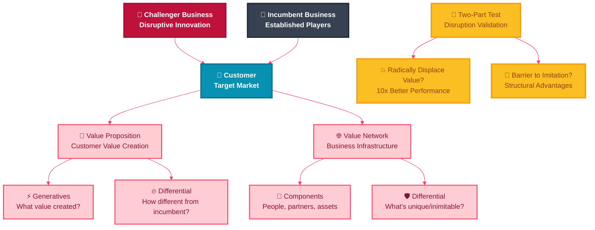

### Components of Business Models

#### Value Proposition
- **What you offer** to customers
- **How you create value** for different customer segments
- **Why customers choose you** over alternatives

#### Value Network
- **People and partners** required for value creation
- **Assets and capabilities** needed for delivery
- **Revenue model** and cost structure
- **Processes and systems** enabling value capture

### The Two-Part Test for Disruption

For a business model to be truly disruptive, it must pass both tests:

#### Test 1: Radically Displace Value
- Dramatically superior value proposition
- 10x improvement in key customer metrics
- Makes incumbent offerings seem inadequate
- Addresses previously underserved market segments

#### Test 2: Barrier to Imitation
- **Business model conflict**: Incumbent can't respond without cannibalizing existing business
- **Technical barriers**: Requires fundamental technology rebuild
- **Cultural barriers**: Contradicts incumbent's organizational DNA
- **Economic barriers**: Incompatible with existing revenue/cost structure

### Variables of Disruptive Business Models

1. **Customer Trajectory**: How customer needs evolve over time
2. **Scope of Disruption**: Industry-wide vs. segment-specific impact
3. **Multiple Incumbents**: Various established players affected differently

### Six Incumbent Response Strategies

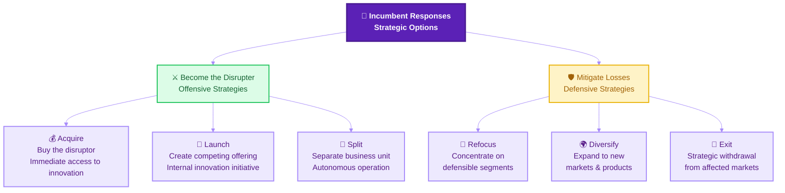

### Organizational Barriers to Digital Transformation

Understanding these barriers is crucial for successful transformation:

#### The Five Barriers

1. **No Shared Vision**
   - Lack of clear digital transformation definition
   - Misaligned understanding across organization
   - Unclear strategic direction

2. **No Priorities for Growth**
   - Focus on efficiency rather than growth
   - Maintaining status quo operations
   - Risk-averse decision making

3. **No Focus on Experimentation**
   - Over-reliance on planning vs. testing
   - Extensive business case requirements
   - Benchmarking rather than innovating

4. **No Flexibility in Governance**
   - Rigid approval processes
   - Inability to launch new products quickly
   - Bureaucratic decision-making structures

5. **Limited Investment Capabilities**
   - Insufficient technology investment
   - Lack of new skills and talent
   - Resistance to cultural change

---

## Key Takeaways and Implementation Roadmap

### Essential Strategic Principles

1. **Digital transformation is primarily about strategy and mindset, not technology**
2. **Customer networks require fundamentally different engagement approaches**
3. **Platform business models can create exponential value and growth**
4. **Asymmetric competition comes from unexpected directions**
5. **Data must be treated as a core strategic asset**
6. **Innovation requires rapid experimentation and smart failure**
7. **Value propositions must continuously evolve with customer needs**
8. **True disruption is rare but requires specific strategic responses**

### Implementation Framework

```mermaid
%%{init: {'theme':'base', 'themeVariables': {'primaryColor':'#065f46', 'primaryTextColor':'#ffffff', 'primaryBorderColor':'#10b981', 'lineColor':'#34d399', 'secondaryColor':'#f0fdf4', 'tertiaryColor':'#dcfce7'}}}%%
flowchart TD
    A[🚀 Digital Transformation Implementation] --> B[📊 Phase 1: Assessment<br/>Days 1-65]
    A --> C[📋 Phase 2: Strategy Development<br/>Days 30-115] 
    A --> D[🛠️ Phase 3: Implementation<br/>Days 75-270]
    A --> E[📈 Phase 4: Optimization<br/>Days 165-730]
    
    B --> B1[🔍 Five Domains Audit<br/>30 days]
    B --> B2[⚔️ Competitive Analysis<br/>15 days]
    B --> B3[📈 Data Strategy Review<br/>20 days]
    
    C --> C1[👥 Customer Network Strategy<br/>45 days]
    C --> C2[🏢 Platform Opportunities<br/>30 days]
    C --> C3[💎 Value Proposition Evolution<br/>40 days]
    
    D --> D1[🧪 Experimentation Framework<br/>60 days]
    D --> D2[📊 Data Initiative Launch<br/>90 days]
    D --> D3[🚀 Platform Development<br/>120 days]
    
    E --> E1[🔄 Continuous Improvement<br/>365 days]
    E --> E2[📊 Scale and Expand<br/>180 days]
    
    classDef phase fill:#065f46,stroke:#047857,stroke-width:3px,color:#ffffff,font-weight:bold
    classDef activity fill:#dcfce7,stroke:#34d399,stroke-width:2px,color:#166534
    classDef longTerm fill:#fef3c7,stroke:#facc15,stroke-width:2px,color:#a16207
    
    class A phase
    class B,C,D,E phase
    class B1,B2,B3,C1,C2,C3,D1,D2,D3 activity
    class E1,E2 longTerm
```

### Organizational Readiness Assessment

Use this framework to evaluate your organization's digital transformation readiness:

| Domain | Current State (1-7) | Target State | Gap | Priority Actions |
|--------|---------------------|--------------|-----|------------------|
| **Customers** | Customer networks understanding | Advanced network leverage | | Implement five core behaviors |
| **Competition** | Asymmetric threat awareness | Proactive competitive intelligence | | Develop value train analysis |
| **Data** | Data strategy maturity | Data-driven decision making | | Implement four value templates |
| **Innovation** | Experimentation culture | Rapid test-and-learn cycles | | Build experimentation framework |
| **Value** | Value proposition adaptation | Continuous value evolution | | Develop value expansion strategy |

### Success Metrics and KPIs

Track these metrics to measure digital transformation progress:

#### Customer Domain
- Customer network engagement rates
- Multi-channel customer experience scores
- Customer lifetime value improvement
- Social amplification metrics

#### Competition Domain
- Competitive intelligence accuracy
- Response time to competitive threats
- Market position in asymmetric competition
- Value chain leverage assessment

#### Data Domain
- Data-driven decision percentage
- Predictive analytics accuracy
- Customer insight generation rate
- Data monetization opportunities

#### Innovation Domain
- Experimentation velocity
- Smart failure learning rate
- Innovation pipeline value
- Time-to-market improvements

#### Value Domain
- Value proposition differentiation score
- Customer needs alignment
- Revenue from new value propositions
- Market expansion success rate

### Getting Started: 90-Day Action Plan

#### Days 1-30: Foundation Building
- **Week 1-2**: Complete five domains assessment
- **Week 3**: Identify quick wins and pilot opportunities
- **Week 4**: Establish digital transformation team and governance

#### Days 31-60: Strategy Development
- **Week 5-6**: Develop customer network strategy
- **Week 7**: Create experimentation framework
- **Week 8**: Define data strategy and value templates

#### Days 61-90: Implementation Launch
- **Week 9-10**: Launch first experiments and pilots
- **Week 11**: Implement customer behavior strategies
- **Week 12**: Establish measurement and feedback systems

### Long-term Success Factors

1. **Leadership Commitment**: Sustained executive support and resource allocation
2. **Cultural Transformation**: Building test-and-learn, customer-centric mindset
3. **Capability Development**: Continuous skill building and talent acquisition
4. **Technology Infrastructure**: Scalable, flexible technology foundation
5. **Partnership Ecosystem**: Strategic alliances and platform relationships
6. **Continuous Adaptation**: Regular strategy review and course correction

---

## Conclusion

Digital transformation is not a destination but a continuous journey of adaptation and evolution. The five domains framework—Customers, Competition, Data, Innovation, and Value—provides a comprehensive approach to navigating this complex landscape.

Success requires moving beyond traditional assumptions about strategy and embracing new ways of creating and delivering value. Organizations that master these domains will not only survive digital disruption but will become the disruptors themselves, creating new markets and customer experiences that define the future of business.

**Remember**: Digital transformation is primarily a challenge of strategy and mindset over technology. Start with understanding your customers, embrace experimentation, treat data as a strategic asset, and continuously evolve your value proposition. The future belongs to organizations that can adapt and thrive in an age of constant change.

---

## References

---

## Assignments

---

*This comprehensive guide synthesizes proven frameworks and strategies for digital business transformation. Use it as a reference for developing your organization's digital strategy and building competitive advantage in the digital age.*