

    <a href="https://kranthib.github.io/tech-pulse/" style="display: inline-block; padding: 6px 14px; background-color: #2054a6; color: white; text-decoration: none; border-radius: 3px; font-size: 14px; font-weight: 500; transition: background-color 0.3s;">Back to Home →</a>

# The Complete Guide to Digital Strategies for Business Transformation

## Table of Contents

1. [Introduction](#introduction)
2. [The Five Domains of Digital Transformation](#the-five-domains-of-digital-transformation)
3. [Domain 1: Customers - Harnessing Customer Networks](#domain-1-customers---harnessing-customer-networks)
4. [Platform Business Models](#platform-business-models)
5. [Domain 2: Competition - Understanding Asymmetric Competition](#domain-2-competition---understanding-asymmetric-competition)
6. [Domain 3: Data - Turning Data Into Strategic Assets](#domain-3-data---turning-data-into-strategic-assets)
7. [Domain 4: Innovation - Rapid Experimentation Framework](#domain-4-innovation---rapid-experimentation-framework)
8. [Domain 5: Value - Adapting Your Value Proposition](#domain-5-value---adapting-your-value-proposition)
9. [Mastering Disruptive Business Models](#mastering-disruptive-business-models)
10. [Key Takeaways and Implementation Roadmap](#key-takeaways-and-implementation-roadmap)

---

## Introduction

Digital transformation has become a critical imperative for businesses across all industries. However, many organizations struggle with where to start and how to approach this complex challenge systematically. This comprehensive guide presents a strategic framework for digital transformation based on five key domains that every organization must address.

**Digital transformation is not primarily about technology—it's about strategy, mindset, and reimagining how your organization creates and delivers value in the digital age.**

### What is Digital Transformation?

Digital transformation is **the adaptation of an established business to thrive in a digital age of constant change**. It involves rethinking the fundamental, strategic definition of the organization and its opportunities.

### Examples of Successful Digital Transformation

- **The New York Times**: Shifted from advertising-focused revenue to subscription-based model
- **Walmart**: Leveraged unique physical assets alongside digital capabilities
- **Mastercard**: Expanded into cybersecurity and predictive analytics using commercial data networks

---

## The Five Domains of Digital Transformation

Digital technologies are reshaping five key domains of strategy, creating new opportunities and challenges for businesses:

```mermaid
%%{init: {'theme':'base', 'themeVariables': {'primaryColor':'#1e3a8a', 'primaryTextColor':'#ffffff', 'primaryBorderColor':'#3b82f6', 'lineColor':'#6366f1', 'secondaryColor':'#f1f5f9', 'tertiaryColor':'#e2e8f0'}}}%%
flowchart TD
    A[🚀 Digital Transformation] --> B[👥 Customers]
    A --> C[⚔️ Competition]
    A --> D[📊 Data]
    A --> E[💡 Innovation]
    A --> F[💎 Value]
    
    B --> B1[🌐 Customer Networks]
    B --> B2[🎯 Five Core Behaviors]
    
    C --> C1[🔄 Asymmetric Competition]
    C --> C2[⛓️ Value Train Analysis]
    
    D --> D1[🏆 Data as Strategic Asset]
    D --> D2[🎨 Four Value Templates]
    
    E --> E1[🧪 Rapid Experimentation]
    E --> E2[🎓 Failing Smart]
    
    F --> F1[📈 Value Proposition Evolution]
    F --> F2[🎯 Market Adaptation]
    
    classDef domainClass fill:#3b82f6,stroke:#1e40af,stroke-width:3px,color:#ffffff
    classDef subClass fill:#e0e7ff,stroke:#6366f1,stroke-width:2px,color:#1e40af
    
    class A domainClass
    class B,C,D,E,F domainClass
    class B1,B2,C1,C2,D1,D2,E1,E2,F1,F2 subClass
```

### The Five Domains Explained

1. **Customers**: How do you need to think differently about your relationship to customers in the digital era?
2. **Competition**: How are the dynamics of competition different in the digital era?
3. **Data**: How do you need to think differently about the role of data in organizations today?
4. **Innovation**: How do you manage the process of innovation differently?
5. **Value**: How do you redefine your organization's value proposition?

---

## Domain 1: Customers - Harnessing Customer Networks

### From Mass Markets to Customer Networks

The digital age has transformed customers from isolated individuals into dynamically connected networks. Understanding and harnessing these networks is crucial for modern business success.

### The Marketing Funnel Evolution

Traditional marketing funnels still apply, but with enhanced complexity in the digital age:

```mermaid
%%{init: {'theme':'base', 'themeVariables': {'primaryColor':'#059669', 'primaryTextColor':'#ffffff', 'primaryBorderColor':'#10b981', 'lineColor':'#34d399', 'secondaryColor':'#ecfdf5', 'tertiaryColor':'#d1fae5'}}}%%
flowchart TD
    A[🔍 Awareness] --> B[🤔 Consideration]
    B --> C[❤️ Preference]
    C --> D[🛒 Action]
    D --> E[🔒 Loyalty]
    E --> F[📢 Advocacy]
    
    A --> A1[📱 Search engines<br/>📝 Blogs]
    B --> B1[🔍 Online research<br/>⭐ User reviews]
    C --> C1[👥 Social networks<br/>💬 Public opinions]
    D --> D1[🎁 Group discounts<br/>📋 Subscriptions]
    E --> E1[📱 Social engagement<br/>🎯 Custom upselling]
    F --> F1[🗣️ Referrals<br/>📈 Amplification]
    
    classDef funnelStage fill:#10b981,stroke:#059669,stroke-width:3px,color:#ffffff,font-weight:bold
    classDef actionItems fill:#d1fae5,stroke:#34d399,stroke-width:2px,color:#065f46
    
    class A,B,C,D,E,F funnelStage
    class A1,B1,C1,D1,E1,F1 actionItems
```

### B2B Marketing Funnel Characteristics

- Longer process from awareness to advocacy
- More constituents in buying decisions
- More rational/utilitarian decision-making
- Information-seeking behavior
- Need for rich content at each stage

### Three Behavioral Models

1. **Path-to-Purchase Model**: Specific touchpoints and purchase cycle measurement
2. **Micro-Moments Model**: Understanding customer journey interaction points
3. **Customer Journey Model**: Archetype identification and experience categorization

### Five Core Behaviors of Customer Networks

Modern customers exhibit five key behaviors that businesses must leverage:

```mermaid
%%{init: {'theme':'base', 'themeVariables': {'primaryColor':'#7c3aed', 'primaryTextColor':'#ffffff', 'primaryBorderColor':'#8b5cf6', 'lineColor':'#a78bfa', 'secondaryColor':'#f3f4f6', 'tertiaryColor':'#e5e7eb'}}}%%
mindmap
  root((🌐 Customer Networks))
    🚀 Access
      📱 Mobile experiences
      ⏰ On-demand services  
      🎯 Direct-to-consumer
      ☁️ SaaS platforms
    🎭 Engage
      📝 Valuable content
      🎯 Address needs
      👨‍💼 Expert-focused
      🎬 Multi-media
    🎨 Customize
      💡 Recommendations
      🖥️ Personalized interface
      📊 Data-driven service
      🛠️ Product personalization
    🔗 Connect
      📱 Social media
      🎤 Live events
      📖 Story sharing
      👥 Community building
    🤝 Collaborate
      🔨 Co-creation
      💰 Crowdfunding
      📢 Grassroots campaigns
      🎨 User-generated content
```

#### 1. Access Strategy
- **Mobile-first experiences**: Bring retail to phones and apps
- **Connected devices**: Seamless customer experience integration
- **On-demand services**: Available anytime, anywhere
- **Direct-to-consumer**: Skip traditional channels

#### 2. Engage Strategy
- **Content creation**: Valuable, watchable, readable content
- **Customer-centric**: Address specific needs and pain points
- **Expert focus**: Industry-specific content and solutions
- **Multi-format**: Various media types and formats

#### 3. Customize Strategy
- **Recommendation engines**: AI-powered suggestions
- **Interface personalization**: Tailored user experiences
- **Product customization**: Individual preference accommodation
- **Service personalization**: Data-driven customer service

#### 4. Connect Strategy
- **Social platforms**: Customer community building
- **Conversation listening**: Learn from customer discussions
- **Interactive voting**: Customer-driven decision making
- **Event connectivity**: Live engagement opportunities

#### 5. Collaborate Strategy
- **Co-creation**: Customers help build products/services
- **Crowdsourcing**: Leverage collective intelligence
- **Community building**: Foster user collaboration
- **Partnership development**: Customers as business partners

---

## Platform Business Models

### Understanding Platforms

**A platform is a business that creates value by facilitating direct interactions between two or more distinct types of customers.**

### Three Essential Elements of Platforms

1. **Two or more distinct customer types**
2. **Direct interaction between different customers**
3. **Facilitation of customer interactions**

### Types of Platform Business Models

```mermaid
%%{init: {'theme':'base', 'themeVariables': {'primaryColor':'#dc2626', 'primaryTextColor':'#ffffff', 'primaryBorderColor':'#ef4444', 'lineColor':'#f87171', 'secondaryColor':'#fef2f2', 'tertiaryColor':'#fee2e2'}}}%%
flowchart LR
    A[🏢 Platform Types] --> B[🛒 Marketplaces<br/>& Exchanges]
    A --> C[💻 Hardware/Software<br/>Standards]
    A --> D[💳 Transaction<br/>Systems]
    A --> E[📺 Ad-Supported<br/>Content]
    A --> F[🔄 Hybrid<br/>Models]
    
    B --> B1[🛍️ Buyers & Sellers<br/>📦 Product Exchange]
    C --> C1[👥 Users<br/>👨‍💻 Developers<br/>🔧 Hardware Partners]
    D --> D1[🏪 Merchants<br/>💰 Purchasers<br/>🏦 Banks]
    E --> E1[👥 Audiences<br/>📢 Advertisers]
    F --> F1[🔀 Multiple Model<br/>Combinations]
    
    classDef platformType fill:#dc2626,stroke:#b91c1c,stroke-width:3px,color:#ffffff,font-weight:bold
    classDef details fill:#fee2e2,stroke:#f87171,stroke-width:2px,color:#991b1b
    
    class A platformType
    class B,C,D,E,F platformType
    class B1,C1,D1,E1,F1 details
```

### How Digital Tools Enable Platform Growth

- **Frictionless customer acquisition**
- **Scalable growth capabilities**
- **On-demand access and speed**
- **Enhanced trust mechanisms**

### Network Effects in Platforms

#### Direct Network Effects
- Same-side benefits (communication networks)
- Value increases with more users of same type
- Examples: Messaging apps, social networks

#### Indirect Network Effects
- Cross-side benefits (multi-sided platforms)
- Value increases with more users on other side
- Examples: App stores, marketplaces

### Six Affordances of Platform Business Models

1. **Economic efficiency** through resource optimization
2. **High value creation** for all participants
3. **Asset-light operations** (off-balance-sheet assets)
4. **Remarkable agility** to adapt to changes
5. **Exponential growth rates** potential
6. **Winner-take-all market dynamics**

### Platform Business Model Map

```mermaid
%%{init: {'theme':'base', 'themeVariables': {'primaryColor':'#0891b2', 'primaryTextColor':'#ffffff', 'primaryBorderColor':'#0ea5e9', 'lineColor':'#38bdf8', 'secondaryColor':'#f0f9ff', 'tertiaryColor':'#e0f2fe'}}}%%
flowchart TD
    A[⭐ Platform Core<br/>Central Hub] --> B[👥 Customer Type 1<br/>Primary Users]
    A --> C[🏢 Customer Type 2<br/>Business Partners]
    A --> D[🔧 Customer Type 3<br/>Service Providers]
    
    B --> E[📤 Value Given<br/>Data, Engagement]
    B --> F[📥 Value Received<br/>Services, Content]
    C --> G[📤 Value Given<br/>Resources, Access]
    C --> H[📥 Value Received<br/>Revenue, Reach]
    D --> I[📤 Value Given<br/>Services, Solutions]
    D --> J[📥 Value Received<br/>Income, Users]
    
    K[💰 Revenue Model<br/>Monetization Strategy] --> A
    L[🎯 Key Customer Priority<br/>Most Important Segment] --> A
    
    classDef platformCore fill:#0891b2,stroke:#0369a1,stroke-width:4px,color:#ffffff,font-weight:bold
    classDef customerType fill:#e0f2fe,stroke:#0ea5e9,stroke-width:2px,color:#0c4a6e
    classDef valueExchange fill:#bae6fd,stroke:#38bdf8,stroke-width:2px,color:#075985
    classDef strategy fill:#fbbf24,stroke:#f59e0b,stroke-width:3px,color:#92400e
    
    class A platformCore
    class B,C,D customerType
    class E,F,G,H,I,J valueExchange
    class K,L strategy
```

**Key Platform Design Questions:**
- What types of customers do you need?
- Is there balanced value exchange?
- How will you monetize this platform?
- Who are the most important customers for success?

---

## Domain 2: Competition - Understanding Asymmetric Competition

### Symmetric vs. Asymmetric Competition

#### Symmetric Competitors
- **Same value proposition**
- **Same business model**
- Example: Honda, Ford, GM, Tesla vs. Toyota

#### Asymmetric Competitors
- **Competing value proposition**
- **Different business models**
- Example: Uber vs. Toyota (different investments, skills, technologies, revenue models)

### The Competitive Value Train

The competitive value train helps understand the mix of competition and cooperation between business partners and identifies who has leverage in delivering value to customers.

```mermaid
%%{init: {'theme':'base', 'themeVariables': {'primaryColor':'#ea580c', 'primaryTextColor':'#ffffff', 'primaryBorderColor':'#f97316', 'lineColor':'#fb923c', 'secondaryColor':'#fff7ed', 'tertiaryColor':'#fed7aa'}}}%%
flowchart LR
    A[🎯 Originators<br/>Essential Inputs] --> B[🏭 Producer<br/>Finished Offering] 
    B --> C[🚚 Distributor<br/>Final Delivery] 
    C --> D[👤 Ultimate Customer<br/>End Consumer]
    
    A --> A1[🔧 Essential Components<br/>Raw Materials<br/>Core Technologies]
    B --> B1[📦 Complete Products<br/>Integrated Solutions<br/>Value-Added Services]
    C --> C1[🛒 Market Access<br/>Customer Interface<br/>Final Mile Delivery]
    D --> D1[💰 End Value<br/>Customer Experience<br/>Problem Resolution]
    
    E[⚔️ Symmetric Competitors<br/>Same Business Model] -.-> B
    F[🔄 Asymmetric Competitors<br/>Different Business Model] -.-> B
    
    classDef valueChain fill:#ea580c,stroke:#c2410c,stroke-width:3px,color:#ffffff,font-weight:bold
    classDef details fill:#fed7aa,stroke:#fb923c,stroke-width:2px,color:#9a3412
    classDef competitors fill:#f3e8ff,stroke:#a855f7,stroke-width:2px,color:#581c87
    
    class A,B,C,D valueChain
    class A1,B1,C1,D1 details
    class E,F competitors
```

### Applications of Value Train Analysis

#### Disintermediation
- **Definition**: Cutting out the middleman
- **Example**: Streaming services bypassing cable distributors
- **Example**: Google allowing direct airline ticket purchases

#### Intermediation
- **Definition**: New entrants inserting themselves into existing value chains
- **Example**: Mobile wallets between credit cards and purchasers
- **Example**: Facebook in newspaper industry value chain

### Rules of Power in Value Trains

1. **Power goes to unique value creators**
2. **Power tends to go to the edges** (closest to customer or originator)

### Managing Competition Challenges

#### Channel Conflict
- Exploring new strategies that conflict with existing distribution channels
- Requires careful balance between innovation and current partnerships

#### Zero-Sum Mentality
- Moving beyond win-lose thinking
- Recognizing that multiple players can thrive simultaneously
- Understanding complex modern competitive dynamics

---

## Domain 3: Data - Turning Data Into Strategic Assets

### Data as Core Strategic Asset

**Every organization should have its own explicit data strategy.** Data is not just operational—it's a fundamental driver of competitive advantage and business growth.

### Different Types of Data

| Data Type | Examples | Utility |
|-----------|----------|---------|
| **Business Process Data** | Inventory, sales, billing, HR | Optimize operations, reduce risk, external reporting |
| **Customer Data** | Purchases, behavior, reviews, demographics | Complete customer picture, relevant interactions |
| **Product/Service Data** | Maps (Google), business data (Bloomberg), weather (TWC) | Core value proposition delivery |

### Data Strategy Application Framework

```mermaid
%%{init: {'theme':'base', 'themeVariables': {'primaryColor':'#16a34a', 'primaryTextColor':'#ffffff', 'primaryBorderColor':'#22c55e', 'lineColor':'#4ade80', 'secondaryColor':'#f0fdf4', 'tertiaryColor':'#dcfce7'}}}%%
flowchart TD
    A[📊 Data Strategy<br/>Strategic Framework] --> B[📥 Gather Data<br/>Collection Phase]
    A --> C[🔬 Analyze Data<br/>Processing Phase]
    A --> D[💡 Apply Insights<br/>Decision Phase]
    A --> E[🚀 Implement Changes<br/>Action Phase]
    
    B --> B1[👤 Individual Behaviors<br/>User Actions & Patterns]
    C --> C1[📈 Statistical Analysis<br/>Advanced Analytics]
    C --> C2[🔄 Retention Patterns<br/>Customer Lifecycle]
    D --> D1[🎯 Habit Drivers<br/>Behavioral Triggers]
    D --> D2[📊 Impact Assessment<br/>Business Metrics]
    E --> E1[🎨 Product Design<br/>User Experience]
    E --> E2[👥 User Experience<br/>Interface Optimization]
    E --> E3[📱 Communications<br/>Customer Engagement]
    
    classDef strategy fill:#16a34a,stroke:#15803d,stroke-width:3px,color:#ffffff,font-weight:bold
    classDef phase fill:#dcfce7,stroke:#4ade80,stroke-width:2px,color:#166534
    classDef implementation fill:#fef3c7,stroke:#facc15,stroke-width:2px,color:#a16207
    
    class A strategy
    class B,C,D,E phase
    class B1,C1,C2,D1,D2,E1,E2,E3 implementation
```

### Principles of Explicit Data Strategy

#### Get the Data
- **Combine data across silos** for holistic view
- **Gather diverse new data types** beyond traditional sources
- **Watch customer actions**, not just stated preferences

#### Use the Data
- **Develop 360-degree organizational picture**
- **Use data as predictive layer** in decision making
- **Design data into product experience** from the ground up

### Four Templates for Value Creation from Data

```mermaid
%%{init: {'theme':'base', 'themeVariables': {'primaryColor':'#7c2d12', 'primaryTextColor':'#ffffff', 'primaryBorderColor':'#ea580c', 'lineColor':'#fb923c', 'secondaryColor':'#fff7ed', 'tertiaryColor':'#fed7aa'}}}%%
flowchart TD
    A[📊 Data Value Creation Templates] --> B[🎯 High Specificity]
    A --> C[🌐 Low Specificity]
    
    B --> B1[👤 Individual Focus<br/>🎯 Personalization<br/>Tailored experiences]
    B --> B2[👥 Population Focus<br/>🎪 Targeting<br/>Segmented audiences]
    
    C --> C1[👤 Individual Focus<br/>💡 Insights<br/>Hidden patterns]
    C --> C2[👥 Population Focus<br/>🌍 Context<br/>Reference frameworks]
    
    classDef header fill:#7c2d12,stroke:#92400e,stroke-width:3px,color:#ffffff,font-weight:bold
    classDef category fill:#fed7aa,stroke:#fb923c,stroke-width:2px,color:#9a3412
    classDef template fill:#f0f9ff,stroke:#0ea5e9,stroke-width:2px,color:#0c4a6e
    
    class A header
    class B,C category
    class B1,B2,C1,C2 template
```

#### 1. Insights: Revealing the Invisible
- **Purpose**: Understanding customer psychology and behavior patterns
- **Applications**: Brand perception analysis, behavior prediction, impact measurement
- **Example**: Text-mining customer discussions to identify brand attributes

#### 2. Targeting: Narrowing the Field
- **Purpose**: Advanced segmentation and audience identification
- **Applications**: Customer acquisition, campaign optimization, resource allocation
- **Example**: Identifying high-value customer segments for focused marketing

#### 3. Personalization: Tailoring to Fit
- **Purpose**: Individual customer experience customization
- **Applications**: Product recommendations, interface adaptation, service customization
- **Example**: Netflix content recommendations based on viewing history

#### 4. Context: Providing a Frame of Reference
- **Purpose**: Using population data to provide individual context
- **Applications**: Benchmarking, social proof, behavioral nudging
- **Example**: Energy usage comparison with neighborhood averages

### Data Strategy Implementation Process

1. **Area of Impact and KPIs**: Define measurable business objectives
2. **Value Template Selection**: Choose most relevant approach
3. **Concept Generation**: Ideate specific data applications
4. **Data Audit**: Assess current data and identify gaps
5. **Execution Plan**: Technical solution and business process changes

### Organizational Issues in Data-Driven Organizations

- **Centralization vs. Decentralization**: Balancing control and agility
- **Data Governance**: Ensuring quality, security, and compliance
- **Job Redefinition**: Adapting roles for data-driven decision making
- **Decision-Making Evolution**: From intuition to evidence-based choices

---

## Domain 4: Innovation - Rapid Experimentation Framework

### The Shift from Planning to Learning

**Innovation in the digital era has shifted from extensive planning to rapid experimentation.** The focus is on iterative learning through testing and validation.

### Experimentation-Centered Methodologies

Modern innovation draws from several experimentation-focused approaches:
- **Lean Startup**: Build-measure-learn cycles
- **Agile Software Development**: Iterative development
- **Design Thinking**: Human-centered problem solving
- **Product Management**: Data-driven feature development

### Types of Experimentation

```mermaid
%%{init: {'theme':'base', 'themeVariables': {'primaryColor':'#9333ea', 'primaryTextColor':'#ffffff', 'primaryBorderColor':'#a855f7', 'lineColor':'#c084fc', 'secondaryColor':'#faf5ff', 'tertiaryColor':'#f3e8ff'}}}%%
flowchart LR
    A[🧪 Experimentation Types<br/>Innovation Framework] --> B[📊 Convergent<br/>Optimization Focus]
    A --> C[🚀 Divergent<br/>Exploration Focus]
    
    B --> B1[📈 A/B Testing<br/>Statistical Analysis]
    B --> B2[🔬 Multivariate Testing<br/>Multiple Variables]
    B --> B3[📱 Campaign Response<br/>Marketing Optimization]
    B --> B4[⚡ Later Innovation Stages<br/>Refinement Phase]
    
    C --> C1[🛠️ Prototyping<br/>Rapid Development]
    C --> C2[👥 Customer Observation<br/>User Research]
    C --> C3[⭐ MVP Development<br/>Minimum Viable Product]
    C --> C4[🌟 Early Innovation Stages<br/>Discovery Phase]
    
    classDef experimentType fill:#9333ea,stroke:#7c3aed,stroke-width:3px,color:#ffffff,font-weight:bold
    classDef convergentMethod fill:#ddd6fe,stroke:#c084fc,stroke-width:2px,color:#581c87
    classDef divergentMethod fill:#ecfdf5,stroke:#34d399,stroke-width:2px,color:#065f46
    
    class A experimentType
    class B convergentMethod
    class C divergentMethod
    class B1,B2,B3,B4 convergentMethod
    class C1,C2,C3,C4 divergentMethod
```

#### Convergent Experimentation
- **Purpose**: Optimize existing processes and products
- **Methods**: A/B testing, multivariate analysis
- **Usage**: Later stages of innovation, quantitative predictions
- **Timeline**: Often quick (hours to days)

#### Divergent Experimentation
- **Purpose**: Explore new ideas and opportunities
- **Methods**: Prototyping, MVP development, customer observation
- **Usage**: Early innovation stages, open-ended questions
- **Process**: Lesser to greater fidelity and completeness

### The Convergent Experimental Method

```mermaid
%%{init: {'theme':'base', 'themeVariables': {'primaryColor':'#0f766e', 'primaryTextColor':'#ffffff', 'primaryBorderColor':'#14b8a6', 'lineColor':'#2dd4bf', 'secondaryColor':'#f0fdfa', 'tertiaryColor':'#ccfbf1'}}}%%
flowchart TD
    A[1️⃣ Define Question & Variables<br/>🎯 Problem Statement] --> B[2️⃣ Pick Your Testers<br/>👥 Team Selection]
    B --> C[3️⃣ Randomize Test & Control<br/>🎲 Group Assignment]
    C --> D[4️⃣ Validate Your Sample<br/>📊 Statistical Power]
    D --> E[5️⃣ Test and Analyze<br/>🔬 Data Collection]
    E --> F[6️⃣ Decide<br/>✅ Implementation Choice]
    F --> G[7️⃣ Share Learning<br/>📚 Knowledge Transfer]
    
    A --> A1[📝 Independent & Dependent<br/>Variables Definition]
    B --> B1[🧠 Statistical Knowledge<br/>Required Skills]
    C --> C1[⚠️ Avoid Selection<br/>Bias Risks]
    D --> D1[🔢 Unit of Analysis<br/>& Sample Size]
    E --> E1[📈 Statistical<br/>Significance Test]
    F --> F1[🚀 Implementation<br/>Decision Process]
    G --> G1[🏢 Organizational<br/>Learning Culture]
    
    classDef processStep fill:#0f766e,stroke:#0d9488,stroke-width:3px,color:#ffffff,font-weight:bold
    classDef detail fill:#ccfbf1,stroke:#2dd4bf,stroke-width:2px,color:#134e4a
    
    class A,B,C,D,E,F,G processStep
    class A1,B1,C1,D1,E1,F1,G1 detail
```

### The Divergent Experimental Method (MVP Approach)

**Minimum Viable Product (MVP)**: A bare-bones creation with just enough features to allow useful feedback from early adopters.

**MVP Formula: Minimal Cost + Maximum Learning**

### Six Principles of Experimentation

1. **Fall in love with the problem**, not the solution
2. **Learn early** to reduce risk and cost
3. **Test your assumptions** systematically
4. **Focus on speed of learning** over perfection
5. **Measure what matters now** for current decisions
6. **Fail smart** to maximize learning from failures

### The Four Parts of Failing Smart

```mermaid
%%{init: {'theme':'base', 'themeVariables': {'primaryColor':'#b91c1c', 'primaryTextColor':'#ffffff', 'primaryBorderColor':'#dc2626', 'lineColor':'#f87171', 'secondaryColor':'#fef2f2', 'tertiaryColor':'#fee2e2'}}}%%
flowchart TD
    A[🎓 Failing Smart<br/>Learning from Failure] --> B[📖 Learn from<br/>Failed Test]
    A --> C[🔄 Apply Learning<br/>to Strategy]
    A --> D[🤝 Share Learning<br/>with Others]
    A --> E[⚡ Fail Early<br/>and Cheaply]
    
    B --> B1[🔍 Analyze what<br/>went wrong]
    B --> B2[🎯 Identify key<br/>insights gained]
    
    C --> C1[📊 Adjust approach<br/>based on insights]
    C --> C2[🔧 Modify strategy<br/>and tactics]
    
    D --> D1[📚 Build organizational<br/>knowledge base]
    D --> D2[👥 Foster learning<br/>culture]
    
    E --> E1[💰 Minimize resource<br/>waste and risk]
    E --> E2[⏱️ Quick iteration<br/>cycles]
    
    classDef smartFail fill:#b91c1c,stroke:#991b1b,stroke-width:3px,color:#ffffff,font-weight:bold
    classDef component fill:#fee2e2,stroke:#f87171,stroke-width:2px,color:#991b1b
    classDef action fill:#dbeafe,stroke:#60a5fa,stroke-width:2px,color:#1e3a8a
    
    class A smartFail
    class B,C,D,E component
    class B1,B2,C1,C2,D1,D2,E1,E2 action
```

### Overcoming Organizational Challenges

- **Decision-making culture**: Build test-and-learn mindset at all levels
- **Leadership support**: Look beyond top leadership for culture change
- **Celebrate smart failures**: Recognize valuable learning from failures
- **Resource allocation**: Balance experimentation with operational needs

---

## Domain 5: Value - Adapting Your Value Proposition

### From Sustaining to Adapting

**Value represents a shift from sustaining your current value proposition to adapting to changing market needs.** In the digital age, maintaining an unchanging value proposition invites disruption.

### Recognizing Value from Customer's Perspective

Understanding how customer needs evolve is crucial for value proposition adaptation:

```mermaid
%%{init: {'theme':'base', 'themeVariables': {'primaryColor':'#1f2937', 'primaryTextColor':'#ffffff', 'primaryBorderColor':'#374151', 'lineColor':'#6b7280', 'cScale0':'#fee2e2', 'cScale1':'#fef3c7', 'cScale2':'#d1fae5', 'cScale3':'#dbeafe'}}}%%
timeline
    title 🎵 Value Proposition Evolution: Music Industry
    
    1999 : 💿 Traditional CDs
         : 🏪 Physical retail stores
         : 📦 Limited selection per store
         : 💰 $15-20 per album
         : 🚗 Drive to store experience
    
    2003 : 🌐 Napster Era
         : ⚡ Instant digital access
         : 🌍 Unlimited global catalog
         : 🆓 Free peer-to-peer sharing
         : 🎵 Choose individual songs
         : 📱 Computer-based listening
    
    2010 : 📱 iTunes/iPod Revolution
         : 🎧 Portable music device
         : ⚖️ Legal digital downloads
         : 💲 $0.99 per song model
         : ⭐ Premium user experience
         : 🔄 Sync across devices
    
    2020 : 🎶 Streaming Services Era
         : 🔄 Unlimited access subscription
         : 🤖 AI-powered recommendations
         : 📱 Multi-device synchronization
         : 🎯 Personalized discovery
         : 👥 Social sharing features
```

### Three Routes Out of a Shrinking Market

```mermaid
%%{init: {'theme':'base', 'themeVariables': {'primaryColor':'#7c2d12', 'primaryTextColor':'#ffffff', 'primaryBorderColor':'#ea580c', 'lineColor':'#fb923c', 'secondaryColor':'#fff7ed', 'tertiaryColor':'#fed7aa'}}}%%
flowchart TD
    A[🏢 Current Position<br/>Existing Market] --> B[🎯 Route 1: New Customers<br/>Market Expansion]
    A --> C[💡 Route 2: New Value Proposition<br/>Offering Innovation]
    A --> D[🚀 Route 3: Both New Value & Customers<br/>Complete Transformation]
    
    B --> B1[👥 Same value to<br/>new segments]
    B --> B2[🔄 New use cases<br/>for existing products]
    
    C --> C1[⭐ Enhanced offerings<br/>for current customers]
    C --> C2[🎨 Innovation in<br/>service delivery]
    
    D --> D1[💎 New value for<br/>current customers]
    D --> D2[🌟 Attract additional<br/>new customer segments]
    
    classDef currentState fill:#7c2d12,stroke:#92400e,stroke-width:3px,color:#ffffff,font-weight:bold
    classDef route fill:#fed7aa,stroke:#fb923c,stroke-width:2px,color:#9a3412
    classDef strategy fill:#e0f2fe,stroke:#0ea5e9,stroke-width:2px,color:#0c4a6e
    
    class A currentState
    class B,C,D route
    class B1,B2,C1,C2,D1,D2 strategy
```

#### Route 1: New Customers/Use Cases
- Maintain current value proposition
- Target different customer segments
- Explore new use cases for existing offerings

#### Route 2: New Value Proposition
- Develop enhanced offerings for current customers
- Adapt to changing customer needs
- Innovation in service delivery

#### Route 3: Combined Approach
- Create new value propositions for current customers
- Use enhanced offerings to attract new customer segments
- Maximum growth potential but higher complexity

### Value Proposition Expansion Framework

#### Part A: Current State Analysis
1. **Industry and organization selection**
2. **Core product/service definition**
3. **Customer value analysis**
4. **Revenue model assessment**

#### Part B: Future Value Creation
1. **New value proposition ideation**
2. **Customer benefit analysis**
3. **Revenue model innovation**
4. **Partnership ecosystem development**

#### Part C: Competitive Defense
1. **Barrier creation strategies**
2. **Competitive response planning**
3. **Market positioning**
4. **Sustainable advantage building**

### Strategic Assumptions: Analog vs. Digital Age

| Analog Age Assumption | Digital Age Reality |
|----------------------|---------------------|
| Value proposition defined by industry | Value proposition defined by changing customer needs |
| Execute current value proposition | Uncover next opportunity for customer value |
| Optimize business model as long as possible | Evolve before you must, stay ahead of curve |
| Judge change by current business impact | Judge change by potential new business creation |
| Market success allows complacency | "Only the paranoid survive" |

---

## Mastering Disruptive Business Models

### Understanding True Disruption

**Disruption occurs when an existing industry faces a challenger that offers far greater value to customers in a way that existing firms cannot compete with directly.**

Not every innovation is disruptive. True disruption requires specific characteristics that distinguish it from regular competition or innovation.

### The Disruptive Business Model Map

```mermaid
%%{init: {'theme':'base', 'themeVariables': {'primaryColor':'#be123c', 'primaryTextColor':'#ffffff', 'primaryBorderColor':'#e11d48', 'lineColor':'#f43f5e', 'secondaryColor':'#fff1f2', 'tertiaryColor':'#fecdd3'}}}%%
flowchart TD
    A[🚀 Challenger Business<br/>Disruptive Innovation] --> G[👥 Customer<br/>Target Market]
    B[🏢 Incumbent Business<br/>Established Players] --> G
    
    G --> C[💎 Value Proposition<br/>Customer Value Creation]
    G --> D[🌐 Value Network<br/>Business Infrastructure]
    
    C --> C1[⚡ Generatives<br/>What value created?]
    C --> C2[🔥 Differential<br/>How different from incumbent?]
    
    D --> D1[🔧 Components<br/>People, partners, assets]
    D --> D2[🛡️ Differential<br/>What's unique/inimitable?]
    
    E[🎯 Two-Part Test<br/>Disruption Validation] --> E1[💥 Radically Displace Value?<br/>10x Better Performance]
    E --> E2[🚧 Barrier to Imitation?<br/>Structural Advantages]
    
    classDef challenger fill:#be123c,stroke:#9f1239,stroke-width:3px,color:#ffffff,font-weight:bold
    classDef incumbent fill:#374151,stroke:#1f2937,stroke-width:3px,color:#ffffff,font-weight:bold
    classDef customer fill:#0891b2,stroke:#0e7490,stroke-width:3px,color:#ffffff,font-weight:bold
    classDef valueProps fill:#fecdd3,stroke:#f43f5e,stroke-width:2px,color:#881337
    classDef test fill:#fbbf24,stroke:#f59e0b,stroke-width:3px,color:#92400e
    
    class A challenger
    class B incumbent
    class G customer
    class C,D,C1,C2,D1,D2 valueProps
    class E,E1,E2 test
```

### Components of Business Models

#### Value Proposition
- **What you offer** to customers
- **How you create value** for different customer segments
- **Why customers choose you** over alternatives

#### Value Network
- **People and partners** required for value creation
- **Assets and capabilities** needed for delivery
- **Revenue model** and cost structure
- **Processes and systems** enabling value capture

### The Two-Part Test for Disruption

For a business model to be truly disruptive, it must pass both tests:

#### Test 1: Radically Displace Value
- Dramatically superior value proposition
- 10x improvement in key customer metrics
- Makes incumbent offerings seem inadequate
- Addresses previously underserved market segments

#### Test 2: Barrier to Imitation
- **Business model conflict**: Incumbent can't respond without cannibalizing existing business
- **Technical barriers**: Requires fundamental technology rebuild
- **Cultural barriers**: Contradicts incumbent's organizational DNA
- **Economic barriers**: Incompatible with existing revenue/cost structure

### Variables of Disruptive Business Models

1. **Customer Trajectory**: How customer needs evolve over time
2. **Scope of Disruption**: Industry-wide vs. segment-specific impact
3. **Multiple Incumbents**: Various established players affected differently

### Six Incumbent Response Strategies

```mermaid
%%{init: {'theme':'base', 'themeVariables': {'primaryColor':'#5b21b6', 'primaryTextColor':'#ffffff', 'primaryBorderColor':'#7c3aed', 'lineColor':'#a78bfa', 'secondaryColor':'#f5f3ff', 'tertiaryColor':'#ede9fe'}}}%%
flowchart TD
    A[🏢 Incumbent Responses<br/>Strategic Options] --> B[⚔️ Become the Disrupter<br/>Offensive Strategies]
    A --> C[🛡️ Mitigate Losses<br/>Defensive Strategies]
    
    B --> B1[💰 Acquire<br/>Buy the disruptor<br/>Immediate access to innovation]
    B --> B2[🚀 Launch<br/>Create competing offering<br/>Internal innovation initiative]
    B --> B3[🔀 Split<br/>Separate business unit<br/>Autonomous operation]
    
    C --> C1[🎯 Refocus<br/>Concentrate on<br/>defensible segments]
    C --> C2[🌍 Diversify<br/>Expand to new<br/>markets & products]
    C --> C3[🚪 Exit<br/>Strategic withdrawal<br/>from affected markets]
    
    classDef responses fill:#5b21b6,stroke:#4c1d95,stroke-width:3px,color:#ffffff,font-weight:bold
    classDef offensive fill:#dcfce7,stroke:#22c55e,stroke-width:2px,color:#166534
    classDef defensive fill:#fef3c7,stroke:#eab308,stroke-width:2px,color:#a16207
    classDef strategy fill:#ede9fe,stroke:#a78bfa,stroke-width:2px,color:#581c87
    
    class A responses
    class B offensive
    class C defensive
    class B1,B2,B3,C1,C2,C3 strategy
```

### Organizational Barriers to Digital Transformation

Understanding these barriers is crucial for successful transformation:

#### The Five Barriers

1. **No Shared Vision**
   - Lack of clear digital transformation definition
   - Misaligned understanding across organization
   - Unclear strategic direction

2. **No Priorities for Growth**
   - Focus on efficiency rather than growth
   - Maintaining status quo operations
   - Risk-averse decision making

3. **No Focus on Experimentation**
   - Over-reliance on planning vs. testing
   - Extensive business case requirements
   - Benchmarking rather than innovating

4. **No Flexibility in Governance**
   - Rigid approval processes
   - Inability to launch new products quickly
   - Bureaucratic decision-making structures

5. **Limited Investment Capabilities**
   - Insufficient technology investment
   - Lack of new skills and talent
   - Resistance to cultural change

---

## Key Takeaways and Implementation Roadmap

### Essential Strategic Principles

1. **Digital transformation is primarily about strategy and mindset, not technology**
2. **Customer networks require fundamentally different engagement approaches**
3. **Platform business models can create exponential value and growth**
4. **Asymmetric competition comes from unexpected directions**
5. **Data must be treated as a core strategic asset**
6. **Innovation requires rapid experimentation and smart failure**
7. **Value propositions must continuously evolve with customer needs**
8. **True disruption is rare but requires specific strategic responses**

### Implementation Framework

```mermaid
%%{init: {'theme':'base', 'themeVariables': {'primaryColor':'#065f46', 'primaryTextColor':'#ffffff', 'primaryBorderColor':'#10b981', 'lineColor':'#34d399'}}}%%
gantt
    title 🚀 Digital Transformation Implementation Timeline
    dateFormat  YYYY-MM-DD
    
    section 📊 Assessment Phase
    🔍 Five Domains Audit           :a1, 2024-01-01, 30d
    ⚔️ Competitive Analysis         :a2, after a1, 15d
    📈 Data Strategy Review         :a3, after a1, 20d
    
    section 📋 Strategy Development
    👥 Customer Network Strategy    :s1, after a2, 45d
    🏢 Platform Opportunities       :s2, after a3, 30d
    💎 Value Proposition Evolution  :s3, after s1, 40d
    
    section 🛠️ Implementation
    🧪 Experimentation Framework    :i1, after s2, 60d
    📊 Data Initiative Launch       :i2, after s3, 90d
    🚀 Platform Development         :i3, after i1, 120d
    
    section 📈 Optimization
    🔄 Continuous Improvement       :o1, after i2, 365d
    📊 Scale and Expand            :o2, after i3, 180d
```

### Organizational Readiness Assessment

Use this framework to evaluate your organization's digital transformation readiness:

| Domain | Current State (1-7) | Target State | Gap | Priority Actions |
|--------|---------------------|--------------|-----|------------------|
| **Customers** | Customer networks understanding | Advanced network leverage | | Implement five core behaviors |
| **Competition** | Asymmetric threat awareness | Proactive competitive intelligence | | Develop value train analysis |
| **Data** | Data strategy maturity | Data-driven decision making | | Implement four value templates |
| **Innovation** | Experimentation culture | Rapid test-and-learn cycles | | Build experimentation framework |
| **Value** | Value proposition adaptation | Continuous value evolution | | Develop value expansion strategy |

### Success Metrics and KPIs

Track these metrics to measure digital transformation progress:

#### Customer Domain
- Customer network engagement rates
- Multi-channel customer experience scores
- Customer lifetime value improvement
- Social amplification metrics

#### Competition Domain
- Competitive intelligence accuracy
- Response time to competitive threats
- Market position in asymmetric competition
- Value chain leverage assessment

#### Data Domain
- Data-driven decision percentage
- Predictive analytics accuracy
- Customer insight generation rate
- Data monetization opportunities

#### Innovation Domain
- Experimentation velocity
- Smart failure learning rate
- Innovation pipeline value
- Time-to-market improvements

#### Value Domain
- Value proposition differentiation score
- Customer needs alignment
- Revenue from new value propositions
- Market expansion success rate

### Getting Started: 90-Day Action Plan

#### Days 1-30: Foundation Building
- **Week 1-2**: Complete five domains assessment
- **Week 3**: Identify quick wins and pilot opportunities
- **Week 4**: Establish digital transformation team and governance

#### Days 31-60: Strategy Development
- **Week 5-6**: Develop customer network strategy
- **Week 7**: Create experimentation framework
- **Week 8**: Define data strategy and value templates

#### Days 61-90: Implementation Launch
- **Week 9-10**: Launch first experiments and pilots
- **Week 11**: Implement customer behavior strategies
- **Week 12**: Establish measurement and feedback systems

### Long-term Success Factors

1. **Leadership Commitment**: Sustained executive support and resource allocation
2. **Cultural Transformation**: Building test-and-learn, customer-centric mindset
3. **Capability Development**: Continuous skill building and talent acquisition
4. **Technology Infrastructure**: Scalable, flexible technology foundation
5. **Partnership Ecosystem**: Strategic alliances and platform relationships
6. **Continuous Adaptation**: Regular strategy review and course correction

---

## Conclusion

Digital transformation is not a destination but a continuous journey of adaptation and evolution. The five domains framework—Customers, Competition, Data, Innovation, and Value—provides a comprehensive approach to navigating this complex landscape.

Success requires moving beyond traditional assumptions about strategy and embracing new ways of creating and delivering value. Organizations that master these domains will not only survive digital disruption but will become the disruptors themselves, creating new markets and customer experiences that define the future of business.

**Remember**: Digital transformation is primarily a challenge of strategy and mindset over technology. Start with understanding your customers, embrace experimentation, treat data as a strategic asset, and continuously evolve your value proposition. The future belongs to organizations that can adapt and thrive in an age of constant change.

---

*This comprehensive guide synthesizes proven frameworks and strategies for digital business transformation. Use it as a reference for developing your organization's digital strategy and building competitive advantage in the digital age.*