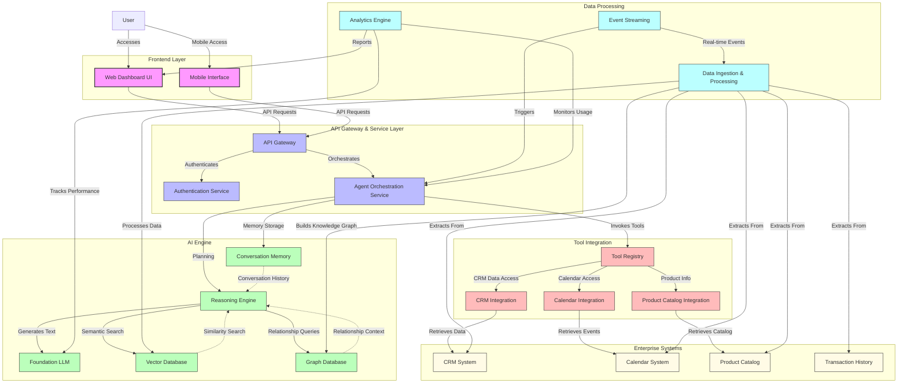
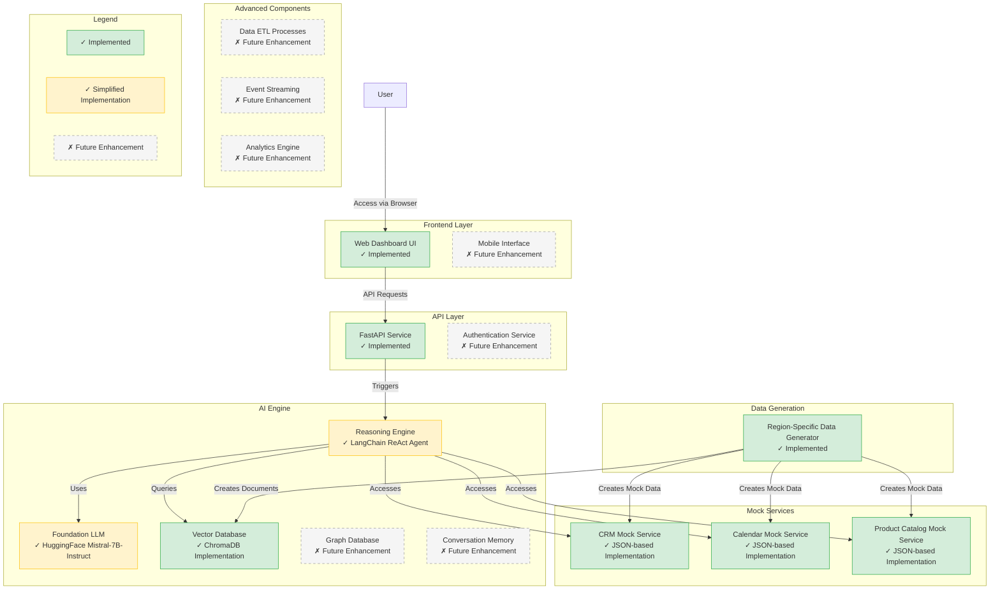

    <a href="https://kranthib.github.io/tech-pulse/" style="display: inline-block; padding: 6px 14px; background-color: #2054a6; color: white; text-decoration: none; border-radius: 3px; font-size: 14px; font-weight: 500; transition: background-color 0.3s;">Back to Home →</a>

# Sales Meeting Preparation Agent

## 1. Executive Summary

The ABC Paints Sales Meeting Preparation Agent is an AI-powered solution designed to transform how sales representatives prepare for customer meetings. By automatically analyzing data from multiple enterprise systems, this solution generates comprehensive, personalized meeting preparation materials that enable more effective customer interactions and improved sales outcomes.

This document outlines the complete solution approach, architecture, and proof of concept implementation details.

## 2. Problem Statement

Sales representatives at ABC Paints face significant challenges in preparing for customer meetings due to:

- Limited time to review extensive customer data scattered across multiple systems
- Difficulty recalling specific details from previous interactions
- Lack of data-driven insights to guide sales approaches
- Insufficient visibility into customer preferences and pain points
- Limited ability to prepare tailored recommendations for each customer

These challenges result in missed opportunities, inconsistent customer experiences, and diminished sales performance.

## 3. Solution Approach

The ABC Paints Sales Meeting Preparation Agent addresses these challenges by:

- Automatically detecting upcoming customer meetings
- Aggregating relevant information from disparate enterprise systems
- Analyzing customer interaction history to identify patterns and preferences
- Generating actionable insights with transparent reasoning explanations
- Delivering comprehensive preparation materials to sales representatives
- Providing feedback mechanisms to continuously improve recommendations

This solution leverages advanced AI capabilities, including large language models, semantic search, and reasoning frameworks, to transform meeting preparation from a time-consuming manual process into a strategic advantage.

## 4. Architecture

The solution architecture encompasses multiple layers working together to deliver comprehensive meeting preparation capabilities.

### 4.1 Architecture Components

#### Frontend Layer
- **Web Dashboard UI**: Primary interface for sales representatives to access meeting preparation materials
- **Mobile Interface**: Provides on-the-go access for quick review before meetings

#### API Gateway & Service Layer
- **API Gateway**: Routes requests and manages API traffic
- **Authentication Service**: Ensures secure access with appropriate permissions
- **Agent Orchestration Service**: Coordinates the AI agent workflow and tool invocation

#### AI Engine
- **Foundation LLM**: Large language model for natural language understanding and generation
- **Reasoning Engine**: Implements Chain-of-Thought and ReAct patterns for transparent recommendations
- **Vector Database**: Enables semantic search across customer interactions and product information
- **Graph Database**: Maintains relationship context between entities (customers, products, interactions)
- **Conversation Memory**: Preserves context across multiple user sessions

#### Tool Integration
- **Tool Registry**: Manages available tools and their capabilities
- **CRM Integration**: Connects to customer relationship management systems
- **Calendar Integration**: Enables access to meeting schedules
- **Product Catalog Integration**: Provides product information and specifications

#### Data Processing
- **Data Ingestion & Processing**: ETL processes for structured enterprise data
- **Event Streaming**: Real-time processing of system events
- **Analytics Engine**: Measures system performance and business impact

#### Enterprise Systems
- **CRM System**: Customer relationship data
- **Calendar System**: Meeting schedules and information
- **Product Catalog**: Product information and specifications
- **Transaction History**: Past purchase data

## 5. Proof of Concept Implementation

The Proof of Concept (POC) implementation demonstrates core capabilities of the Sales Meeting Preparation Agent while focusing on the most essential components for validating the solution's value.

### 5.1 Implemented Components

The POC includes the following key components:

- **Web Dashboard**: FastAPI-based web interface with Jinja2 templates
- **AI Agent**: LangChain-based implementation with reasoning capabilities
- **Mock Enterprise Services**: Simulated CRM, calendar, and product catalog data
- **Vector Database**: ChromaDB implementation for semantic search
- **Region-Specific Data Generation**: Support for multiple regions and markets

### 5.2 Technology Stack

The POC leverages the following technologies:

- **Python**: Primary programming language
- **LangChain**: Framework for building AI agents and workflows
- **FastAPI**: Web framework for API and interface development
- **ChromaDB**: Vector database for semantic search capabilities
- **HuggingFace Models**: For embedding generation and language processing
- **Docker**: Containerization for consistent deployment

### 5.3 Data Model

The POC implements a data model that includes:

- **Customers**: Company information, industry, size, and primary contacts
- **Interactions**: Past meetings, calls, emails, and site visits
- **Transactions**: Purchase history with product details
- **Products**: Complete catalog with categories and specifications
- **Meetings**: Upcoming calendar events with customer context

## 6. Key Capabilities

The Sales Meeting Preparation Agent provides the following core capabilities:

### 6.1 Automated Meeting Detection

The system automatically identifies upcoming customer meetings from calendar data and triggers preparation workflows with appropriate lead time.

### 6.2 Comprehensive Customer Intelligence

The solution aggregates information from multiple sources to provide a complete view of:
- Company profile and background
- Relationship history and key events
- Past interactions and communication patterns
- Purchase history and product preferences
- Identified pain points and challenges

### 6.3 Data-Driven Recommendations

Using advanced AI reasoning, the system generates:
- Tailored talking points for each customer
- Product recommendations based on identified needs
- Objection handling guidance
- Suggested next steps and follow-up actions

### 6.4 Transparent Reasoning

All recommendations include:
- Step-by-step explanation of the reasoning process
- Supporting evidence from customer data
- Confidence indicators for each insight
- Alternative approaches where relevant

### 6.5 Region-Specific Customization

The solution supports regional customization with:
- Region-appropriate company and contact information
- Local currency and formatting
- Industry-specific terminology
- Regional business patterns and preferences

## 7. Demonstration Flow

### 7.1. Setup and Preparation

Follow README.md in https://github.com/kranthiB/agentic-ai-solutions/tree/main/sales-meeting-preparation-agent

### 7.2. Demonstration Narrative

#### Introduction (5 minutes)
- Introduce the problem: sales reps struggling with meeting preparation
- Highlight the costs of inadequate preparation (missed opportunities, inconsistent experiences)
- Explain the solution objective: AI-assisted meeting preparation

#### Homepage Overview (3 minutes)
- Show the homepage with upcoming meetings
- Explain how the system automatically detects meetings from the calendar
- Point out the meeting types and time information

#### Meeting Preparation Workflow (10 minutes)
- Select a meeting with a customer
- Walk through the preparation page sections:
  - Customer summary and relationship insights
  - Interaction and purchase history summaries
  - Preferences and pain points
  - Recommendations with transparent reasoning and confidence scores
  - Suggested next steps

#### Transparent Reasoning (5 minutes)
- Expand a recommendation to show the detailed reasoning
- Highlight how the system cites specific evidence from customer interactions
- Demonstrate the confidence scoring system
- Explain how this transparency builds trust with sales representatives

#### Customer Profile Deep Dive (5 minutes)
- Navigate to the full customer profile
- Show the interaction timeline and purchase history details
- Explain how this data contributes to the preparation insights
- Highlight the relationship duration and development

#### Feedback Collection (2 minutes)
- Demonstrate the feedback mechanism on recommendations
- Explain how this feedback helps improve future recommendations
- Show how the system learns from sales rep input

#### Region-Specific Features (3 minutes)
- Highlight region-specific elements in the data
- Show how the system adapts to different markets
- Explain how this enhances relevance for global sales teams

#### Technical Overview (5 minutes)
- Briefly explain the architecture components
- Highlight the AI reasoning capabilities
- Explain how the system integrates with enterprise systems
- Discuss the vector database for semantic search

#### Q&A and Next Steps (10 minutes)
- Address questions about the POC
- Discuss the path to full implementation
- Highlight additional capabilities in the complete solution

### 7.3. Key Demonstration Points

When presenting the POC, emphasize these benefits:

1. **Time Savings**: Sales reps can prepare for meetings in minutes rather than hours
2. **Comprehensive Intelligence**: All relevant customer information in one place
3. **Data-Driven Insights**: Recommendations based on analysis of customer patterns
4. **Trust Through Transparency**: Clear explanations of how recommendations are generated
5. **Continuous Improvement**: System that learns from feedback to improve over time
6. **Global Adaptability**: Support for different regions and market expectations

## 8. Future Enhancements

The following enhancements are planned for the full implementation:

### 8.1 Additional AI Capabilities
- Sentiment analysis of customer interactions
- Predictive analytics for opportunity identification
- Competitor intelligence integration
- Multi-language support for global operations

### 8.2 Advanced Integration
- Real-time CRM integration with bidirectional updates
- Meeting outcome tracking and correlation
- Integration with sales enablement content repositories
- Email and communication history analysis

### 8.3 Mobile Experience
- Dedicated mobile application with offline capabilities
- Voice-based preparation summaries for on-the-go review
- Real-time notification of customer updates

### 8.4 Personalization
- Individual sales rep profile adaptation
- Learning from successful sales approaches
- Performance metrics and improvement suggestions
- Team collaboration and knowledge sharing

## 9. Conclusion

The ABC Paints Sales Meeting Preparation Agent represents a significant advancement in sales enablement technology. By applying advanced AI techniques to the specific challenge of meeting preparation, this solution transforms a traditionally time-consuming, manual process into a strategic advantage.

The proof of concept demonstrates the core capabilities of the system and provides a solid foundation for the full implementation. By continuing to enhance the AI reasoning capabilities, integrating with enterprise systems, and incorporating feedback mechanisms, the complete solution will deliver substantial value in terms of improved sales effectiveness, consistent customer experiences, and increased revenue.