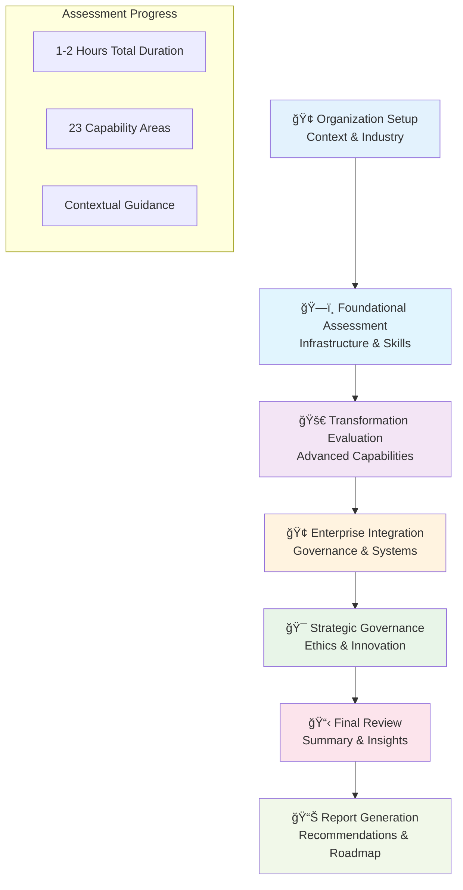
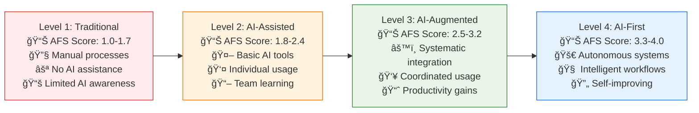

    <a href="https://kranthib.github.io/tech-pulse/" style="display: inline-block; padding: 6px 14px; background-color: #2054a6; color: white; text-decoration: none; border-radius: 3px; font-size: 14px; font-weight: 500; transition: background-color 0.3s;">Back to Home →</a>

# AI-First Software Engineering Maturity Assessment

  <a href="https://drive.google.com/file/d/1gJD9Lh0IHOkRoxd9Fm7WjQNQPiO9_Qmh/view" target="_blank" rel="noopener noreferrer">
    <strong>🎥 ▶️ Click to watch the demo video ▶️ 🎥</strong>
  </a>

  <a href="https://github.com/kranthiB/ai-first-maturity-assesment-framework/raw/main/output/AI_Maturity_Assessment_Report_Engineering_Excellence_Team.pdf" target="_blank" rel="noopener noreferrer">
    <strong>📄 📥 Download Sample Report (PDF) 📥 📄</strong>
  </a>

## Table of Contents

- [About](#about)
- [Key Features](#key-features)
  - [Comprehensive Assessment Platform](#comprehensive-assessment-platform)
  - [Intelligent User Experience](#intelligent-user-experience)
  - [Advanced Reporting & Analytics](#advanced-reporting--analytics)
  - [Assessment Management Dashboard](#assessment-management-dashboard)
- [Application Architecture](#application-architecture)
  - [Assessment Workflow](#assessment-workflow)
  - [Maturity Level Framework](#maturity-level-framework)
- [Getting Started](#getting-started)
  - [For Assessment Administrators](#for-assessment-administrators)
  - [For Assessment Participants](#for-assessment-participants)
  - [For Leadership Teams](#for-leadership-teams)
- [Value Proposition](#value-proposition)
  - [Immediate Benefits](#immediate-benefits)
  - [Long-term Impact](#long-term-impact)
  - [Organizational Outcomes](#organizational-outcomes)
- [Implementation Support](#implementation-support)
  - [Assessment Methodology](#assessment-methodology)
  - [Continuous Improvement](#continuous-improvement)
- [Support and Resources](#support-and-resources)

## About

The **AI-First Software Engineering Maturity Assessment Application** is a comprehensive web-based platform that enables organizations to evaluate, benchmark, and accelerate their AI-driven software development capabilities. This application transforms theoretical assessment frameworks into practical, actionable insights through an intuitive user experience.

## Key Features

### Comprehensive Assessment Platform
- **Multi-dimensional Evaluation**: Assess maturity across 23 capability areas spanning Foundational Capabilities, Transformation Capabilities, Enterprise Integration, and Strategic Governance
- **Progressive Assessment Flow**: Guided step-by-step evaluation with contextual help and practical guidance
- **Flexible Scoring System**: Four-level maturity scale (Basic, Evolving, Advanced, Optimized) with detailed AFS scoring from 1.0-4.0

#### Assessment Dimensions Overview

```mermaid
graph TB
    subgraph "AI-First Software Engineering Assessment"
        A[🏗️ Foundational Capabilities<br/>4 Core Areas<br/>Infrastructure, Skills, Code, Documentation]
        B[🚀 Transformation Capabilities<br/>5 Advanced Areas<br/>Architecture, Testing, CI/CD, Monitoring, Legacy]
        C[🏢 Enterprise Integration<br/>6 Organizational Areas<br/>Governance, Vendors, Systems, Cost, Performance, Continuity]
        D[🎯 Strategic Governance<br/>8 Leadership Areas<br/>Ethics, Compliance, IP, Risk, Change, Performance, Collaboration, Innovation]
    end
    
    A --> E[Comprehensive<br/>Assessment Score<br/>AFS 1.0-4.0]
    B --> E
    C --> E
    D --> E
    
    style A fill:#e1f5fe
    style B fill:#f3e5f5
    style C fill:#fff3e0
    style D fill:#e8f5e8
    style E fill:#f1f8e9
```

### Intelligent User Experience
- **Contextual Guidance**: Interactive help system providing prerequisites, action items, success metrics, and implementation timelines for each capability area
- **Organization Profiling**: Structured data collection for organization context, industry classification, and assessment parameters
- **Progress Tracking**: Visual progress indicators and section completion status throughout the assessment journey

### Advanced Reporting & Analytics
- **Comprehensive Reports**: Detailed assessment reports with maturity scores, gap analysis, and actionable recommendations
- **Download Capabilities**: Export complete assessment reports for offline review and stakeholder sharing
- **Benchmarking Insights**: Industry comparison and best practice recommendations

### Assessment Management Dashboard
- **Centralized Overview**: Unified dashboard displaying all organizational assessments with status tracking
- **Historical Analysis**: Track maturity progression over time with multiple assessment comparisons
- **Drill-down Views**: Detailed examination of individual assessments with section-by-section analysis

## Application Architecture

### Assessment Workflow

1. **Organization Setup**: Capture organizational context, industry, and assessor information
2. **Foundational Assessment**: Evaluate core AI infrastructure, team skills, code generation, and knowledge management
3. **Transformation Evaluation**: Assess advanced capabilities including architecture translation, AI-driven testing, CI/CD, and monitoring
4. **Enterprise Integration**: Review data governance, vendor management, system integration, and performance management
5. **Strategic Governance**: Examine AI ethics, compliance, IP management, risk management, and innovation readiness
6. **Final Review**: Comprehensive assessment summary with immediate insights
7. **Report Generation**: Detailed documentation with recommendations and roadmap

### Maturity Level Framework

**Level 1: Traditional Development (AFS Score: 1.0-1.7)**
- Manual processes with minimal AI integration
- Teams rely on traditional development tools and practices
- Limited awareness of AI-first methodologies

**Level 2: AI-Assisted Development (AFS Score: 1.8-2.4)**
- Basic AI tool adoption with individual usage patterns
- Initial AI assistance for code completion and documentation
- Beginning team skill development

**Level 3: AI-Augmented Development (AFS Score: 2.5-3.2)**
- Systematic AI integration across development workflows
- Standardized AI practices with coordinated usage
- Measurable productivity improvements

**Level 4: AI-First Development (AFS Score: 3.3-4.0)**
- Advanced AI-native development with autonomous capabilities
- Intelligent systems for most development activities
- Predictive and self-improving processes

## Getting Started

### For Assessment Administrators
1. Access the application homepage
2. Navigate to "Create Assessment" to begin a new evaluation
3. Complete organization information setup
4. Progress through each assessment dimension
5. Review results and generate comprehensive reports

### For Assessment Participants
1. Receive assessment invitation with organization context
2. Follow guided assessment flow with contextual help
3. Utilize help icons for detailed guidance on each capability area
4. Complete all sections for comprehensive evaluation

### For Leadership Teams
1. Access the dashboard for organizational assessment overview
2. Review detailed assessment reports and recommendations
3. Track progress across multiple assessment cycles
4. Download reports for stakeholder communication and planning

## Value Proposition

```mermaid
graph TD
    A[Assessment Input<br/>Current State Evaluation] --> B[Analysis Engine<br/>Gap Identification & Benchmarking]
    
    B --> C[Immediate Benefits<br/>âš¡ Rapid Assessment<br/>🯠Actionable Insights<br/>📊 Benchmark Positioning<br/>ğŸ—ºï¸ Strategic Planning]
    
    B --> D[Long-term Impact<br/>📈 30-80% Productivity Gains<br/>✨ Quality Enhancement<br/>ğŸ›¡ï¸ Risk Mitigation<br/>🆠Competitive Advantage]
    
    B --> E[Organizational Outcomes<br/>🔄 Digital Transformation<br/>💡 Innovation Capability<br/>âš™ï¸ Operational Excellence<br/>🚀 Future Readiness]
    
    C --> F[Strategic Decision Making<br/>Data-Driven AI Transformation]
    D --> F
    E --> F
    
    style A fill:#e3f2fd
    style B fill:#fff3e0
    style C fill:#e8f5e8
    style D fill:#f3e5f5
    style E fill:#fce4ec
    style F fill:#e1f5fe
```

### Immediate Benefits
- **Rapid Assessment**: Complete comprehensive evaluation in 1-2 hours
- **Actionable Insights**: Specific recommendations with implementation timelines
- **Benchmark Positioning**: Understanding of current maturity relative to industry standards
- **Strategic Planning**: Clear roadmap for AI transformation initiatives

### Long-term Impact
- **Productivity Gains**: 30-80% improvement in development velocity through systematic AI adoption
- **Quality Enhancement**: Intelligent quality assurance and automated review processes
- **Risk Mitigation**: Structured approach to AI implementation with proven practices
- **Competitive Advantage**: Industry-leading AI development capabilities

### Organizational Outcomes
- **Digital Transformation**: Accelerated enterprise-wide AI adoption
- **Innovation Capability**: Enhanced ability to develop AI-driven solutions
- **Operational Excellence**: Optimized development processes and workflows
- **Future Readiness**: Preparation for emerging AI technologies and methodologies

## Assessment Methodology
The application employs a research-based, industry-validated assessment methodology that evaluates organizational capabilities across multiple dimensions. Each capability area includes:

- **Prerequisites**: Foundational requirements for advancement
- **Action Items**: Specific implementation steps with detailed guidance
- **Success Metrics**: Measurable indicators for progress tracking
- **Timeline Estimates**: Realistic implementation timeframes
- **Common Pitfalls**: Risk mitigation strategies and lessons learned

## Continuous Improvement
- **Regular Updates**: Framework updates based on industry developments and user feedback
- **Benchmark Evolution**: Continuous refinement of industry benchmarks and best practices
- **Feature Enhancement**: Ongoing platform improvements based on user experience research

## Support and Resources

The application provides comprehensive support through:
- Interactive help system with contextual guidance
- Detailed framework documentation
- Implementation roadmaps and best practices
- Industry benchmarking and comparison data

---

Transform your software engineering organization with AI-first practices. Begin your assessment journey today to understand your current maturity and chart your path toward AI-driven development excellence.