# AI-Powered Code Modernization
## Revolutionizing Legacy System Migration Through Multi-Agent Intelligence

---

## The Legacy System Challenge

### Traditional Migration Approaches Are Failing

- **Time-Consuming**: 5+ years for large-scale migrations
- **Resource-Intensive**: Requires scarce specialized expertise
- **High-Risk**: 70% of modernization projects exceed budget or fail
- **Business Disruption**: Extended feature freezes and disruptions
- **Knowledge Loss**: Critical business logic often lost in translation

> *Organizations are trapped by technical debt, unable to innovate at the pace required by today's market*

---

## The Cost of Inaction

```mermaid
graph TD
    A["⚠️ Legacy System Technical Debt"] --> B["💰 Increasing Maintenance Costs"]
    A --> C["🔓 Security Vulnerabilities"]
    A --> D["🧩 Integration Limitations"]
    A --> E["🐢 Slow Time-to-Market"]
    A --> F["👩‍💻 Talent Acquisition Challenges"]
    
    B --> G["📉 Business Impact"]
    C --> G
    D --> G
    E --> G
    F --> G
    
    G --> H["⬇️ Competitive Position"]
    G --> I["⬇️ Innovation Capacity"]
    G --> J["⬆️ Operational Risk"]
    
    style A fill:#ff6b6b,color:#fff,stroke:#333,stroke-width:2px,rx:10px,ry:10px
    style B fill:#f9ca24,color:#333,stroke:#333,stroke-width:1px,rx:5px,ry:5px
    style C fill:#f9ca24,color:#333,stroke:#333,stroke-width:1px,rx:5px,ry:5px
    style D fill:#f9ca24,color:#333,stroke:#333,stroke-width:1px,rx:5px,ry:5px
    style E fill:#f9ca24,color:#333,stroke:#333,stroke-width:1px,rx:5px,ry:5px
    style F fill:#f9ca24,color:#333,stroke:#333,stroke-width:1px,rx:5px,ry:5px
    style G fill:#FF8C61,color:#333,stroke:#333,stroke-width:2px,rx:5px,ry:5px
    style H fill:#d63031,color:#fff,stroke:#333,stroke-width:1px,rx:5px,ry:5px
    style I fill:#d63031,color:#fff,stroke:#333,stroke-width:1px,rx:5px,ry:5px
    style J fill:#d63031,color:#fff,stroke:#333,stroke-width:1px,rx:5px,ry:5px
    
    classDef impact font-weight:bold;
    class G,H,I,J impact;
```



- Increasing maintenance costs (15-20% annual growth)
- Security vulnerabilities in unsupported platforms
- Inability to integrate with modern systems and cloud services
- Competitive disadvantage in digital transformation initiatives
- Difficulty attracting and retaining development talent

---

## Introducing AI-Powered Code Modernization

### A Revolutionary Approach to Legacy System Migration

Our solution employs a network of specialized AI agents working in concert to:

- **Assess** legacy codebases with unprecedented depth and accuracy
- **Transform** source code while preserving business logic and functionality
- **Validate** the modernized system against the original behavior
- **Accelerate** the entire migration process by up to 70%

> *Not just a migration tool, but an intelligent ecosystem that fundamentally transforms the modernization approach*

---

## The Multi-Agent Advantage

```mermaid
graph TD
    A["👨‍💻 Legacy Codebase"] --> B["🧠 AI Agent Ecosystem"]
    B --> C["✨ Modern Codebase"]
    
    subgraph "🤖 Specialized AI Agents"
        D["🔎 Assessment<br>Agents"] --- E["⚙️ Transformation<br>Agents"]
        E --- F["🧪 Validation<br>Agents"]
        
        D -..-> D1["👁️ CodeLens<br><i>Structure Analysis</i>"]
        D -..-> D2["🗺️ LogicMapper<br><i>Business Rules</i>"]
        D -..-> D3["🧵 DataFabric<br><i>Data Relationships</i>"]
        
        E -..-> E1["🏗️ CodeStructor<br><i>Restructuring</i>"]
        E -..-> E2["🔄 TransformEngine<br><i>Translation</i>"]
        E -..-> E3["⚡ EnhanceLogic<br><i>Optimization</i>"]
        
        F -..-> F1["🧪 TestBed<br><i>Test Generation</i>"]
        F -..-> F2["⚖️ DualRunner<br><i>Equivalence Testing</i>"]
        F -..-> F3["🔧 FixPoint<br><i>Issue Resolution</i>"]
    end
    
    subgraph "👥 Human Collaboration Points"
        H1["👨‍💼 Business<br>Stakeholders"]
        H2["👩‍💻 Technical<br>Architects"]
        H3["👨‍🔬 QA<br>Experts"]
    end
    
    H1 -.-> D
    H2 -.-> E
    H3 -.-> F
    
    style A fill:#f8a5c2,color:#333,stroke:#333,stroke-width:2px,rx:10px,ry:10px
    style B fill:#a3d8f4,color:#333,stroke:#333,stroke-width:2px,rx:10px,ry:10px
    style C fill:#b5ead7,color:#333,stroke:#333,stroke-width:2px,rx:10px,ry:10px
    
    style D fill:#ffd3b6,color:#333,stroke:#333,stroke-width:1px,rx:8px,ry:8px
    style E fill:#c7ceea,color:#333,stroke:#333,stroke-width:1px,rx:8px,ry:8px
    style F fill:#a8e6cf,color:#333,stroke:#333,stroke-width:1px,rx:8px,ry:8px
    
    style D1 fill:#ffd3b6,color:#333,stroke:#333,stroke-width:1px,rx:5px,ry:5px,stroke-dasharray: 3 3
    style D2 fill:#ffd3b6,color:#333,stroke:#333,stroke-width:1px,rx:5px,ry:5px,stroke-dasharray: 3 3
    style D3 fill:#ffd3b6,color:#333,stroke:#333,stroke-width:1px,rx:5px,ry:5px,stroke-dasharray: 3 3
    
    style E1 fill:#c7ceea,color:#333,stroke:#333,stroke-width:1px,rx:5px,ry:5px,stroke-dasharray: 3 3
    style E2 fill:#c7ceea,color:#333,stroke:#333,stroke-width:1px,rx:5px,ry:5px,stroke-dasharray: 3 3
    style E3 fill:#c7ceea,color:#333,stroke:#333,stroke-width:1px,rx:5px,ry:5px,stroke-dasharray: 3 3
    
    style F1 fill:#a8e6cf,color:#333,stroke:#333,stroke-width:1px,rx:5px,ry:5px,stroke-dasharray: 3 3
    style F2 fill:#a8e6cf,color:#333,stroke:#333,stroke-width:1px,rx:5px,ry:5px,stroke-dasharray: 3 3
    style F3 fill:#a8e6cf,color:#333,stroke:#333,stroke-width:1px,rx:5px,ry:5px,stroke-dasharray: 3 3
    
    style H1 fill:#fab1a0,color:#333,stroke:#333,stroke-width:1px,rx:5px,ry:5px
    style H2 fill:#fab1a0,color:#333,stroke:#333,stroke-width:1px,rx:5px,ry:5px
    style H3 fill:#fab1a0,color:#333,stroke:#333,stroke-width:1px,rx:5px,ry:5px
    
    linkStyle default stroke:#999,stroke-width:1px,fill:none;
```



Traditional tools use simplistic one-size-fits-all approaches.

Our solution leverages **specialized AI agents** for each aspect of modernization:

- Each agent brings **focused expertise** to a specific task
- Agents work in **parallel** to accelerate the process
- The ecosystem **continuously learns** from each project
- **Human-AI collaboration** at critical decision points

---

## Assessment Phase: Deep Understanding

```mermaid
flowchart LR
    subgraph "👁️ CodeLens"
        A1["📊 Complexity<br>Analysis"] --> A2["🧩 Dependency<br>Mapping"]
        A2 --> A3["⚠️ Risk<br>Assessment"]
    end
    
    subgraph "🗺️ LogicMapper"
        B1["💡 Business Rule<br>Extraction"] --> B2["📋 Process<br>Documentation"]
        B2 --> B3["📝 Knowledge<br>Preservation"]
    end
    
    subgraph "🧵 DataFabric"
        C1["🏗️ Schema<br>Analysis"] --> C2["🔗 Relationship<br>Mapping"]
        C2 --> C3["📊 Data Flow<br>Tracing"]
    end
    
    LC["👨‍💻 Legacy<br>Codebase"] --> A1
    LC --> B1
    LC --> C1
    
    A3 --> OUT["🧠 Complete<br>System Understanding"]
    B3 --> OUT
    C3 --> OUT
    
    style LC fill:#ff9ff3,color:#333,stroke:#333,stroke-width:2px,rx:10px,ry:10px
    style OUT fill:#0abde3,color:#fff,stroke:#333,stroke-width:2px,rx:10px,ry:10px
    
    %% CodeLens styles
    style A1 fill:#ffeaa7,color:#333,stroke:#333,stroke-width:1px,rx:5px,ry:5px
    style A2 fill:#ffeaa7,color:#333,stroke:#333,stroke-width:1px,rx:5px,ry:5px
    style A3 fill:#ffeaa7,color:#333,stroke:#333,stroke-width:1px,rx:5px,ry:5px
    
    %% LogicMapper styles
    style B1 fill:#55efc4,color:#333,stroke:#333,stroke-width:1px,rx:5px,ry:5px
    style B2 fill:#55efc4,color:#333,stroke:#333,stroke-width:1px,rx:5px,ry:5px
    style B3 fill:#55efc4,color:#333,stroke:#333,stroke-width:1px,rx:5px,ry:5px
    
    %% DataFabric styles
    style C1 fill:#74b9ff,color:#333,stroke:#333,stroke-width:1px,rx:5px,ry:5px
    style C2 fill:#74b9ff,color:#333,stroke:#333,stroke-width:1px,rx:5px,ry:5px
    style C3 fill:#74b9ff,color:#333,stroke:#333,stroke-width:1px,rx:5px,ry:5px
    
    %% Style for subgraphs
    classDef subgraphStyle fill:#f5f6fa,stroke:#dcdde1,stroke-width:1px,rx:10px,ry:10px;
    class "👁️ CodeLens","🗺️ LogicMapper","🧵 DataFabric" subgraphStyle;
```

**🔍 CodeLens**: Analyzes code structure, complexity, and dependencies
- Identifies risky areas and modernization challenges
- Creates comprehensive dependency maps

**🧠 LogicMapper**: Extracts and documents business logic
- Translates code into business process documentation
- Preserves institutional knowledge embedded in code

**🧵 DataFabric**: Maps data structures and relationships
- Traces data flows through the system
- Ensures data integrity during transformation

---

## Transformation Phase: Intelligent Conversion

```mermaid
flowchart LR
    subgraph "🏗️ CodeStructor"
        A1["📦 Code<br>Modularization"] --> A2["🧹 Technical Debt<br>Reduction"]
        A2 --> A3["📐 Architecture<br>Improvement"]
    end
    
    subgraph "🔄 TransformEngine"
        B1["🔍 Source<br>Analysis"] --> B2["🔄 Language<br>Translation"]
        B2 --> B3["⚙️ API<br>Adaptation"]
    end
    
    subgraph "⚡ EnhanceLogic"
        C1["🚀 Performance<br>Optimization"] --> C2["✨ Modern Pattern<br>Implementation"]
        C2 --> C3["🎯 Platform<br>Specialization"]
    end
    
    IN["🧠 System<br>Understanding"] --> A1
    IN --> B1
    IN --> C1
    
    A3 --> OUT["✅ Modernized<br>Codebase"]
    B3 --> OUT
    C3 --> OUT
    
    style IN fill:#0abde3,color:#fff,stroke:#333,stroke-width:2px,rx:10px,ry:10px
    style OUT fill:#10ac84,color:#fff,stroke:#333,stroke-width:2px,rx:10px,ry:10px
    
    %% CodeStructor styles
    style A1 fill:#ff9ff3,color:#333,stroke:#333,stroke-width:1px,rx:5px,ry:5px
    style A2 fill:#ff9ff3,color:#333,stroke:#333,stroke-width:1px,rx:5px,ry:5px
    style A3 fill:#ff9ff3,color:#333,stroke:#333,stroke-width:1px,rx:5px,ry:5px
    
    %% TransformEngine styles
    style B1 fill:#feca57,color:#333,stroke:#333,stroke-width:1px,rx:5px,ry:5px
    style B2 fill:#feca57,color:#333,stroke:#333,stroke-width:1px,rx:5px,ry:5px
    style B3 fill:#feca57,color:#333,stroke:#333,stroke-width:1px,rx:5px,ry:5px
    
    %% EnhanceLogic styles
    style C1 fill:#54a0ff,color:#333,stroke:#333,stroke-width:1px,rx:5px,ry:5px
    style C2 fill:#54a0ff,color:#333,stroke:#333,stroke-width:1px,rx:5px,ry:5px
    style C3 fill:#54a0ff,color:#333,stroke:#333,stroke-width:1px,rx:5px,ry:5px
    
    %% Style for subgraphs
    classDef subgraphStyle fill:#f5f6fa,stroke:#dcdde1,stroke-width:1px,rx:10px,ry:10px;
    class "🏗️ CodeStructor","🔄 TransformEngine","⚡ EnhanceLogic" subgraphStyle;
```

**🏗️ CodeStructor**: Restructures code for modern architectures
- Improves modularity and maintainability
- Reduces technical debt before migration

**🔄 TransformEngine**: Translates between language pairs
- Converts source to target language with contextual understanding
- Maintains functional equivalence

**⚡ EnhanceLogic**: Optimizes code for the target platform
- Implements modern design patterns
- Leverages target language capabilities

---

## Validation Phase: Ensuring Quality

```mermaid
flowchart LR
    subgraph "🧪 TestBed"
        A1["🧮 Test Case<br>Generation"] --> A2["📊 Synthetic Data<br>Creation"]
        A2 --> A3["🎭 Edge Case<br>Simulation"]
    end
    
    subgraph "⚖️ DualRunner"
        B1["⏯️ Parallel<br>Execution"] --> B2["🔎 Output<br>Comparison"]
        B2 --> B3["📈 Performance<br>Benchmarking"]
    end
    
    subgraph "🔧 FixPoint"
        C1["🐞 Issue<br>Detection"] --> C2["🤖 Automated<br>Fixes"]
        C2 --> C3["👨‍💻 Human Review<br>Flagging"]
    end
    
    IN["✅ Modernized<br>Codebase"] --> A1
    IN --> B1
    IN --> C1
    
    A3 --> OUT["🚀 Production-Ready<br>System"]
    B3 --> OUT
    C3 --> OUT
    
    style IN fill:#10ac84,color:#fff,stroke:#333,stroke-width:2px,rx:10px,ry:10px
    style OUT fill:#8854d0,color:#fff,stroke:#333,stroke-width:2px,rx:10px,ry:10px
    
    %% TestBed styles
    style A1 fill:#a3cb38,color:#333,stroke:#333,stroke-width:1px,rx:5px,ry:5px
    style A2 fill:#a3cb38,color:#333,stroke:#333,stroke-width:1px,rx:5px,ry:5px
    style A3 fill:#a3cb38,color:#333,stroke:#333,stroke-width:1px,rx:5px,ry:5px
    
    %% DualRunner styles
    style B1 fill:#ffb8b8,color:#333,stroke:#333,stroke-width:1px,rx:5px,ry:5px
    style B2 fill:#ffb8b8,color:#333,stroke:#333,stroke-width:1px,rx:5px,ry:5px
    style B3 fill:#ffb8b8,color:#333,stroke:#333,stroke-width:1px,rx:5px,ry:5px
    
    %% FixPoint styles
    style C1 fill:#c8d6e5,color:#333,stroke:#333,stroke-width:1px,rx:5px,ry:5px
    style C2 fill:#c8d6e5,color:#333,stroke:#333,stroke-width:1px,rx:5px,ry:5px
    style C3 fill:#c8d6e5,color:#333,stroke:#333,stroke-width:1px,rx:5px,ry:5px
    
    %% Style for subgraphs
    classDef subgraphStyle fill:#f5f6fa,stroke:#dcdde1,stroke-width:1px,rx:10px,ry:10px;
    class "🧪 TestBed","⚖️ DualRunner","🔧 FixPoint" subgraphStyle;
```

**🧪 TestBed**: Creates comprehensive test suites
- Generates realistic test data preserving relationships
- Covers edge cases and critical paths

**⚖️ DualRunner**: Verifies behavioral equivalence
- Runs parallel tests in source and target environments
- Identifies discrepancies before they reach production

**🔧 FixPoint**: Resolves migration issues
- Automatically fixes common transformation problems
- Intelligently flags areas requiring human expertise

---

## The Value Proposition

### Breaking the Traditional Constraints

```mermaid
graph TD
    subgraph "⏱️ Speed"
        A1["❌ Traditional:<br>5+ Years"]
        A2["✅ AI-Powered:<br>1-2 Years<br><b>70% Faster</b>"]
    end
    
    subgraph "💎 Quality"
        B1["❌ Traditional:<br>High Defect Rate"]
        B2["✅ AI-Powered:<br>99% Functional Equivalence<br><b>80% Fewer Defects</b>"]
    end
    
    subgraph "💰 Cost"
        C1["❌ Traditional:<br>High Resource Requirement"]
        C2["✅ AI-Powered:<br>Efficient Automation<br><b>60% Cost Reduction</b>"]
    end
    
    Z["🧠 AI-Powered<br>Code Modernization"] --> A2
    Z --> B2
    Z --> C2
    
    style Z fill:#6c5ce7,color:#fff,stroke:#333,stroke-width:2px,rx:10px,ry:10px
    
    %% Traditional approaches
    style A1 fill:#ff7675,color:#333,stroke:#333,stroke-width:1px,rx:5px,ry:5px
    style B1 fill:#ff7675,color:#333,stroke:#333,stroke-width:1px,rx:5px,ry:5px
    style C1 fill:#ff7675,color:#333,stroke:#333,stroke-width:1px,rx:5px,ry:5px
    
    %% AI-Powered approaches
    style A2 fill:#55efc4,color:#333,stroke:#333,stroke-width:1px,rx:5px,ry:5px
    style B2 fill:#55efc4,color:#333,stroke:#333,stroke-width:1px,rx:5px,ry:5px
    style C2 fill:#55efc4,color:#333,stroke:#333,stroke-width:1px,rx:5px,ry:5px
    
    %% Style for subgraphs
    classDef subgraphStyle fill:#f5f6fa,stroke:#dcdde1,stroke-width:1px,rx:10px,ry:10px;
    class "⏱️ Speed","💎 Quality","💰 Cost" subgraphStyle;
    
    %% Add comparison arrows
    A1 -.- A2
    B1 -.- B2
    C1 -.- C2
```

Traditional modernization projects force choosing between:

| Dimension | Traditional Approach | Our AI-Powered Approach |
|-----------|----------------------|-------------------------|
| **Speed** | 5+ years | 1-2 years (70% faster) |
| **Quality** | High defect rates | 99% functional equivalence |
| **Cost** | $$$$ | $ (Up to 60% cost reduction) |

> *Our approach delivers improvements across all dimensions simultaneously*

---

## Business Impact

### Transformative Benefits

- **Accelerated Digital Transformation**: Unlock modern capabilities faster
- **Reduced Operational Costs**: Lower maintenance costs by 40-60%
- **Enhanced Security Posture**: Eliminate legacy vulnerabilities
- **Improved Agility**: Enable cloud-native, microservices architectures
- **Future-Proofed Systems**: Build on sustainable, maintainable platforms
- **Preserved Business Knowledge**: Capture critical logic and processes

---

## Implementation Approach

### Practical, Phased Delivery

```mermaid
gantt
    title Implementation Roadmap
    dateFormat  YYYY-MM-DD
    axisFormat %b %d
    
    section Phase 1: Assessment
    🔍 Initial Codebase Analysis      :a1, 2025-04-01, 10d
    📊 Complexity Assessment          :a2, after a1, 7d
    📝 Modernization Strategy         :a3, after a2, 7d
    
    section Phase 2: Pilot
    🧪 Select Target Modules      :p1, after a3, 5d
    🔄 Pilot Transformation       :p2, after p1, 25d
    ✅ Validation & Calibration   :p3, after p2, 10d
    
    section Phase 3: Full Migration
    📋 Detailed Migration Plan    :m1, after p3, 10d
    🏗️ Incremental Transformation :m2, after m1, 120d
    ⚖️ Continuous Validation      :m3, after m1, 120d
    🚢 Progressive Deployment     :m4, after m2, 30d
    
    section Phase 4: Handover
    📚 Documentation Generation   :h1, after m3, 15d
    👨‍🏫 Knowledge Transfer        :h2, after h1, 10d
    🎯 Ongoing Optimization       :h3, after h2, 20d
    
    %% Set milestone
    %% These don't render well in Mermaid, so marking key milestones with special tasks
    
    section Milestones
    🏁 Assessment Complete        :milestone, after a3, 0d
    🏁 Pilot Complete            :milestone, after p3, 0d
    🏁 Migration Complete        :milestone, after m4, 0d
    🏁 Project Complete          :milestone, after h3, 0d
```



1. **Assessment & Planning** (2-4 weeks)
   - Codebase analysis and complexity assessment
   - Modernization strategy and roadmap development

2. **Pilot Transformation** (6-8 weeks)
   - Targeted transformation of select modules
   - Validation of approach and calibration of agents

3. **Full-Scale Modernization** (Based on codebase size)
   - Phased transformation with continuous validation
   - Progressive deployment of modernized components

4. **Knowledge Transfer & Handover**
   - Documentation and training
   - Ongoing support and optimization

---

## Case Study: Financial Services Modernization

### From Legacy COBOL to Cloud-Native Java

**Client Challenge**:
- 2.5M lines of COBOL code running core banking system
- 30+ year old codebase with limited documentation
- Previous migration attempt failed after 2 years and $4M

**Our Approach**:
- AI-powered assessment revealed 65% of code was redundant or obsolete
- Extracted and preserved critical business rules
- Transformed viable code to modern Java architecture

**Results**:
- Full migration completed in 14 months (vs. estimated 4+ years)
- 42% reduction in operating costs
- 99.8% functional equivalence in production
- Cloud deployment enabling new digital banking capabilities

---

## ROI Analysis

### Compelling Financial Benefits

```mermaid
%%{init: {"pie": {"textPosition": 0.5}, "themeVariables": {"pieOuterStrokeWidth": "2px"}} }%%
graph TD
    subgraph "⏱️ Timeline Comparison"
        T1[Traditional Approach<br><b>48 months</b>]
        T2[AI-Powered Approach<br><b>14 months</b>]
    end
    
    subgraph "💰 Cost Comparison (in $M)"
        C1[Traditional Approach<br><b>$12M</b>]
        C2[AI-Powered Approach<br><b>$4.8M</b>]
    end
    
    subgraph "📈 5-Year TCO Impact"
        TCO1[Traditional<br><b>+$2.5M</b>]
        TCO2[AI-Powered<br><b>-$8.7M</b>]
        DELTA[Cost Advantage<br><b>$11.2M</b>]
    end
    
    subgraph "⚡ Time to New Features"
        F1[Traditional<br><b>60 months</b>]
        F2[AI-Powered<br><b>16 months</b>]
    end
    
    %% Add visual improvements
    style T1 fill:#ff7675,color:#333,stroke:#333,stroke-width:1px,rx:5px,ry:5px
    style T2 fill:#55efc4,color:#333,stroke:#333,stroke-width:1px,rx:5px,ry:5px
    
    style C1 fill:#ff7675,color:#333,stroke:#333,stroke-width:1px,rx:5px,ry:5px
    style C2 fill:#55efc4,color:#333,stroke:#333,stroke-width:1px,rx:5px,ry:5px
    
    style TCO1 fill:#ff7675,color:#333,stroke:#333,stroke-width:1px,rx:5px,ry:5px
    style TCO2 fill:#55efc4,color:#333,stroke:#333,stroke-width:1px,rx:5px,ry:5px
    style DELTA fill:#a29bfe,color:#333,stroke:#333,stroke-width:1px,rx:5px,ry:5px
    
    style F1 fill:#ff7675,color:#333,stroke:#333,stroke-width:1px,rx:5px,ry:5px
    style F2 fill:#55efc4,color:#333,stroke:#333,stroke-width:1px,rx:5px,ry:5px
    
    %% Style for subgraphs
    classDef subgraphStyle fill:#f5f6fa,stroke:#dcdde1,stroke-width:1px,rx:10px,ry:10px;
    class "⏱️ Timeline Comparison","💰 Cost Comparison (in $M)","📈 5-Year TCO Impact","⚡ Time to New Features" subgraphStyle;
    
    %% Create a centered title
    TITLE["<b>ROI Comparison:</b> Traditional vs AI-Powered Approach"]
    style TITLE fill:none,stroke:none,color:#333,font-size:18px;
    
    TITLE --- T1
    TITLE --- C1
    TITLE --- TCO1
    TITLE --- F1
    
    %% Hide these connecting lines
    linkStyle 0 stroke:none;
    linkStyle 1 stroke:none;
    linkStyle 2 stroke:none;
    linkStyle 3 stroke:none;
```

| Metric | Traditional Approach | AI-Powered Approach | Difference |
|--------|----------------------|---------------------|------------|
| Migration Timeline | 48 months | 14 months | -70% |
| Project Cost | $12M | $4.8M | -60% |
| Maintenance Reduction | 15% | 45% | +30% |
| Time to New Features | 60 months | 16 months | -73% |
| 5-Year TCO Impact | +$2.5M | -$8.7M | $11.2M |

---

## Partner With Us

### Begin Your Modernization Journey

- **Assessment Workshop**: 2-week engagement to evaluate your codebase
- **Proof of Concept**: Demonstrate value with a targeted module transformation
- **Strategic Roadmap**: Develop a comprehensive modernization strategy

> *Transform your legacy burden into your competitive advantage*

---

## Next Steps

```mermaid
graph TD
    A["🚀 Begin Your<br>Modernization Journey"] --> B["📞 Contact Us"]
    
    subgraph "👥 Connect With Us"
        B --> C["✉️ Email:<br>modernization@company.com"]
        B --> D["📱 Phone:<br>(555) 123-4567"]
        B --> E["🌐 Website:<br>www.company.com/modernization"]
    end
    
    subgraph "📋 Next Steps"
        A --> F["📊 Assessment<br>Workshop"]
        A --> G["🧪 Personalized<br>Demo"]
        A --> H["👥 Client<br>References"]
    end
    
    style A fill:#6c5ce7,color:#fff,stroke:#333,stroke-width:2px,rx:10px,ry:10px
    style B fill:#74b9ff,color:#333,stroke:#333,stroke-width:1px,rx:8px,ry:8px
    
    style C fill:#81ecec,color:#333,stroke:#333,stroke-width:1px,rx:5px,ry:5px
    style D fill:#81ecec,color:#333,stroke:#333,stroke-width:1px,rx:5px,ry:5px
    style E fill:#81ecec,color:#333,stroke:#333,stroke-width:1px,rx:5px,ry:5px
    
    style F fill:#ffeaa7,color:#333,stroke:#333,stroke-width:1px,rx:5px,ry:5px
    style G fill:#ffeaa7,color:#333,stroke:#333,stroke-width:1px,rx:5px,ry:5px
    style H fill:#ffeaa7,color:#333,stroke:#333,stroke-width:1px,rx:5px,ry:5px
    
    %% Style for subgraphs
    classDef subgraphStyle fill:#f5f6fa,stroke:#dcdde1,stroke-width:1px,rx:10px,ry:10px;
    class "👥 Connect With Us","📋 Next Steps" subgraphStyle;
    
    %% Add action buttons
    I[" Book Assessment Workshop "]
    J[" Request Demo "]
    K[" Speak with References "]
    
    F --- I
    G --- J
    H --- K
    
    style I fill:#55efc4,color:#333,stroke:#333,stroke-width:1px,rx:15px,ry:15px,text-align:center
    style J fill:#55efc4,color:#333,stroke:#333,stroke-width:1px,rx:15px,ry:15px,text-align:center
    style K fill:#55efc4,color:#333,stroke:#333,stroke-width:1px,rx:15px,ry:15px,text-align:center
```

- Schedule an assessment workshop
- Request a personalized demo
- Speak with reference clients

**Contact Us**:
- Email: modernization@company.com
- Phone: (555) 123-4567
- Website: www.company.com/modernization

---

## Q&A

Thank you for your attention!

```mermaid
graph TD
    A["🧠 AI-Powered<br>Code Modernization"]
    
    style A fill:#6c5ce7,color:#fff,stroke:#333,stroke-width:2px,rx:10px,ry:10px,font-size:20px,text-align:center,padding:20px
```

