# AI-Powered Code Modernization
## Revolutionizing Legacy System Migration Through Multi-Agent Intelligence

```mermaid
graph LR
    A["👴 Legacy Systems"] --> B["🧠 AI-Powered<br>Code Modernization"]
    B --> C["✨ Modern Systems"]
    
    subgraph "❌ Legacy Challenges"
    D["💸 Technical Debt"]
    E["🔙 Outdated Languages"]
    F["💰 High Maintenance Cost"]
    G["📉 Limited Scalability"]
    end
    
    subgraph "✅ Modernization Benefits"
    H["☁️ Cloud-Ready"]
    I["🔒 Enhanced Security"]
    J["🚀 Business Agility"]
    K["🔮 Future-Proof Architecture"]
    end
    
    A --- D & E & F & G
    C --- H & I & J & K
    
    style A fill:#ff6b6b,color:#fff,stroke:#333,stroke-width:2px
    style B fill:#4d96ff,color:#fff,stroke:#333,stroke-width:2px
    style C fill:#6bcb77,color:#fff,stroke:#333,stroke-width:2px
    style D fill:#ffd166,color:#333,stroke:#333,stroke-width:1px
    style E fill:#ffd166,color:#333,stroke:#333,stroke-width:1px
    style F fill:#ffd166,color:#333,stroke:#333,stroke-width:1px
    style G fill:#ffd166,color:#333,stroke:#333,stroke-width:1px
    style H fill:#06d6a0,color:#333,stroke:#333,stroke-width:1px
    style I fill:#06d6a0,color:#333,stroke:#333,stroke-width:1px
    style J fill:#06d6a0,color:#333,stroke:#333,stroke-width:1px
    style K fill:#06d6a0,color:#333,stroke:#333,stroke-width:1px
```

## The Challenge

In today's rapidly evolving digital landscape, organizations find themselves trapped by legacy systems that were once cutting-edge but now represent significant technical debt. Traditional code migration approaches have proven to be:

- **Time-consuming**: Often requiring 5+ years to complete
- **Complex**: Involving intricate interdependencies and undocumented business logic
- **Manual**: Relying heavily on scarce human expertise
- **Inefficient**: Prone to errors, delays, and budget overruns

This technological stagnation creates a critical bottleneck for digital transformation initiatives, hindering innovation and compromising market competitiveness.

```mermaid
flowchart TD
    A["👨‍💻 Legacy Codebase"] -->|"⏱️ Traditional Migration"| B["⌛ 5+ Years Timeline"]
    A -->|"🔧 Manual Process"| C["🧩 High Complexity"]
    A -->|"💼 Resource Intensive"| D["💰 Budget Overruns"]
    A -->|"⚠️ Error Prone"| E["🐞 Quality Issues"]
    
    B & C & D & E --> F["🚧 Digital Transformation<br>Bottleneck"]
    F --> G["⬇️ Competitive<br>Disadvantage"]
    
    style A fill:#f8a5c2,color:#333,stroke:#333,stroke-width:2px
    style B fill:#f7d794,color:#333,stroke:#333,stroke-width:1px
    style C fill:#f7d794,color:#333,stroke:#333,stroke-width:1px
    style D fill:#f7d794,color:#333,stroke:#333,stroke-width:1px
    style E fill:#f7d794,color:#333,stroke:#333,stroke-width:1px
    style F fill:#778beb,color:#fff,stroke:#333,stroke-width:2px
    style G fill:#ea8685,color:#fff,stroke:#333,stroke-width:2px
    
    classDef path fill:none,stroke:#333,stroke-width:1px;
    linkStyle default stroke:#999,stroke-width:2px,fill:none;
```

## Our Solution: Intelligent Migration Ecosystem

We introduce a groundbreaking approach to code modernization through an orchestrated network of specialized AI agents, each designed to handle specific aspects of the migration process with unprecedented efficiency and accuracy.

### Core Concept

Rather than approaching migration as a brute-force manual effort, our solution leverages a collaborative AI ecosystem that mimics the structure of an expert human team while operating at machine scale and speed. This fundamentally transforms the migration paradigm from a linear, resource-intensive process to an intelligent, parallel operation.

```mermaid
graph TD
    A["👨‍💻 Legacy Codebase"] --> B["🤖 AI Agent Ecosystem"]
    B --> C["✨ Modern Codebase"]
    
    subgraph "🧠 AI Agent Ecosystem"
    D["🔍 Assessment<br>Agents"] ---|"Insights"| E["🔄 Transformation<br>Agents"]
    E ---|"Output"| F["✅ Validation<br>Agents"]
    end
    
    D -..->|"Analyzes"| D1["👁️ CodeLens"]
    D -..->|"Extracts"| D2["🗺️ LogicMapper"]
    D -..->|"Organizes"| D3["🧵 DataFabric"]
    
    E -..->|"Restructures"| E1["🏗️ CodeStructor"]
    E -..->|"Converts"| E2["🔄 TransformEngine"]
    E -..->|"Optimizes"| E3["⚡ EnhanceLogic"]
    
    F -..->|"Generates"| F1["🧪 TestBed"]
    F -..->|"Executes"| F2["⚖️ DualRunner"]
    F -..->|"Resolves"| F3["🔧 FixPoint"]
    
    style A fill:#f8a5c2,color:#333,stroke:#333,stroke-width:2px
    style B fill:#a3d8f4,color:#333,stroke:#333,stroke-width:2px
    style C fill:#b5ead7,color:#333,stroke:#333,stroke-width:2px
    
    style D fill:#ffd3b6,color:#333,stroke:#333,stroke-width:1px
    style E fill:#c7ceea,color:#333,stroke:#333,stroke-width:1px
    style F fill:#a8e6cf,color:#333,stroke:#333,stroke-width:1px
    
    style D1 fill:#ffd3b6,color:#333,stroke:#333,stroke-width:1px,stroke-dasharray: 3 3
    style D2 fill:#ffd3b6,color:#333,stroke:#333,stroke-width:1px,stroke-dasharray: 3 3
    style D3 fill:#ffd3b6,color:#333,stroke:#333,stroke-width:1px,stroke-dasharray: 3 3
    
    style E1 fill:#c7ceea,color:#333,stroke:#333,stroke-width:1px,stroke-dasharray: 3 3
    style E2 fill:#c7ceea,color:#333,stroke:#333,stroke-width:1px,stroke-dasharray: 3 3
    style E3 fill:#c7ceea,color:#333,stroke:#333,stroke-width:1px,stroke-dasharray: 3 3
    
    style F1 fill:#a8e6cf,color:#333,stroke:#333,stroke-width:1px,stroke-dasharray: 3 3
    style F2 fill:#a8e6cf,color:#333,stroke:#333,stroke-width:1px,stroke-dasharray: 3 3
    style F3 fill:#a8e6cf,color:#333,stroke:#333,stroke-width:1px,stroke-dasharray: 3 3
    
    linkStyle default stroke:#999,stroke-width:1px
```

## The Migration Journey

### Phase 1: Assessment & Understanding

| Agent | Function | Value Proposition |
|-------|----------|-------------------|
| **CodeLens** | Evaluates codebase complexity, dependencies, and structure | Enables accurate effort estimation, risk identification, and strategic migration planning |
| **LogicMapper** | Documents business logic embedded within legacy code | Ensures critical business processes are preserved during translation, maintaining operational continuity |
| **DataFabric** | Maps data structures, relationships, and code lineage | Addresses data integrity concerns, often a primary failure point in migrations |

### Phase 2: Transformation

| Agent | Function | Value Proposition |
|-------|----------|-------------------|
| **CodeStructor** | Restructures complex code into logical, manageable segments | Improves maintainability before migration begins, reducing technical debt |
| **TransformEngine** | Translates source code to target language with contextual awareness | Performs the core technical transformation with precision |
| **EnhanceLogic** | Refines transformed code to leverage target platform capabilities | Goes beyond translation to create idiomatic, high-performance code in the new environment |

```mermaid
stateDiagram-v2
    [*] --> Transformation: "🚀 Begin Transformation"
    
    state Transformation {
        [*] --> Planning
        Planning --> Execution
        Execution --> Review
    }
    
    Transformation --> CodeStructor: "🏗️ Restructuring"
    state CodeStructor {
        [*] --> Analyze
        Analyze --> Refactor
        Refactor --> Validate
    }
    CodeStructor --> Modularization: "📦 Break Down"
    CodeStructor --> Simplification: "✂️ Clarify"
    CodeStructor --> Architecture: "🏛️ Improve"
    
    Transformation --> TransformEngine: "🔄 Translation"
    state TransformEngine {
        [*] --> Parse
        Parse --> Convert
        Convert --> Refine
    }
    TransformEngine --> LanguageTranslation: "💬 Convert"
    TransformEngine --> APIMapping: "🔌 Align"
    TransformEngine --> FunctionalEquivalence: "⚖️ Maintain"
    
    Transformation --> EnhanceLogic: "⚡ Enhancement"
    state EnhanceLogic {
        [*] --> Assess
        Assess --> Optimize
        Optimize --> Finalize
    }
    EnhanceLogic --> PerformanceOptimization: "🚀 Accelerate"
    EnhanceLogic --> ModernPatterns: "✨ Implement"
    EnhanceLogic --> TargetCapabilities: "🎯 Leverage"
    
    state CodeTransformed {
        [*] --> Integrated
        Integrated --> Verified
        Verified --> Ready
    }
    
    Modularization --> CodeTransformed: "Result"
    Simplification --> CodeTransformed: "Result"
    Architecture --> CodeTransformed: "Result"
    LanguageTranslation --> CodeTransformed: "Result"
    APIMapping --> CodeTransformed: "Result"
    FunctionalEquivalence --> CodeTransformed: "Result"
    PerformanceOptimization --> CodeTransformed: "Result"
    ModernPatterns --> CodeTransformed: "Result"
    TargetCapabilities --> CodeTransformed: "Result"
    
    CodeTransformed --> [*]: "✅ Transformation Complete"
    
    note right of Transformation
        Human experts guide priority
        and transformation strategy
    end note
    
    note right of CodeTransformed
        Human developers review
        transformation results
    end note
```

### Phase 3: Validation & Refinement

| Agent | Function | Value Proposition |
|-------|----------|-------------------|
| **TestBed** | Creates realistic test datasets that preserve relationships | Enables comprehensive testing without exposing sensitive production data |
| **DualRunner** | Runs parallel tests in source and target environments | Identifies behavioral discrepancies and ensures functional equivalence |
| **FixPoint** | Resolves migration errors and flags complex issues for human review | Optimizes the use of scarce human expertise, focusing developer time on high-value problems |

## Business Impact

Our AI-powered modernization approach delivers transformative benefits across multiple dimensions:

```mermaid
graph LR
    A["🧠 AI-Powered<br>Code Modernization"] --> B["⚡ Accelerated<br>Delivery"]
    A --> C["✨ Enhanced<br>Quality"]
    A --> D["💰 Cost<br>Efficiency"]
    A --> E["🛡️ Risk<br>Mitigation"]
    A --> F["📋 Governance &<br>Compliance"]
    
    B --> B1["⏱️ 70% Faster Timelines"]
    C --> C1["🔍 Fewer Defects"]
    D --> D1["📉 Lower Resource Requirements"]
    E --> E1["🧩 Structured Risk Management"]
    F --> F1["✅ Auditable Process"]
    
    style A fill:#4d96ff,color:#fff,stroke:#333,stroke-width:2px,rx:10px,ry:10px
    style B fill:#ff9a8b,color:#333,stroke:#333,stroke-width:1px,rx:5px,ry:5px
    style C fill:#ffd3b6,color:#333,stroke:#333,stroke-width:1px,rx:5px,ry:5px
    style D fill:#a8e6cf,color:#333,stroke:#333,stroke-width:1px,rx:5px,ry:5px
    style E fill:#d3b6ff,color:#333,stroke:#333,stroke-width:1px,rx:5px,ry:5px
    style F fill:#ffb6b9,color:#333,stroke:#333,stroke-width:1px,rx:5px,ry:5px
    
    style B1 fill:#ff9a8b,color:#333,stroke:#333,stroke-width:1px,stroke-dasharray: 3 3,rx:5px,ry:5px
    style C1 fill:#ffd3b6,color:#333,stroke:#333,stroke-width:1px,stroke-dasharray: 3 3,rx:5px,ry:5px
    style D1 fill:#a8e6cf,color:#333,stroke:#333,stroke-width:1px,stroke-dasharray: 3 3,rx:5px,ry:5px
    style E1 fill:#d3b6ff,color:#333,stroke:#333,stroke-width:1px,stroke-dasharray: 3 3,rx:5px,ry:5px
    style F1 fill:#ffb6b9,color:#333,stroke:#333,stroke-width:1px,stroke-dasharray: 3 3,rx:5px,ry:5px
    
    linkStyle default stroke:#999,stroke-width:2px,fill:none,stroke-dasharray: 5 5;
    
    classDef businessImpact text-align:center,font-weight:bold;
    class A,B,C,D,E,F businessImpact;

    %% Adding human element notes
    subgraph "👥 Business Stakeholder Benefits"
    B & C & D & E & F
    end
```

- **Accelerated Delivery**: Reduce migration timelines by up to 70%
- **Enhanced Quality**: Minimize errors through consistent, methodical processing
- **Cost Efficiency**: Dramatically lower resource requirements and associated costs
- **Risk Mitigation**: Structured approach with comprehensive validation
- **Governance & Compliance**: Documented, auditable process that maintains regulatory standards

## The Value Proposition

Traditional modernization projects often face a painful trade-off between speed, quality, and cost. Our AI-driven approach breaks this constraint by delivering improvements across all dimensions simultaneously:

```mermaid
graph TD
    A["🧠 AI-Driven<br>Code Modernization"] --> B["⚡ Faster"]
    A --> C["✨ Better"]
    A --> D["💰 Cheaper"]
    
    B --> B1["⏱️ Parallel Processing"]
    B --> B2["🤖 Automation at Scale"]
    
    C --> C1["👨‍💻 Specialized Expertise"]
    C --> C2["🔍 Consistent Quality"]
    
    D --> D1["👥 Reduced Human Effort"]
    D --> D2["📉 Lower Operational Costs"]
    
    style A fill:#6c5ce7,color:#fff,stroke:#333,stroke-width:2px,rx:10px,ry:10px
    style B fill:#74b9ff,color:#333,stroke:#333,stroke-width:1px,rx:8px,ry:8px
    style C fill:#55efc4,color:#333,stroke:#333,stroke-width:1px,rx:8px,ry:8px
    style D fill:#ffeaa7,color:#333,stroke:#333,stroke-width:1px,rx:8px,ry:8px
    
    style B1 fill:#74b9ff,color:#333,stroke:#333,stroke-width:1px,rx:5px,ry:5px,stroke-dasharray: 3 3
    style B2 fill:#74b9ff,color:#333,stroke:#333,stroke-width:1px,rx:5px,ry:5px,stroke-dasharray: 3 3
    style C1 fill:#55efc4,color:#333,stroke:#333,stroke-width:1px,rx:5px,ry:5px,stroke-dasharray: 3 3
    style C2 fill:#55efc4,color:#333,stroke:#333,stroke-width:1px,rx:5px,ry:5px,stroke-dasharray: 3 3
    style D1 fill:#ffeaa7,color:#333,stroke:#333,stroke-width:1px,rx:5px,ry:5px,stroke-dasharray: 3 3
    style D2 fill:#ffeaa7,color:#333,stroke:#333,stroke-width:1px,rx:5px,ry:5px,stroke-dasharray: 3 3
    
    linkStyle default stroke:#999,stroke-width:2px,fill:none;

    %% Human-centric callouts
    subgraph "👥 Human Benefits"
    direction LR
    H1["👨‍💼 For Executives:<br>ROI & Competitive Edge"]
    H2["👨‍💻 For Developers:<br>Focus on Innovation"]
    H3["👩‍💼 For Managers:<br>Predictable Delivery"]
    end
    
    B -.-> H1
    C -.-> H2
    D -.-> H3
    
    style H1 fill:#fab1a0,color:#333,stroke:#333,stroke-width:1px,rx:5px,ry:5px
    style H2 fill:#fab1a0,color:#333,stroke:#333,stroke-width:1px,rx:5px,ry:5px
    style H3 fill:#fab1a0,color:#333,stroke:#333,stroke-width:1px,rx:5px,ry:5px
```

- **Faster**: Parallel processing and automation accelerate delivery
- **Better**: Specialized expertise at every stage ensures quality outcomes
- **Cheaper**: Reduced human effort lowers costs substantially

For organizations trapped by legacy infrastructure, this represents a compelling opportunity to break free from technical debt and embrace digital transformation with confidence.

---

*This revolutionary approach to code modernization doesn't just migrate systems—it transforms them for the modern era while preserving the business value embedded in decades of development.*