<div style="text-align: right;">
    <a href="https://kranthib.github.io/tech-pulse/" style="display: inline-block; padding: 6px 14px; background-color: #2054a6; color: white; text-decoration: none; border-radius: 3px; font-size: 14px; font-weight: 500; transition: background-color 0.3s;">Back to Home →</a>
</div>

# AI-Powered Code Modernization

## Revolutionizing Legacy System Migration Through Multi-Agent Intelligence

```mermaid
graph LR
    A["👴 Legacy Systems"] --> B["🧠 AI-Powered<br>Code Modernization"]
    B --> C["✨ Modern Systems"]
    
    subgraph "❌ Legacy Challenges"
    D["💸 Technical Debt"]
    E["🔙 Outdated Languages"]
    F["💰 High Maintenance Cost"]
    G["📉 Limited Scalability"]
    end
    
    subgraph "✅ Modernization Benefits"
    H["☁️ Cloud-Ready"]
    I["🔒 Enhanced Security"]
    J["🚀 Business Agility"]
    K["🔮 Future-Proof Architecture"]
    end
    
    A --- D & E & F & G
    C --- H & I & J & K
    
    style A fill:#ff6b6b,color:#fff,stroke:#333,stroke-width:2px
    style B fill:#4d96ff,color:#fff,stroke:#333,stroke-width:2px
    style C fill:#6bcb77,color:#fff,stroke:#333,stroke-width:2px
    style D fill:#ffd166,color:#333,stroke:#333,stroke-width:1px
    style E fill:#ffd166,color:#333,stroke:#333,stroke-width:1px
    style F fill:#ffd166,color:#333,stroke:#333,stroke-width:1px
    style G fill:#ffd166,color:#333,stroke:#333,stroke-width:1px
    style H fill:#06d6a0,color:#333,stroke:#333,stroke-width:1px
    style I fill:#06d6a0,color:#333,stroke:#333,stroke-width:1px
    style J fill:#06d6a0,color:#333,stroke:#333,stroke-width:1px
    style K fill:#06d6a0,color:#333,stroke:#333,stroke-width:1px
```



---

## The Challenge

In today's rapidly evolving digital landscape, organizations find themselves trapped by legacy systems that were once cutting-edge but now represent significant technical debt. Traditional code migration approaches have proven to be:

- **Time-consuming**: Often requiring 5+ years to complete
- **Complex**: Involving intricate interdependencies and undocumented business logic
- **Manual**: Relying heavily on scarce human expertise
- **Inefficient**: Prone to errors, delays, and budget overruns

This technological stagnation creates a critical bottleneck for digital transformation initiatives, hindering innovation and compromising market competitiveness.

```mermaid
flowchart TD
    A["👨‍💻 Legacy Codebase"] -->|"⏱️ Traditional Migration"| B["⌛ 5+ Years Timeline"]
    A -->|"🔧 Manual Process"| C["🧩 High Complexity"]
    A -->|"💼 Resource Intensive"| D["💰 Budget Overruns"]
    A -->|"⚠️ Error Prone"| E["🐞 Quality Issues"]
    
    B & C & D & E --> F["🚧 Digital Transformation<br>Bottleneck"]
    F --> G["⬇️ Competitive<br>Disadvantage"]
    
    style A fill:#f8a5c2,color:#333,stroke:#333,stroke-width:2px
    style B fill:#f7d794,color:#333,stroke:#333,stroke-width:1px
    style C fill:#f7d794,color:#333,stroke:#333,stroke-width:1px
    style D fill:#f7d794,color:#333,stroke:#333,stroke-width:1px
    style E fill:#f7d794,color:#333,stroke:#333,stroke-width:1px
    style F fill:#778beb,color:#fff,stroke:#333,stroke-width:2px
    style G fill:#ea8685,color:#fff,stroke:#333,stroke-width:2px
    
    classDef path fill:none,stroke:#333,stroke-width:1px;
    linkStyle default stroke:#999,stroke-width:2px,fill:none;
```



---

## Solution: Intelligent Migration Ecosystem

We introduce a groundbreaking approach to code modernization through an orchestrated network of specialized AI agents, each designed to handle specific aspects of the migration process with unprecedented efficiency and accuracy.

### Core Concept

Rather than approaching migration as a brute-force manual effort, our solution leverages a collaborative AI ecosystem that mimics the structure of an expert human team while operating at machine scale and speed. This fundamentally transforms the migration paradigm from a linear, resource-intensive process to an intelligent, parallel operation.

```mermaid
graph TD
    A["👨‍💻 Legacy Codebase"] --> B["🤖 AI Agent Ecosystem"]
    B --> C["✨ Modern Codebase"]
    
    subgraph "🧠 AI Agent Ecosystem"
    D["🔍 Assessment<br>Agents"] ---|"Insights"| E["🔄 Transformation<br>Agents"]
    E ---|"Output"| F["✅ Validation<br>Agents"]
    end
    
    D -..->|"Analyzes"| D1["👁️ CodeLens"]
    D -..->|"Extracts"| D2["🗺️ LogicMapper"]
    D -..->|"Organizes"| D3["🧵 DataFabric"]
    
    E -..->|"Restructures"| E1["🏗️ CodeStructor"]
    E -..->|"Converts"| E2["🔄 TransformEngine"]
    E -..->|"Optimizes"| E3["⚡ EnhanceLogic"]
    
    F -..->|"Generates"| F1["🧪 TestBed"]
    F -..->|"Executes"| F2["⚖️ DualRunner"]
    F -..->|"Resolves"| F3["🔧 FixPoint"]
    
    style A fill:#f8a5c2,color:#333,stroke:#333,stroke-width:2px
    style B fill:#a3d8f4,color:#333,stroke:#333,stroke-width:2px
    style C fill:#b5ead7,color:#333,stroke:#333,stroke-width:2px
    
    style D fill:#ffd3b6,color:#333,stroke:#333,stroke-width:1px
    style E fill:#c7ceea,color:#333,stroke:#333,stroke-width:1px
    style F fill:#a8e6cf,color:#333,stroke:#333,stroke-width:1px
    
    style D1 fill:#ffd3b6,color:#333,stroke:#333,stroke-width:1px,stroke-dasharray: 3 3
    style D2 fill:#ffd3b6,color:#333,stroke:#333,stroke-width:1px,stroke-dasharray: 3 3
    style D3 fill:#ffd3b6,color:#333,stroke:#333,stroke-width:1px,stroke-dasharray: 3 3
    
    style E1 fill:#c7ceea,color:#333,stroke:#333,stroke-width:1px,stroke-dasharray: 3 3
    style E2 fill:#c7ceea,color:#333,stroke:#333,stroke-width:1px,stroke-dasharray: 3 3
    style E3 fill:#c7ceea,color:#333,stroke:#333,stroke-width:1px,stroke-dasharray: 3 3
    
    style F1 fill:#a8e6cf,color:#333,stroke:#333,stroke-width:1px,stroke-dasharray: 3 3
    style F2 fill:#a8e6cf,color:#333,stroke:#333,stroke-width:1px,stroke-dasharray: 3 3
    style F3 fill:#a8e6cf,color:#333,stroke:#333,stroke-width:1px,stroke-dasharray: 3 3
    
    linkStyle default stroke:#999,stroke-width:1px
```



---

## The Migration Journey

### Phase 1: Assessment & Understanding

| Agent | Function | Value Proposition |
|-------|----------|-------------------|
| **CodeLens** | Evaluates codebase complexity, dependencies, and structure | Enables accurate effort estimation, risk identification, and strategic migration planning |
| **LogicMapper** | Documents business logic embedded within legacy code | Ensures critical business processes are preserved during translation, maintaining operational continuity |
| **DataFabric** | Maps data structures, relationships, and code lineage | Addresses data integrity concerns, often a primary failure point in migrations |


---

### Phase 2: Transformation

| Agent | Function | Value Proposition |
|-------|----------|-------------------|
| **CodeStructor** | Restructures complex code into logical, manageable segments | Improves maintainability before migration begins, reducing technical debt |
| **TransformEngine** | Translates source code to target language with contextual awareness | Performs the core technical transformation with precision |
| **EnhanceLogic** | Refines transformed code to leverage target platform capabilities | Goes beyond translation to create idiomatic, high-performance code in the new environment |

```mermaid
stateDiagram-v2
    [*] --> Transformation: "🚀 Begin Transformation"
    
    state Transformation {
        [*] --> Planning
        Planning --> Execution
        Execution --> Review
    }
    
    Transformation --> CodeStructor: "🏗️ Restructuring"
    state CodeStructor {
        [*] --> Analyze
        Analyze --> Refactor
        Refactor --> Validate
    }
    CodeStructor --> Modularization: "📦 Break Down"
    CodeStructor --> Simplification: "✂️ Clarify"
    CodeStructor --> Architecture: "🏛️ Improve"
    
    Transformation --> TransformEngine: "🔄 Translation"
    state TransformEngine {
        [*] --> Parse
        Parse --> Convert
        Convert --> Refine
    }
    TransformEngine --> LanguageTranslation: "💬 Convert"
    TransformEngine --> APIMapping: "🔌 Align"
    TransformEngine --> FunctionalEquivalence: "⚖️ Maintain"
    
    Transformation --> EnhanceLogic: "⚡ Enhancement"
    state EnhanceLogic {
        [*] --> Assess
        Assess --> Optimize
        Optimize --> Finalize
    }
    EnhanceLogic --> PerformanceOptimization: "🚀 Accelerate"
    EnhanceLogic --> ModernPatterns: "✨ Implement"
    EnhanceLogic --> TargetCapabilities: "🎯 Leverage"
    
    state CodeTransformed {
        [*] --> Integrated
        Integrated --> Verified
        Verified --> Ready
    }
    
    Modularization --> CodeTransformed: "Result"
    Simplification --> CodeTransformed: "Result"
    Architecture --> CodeTransformed: "Result"
    LanguageTranslation --> CodeTransformed: "Result"
    APIMapping --> CodeTransformed: "Result"
    FunctionalEquivalence --> CodeTransformed: "Result"
    PerformanceOptimization --> CodeTransformed: "Result"
    ModernPatterns --> CodeTransformed: "Result"
    TargetCapabilities --> CodeTransformed: "Result"
    
    CodeTransformed --> [*]: "✅ Transformation Complete"
    
    note right of Transformation
        Human experts guide priority
        and transformation strategy
    end note
    
    note right of CodeTransformed
        Human developers review
        transformation results
    end note
```



---

### Phase 3: Validation & Refinement

| Agent | Function | Value Proposition |
|-------|----------|-------------------|
| **TestBed** | Creates realistic test datasets that preserve relationships | Enables comprehensive testing without exposing sensitive production data |
| **DualRunner** | Runs parallel tests in source and target environments | Identifies behavioral discrepancies and ensures functional equivalence |
| **FixPoint** | Resolves migration errors and flags complex issues for human review | Optimizes the use of scarce human expertise, focusing developer time on high-value problems |

```mermaid
stateDiagram-v2
    [*] --> Validation: "🧪 Begin Validation"
    
    state Validation {
        [*] --> Setup
        Setup --> Execute
        Execute --> Analyze
    }
    
    Validation --> TestBed: "🧪 Data Preparation"
    state TestBed {
        [*] --> Design
        Design --> Generate
        Generate --> Verify
    }
    TestBed --> SyntheticDatasets: "📊 Create"
    TestBed --> EdgeCaseScenarios: "🧠 Define"
    TestBed --> DataRelationships: "🔗 Preserve"
    
    Validation --> DualRunner: "⚖️ Comparison Testing"
    state DualRunner {
        [*] --> Configure
        Configure --> Execute
        Execute --> Compare
    }
    DualRunner --> ParallelExecution: "⏯️ Run"
    DualRunner --> OutputComparison: "🔍 Analyze"
    DualRunner --> PerformanceMetrics: "📈 Measure"
    
    Validation --> FixPoint: "🔧 Refinement"
    state FixPoint {
        [*] --> Detect
        Detect --> Classify
        Classify --> Resolve
    }
    FixPoint --> AutomaticFixes: "🤖 Apply"
    FixPoint --> HumanReviewFlags: "👨‍💻 Prioritize"
    FixPoint --> QualityChecks: "✅ Verify"
    
    state ValidationComplete {
        [*] --> ResultsAnalyzed
        ResultsAnalyzed --> IssuesResolved
        IssuesResolved --> ReadyForDeployment
    }
    
    SyntheticDatasets --> ValidationComplete: "Input"
    EdgeCaseScenarios --> ValidationComplete: "Input"
    DataRelationships --> ValidationComplete: "Input"
    ParallelExecution --> ValidationComplete: "Input"
    OutputComparison --> ValidationComplete: "Input"
    PerformanceMetrics --> ValidationComplete: "Input"
    AutomaticFixes --> ValidationComplete: "Input"
    HumanReviewFlags --> ValidationComplete: "Input"
    QualityChecks --> ValidationComplete: "Input"
    
    ValidationComplete --> [*]: "🎉 Validation Complete"
    
    note right of Validation
        QA experts set 
        validation criteria
    end note
    
    note right of FixPoint
        Human-AI collaboration
        for complex issues
    end note
    
    note right of ValidationComplete
        Business stakeholders
        sign off on results
    end note
```



---

## Business Impact

Our AI-powered modernization approach delivers transformative benefits across multiple dimensions:

```mermaid
graph LR
    A["🧠 AI-Powered<br>Code Modernization"] --> B["⚡ Accelerated<br>Delivery"]
    A --> C["✨ Enhanced<br>Quality"]
    A --> D["💰 Cost<br>Efficiency"]
    A --> E["🛡️ Risk<br>Mitigation"]
    A --> F["📋 Governance &<br>Compliance"]
    
    B --> B1["⏱️ 70% Faster Timelines"]
    C --> C1["🔍 Fewer Defects"]
    D --> D1["📉 Lower Resource Requirements"]
    E --> E1["🧩 Structured Risk Management"]
    F --> F1["✅ Auditable Process"]
    
    style A fill:#4d96ff,color:#fff,stroke:#333,stroke-width:2px,rx:10px,ry:10px
    style B fill:#ff9a8b,color:#333,stroke:#333,stroke-width:1px,rx:5px,ry:5px
    style C fill:#ffd3b6,color:#333,stroke:#333,stroke-width:1px,rx:5px,ry:5px
    style D fill:#a8e6cf,color:#333,stroke:#333,stroke-width:1px,rx:5px,ry:5px
    style E fill:#d3b6ff,color:#333,stroke:#333,stroke-width:1px,rx:5px,ry:5px
    style F fill:#ffb6b9,color:#333,stroke:#333,stroke-width:1px,rx:5px,ry:5px
    
    style B1 fill:#ff9a8b,color:#333,stroke:#333,stroke-width:1px,stroke-dasharray: 3 3,rx:5px,ry:5px
    style C1 fill:#ffd3b6,color:#333,stroke:#333,stroke-width:1px,stroke-dasharray: 3 3,rx:5px,ry:5px
    style D1 fill:#a8e6cf,color:#333,stroke:#333,stroke-width:1px,stroke-dasharray: 3 3,rx:5px,ry:5px
    style E1 fill:#d3b6ff,color:#333,stroke:#333,stroke-width:1px,stroke-dasharray: 3 3,rx:5px,ry:5px
    style F1 fill:#ffb6b9,color:#333,stroke:#333,stroke-width:1px,stroke-dasharray: 3 3,rx:5px,ry:5px
    
    linkStyle default stroke:#999,stroke-width:2px,fill:none,stroke-dasharray: 5 5;
    
    classDef businessImpact text-align:center,font-weight:bold;
    class A,B,C,D,E,F businessImpact;

    %% Adding human element notes
    subgraph "👥 Business Stakeholder Benefits"
    B & C & D & E & F
    end
```



- **Accelerated Delivery**: Reduce migration timelines by up to 70%
- **Enhanced Quality**: Minimize errors through consistent, methodical processing
- **Cost Efficiency**: Dramatically lower resource requirements and associated costs
- **Risk Mitigation**: Structured approach with comprehensive validation
- **Governance & Compliance**: Documented, auditable process that maintains regulatory standards

---

## The Value Proposition

Traditional modernization projects often face a painful trade-off between speed, quality, and cost. Our AI-driven approach breaks this constraint by delivering improvements across all dimensions simultaneously:

```mermaid
graph TD
    A["🧠 AI-Driven<br>Code Modernization"] --> B["⚡ Faster"]
    A --> C["✨ Better"]
    A --> D["💰 Cheaper"]
    
    B --> B1["⏱️ Parallel Processing"]
    B --> B2["🤖 Automation at Scale"]
    
    C --> C1["👨‍💻 Specialized Expertise"]
    C --> C2["🔍 Consistent Quality"]
    
    D --> D1["👥 Reduced Human Effort"]
    D --> D2["📉 Lower Operational Costs"]
    
    style A fill:#6c5ce7,color:#fff,stroke:#333,stroke-width:2px,rx:10px,ry:10px
    style B fill:#74b9ff,color:#333,stroke:#333,stroke-width:1px,rx:8px,ry:8px
    style C fill:#55efc4,color:#333,stroke:#333,stroke-width:1px,rx:8px,ry:8px
    style D fill:#ffeaa7,color:#333,stroke:#333,stroke-width:1px,rx:8px,ry:8px
    
    style B1 fill:#74b9ff,color:#333,stroke:#333,stroke-width:1px,rx:5px,ry:5px,stroke-dasharray: 3 3
    style B2 fill:#74b9ff,color:#333,stroke:#333,stroke-width:1px,rx:5px,ry:5px,stroke-dasharray: 3 3
    style C1 fill:#55efc4,color:#333,stroke:#333,stroke-width:1px,rx:5px,ry:5px,stroke-dasharray: 3 3
    style C2 fill:#55efc4,color:#333,stroke:#333,stroke-width:1px,rx:5px,ry:5px,stroke-dasharray: 3 3
    style D1 fill:#ffeaa7,color:#333,stroke:#333,stroke-width:1px,rx:5px,ry:5px,stroke-dasharray: 3 3
    style D2 fill:#ffeaa7,color:#333,stroke:#333,stroke-width:1px,rx:5px,ry:5px,stroke-dasharray: 3 3
    
    linkStyle default stroke:#999,stroke-width:2px,fill:none;

    %% Human-centric callouts
    subgraph "👥 Human Benefits"
    direction LR
    H1["👨‍💼 For Executives:<br>ROI & Competitive Edge"]
    H2["👨‍💻 For Developers:<br>Focus on Innovation"]
    H3["👩‍💼 For Managers:<br>Predictable Delivery"]
    end
    
    B -.-> H1
    C -.-> H2
    D -.-> H3
    
    style H1 fill:#fab1a0,color:#333,stroke:#333,stroke-width:1px,rx:5px,ry:5px
    style H2 fill:#fab1a0,color:#333,stroke:#333,stroke-width:1px,rx:5px,ry:5px
    style H3 fill:#fab1a0,color:#333,stroke:#333,stroke-width:1px,rx:5px,ry:5px
```



- **Faster**: Parallel processing and automation accelerate delivery
- **Better**: Specialized expertise at every stage ensures quality outcomes
- **Cheaper**: Reduced human effort lowers costs substantially

For organizations trapped by legacy infrastructure, this represents a compelling opportunity to break free from technical debt and embrace digital transformation with confidence.

---

## Technical Specification

### 1. Introduction

#### 1.1 Purpose
This technical specification details the architecture, components, and implementation requirements for the AI-Powered Code Modernization System. This system employs specialized AI agents to automate and enhance the process of modernizing legacy codebases.

#### 1.2 Scope
This specification covers the end-to-end technical components required to build, deploy, and operate the AI-Powered Code Modernization System, including all AI agents, workflows, interfaces, and supporting infrastructure.

#### 1.3 Intended Audience
- System Architects
- ML/AI Engineers
- Software Engineers
- DevOps Engineers
- QA Engineers
- Project Managers

#### 1.4 Definitions and Acronyms

| Term | Definition |
|------|------------|
| LLM | Large Language Model |
| RAG | Retrieval-Augmented Generation |
| AST | Abstract Syntax Tree |
| LSP | Language Server Protocol |
| IR | Intermediate Representation |

---

### 2. System Architecture

#### 2.1 High-Level Architecture
The system follows a microservices architecture with specialized AI agents implemented as independent services that communicate through a central orchestration layer.

```
┌─────────────────────────────────────────────────────────────────────┐
│                         User Interface Layer                        │
└───────────────────────────────────┬─────────────────────────────────┘
                                    │
┌───────────────────────────────────┼─────────────────────────────────┐
│                      Orchestration & Workflow Layer                 │
└───────────────────────────────────┬─────────────────────────────────┘
                                    │
┌───────────────────────────────────┼─────────────────────────────────┐
│                         AI Agent Service Layer                      │
│   ┌───────────┐   ┌───────────┐   ┌───────────┐   ┌───────────┐     │
│   │ Assessment│   │Transformat│   │ Validation│   │  Shared   │     │
│   │  Agents   │   │ion Agents │   │  Agents   │   │ Services  │     │
│   └───────────┘   └───────────┘   └───────────┘   └───────────┘     │
└─────────────────────────────────────────────────────────────────────┘
                                    │
┌───────────────────────────────────┼─────────────────────────────────┐
│                        Data & Storage Layer                         │
└─────────────────────────────────────────────────────────────────────┘
```

#### 2.2 Core Subsystems

1. **User Interface Subsystem**
   - Project Dashboard
   - Configuration Interface
   - Progress Monitoring
   - Results Visualization

2. **Orchestration & Workflow Subsystem**
   - Agent Coordination
   - State Management
   - Process Monitoring
   - Human-in-the-loop Intervention Points

3. **AI Agent Subsystem**
   - Assessment Agents
   - Transformation Agents
   - Validation Agents
   - Shared AI Services

4. **Data & Storage Subsystem**
   - Code Repository Integration
   - Analysis Results Storage
   - Transformation History
   - Knowledge Base

#### 2.3 Technology Stack

| Component | Recommended Technologies |
|-----------|--------------------------|
| Frontend | React, TypeScript, D3.js |
| Backend APIs | FastAPI, Node.js (Express) |
| Agent Orchestration | Temporal, Apache Airflow |
| AI/ML Framework | PyTorch, TensorFlow, Hugging Face Transformers |
| Code Analysis | LLVM, TreeSitter, Language-specific parsers |
| Database | PostgreSQL, MongoDB, Neo4j (for code relationships) |
| Knowledge Base | Elasticsearch, Pinecone (vector DB) |
| Monitoring | Prometheus, Grafana |
| Container Orchestration | Kubernetes |

---

### 3. AI Agent Specifications

#### 3.1 Assessment Phase Agents

##### 3.1.1 CodeLens Agent
**Purpose:** Analyze legacy codebase structure, complexity, and dependencies

**Capabilities:**
- Parse and analyze source code across multiple languages
- Generate AST (Abstract Syntax Tree) representations
- Identify module dependencies and call graphs
- Calculate complexity metrics (cyclomatic complexity, etc.)
- Determine code quality and risk scores
- Map circular dependencies and tight coupling

**Technical Components:**
- Language-specific parsers
- AST generators and analyzers
- Graph database for dependency mapping
- Complexity analysis algorithms
- Fine-tuned LLM for code structural analysis

**Inputs:** 
- Source code repository
- Configuration parameters (analysis depth, focus areas)

**Outputs:**
- Dependency graphs
- Complexity metrics by module/file
- Risk assessment report
- Recommended refactoring areas

##### 3.1.2 LogicMapper Agent
**Purpose:** Extract and document business logic embedded in code

**Capabilities:**
- Identify business rules within code
- Extract conditional logic patterns
- Document domain-specific functionality
- Create natural language explanations of code functionality
- Trace business processes across multiple code modules
- Identify edge cases and exception handling

**Technical Components:**
- Business rule extraction algorithms
- Pattern recognition for business logic
- RAG-enhanced LLM for code-to-natural-language translation
- Process flow modeling
- Knowledge graph for business logic relationships

**Inputs:**
- Source code repository
- Domain glossary (if available)
- Existing documentation (if available)

**Outputs:**
- Business rule catalog
- Process flow diagrams
- Domain model
- Business logic documentation in natural language

##### 3.1.3 DataFabric Agent
**Purpose:** Analyze and map data structures, relationships, and lineage

**Capabilities:**
- Extract database schema information
- Map entity relationships
- Trace data transformations through code
- Document data validation rules
- Identify data access patterns
- Map data lineage from source to consumption

**Technical Components:**
- Database schema analyzers
- Data lineage tracking algorithms
- SQL/ORM parsers
- Entity-relationship modeling tools
- Data flow analyzers

**Inputs:**
- Database schemas
- Data access code
- ORM definitions
- ETL processes

**Outputs:**
- Data models
- Entity-relationship diagrams
- Data lineage maps
- Data validation rule catalog
- Data access pattern documentation

#### 3.2 Transformation Phase Agents

##### 3.2.1 CodeStructor Agent
**Purpose:** Restructure and modularize legacy code

**Capabilities:**
- Identify refactoring opportunities
- Break down monolithic code
- Apply design patterns
- Improve code organization
- Extract reusable components
- Normalize naming conventions

**Technical Components:**
- Refactoring pattern library
- Code structure analyzer
- Design pattern templates
- Abstract Syntax Tree (AST) manipulation tools
- Code generation engine

**Inputs:**
- Source code
- Assessment results from CodeLens
- Target architecture guidelines

**Outputs:**
- Restructured code
- Refactoring recommendations
- Component extraction plans

##### 3.2.2 TransformEngine Agent
**Purpose:** Translate source code to target language

**Capabilities:**
- Parse source language syntax
- Generate equivalent target language code
- Map language-specific constructs
- Handle library and framework migrations
- Preserve functionality and behavior
- Process language-specific idioms

**Technical Components:**
- Language-specific parsers and generators
- Translation rules engine
- Intermediate representation (IR) system
- Target language code generator
- Cross-language mapping database

**Inputs:**
- Source code
- Source-to-target language mapping rules
- Library equivalence mappings

**Outputs:**
- Translated code in target language
- Translation notes and issues
- Library/framework migration maps

##### 3.2.3 EnhanceLogic Agent
**Purpose:** Optimize and modernize translated code

**Capabilities:**
- Apply target language best practices
- Optimize performance
- Implement modern design patterns
- Leverage target platform capabilities
- Enhance security and error handling
- Update logging and monitoring approaches

**Technical Components:**
- Language-specific optimization rules
- Pattern matching and replacement engine
- Code quality analysis tools
- Performance optimization algorithms
- LLM fine-tuned for code improvement

**Inputs:**
- Translated code
- Target platform specifications
- Modernization objectives

**Outputs:**
- Optimized, modernized code
- Performance improvement metrics
- Modernization notes

#### 3.3 Validation Phase Agents

##### 3.3.1 TestBed Agent
**Purpose:** Generate synthetic test data and test cases

**Capabilities:**
- Generate realistic test data
- Create comprehensive test cases
- Ensure edge case coverage
- Generate unit, integration, and functional tests
- Create data with proper relationships and constraints
- Generate performance test scenarios

**Technical Components:**
- Test data generation framework
- Statistical data modeling
- Constraint satisfaction algorithms
- Test case derivation from business rules
- Edge case identification algorithms

**Inputs:**
- Data models
- Business rules
- Code structure
- Existing test cases (if available)

**Outputs:**
- Test data sets
- Unit test suites
- Integration test scenarios
- Performance test cases
- Test coverage analysis

##### 3.3.2 DualRunner Agent
**Purpose:** Execute code in both source and target environments

**Capabilities:**
- Set up parallel execution environments
- Run equivalent code in both environments
- Compare outputs and behavior
- Measure performance differences
- Detect functional discrepancies
- Analyze memory usage and resource consumption

**Technical Components:**
- Parallel execution framework
- Output comparison engine
- Behavior analysis tools
- Performance measurement tools
- Environment virtualization

**Inputs:**
- Original and transformed code
- Test data and test cases
- Execution parameters

**Outputs:**
- Execution comparison results
- Functional equivalence report
- Performance comparison metrics
- Behavioral difference analysis

##### 3.3.3 FixPoint Agent
**Purpose:** Identify and resolve issues in transformed code

**Capabilities:**
- Detect runtime errors
- Identify logical inconsistencies
- Fix common transformation issues
- Highlight areas requiring human review
- Generate documentation for manual fixes
- Verify fixes resolve identified issues

**Technical Components:**
- Error detection algorithms
- Issue classification system
- Automated fix generators
- Human review flagging system
- Fix verification framework

**Inputs:**
- Transformation issues from DualRunner
- Code quality metrics
- Performance comparison results

**Outputs:**
- Automated fixes
- Human review recommendations
- Issue resolution documentation
- Validation certificates

---

### 4. Data Flow and Processing

#### 4.1 System Data Flow

```
┌─────────────┐     ┌───────────┐     ┌──────────┐     ┌────────────┐     ┌───────────┐
│ Source Code │────>│ Assessment│────>│ Analysis │────>│Transformati│────>│ Validation│
│ Repository  │     │   Phase   │     │ Results  │     │  on Phase  │     │   Phase   │
└─────────────┘     └───────────┘     └──────────┘     └────────────┘     └───────────┘
                         │                                   │                 │
                         ▼                                   ▼                 ▼
                    ┌──────────┐                      ┌────────────┐      ┌──────────┐
                    │ Knowledge│                      │ Transformed│      │ Quality  │
                    │   Base   │                      │    Code    │      │  Report  │
                    └──────────┘                      └────────────┘      └──────────┘
```

#### 4.2 Agent Interaction Patterns

##### 4.2.1 Intra-Phase Communication
- RESTful APIs for synchronous communication
- Message queues for asynchronous tasks
- Shared data stores for analysis results
- Event-driven notifications for status updates

##### 4.2.2 Inter-Phase Communication
- Phase transition controlled by orchestration layer
- Completion criteria verified before phase advancement
- Results aggregation at phase boundaries
- Human approval checkpoints (configurable)

#### 4.3 Data Storage Requirements

| Data Category | Storage Requirements | Retention Policy |
|---------------|----------------------|------------------|
| Source Code | Version-controlled repository | Full history |
| Analysis Results | Document database | Project lifetime |
| Transformation History | Relational/Graph database | Project lifetime |
| Validation Results | Document database | Project lifetime + 1 year |
| Test Data | Object storage | Project lifetime or compliance period |
| Agent Models | Model registry | Current + 2 previous versions |

---

### 5. API Specifications

#### 5.1 External APIs

##### 5.1.1 Project Management API
- **POST /api/projects** - Create new modernization project
- **GET /api/projects/{id}** - Retrieve project details
- **PUT /api/projects/{id}** - Update project configuration
- **DELETE /api/projects/{id}** - Delete project
- **GET /api/projects/{id}/status** - Get project status

##### 5.1.2 Code Repository Integration API
- **POST /api/repositories/connect** - Connect to source repository
- **GET /api/repositories/{id}/structure** - Get repository structure
- **POST /api/repositories/{id}/analyze** - Trigger repository analysis
- **GET /api/repositories/{id}/changes** - Get proposed changes

##### 5.1.3 Human Review API
- **GET /api/reviews/pending** - Get pending review items
- **POST /api/reviews/{id}/approve** - Approve review item
- **POST /api/reviews/{id}/reject** - Reject with feedback
- **GET /api/reviews/stats** - Get review statistics

#### 5.2 Internal APIs

##### 5.2.1 Agent Orchestration API
- **POST /internal/agents/{agent_id}/tasks** - Assign task to agent
- **GET /internal/agents/{agent_id}/status** - Get agent status
- **POST /internal/agents/{agent_id}/abort** - Abort current task
- **GET /internal/agents/registry** - List available agents

##### 5.2.2 Knowledge Base API
- **GET /internal/kb/query** - Query knowledge base
- **POST /internal/kb/store** - Store information
- **GET /internal/kb/recommendations** - Get modernization recommendations

---

### 6. Security Considerations

#### 6.1 Authentication and Authorization
- OAuth 2.0 / OpenID Connect for user authentication
- Role-based access control (RBAC)
- JWT token-based API authentication
- Fine-grained permissions model

#### 6.2 Data Protection
- Encryption at rest for all stored data
- TLS 1.3 for data in transit
- Secure code storage with access controls
- Anonymization of sensitive data during testing

#### 6.3 AI Security
- Model access controls
- Prompt injection protection
- Output validation and sanitization
- LLM guardrails for prohibited operations
- Audit logging of all AI operations

---

### 7. Performance Requirements

#### 7.1 Scalability
- Support for codebases up to 10M+ lines of code
- Horizontal scaling for agent processing
- Distributed processing of large repositories
- Dynamic resource allocation based on workload

#### 7.2 Processing Metrics
- Assessment phase: Process 100K LOC per hour (minimum)
- Transformation phase: Process 50K LOC per hour (minimum)
- Validation phase: Test execution at 80% of native speed
- Support parallel processing of multiple projects

#### 7.3 Resource Requirements

| Component | CPU | Memory | Storage |
|-----------|-----|--------|---------|
| CodeLens Agent | 8 cores | 16 GB | 100 GB SSD |
| LogicMapper Agent | 8 cores | 32 GB | 200 GB SSD |
| DataFabric Agent | 4 cores | 16 GB | 500 GB SSD |
| CodeStructor Agent | 8 cores | 16 GB | 200 GB SSD |
| TransformEngine Agent | 16 cores | 64 GB | 300 GB SSD |
| EnhanceLogic Agent | 8 cores | 32 GB | 200 GB SSD |
| TestBed Agent | 8 cores | 16 GB | 1 TB SSD |
| DualRunner Agent | 16 cores | 32 GB | 500 GB SSD |
| FixPoint Agent | 8 cores | 16 GB | 200 GB SSD |
| Orchestration Layer | 8 cores | 16 GB | 100 GB SSD |
| Knowledge Base | 16 cores | 64 GB | 2 TB SSD |

---

### 8. Implementation Strategy

#### 8.1 Development Phases

1. **Phase 1: Core Infrastructure**
   - Orchestration framework
   - Agent communication framework
   - Knowledge base foundation
   - Basic UI dashboard

2. **Phase 2: Assessment Agents**
   - CodeLens implementation
   - LogicMapper implementation
   - DataFabric implementation
   - Integration with orchestration

3. **Phase 3: Transformation Agents**
   - CodeStructor implementation
   - TransformEngine implementation
   - EnhanceLogic implementation
   - Integration with assessment outputs

4. **Phase 4: Validation Agents**
   - TestBed implementation
   - DualRunner implementation
   - FixPoint implementation
   - Integration with transformation outputs

5. **Phase 5: End-to-End Integration**
   - Complete workflow integration
   - UI enhancements
   - Performance optimization
   - Full system testing

#### 8.2 Implementation Considerations

##### 8.2.1 LLM Integration
- Use a mixture of:
  - Fine-tuned open-source LLMs for specialized tasks
  - API-based commercial LLMs for complex reasoning
  - Custom-trained models for language-specific translation
- Implement effective prompting strategies
- Create domain-specific knowledge bases for RAG

##### 8.2.2 Language Support Strategy
Implement support in the following order:
1. COBOL → Java
2. Java → Kotlin
3. C# → .NET Core
4. AngularJS → Angular
5. PHP → Python/Django
6. VB.NET → C#
7. Objective-C → Swift

##### 8.2.3 Testing Strategy
- Automated tests for each agent
- Integration tests for phase transitions
- Benchmark tests against known codebases
- Regression testing for agent improvements
- A/B testing for translation quality

---

### 9. Deployment Architecture

#### 9.1 Containerization Strategy
- Each agent as a separate container
- Kubernetes for orchestration
- Helm charts for deployment
- Istio for service mesh (optional)

#### 9.2 Cloud Infrastructure
- Kubernetes cluster (EKS/GKE/AKS)
- Managed databases for persistence
- Object storage for code and artifacts
- Container registry for agent images
- API gateway for external access

#### 9.3 Monitoring and Observability
- Prometheus for metrics
- Grafana for dashboards
- Jaeger for distributed tracing
- ELK stack for log aggregation
- Custom agent performance metrics

---

### 10. Quality Assurance

#### 10.1 Validation Methodology
- Benchmark on open-source codebases
- Compare against manual modernization
- Measure functional equivalence
- Performance comparison testing
- Security vulnerability scanning

#### 10.2 Acceptance Criteria
- 99% functional equivalence
- <1% performance degradation
- 95% test coverage of transformed code
- No introduction of new security vulnerabilities
- Compliance with target platform best practices

---

### 11. Appendices

#### 11.1 Supported Languages and Frameworks

| Source | Target | Status |
|--------|--------|--------|
| COBOL | Java | Planned |
| Java (Legacy) | Java (Modern) | Supported |
| C# (.NET Framework) | C# (.NET Core) | Supported |
| AngularJS | Angular | Planned |
| Objective-C | Swift | Planned |
| PHP | Python/Django | Planned |
| VB.NET | C# | Planned |

#### 11.2 Integration Points

| System | Integration Method | Purpose |
|--------|-------------------|---------|
| GitHub | API | Source code access |
| GitLab | API | Source code access |
| Bitbucket | API | Source code access |
| Azure DevOps | API | Source code and pipeline integration |
| Jenkins | API | CI/CD integration |
| JIRA | API | Issue tracking integration |
| SonarQube | API | Code quality integration |

#### 11.3 Sample Agent Configuration

```json
{
  "agent": "TransformEngine",
  "version": "1.0.0",
  "configuration": {
    "source_language": "java",
    "target_language": "kotlin",
    "preserve_comments": true,
    "api_compatibility": "strict",
    "max_concurrent_files": 10,
    "style_guide": "kotlin_official",
    "optimization_level": "moderate"
  },
  "resource_allocation": {
    "cpu_request": "4",
    "cpu_limit": "8",
    "memory_request": "8Gi",
    "memory_limit": "16Gi"
  },
  "integration": {
    "input_queue": "transformation_tasks",
    "output_queue": "transformed_code",
    "status_topic": "agent_status"
  }
}
```

#### 11.4 References
1. NIST - Software Modernization Strategies
2. ISO/IEC 25010:2011 - Systems and software Quality Requirements and Evaluation (SQuaRE)
3. Automated Software Modernization: Learning and Reasoning over Code Models (Research Paper)
4. Domain-Driven Design: Tackling Complexity in the Heart of Software
5. OWASP Secure Coding Practices

---

*This revolutionary approach to code modernization doesn't just migrate systems—it transforms them for the modern era while preserving the business value embedded in decades of development.*