<div style="text-align: right;">
    <a href="https://kranthib.github.io/tech-pulse/" style="display: inline-block; padding: 6px 14px; background-color: #2054a6; color: white; text-decoration: none; border-radius: 3px; font-size: 14px; font-weight: 500; transition: background-color 0.3s;">Back to Home →</a>
</div>

# Kubernetes AI Agent: Intelligent Cluster Management Through Multi-Agent Orchestration

## Revolutionizing Kubernetes Operations Through AI-Powered Assistance


---

## The Challenge

In today's rapidly evolving cloud-native landscape, organizations face significant challenges managing increasingly complex Kubernetes environments:

- **Operational Complexity**: Troubleshooting requires deep expertise across multiple layers
- **Resource Intensive**: Manual monitoring and optimization consume valuable engineering time
- **Security Concerns**: Constantly evolving security threats require vigilant management
- **Scaling Difficulties**: Managing multiple clusters across environments strains DevOps teams

These challenges create bottlenecks in operational efficiency, slowing down innovation and increasing the risk of costly outages or security incidents.

```mermaid
flowchart TD
    A["👤 Kubernetes Operators"] -->|"⏱️ Manual Operations"| B["⌛ Time-Consuming Tasks"]
    A -->|"🔧 Limited Automation"| C["🧩 High Complexity"]
    A -->|"👨‍💻 Expertise Gaps"| D["💰 Resource Constraints"]
    A -->|"⚠️ Human Error"| E["🐞 Reliability Issues"]
    
    B & C & D & E --> F["🚧 Operational<br>Bottlenecks"]
    F --> G["⬇️ Reduced<br>Innovation"]
    
    style A fill:#f8a5c2,color:#333,stroke:#333,stroke-width:2px
    style B fill:#f7d794,color:#333,stroke:#333,stroke-width:1px
    style C fill:#f7d794,color:#333,stroke:#333,stroke-width:1px
    style D fill:#f7d794,color:#333,stroke:#333,stroke-width:1px
    style E fill:#f7d794,color:#333,stroke:#333,stroke-width:1px
    style F fill:#778beb,color:#fff,stroke:#333,stroke-width:2px
    style G fill:#ea8685,color:#fff,stroke:#333,stroke-width:2px
```



---

## Solution: Kubernetes AI Agent

Our Kubernetes AI Agent represents a paradigm shift in cluster management through an intelligent, multi-agent system that combines specialized AI capabilities with comprehensive Kubernetes integrations.

### Core Architecture

The Kubernetes AI Agent is built on a modular architecture with specialized components working in harmony:

```mermaid
graph TD
    A["👤 Human Input"] --> B["🧠 Kubernetes AI Agent"]
    B --> C["☸️ Kubernetes Clusters"]
    
    subgraph "🤖 AI Agent System"
    D["🔍 Core<br>Agent"] ---|"Orchestrates"| E["🔄 Planning<br>Engine"]
    E ---|"Coordinates"| F["⚙️ Tool<br>Registry"]
    D ---|"Leverages"| G["💾 Memory<br>System"]
    G ---|"Enhances"| D
    end
    
    D -..->|"Analyzes"| D1["🧠 Conversation<br>Manager"]
    D -..->|"Coordinates"| D2["🛡️ Guardrail<br>System"]
    
    E -..->|"Manages"| E1["📝 Task<br>Planner"]
    E -..->|"Builds"| E2["🚀 Task<br>Executor"]
    E -..->|"Improves"| E3["🔄 Reflection<br>Engine"]
    
    F -..->|"Contains"| F1["🧰 Kubectl<br>Tools"]
    F -..->|"Contains"| F2["📦 Pod<br>Tools"]
    F -..->|"Contains"| F3["🚢 Deployment<br>Tools"]
    
    G -..->|"Stores"| G1["📊 Short-Term<br>Memory"]
    G -..->|"Stores"| G2["📚 Long-Term<br>Memory"]
    
    style A fill:#f8a5c2,color:#333,stroke:#333,stroke-width:2px
    style B fill:#a3d8f4,color:#333,stroke:#333,stroke-width:2px
    style C fill:#b5ead7,color:#333,stroke:#333,stroke-width:2px
    
    style D fill:#ffd3b6,color:#333,stroke:#333,stroke-width:1px
    style E fill:#c7ceea,color:#333,stroke:#333,stroke-width:1px
    style F fill:#ff9aa2,color:#333,stroke:#333,stroke-width:1px
    style G fill:#a8e6cf,color:#333,stroke:#333,stroke-width:1px
```



---

## Key Components

### 1. Kubernetes Agent Core

The central orchestrator that processes user inputs, plans responses, and manages the overall interaction flow.

**Capabilities:**
- Natural language understanding for Kubernetes operations
- Context-aware response planning
- Multi-step reasoning for complex Kubernetes scenarios
- Safe operation through guardrail systems

---

### 2. Planning Engine

The strategic backbone of the system that breaks down complex cluster management tasks into executable operations.

**Components:**
- **Task Planner**: Decomposes goals into atomic Kubernetes operations
- **Task Executor**: Safely runs operations against cluster resources
- **Reflection Engine**: Learns from execution results to improve future operations

---

### 3. Tool Registry

An extensive collection of specialized Kubernetes tools, each designed for specific cluster operations.

**Tool Categories:**
- **Kubectl Tools**: General Kubernetes resource management
- **Pod Tools**: Pod-specific operations and troubleshooting
- **Deployment Tools**: Managing application deployments
- **Service Tools**: Network and service configuration
- **Logging Tools**: Log analysis and troubleshooting
- **Node Tools**: Cluster node management
- **Namespace Tools**: Namespace operations
- **Config Tools**: ConfigMap and Secret management
- **Resource Tools**: General resource operations

---

### 4. Memory System

A sophisticated data storage and retrieval system that retains contextual information across interactions.

**Components:**
- **Short-Term Memory**: Maintains conversation state and recent operations
- **Long-Term Memory**: Stores persistent knowledge about clusters and operations
- **Vectorized Storage**: Enables semantic search for relevant past experiences

---

### 5. Guardrail System

A comprehensive safety layer that ensures all operations adhere to security policies and best practices.

**Core Protections:**
- **Input Validation**: Screens user requests for potentially harmful operations
- **Action Validation**: Verifies Kubernetes operations against permission matrices
- **Output Filtering**: Ensures responses don't contain sensitive information
- **Risk Assessment**: Evaluates operations for potential impact on cluster stability

---

## Advanced Features

### 1. Conversation Management

The agent maintains a cohesive conversation flow, allowing users to engage in natural dialogue about their Kubernetes environments.


---

### 2. Multi-Stage Planning

For complex operations, the agent employs a sophisticated planning process to ensure safe and effective execution.

**Planning Phases:**
1. **Assessment**: Evaluate the current state of the cluster resources
2. **Planning**: Develop a strategy for accomplishing the user's goal
3. **Execution**: Safely implement the plan with proper validations
4. **Verification**: Confirm that changes achieved the desired outcome

---

### 3. Tool Integration Methodology

The agent seamlessly integrates with Kubernetes through a well-defined tool architecture:

```mermaid
flowchart TD
    A["👤 User Request"] --> B["🧠 Agent Processing"]
    B --> C["📝 Task Planning"]
    C --> D["🧰 Tool Selection"]
    D --> E["⚙️ Command Generation"]
    E --> F["🛡️ Guardrail Validation"]
    F --> G["☸️ Kubernetes Execution"]
    G --> H["📊 Result Analysis"]
    H --> I["📋 Response Formatting"]
    I --> J["👤 User Response"]
    
    style A fill:#f8a5c2,color:#333,stroke:#333,stroke-width:1px
    style B fill:#a3d8f4,color:#333,stroke:#333,stroke-width:1px
    style C fill:#c7ceea,color:#333,stroke:#333,stroke-width:1px
    style D fill:#ff9aa2,color:#333,stroke:#333,stroke-width:1px
    style E fill:#ffb7b2,color:#333,stroke:#333,stroke-width:1px
    style F fill:#ffdac1,color:#333,stroke:#333,stroke-width:1px
    style G fill:#e2f0cb,color:#333,stroke:#333,stroke-width:1px
    style H fill:#b5ead7,color:#333,stroke:#333,stroke-width:1px
    style I fill:#c7ceea,color:#333,stroke:#333,stroke-width:1px
    style J fill:#f8a5c2,color:#333,stroke:#333,stroke-width:1px
    
    linkStyle default stroke:#999,stroke-width:1px,fill:none;
```



---

### 4. Real-Time Feedback Loop

The system provides real-time updates during long-running operations through WebSocket connections:

**WebSocket Events:**
- Agent thinking indicators
- Task status updates
- Plan progression notifications
- Error alerts and warnings
- Completion confirmations

---

### 5. Learning and Improvement

The Reflection Engine continuously analyzes operation outcomes to enhance future performance:

**Reflection Capabilities:**
- Identifying successful operation patterns
- Learning from errors and edge cases
- Building a knowledge base of cluster-specific insights
- Adapting approaches based on environmental differences

## Safety and Governance

### Robust Guardrail System

The Kubernetes AI Agent incorporates a multi-layered guardrail system to ensure safe and controlled cluster operations:

```mermaid
graph TD
    A["🧠 Agent Operations"] --> B["🛡️ Guardrail System"]
    B --> C["☸️ Kubernetes Clusters"]
    
    subgraph "🛡️ Guardrail Layers"
    D["🔍 Input<br>Validation"] ---|"Filters"| E["⚙️ Action<br>Validation"]
    E ---|"Controls"| F["💬 Output<br>Filtering"]
    end
    
    D -..->|"Checks"| D1["🚫 Harmful<br>Commands"]
    D -..->|"Prevents"| D2["❌ Injection<br>Attempts"]
    
    E -..->|"Enforces"| E1["🔑 Permission<br>Levels"]
    E -..->|"Protects"| E2["⚠️ Critical<br>Resources"]
    E -..->|"Analyzes"| E3["⚖️ Operation<br>Risks"]
    
    F -..->|"Removes"| F1["🔒 Sensitive<br>Information"]
    F -..->|"Sanitizes"| F2["🧹 Credentials<br>& Tokens"]
    
    style A fill:#a3d8f4,color:#333,stroke:#333,stroke-width:2px
    style B fill:#ff9aa2,color:#333,stroke:#333,stroke-width:2px
    style C fill:#b5ead7,color:#333,stroke:#333,stroke-width:2px
    
    style D fill:#ffd3b6,color:#333,stroke:#333,stroke-width:1px
    style E fill:#c7ceea,color:#333,stroke:#333,stroke-width:1px
    style F fill:#a8e6cf,color:#333,stroke:#333,stroke-width:1px
    
    style D1 fill:#ffd3b6,color:#333,stroke:#333,stroke-width:1px,stroke-dasharray: 3 3
    style D2 fill:#ffd3b6,color:#333,stroke:#333,stroke-width:1px,stroke-dasharray: 3 3
    
    style E1 fill:#c7ceea,color:#333,stroke:#333,stroke-width:1px,stroke-dasharray: 3 3
    style E2 fill:#c7ceea,color:#333,stroke:#333,stroke-width:1px,stroke-dasharray: 3 3
    style E3 fill:#c7ceea,color:#333,stroke:#333,stroke-width:1px,stroke-dasharray: 3 3
    
    style F1 fill:#a8e6cf,color:#333,stroke:#333,stroke-width:1px,stroke-dasharray: 3 3
    style F2 fill:#a8e6cf,color:#333,stroke:#333,stroke-width:1px,stroke-dasharray: 3 3
```



**Guardrail Layers:**

1. **Input Validation**
   - Screens user requests for potentially harmful commands
   - Blocks command injection attempts
   - Prevents access to restricted system areas

2. **Action Validation**
   - Enforces role-based access controls
   - Protects critical namespace resources (kube-system, etc.)
   - Performs risk assessment for operations
   - Requires explicit confirmation for high-risk actions

3. **Output Filtering**
   - Prevents exposure of sensitive information
   - Sanitizes credentials and tokens
   - Ensures compliance with data protection policies

**Permission Framework:**

The agent implements a graduated permission model:
- **Viewer**: Read-only operations (get, list, describe)
- **Editor**: Basic modifications (create, update, apply)
- **Admin**: Full control, including dangerous operations (delete, exec)

**Risk Assessment:**

Operations are classified by risk level:
- **Low**: Safe, non-destructive operations
- **Medium**: Operations with limited potential impact
- **High**: Operations that could affect stability or security

---

## Technical Architecture

### System Components

The Kubernetes AI Agent employs a modern, scalable architecture:

```
┌─────────────────────────────────────────────────────────────────────┐
│                         User Interface Layer                        │
└───────────────────────────────────┬─────────────────────────────────┘
                                    │
┌───────────────────────────────────┼─────────────────────────────────┐
│                      API Gateway & Websockets                       │
└───────────────────────────────────┬─────────────────────────────────┘
                                    │
┌───────────────────────────────────┼─────────────────────────────────┐
│                      Core Services & Orchestration                  │
│   ┌───────────┐   ┌───────────┐   ┌───────────┐   ┌───────────┐     │
│   │ Agent Core│   │  Planning │   │   Tools   │   │ Guardrails│     │
│   └───────────┘   └───────────┘   └───────────┘   └───────────┘     │
└─────────────────────────────────────────────────────────────────────┘
                                    │
┌───────────────────────────────────┼─────────────────────────────────┐
│                         Memory & Storage                            │
└─────────────────────────────────────────────────────────────────────┘
```

**Service Communication:**
- RESTful APIs for synchronous operations
- WebSockets for real-time updates
- Redis for short-term memory
- Qdrant for vector-based long-term memory

**Technology Stack:**
- FastAPI for high-performance API endpoints
- WebSockets for real-time client communications
- LLM integration for natural language understanding
- Kubernetes client libraries for cluster interaction
- Vector databases for semantic knowledge retrieval

---

## Use Cases

The Kubernetes AI Agent excels in diverse operational scenarios:

### 1. Diagnostic Troubleshooting

When pods or services experience issues, the agent can:
- Analyze logs and events across multiple resources
- Identify root causes through pattern recognition
- Suggest targeted remediation steps
- Execute fixes with proper safeguards

---

### 2. Resource Optimization

To improve cluster efficiency, the agent can:
- Analyze resource utilization patterns
- Recommend right-sizing for deployments
- Identify underutilized or over-provisioned components
- Implement resource quotas and limits

---

### 3. Security Management

For maintaining cluster security, the agent can:
- Audit role-based access controls
- Identify exposed secrets or insecure configurations
- Apply security best practices
- Validate compliance with security standards

---

### 4. Operational Assistance

In day-to-day operations, the agent can:
- Draft YAML manifests for new resources
- Explain complex Kubernetes concepts
- Provide step-by-step guidance for operations
- Convert between imperative and declarative approaches

---

## Business Impact

The Kubernetes AI Agent delivers transformative benefits across multiple dimensions:

```mermaid
graph LR
    A["🧠 Kubernetes<br>AI Agent"] --> B["⚡ Operational<br>Efficiency"]
    A --> C["👨‍💻 DevOps<br>Productivity"]
    A --> D["🛡️ Enhanced<br>Security"]
    A --> E["🧠 Knowledge<br>Management"]
    A --> F["⏱️ Accelerated<br>Problem Resolution"]
    
    B --> B1["📉 67% Reduction in Manual Tasks"]
    C --> C1["📈 3x Engineer Productivity"]
    D --> D1["🔒 Consistent Security Enforcement"]
    E --> E1["📚 Centralized Cluster Knowledge"]
    F --> F1["⚡ 75% Faster Incident Resolution"]
    
    style A fill:#4d96ff,color:#fff,stroke:#333,stroke-width:2px,rx:10px,ry:10px
    style B fill:#ff9a8b,color:#333,stroke:#333,stroke-width:1px,rx:5px,ry:5px
    style C fill:#ffd3b6,color:#333,stroke:#333,stroke-width:1px,rx:5px,ry:5px
    style D fill:#a8e6cf,color:#333,stroke:#333,stroke-width:1px,rx:5px,ry:5px
    style E fill:#d3b6ff,color:#333,stroke:#333,stroke-width:1px,rx:5px,ry:5px
    style F fill:#ffb6b9,color:#333,stroke:#333,stroke-width:1px,rx:5px,ry:5px
    
    style B1 fill:#ff9a8b,color:#333,stroke:#333,stroke-width:1px,stroke-dasharray: 3 3,rx:5px,ry:5px
    style C1 fill:#ffd3b6,color:#333,stroke:#333,stroke-width:1px,stroke-dasharray: 3 3,rx:5px,ry:5px
    style D1 fill:#a8e6cf,color:#333,stroke:#333,stroke-width:1px,stroke-dasharray: 3 3,rx:5px,ry:5px
    style E1 fill:#d3b6ff,color:#333,stroke:#333,stroke-width:1px,stroke-dasharray: 3 3,rx:5px,ry:5px
    style F1 fill:#ffb6b9,color:#333,stroke:#333,stroke-width:1px,stroke-dasharray: 3 3,rx:5px,ry:5px
```



- **Operational Efficiency**: Reduce manual Kubernetes management tasks by up to 67%
- **Engineer Productivity**: Enable engineers to focus on innovation rather than maintenance
- **Enhanced Security**: Consistent application of security best practices
- **Knowledge Management**: Centralized Kubernetes expertise accessible to all team members
- **Accelerated Problem Resolution**: Reduce mean time to resolution by up to 75%

---

*This intelligent assistant doesn't just automate Kubernetes tasks—it transforms how organizations manage cloud-native infrastructure through a secure, efficient, and knowledgeable AI partner.*