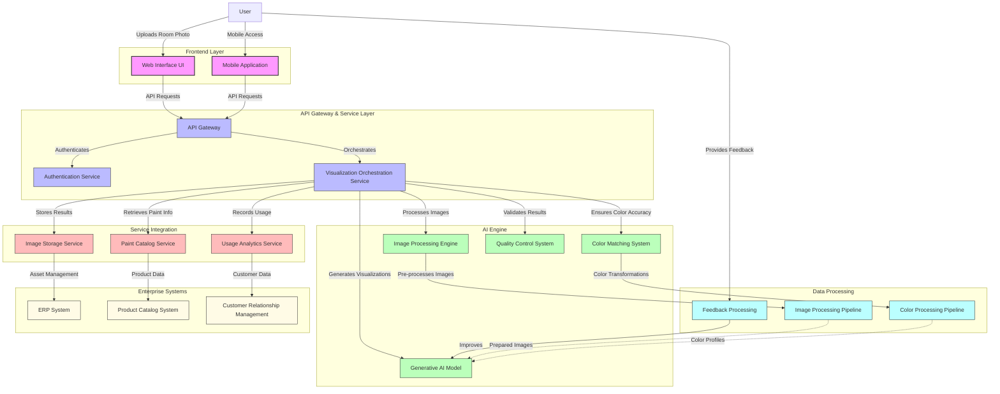
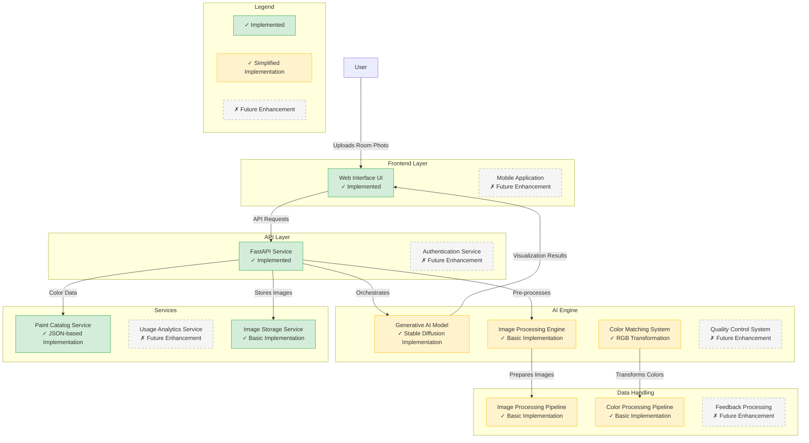

    <a href="https://kranthib.github.io/tech-pulse/" style="display: inline-block; padding: 6px 14px; background-color: #2054a6; color: white; text-decoration: none; border-radius: 3px; font-size: 14px; font-weight: 500; transition: background-color 0.3s;">Back to Home →</a>

# Wall Paint Visualizer Agent

## 1. Executive Summary

The Wall Paint Visualizer Agent is an innovative AI-powered solution designed to transform how customers select paint colors for their living spaces. By leveraging advanced generative AI technology, this solution enables customers to visualize paint colors in their actual rooms before making a purchase decision, significantly enhancing the customer experience while reducing purchase uncertainty and product returns.

This document outlines the complete solution approach, architecture, and proof of concept implementation details for the Wall Paint Visualizer Agent.

## 2. Problem Statement

Customers selecting paint colors for their homes face significant challenges in the traditional selection process:

- Difficulty imagining how specific colors will appear in their unique spaces with varying lighting conditions
- Inability to visualize how color choices coordinate with existing furniture and architectural elements
- Limited perspective from small paint swatches that inadequately represent wall-scale color impact
- Wasted investment in multiple sample cans for colors that ultimately don't meet expectations
- Significant time delays between color consideration and final decision, extending project timelines
- Decision fatigue leading to uncertainty and dissatisfaction with final choices

These challenges result in decision paralysis, delayed purchases, increased returns, and diminished customer satisfaction with the overall paint selection experience.

## 3. Solution Approach

The Wall Paint Visualizer Agent addresses these challenges by:

- Enabling customers to upload photos of their actual rooms
- Leveraging advanced generative AI to apply paint colors to walls while preserving all other room elements
- Maintaining architectural integrity and spatial relationships in modified room images
- Ensuring color accuracy that precisely matches physical product offerings
- Providing side-by-side comparison capabilities for evaluating multiple color options
- Delivering results within seconds to maintain customer engagement

This solution transforms the color selection process from a speculative exercise into a confidence-building visualization experience that accelerates purchase decisions and improves customer satisfaction.

## 4. Architecture

The solution architecture encompasses multiple layers working together to deliver comprehensive room visualization capabilities.

### 4.1 Architecture Components

#### Frontend Layer
- **Web Interface UI**: Primary interface for customers to upload room photos and select colors
- **Mobile Application**: Provides on-the-go access for in-store or at-home visualization

#### API Gateway & Service Layer
- **API Gateway**: Routes requests and manages API traffic
- **Authentication Service**: Ensures secure access with appropriate permissions
- **Visualization Orchestration Service**: Coordinates the visualization workflow

#### AI Engine
- **Generative AI Model**: Stable Diffusion-based model for photorealistic room visualization
- **Image Processing Engine**: Handles image preparation and wall detection
- **Color Matching System**: Ensures precise mapping between digital and physical paint colors
- **Quality Control System**: Validates visualization quality and accuracy

#### Service Integration
- **Paint Catalog Service**: Provides comprehensive paint color information
- **Usage Analytics Service**: Tracks visualization patterns and preferences
- **Image Storage Service**: Manages secure storage of user images and visualizations

#### Data Processing
- **Image Processing Pipeline**: Pre-processes uploaded images for optimal visualization
- **Color Processing Pipeline**: Ensures accurate color transformation and rendering
- **Feedback Processing**: Captures and processes user feedback for continuous improvement

#### Enterprise Systems
- **ERP System**: Enterprise resource planning system
- **Product Catalog System**: Complete product information system
- **Customer Relationship Management**: Customer data and interaction history

## 5. Proof of Concept Implementation

The Proof of Concept (POC) implementation demonstrates core capabilities of the Wall Paint Visualizer Agent while focusing on the most essential components for validating the solution's value.

### 5.1 Implemented Components

The POC includes the following key components:

- **Web Interface**: Responsive UI for photo upload and color selection
- **FastAPI Backend**: RESTful API handling visualization requests
- **Image Processing**: Basic image standardization and preparation
- **Stable Diffusion Integration**: Fine-tuned model for room visualization
- **Paint Catalog Service**: Comprehensive color database with accurate specifications
- **Image Storage**: Secure handling of customer room photos and visualizations

### 5.2 Technology Stack

The POC leverages the following technologies:

- **Python**: Primary programming language
- **FastAPI**: Web framework for API development
- **Stable Diffusion**: Generative AI model for image transformation
- **LangChain**: Framework for AI orchestration and prompting
- **Pillow/OpenCV**: Libraries for image processing
- **React/Bootstrap**: Frontend development frameworks
- **Docker**: Containerization for consistent deployment

### 5.3 Data Model

The POC implements a data model that includes:

- **Paint Colors**: Comprehensive catalog with accurate color codes and metadata
- **Room Images**: User-uploaded photos with processing metadata
- **Visualizations**: Generated room images with applied paint colors
- **Color Families**: Categorization system for organizing paint options
- **Room Types**: Classification of different room environments

## 6. Key Capabilities

The Wall Paint Visualizer Agent provides the following core capabilities:

### 6.1 Room Photo Processing

The system processes customer-uploaded room photos to:
- Standardize image dimensions and quality
- Identify wall surfaces and architectural elements
- Prepare images for visualization processing
- Handle various lighting conditions and room configurations

### 6.2 Color Visualization

The solution generates photorealistic visualizations that:
- Apply selected paint colors to wall surfaces only
- Preserve furniture, fixtures, and architectural elements
- Maintain appropriate lighting and shadow effects
- Ensure spatial consistency and perspective accuracy

### 6.3 Color Selection

The system provides comprehensive paint selection features:
- Complete color catalog with accurate representations
- Color family categorization and filtering
- Search functionality for finding specific colors
- Detailed information about each paint option

### 6.4 Comparison Capabilities

Users can easily compare different color options:
- Side-by-side visualization of multiple colors
- Quick switching between color options
- Saved comparison sets for decision making
- Before/after comparisons with original room photos

### 6.5 Results Sharing

The solution enables customers to share their visualizations:
- Saved visualization galleries for later reference
- Social media sharing capabilities
- Email functionality for sending to family members
- Integration with store appointment scheduling

## 7. Demonstration Flow

### 7.1. Setup and Preparation

Follow [README.md](https://github.com/kranthiB/agentic-ai-solutions/tree/main/wall-paint-visualizer-agent)

### 7.2. Demonstration Narrative

#### Introduction (5 minutes)
- Introduce the problem: customers struggling with paint color selection
- Highlight the costs of uncertainty (returns, delayed projects, dissatisfaction)
- Explain the solution objective: AI-assisted color visualization

#### Interface Overview (3 minutes)
- Show the clean, intuitive user interface
- Explain the simple three-step process: upload, select, visualize
- Highlight the responsive design for various devices

#### Visualization Workflow (10 minutes)
- Upload a sample room photo
- Demonstrate image processing and preparation
- Browse the paint catalog and select color options
- Generate visualizations with different colors
- Show the speed and quality of the results

#### Color Selection Features (5 minutes)
- Demonstrate the color family filtering
- Show search functionality for finding specific colors
- Explain the color detail information
- Show how room type and lighting conditions affect visualization

#### Comparison Capabilities (5 minutes)
- Generate multiple color visualizations
- Show the side-by-side comparison view
- Demonstrate saving and organizing comparisons
- Explain how this facilitates decision making

#### Technical Details (5 minutes)
- Briefly explain the Stable Diffusion model
- Highlight the image processing pipeline
- Demonstrate accuracy of color matching
- Explain storage and security considerations

#### Integration Possibilities (3 minutes)
- Discuss integration with e-commerce
- Explain potential for in-store kiosk deployment
- Highlight mobile app capabilities
- Show connection to sample ordering

#### Business Value (5 minutes)
- Reduced returns and customer dissatisfaction
- Increased conversion rates and average order value
- Enhanced brand differentiation and technology leadership
- Improved customer engagement and loyalty

#### Q&A and Next Steps (10 minutes)
- Address questions about the POC
- Discuss the path to full implementation
- Highlight additional capabilities in the complete solution

### 7.3. Key Demonstration Points

When presenting the POC, emphasize these benefits:

1. **Customer Confidence**: Significantly reduces uncertainty in color selection
2. **Decision Acceleration**: Shortens the customer decision-making process
3. **Visualization Quality**: Produces photorealistic results that maintain room integrity
4. **Ease of Use**: Simple interface requires no technical expertise
5. **Comparison Capabilities**: Facilitates side-by-side evaluation of options
6. **Speed and Responsiveness**: Delivers results in seconds to maintain engagement

## 8. Future Enhancements

The following enhancements are planned for the full implementation:

### 8.1 Advanced Visualization Capabilities
- Multi-wall color combinations for accent wall planning
- Trim and ceiling color visualization
- Texture and finish visualization (matte, semi-gloss, etc.)
- Time-of-day lighting simulations

### 8.2 Enhanced User Experience
- Mobile application for on-the-go visualization
- Augmented reality mode for real-time room scanning
- Voice-controlled interface for hands-free operation
- Personalized color recommendations based on preferences

### 8.3 Integration Features
- E-commerce integration for direct ordering
- Store locator with appointment scheduling
- Professional painter connection services
- Project planning and material calculation tools

### 8.4 Advanced Analytics
- Color preference trend analysis by region
- Visualization-to-purchase conversion tracking
- Seasonal color popularity insights
- Customer segmentation based on visualization behavior

## 9. Conclusion

The Wall Paint Visualizer Agent represents a transformative approach to paint color selection. By leveraging advanced generative AI technology to create photorealistic visualizations of customer spaces, this solution effectively addresses the fundamental challenge of paint color uncertainty.

The proof of concept demonstrates the core capabilities of the system and provides a solid foundation for the full implementation. By continuing to enhance the visualization quality, expanding platform availability, and integrating with e-commerce capabilities, the complete solution will deliver substantial value in terms of improved customer satisfaction, reduced returns, and increased sales conversion rates.