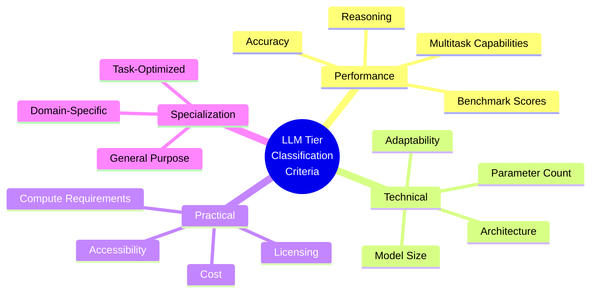
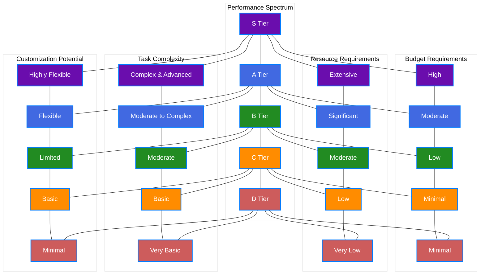
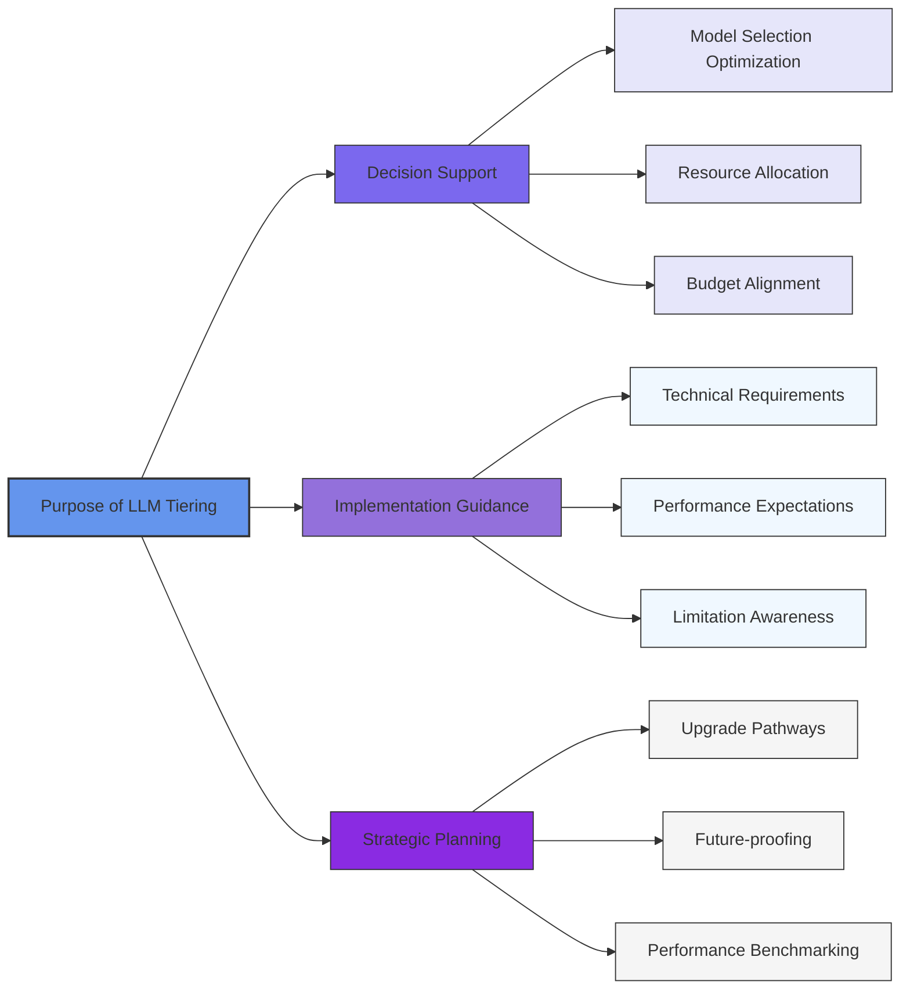
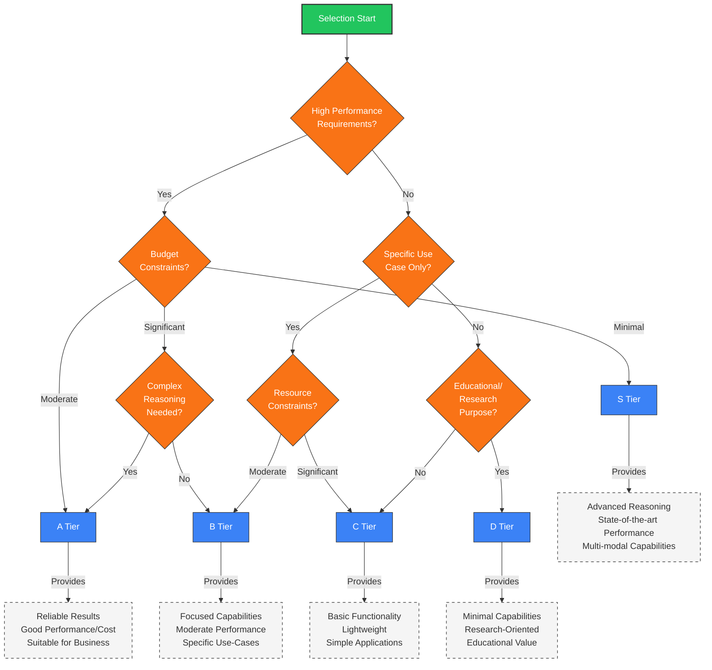

# LLM Tiers: A Comprehensive Guide

## Introduction
This guide presents a structured classification system for Large Language Models (LLMs), helping you assess which models are best suited for various applications based on capabilities, performance, and resource requirements.

```mermaid
flowchart TB
    LLM[LLM Classification] --> S[S Tier\nState-of-the-art]
    LLM --> A[A Tier\nHigh Performance]
    LLM --> B[B Tier\nMid-level]
    LLM --> C[C Tier\nEntry-level]
    LLM --> D[D Tier\nFoundational]
    
    S --> S1[Cutting-edge performance]
    S --> S2[Advanced reasoning]
    S --> S3[Multi-modal capabilities]
    S --> S4[Long-context support]
    
    A --> A1[Reliable performance]
    A --> A2[Cost-effective]
    A --> A3[Excellent for business use]
    A --> A4[High-quality outputs]
    
    B --> B1[Solid performance]
    B --> B2[Limited scalability]
    B --> B3[Good for niche tasks]
    B --> B4[Moderate reasoning]
    
    C --> C1[Basic capabilities]
    C --> C2[Lightweight]
    C --> C3[Low-complexity tasks]
    C --> C4[Resource-constrained environments]
    
    D --> D1[Minimal capabilities]
    D --> D2[Research/experimental]
    D --> D3[Academic purposes]
    D --> D4[Not for production]

    classDef tier fill:#f9f,stroke:#333,stroke-width:2px
    classDef features fill:#ddf,stroke:#333,stroke-width:1px
    class S,A,B,C,D tier
    class S1,S2,S3,S4,A1,A2,A3,A4,B1,B2,B3,B4,C1,C2,C3,C4,D1,D2,D3,D4 features
```

## Key Criteria for LLM Tier Classification

### Performance Metrics
- **Reasoning and Comprehension**: Ability to perform complex reasoning, understand context, and generate coherent responses
- **Accuracy**: Precision in generating relevant and factual outputs
- **Multitask Capabilities**: Proficiency across domains such as coding, creative writing, and summarization

### Technical Considerations
- **Model Size and Complexity**: Larger models typically offer better performance but demand greater computational resources
- **Adaptability**: Ease of fine-tuning and customization for domain-specific applications
- **Multilingual Support**: Capability to handle multiple languages effectively

### Practical Factors
- **Cost and Accessibility**: Compute resources required and associated operational expenses
- **Licensing Terms**: Open-source availability versus proprietary restrictions
- **Specialization**: General-purpose versus task-specific optimization
- **Benchmark Performance**: Scores on standardized evaluations (GLUE, SuperGLUE, MMLU, etc.)

## LLM Tier Breakdown

### S Tier: State-of-the-Art Models
The highest-performing models excelling across a wide range of complex tasks with:
- State-of-the-art capabilities across multiple domains
- Exceptional reasoning and problem-solving abilities
- Advanced multi-modal features and long-context support
- Highest versatility and adaptability

### A Tier: High-Performance Models
Reliable models approaching S Tier but with certain limitations:
- Strong performance in most applications
- Excellent cost-to-capability ratio
- High-quality outputs for business applications
- Good customization potential

### B Tier: Mid-Level Performance
Solid performers with more significant constraints:
- Consistent performance for specific use cases
- Moderate reasoning and generalization capabilities
- Lower computational requirements
- Good for focused applications with defined parameters

### C Tier: Entry-Level Models
Basic models suitable for simpler applications:
- Adequate performance for straightforward tasks
- Lightweight implementation requirements
- Suitable for resource-constrained environments
- Often older generation or smaller architectures

### D Tier: Foundational Models
Minimal capability models primarily for research or education:
- Basic language capabilities
- Extremely lightweight implementation
- Suitable for academic exploration or training
- Not recommended for production environments

## Purpose of LLM Tiering

LLM classification tiers serve several critical functions for organizations implementing AI solutions:

### Strategic Decision Support
- **Optimize Model Selection**: Match appropriate models to specific task requirements
- **Resource Allocation**: Balance performance needs with available computational resources
- **Cost Management**: Align budget constraints with performance expectations

### Implementation Guidance
- **Technical Planning**: Inform infrastructure and deployment requirements
- **Clear Expectations**: Set realistic performance and capability benchmarks
- **Risk Management**: Understand limitations and potential failure points

### Long-term Planning
- **Upgrade Pathways**: Define clear progression paths as needs evolve
- **Future-proofing**: Anticipate technological advancements and scaling requirements
- **Performance Benchmarking**: Establish consistent evaluation frameworks

## LLM Tier Selection Guide

### S Tier Selection Criteria: Cutting-Edge Performance
**Best For:**
- Advanced reasoning and multi-step problem-solving requirements
- Applications demanding state-of-the-art capabilities across domains
- Enterprise deployments requiring highest reliability and versatility
- Situations where budget constraints are secondary to performance

**Example Use Cases:**
- Sophisticated conversational AI assistants for enterprise deployment
- Advanced technical and scientific research applications
- Complex creative content generation (screenwriting, long-form content)
- High-stakes decision support systems

### A Tier Selection Criteria: High Quality and Cost-Effective
**Best For:**
- Balancing strong performance with reasonable operational costs
- Applications requiring reliable but not necessarily cutting-edge results
- Business implementations with moderate resource availability
- Domain-specific deployments with focused requirements

**Example Use Cases:**
- Customer service automation and chatbots
- Robust content generation and summarization
- Medium-complexity code generation and assistance
- Enterprise knowledge management systems

### B Tier Selection Criteria: Mid-Level Performance for Focused Tasks
**Best For:**
- Specific, well-defined use cases with limited scope
- Environments with meaningful resource constraints
- Prototype development and proof-of-concept implementations
- Applications with straightforward requirements

**Example Use Cases:**
- Document summarization and content classification
- Basic to moderate question-answering systems
- Simple chatbots and automated responses
- Content generation where absolute precision isn't critical

### C Tier Selection Criteria: Entry-Level or Lightweight Models
**Best For:**
- Basic applications with minimal complexity
- Highly resource-constrained environments
- Educational and training implementations
- Non-critical applications with basic requirements

**Example Use Cases:**
- Academic exercises and educational demonstrations
- Simple text completion and basic analysis
- Lightweight processing of structured inputs
- Applications where response time is prioritized over sophistication

### D Tier Selection Criteria: Foundational/Research Models
**Best For:**
- Exploration and experimentation with NLP concepts
- Extremely resource-limited environments
- Academic research on fundamental language modeling
- Applications where performance expectations are minimal

**Example Use Cases:**
- Edge computing and embedded systems
- Academic research and experimentation
- Initial prototyping and concept validation
- Learning environments for AI education

### Comparison Matrix: Factors to Consider

| Factor | S Tier | A Tier | B Tier | C Tier | D Tier |
|--------|--------|--------|--------|--------|--------|
| Budget Requirements | High | Moderate | Low | Minimal | Minimal |
| Performance Expectations | Cutting-edge | High | Moderate | Basic | Foundational |
| Resource Availability | Extensive | Moderate | Limited | Very Limited | Minimal |
| Task Complexity | Complex | Moderate to Complex | Moderate | Basic | Very Basic |
| Customization Potential | Highly Flexible | Flexible | Limited | Basic | Minimal |
| Deployment Scope | Enterprise | Department/Team | Specific Application | Single Function | Experimental |
| Risk Tolerance | Low | Moderate | Moderate-High | High | Very High |

## LLMs Tier List - 2024

The landscape of Large Language Models continues to evolve rapidly, with new models and capabilities emerging regularly. Below is a current assessment of prominent LLMs across different tiers:

### S Tier Models: State-of-the-Art

**Gemini 2.0 Flash**: Introduced in December 2024, this multimodal powerhouse processes various input types including audio. Its remarkable speed, zero cost, and performance rivaling GPT-40 make it exceptional for both reasoning and general-purpose applications.

**Claude 3.5 Sonnet**: An elite model celebrated for outstanding efficiency and reliability across a wide application spectrum. Particularly noted for its performance-to-cost ratio.

**GPT-40**: While introducing omni-modality, some feature rollout delays allowed competitors like Gemini 2.0 Flash to gain market advantage. Nevertheless, remains a top-tier model with exceptional capabilities.

### A Tier Models: High Performance

**Claude 3.5 Haiku**: Despite pricing controversies (double that of Claude 3 Haiku), provides solid functionality, though value comparison to free alternatives raises questions.

**Mistral Large 2**: A competent model with comprehensive capabilities, though restrictive licensing may deter some potential users.

**Llama 3.1 (405B)**: The largest publicly available model to date with excellent performance and straightforward licensing terms.

**DeepSeek V2.5**: Successfully combines coding and general functionalities with excellent performance at a competitive API cost.

**Phi4**: A remarkable entry in the 14B parameter category, delivering substantial capability in a compact framework.

**Llama 3.3 70B**: Offers exceptional performance relative to its size, making it a standout in the parameter-efficient category.

### B Tier Models: Solid Performers

**Mistral Nemo**: Once groundbreaking, this Mistral-Nvidia collaboration has been overtaken by newer model releases.

**Qwen 2.5**: Excels in mathematics and task-specific applications but shows limitations in general knowledge and instruction-following.

**DeepSeek R1-Lite**: A capable reasoning-focused model with good performance in analytical tasks.

**Codestral**: A standout coding model that outperforms many competitors (including Qwen 2.5) in programming domains.

**GPT-40 Mini**: Delivers decent performance but faces challenges competing with more aggressively priced alternatives.

**Grok-2**: An uncensored model available through Twitter and API, praised for its accessibility and unique positioning.

### C Tier Models: Basic Functionality

**Qwen 2.5 Coder**: Initially generated significant interest but later criticized for reliance on proprietary benchmarks.

**Mistral Pixtral/Ministral**: Performance generally considered underwhelming with licensing limitations further reducing appeal.

**Llama 3-2 Vision**: Vision capabilities fail to impress compared to multimodal leaders.

**O1 Mini**: Limited capabilities relative to pricing position.

### D Tier Models: Minimal Capabilities

**Gemma 2**: Widely regarded as disappointing due to limited capabilities relative to expectations.

**QwQ**: Despite positioning as an open-source alternative to O1, performance remains limited.

**O1**: Criticized for high pricing ($200) and lack of transparency regarding training methodologies.

## Conclusion

The LLM tier classification system provides a structured framework for evaluating and selecting language models based on capabilities, performance, and resource requirements. As the landscape continues to evolve rapidly, this classification helps organizations make informed decisions aligned with their specific needs and constraints.

Key takeaways:

- **Strategic Selection**: Match the LLM tier to your specific use case, budget, and performance requirements
- **Ongoing Evolution**: The LLM landscape is highly dynamic, with models frequently shifting between tiers as new capabilities emerge
- **Performance/Resource Balance**: Higher tiers generally deliver better performance but require greater resources
- **Deployment Context Matters**: Consider your specific deployment environment, user expectations, and technical constraints

By utilizing this tiering system, organizations can navigate the complex LLM ecosystem more effectively, making strategic choices that optimize both performance and resource utilization.