# Prompt Engineering: A Comprehensive Guide

## Table of Contents

- [What is Prompting?](#what-is-prompting)
- [Designing a Prompt: A 5-Step Framework](#designing-a-prompt-a-5-step-framework)
- [Multimodal Prompting](#multimodal-prompting)
- [Major Issues When Using AI Tools](#major-issues-when-using-ai-tools)
- [Using AI Responsibly](#using-ai-responsibly)
- [Design Prompts for Everyday Work Tasks](#design-prompts-for-everyday-work-tasks)
- [Speed Up Data Analysis](#speed-up-data-analysis)
- [Building Presentations](#building-presentations)
- [Use AI as a Creative or Expert Partner](#use-ai-as-a-creative-or-expert-partner)
- [Rules to Prompt Engineering](#rules-to-prompt-engineering)
- [Parameters](#parameters)
- [Image Generation](#image-generation)

## What is Prompting?

Prompting is the process of providing specific instructions to a generative AI tool to receive new information or to achieve a desired outcome on a task. This interaction can encompass various modalities, including:

- **Text**
- **Images**
- **Videos**
- **Audio**
- **Code**

The quality and structure of the prompt often directly influence the relevance and usefulness of the AI-generated output.

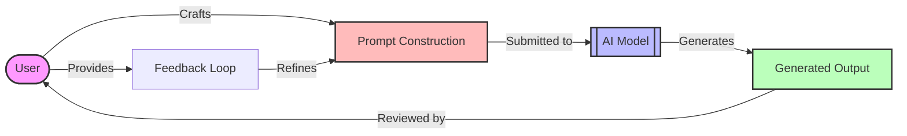

## Designing a Prompt: A 5-Step Framework

Creating an effective prompt is essential for achieving high-quality results from generative AI tools. Following a structured framework can dramatically improve your outcomes.

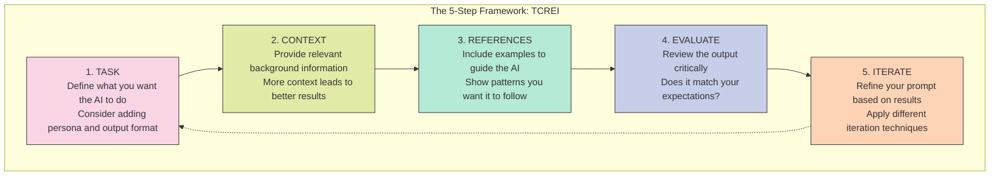

### 1. Task

Define what you want the AI to do. For example:

If your friend's birthday is approaching and they're into anime, you could start with:  
  *"Suggest a gift related to anime for my friend's birthday."*

While this prompt might yield decent results, you can make it more specific by incorporating two additional elements:

**Persona:** Define the role you want the AI to embody. For example:  
  *"Act as an anime expert to suggest an anime gift for my friend's birthday."*  

**Output Format:** Specify the desired format of the response. For instance:  
  *"Organize that data into a table."*

### 2. Context

Provide as much relevant information as possible. More context typically leads to better outputs. For example:  
*"Act as an anime expert to suggest an anime gift for my friend's birthday. She is turning 29 years old, and her favorite animes are Shangri-la Frontier, Solo Leveling, and Naruto Treasures."*

### 3. References

Include examples to clarify your expectations. If explaining your requirements in words proves challenging, examples can help guide the AI's understanding of what you're looking for.

### 4. Evaluate

After receiving the AI's output, ask yourself: *"Is this result aligned with what I wanted?"* If it isn't, proceed to the next step.

### 5. Iterate

Prompting is rarely perfect on the first attempt. It's an iterative cycle where you refine the prompt to achieve desired results.

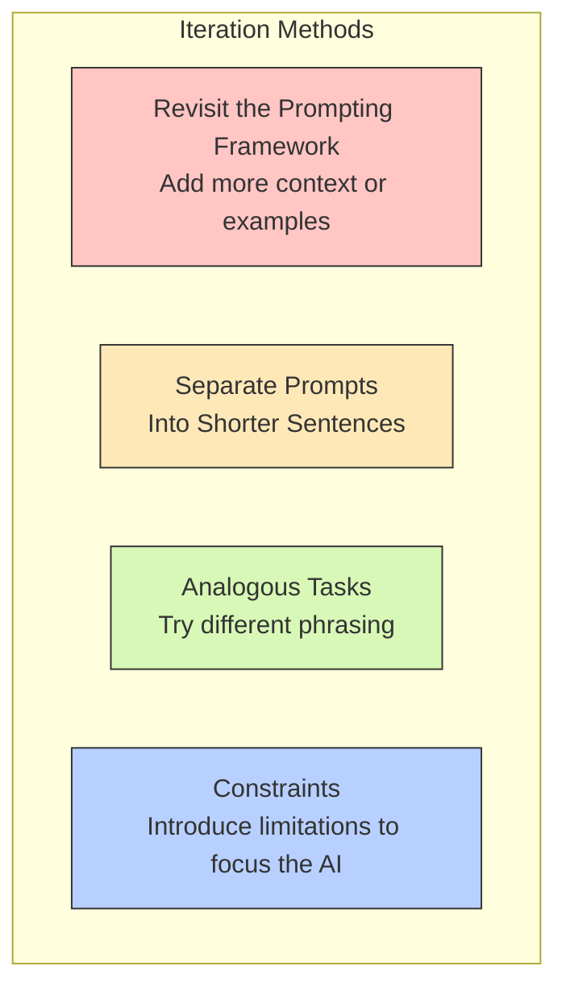

Four effective methods for iteration include:

1. **Revisit the Prompting Framework:** Consider adding more references, providing additional examples, offering more context, or introducing a persona if you haven't already.

2. **Separate Prompts into Shorter Sentences:** Simplify complex instructions into smaller, manageable parts. For example:
   - Instead of:  
     *"Summarize the key data points and information in the report. Then create visual graphs from the data and shorten the key information into bullets."*
   - Try:  
     *"1. Summarize the key data points and information in the report.*  
     *2. Create visual graphs with the data you summarized.*  
     *3. Shorten the key information you summarized into bullets."*

3. **Try Different Phrasing or Analogous Tasks:** If the output feels dull or uninspired, reframe the task.

4. **Introduce Constraints:** Narrow the focus by specifying constraints or limitations.

### Mnemonic to Remember the Framework

Use the phrase **"Thoughtfully Create Really Excellent Inputs"** to recall the 5-step framework:
- **T**ask
- **C**ontext
- **R**eferences
- **E**valuate
- **I**terate

## Multimodal Prompting

Multimodal prompting expands the interaction beyond text, allowing generative AI tools to process and generate outputs in various modalities such as images, audio, video, and code.

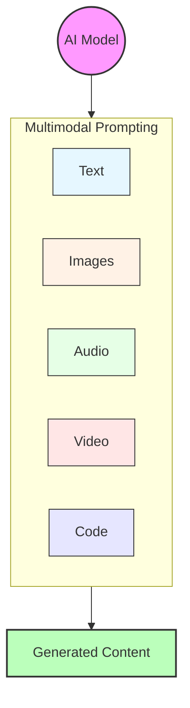

### Examples of Multimodal Usage

- **Suggest recipes based on a photo of the ingredients in your fridge**
- **Design a digital teaser for an upcoming event incorporating brand elements**
- **Analyze data visualizations and extract insights**
- **Create captions for product images based on visual content**

## Major Issues When Using AI Tools

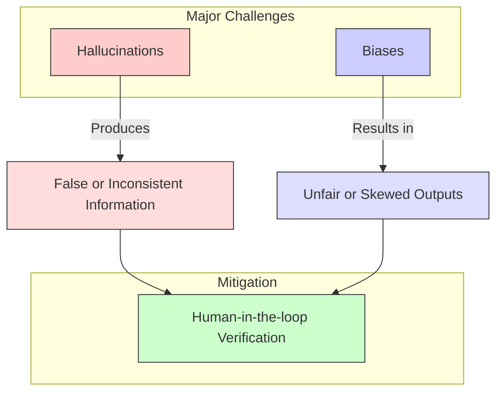

### 1. Hallucinations

Hallucinations occur when the tool provides outputs that are inconsistent, incorrect, or nonsensical. For example:
- Asking AI: *"How many R's are in the word strawberry?"*  
  The AI might respond incorrectly with: *"There are 2 R's in strawberry."* (The correct answer is 1)

### 2. Biases

AI systems, trained on human-generated content, often inherit biases present in that content. These biases can include those related to gender, race, and more.

### Mitigating Issues

To address these problems, a **human-in-the-loop** approach is recommended. Always review and verify the AI-generated outputs to ensure accuracy and fairness.

## Using AI Responsibly

When leveraging AI tools, it is your responsibility to ensure that the outputs are accurate, ethical, and appropriate.

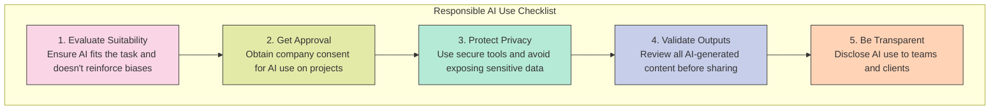

## Design Prompts for Everyday Work Tasks

This section provides examples of use cases based on the 5-step framework and iteration methods to show how generative AI tools can assist with daily work tasks.

### Prompt Library

One common use case for generative AI is content production. Here are some examples:

#### Example 1: Writing an Email

*"I'm a gym manager and we have a new gym schedule. Write an email informing our staff of the new schedule. Highlight the fact that the M/W/F Cardio Blast class changed from 7:00 AM to 6:00 AM. Make the email professional and friendly, and short so that readers can skim it quickly."*

For important content such as essays, articles, or newsletters, be specific about tone:

*"Write a summary in a friendly, easy-to-understand tone like explaining to a curious friend."*

#### Example 2: Planning a Game Launch

*"I'm a marketer for a well-known video game producer known for creating immersive story-based online video games. I'm planning the launch of a new medieval fantasy roleplaying game that follows the path of a young protagonist searching for their missing partner. The game's primary audience is young adults. The game is reaching the end stages of development, and I need help creating a timeline before it goes live. Provide a rough timeline for the year leading up to its launch. Also, provide some pre-launch ideas to help generate buzz around the game."*

#### Example 3: Scheduling Staff Shifts

*"I have 10 employees. Their employee numbers are 1 through 10. Create a table that tracks weekly staffing. Create columns for day, name, and shift (morning or afternoon).*

*- Employees should not be scheduled for a morning shift on the following day after they were scheduled for an afternoon shift.*  
*- Employees should not be scheduled for both the morning and afternoon shifts on the same day.*  
*- Every employee should have roughly the same number of total shifts per week."*

## Speed Up Data Analysis

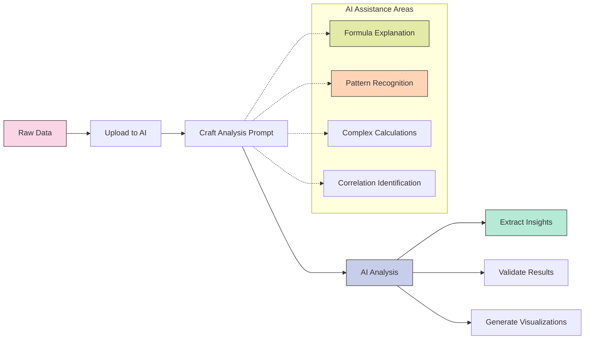

Generative AI can significantly streamline data analysis tasks, from creating new columns to understanding complex formulas.

### Example Dataset

Download the dataset from the following URL:  
[StoreData.xlsx](https://raw.githubusercontent.com/kranthiB/tech-pulse/main/files/StoreData.xlsx)  

This dataset contains information about a grocery store chain, including store details, areas, items available, daily customer counts, and store sales.

### Prompts for Data Analysis

1. **Calculate Average Sales Per Customer:**  
   Prompt:  
   *"Attached is an Excel sheet of store data. How can I create a new column in Sheets that calculates the average sales per customer for each store?"*

2. **Analyze Relationships in the Data:**  
   Prompt:  
   *"Give me insights into the relationship between 'Daily Customer Count,' 'Items Available,' and 'Sales' based on the given data."*

### Understanding Complex Formulas

AI tools can also demystify intricate formulas. For example:

Prompt:  
*"I work at a large restaurant and I need to order inventory while my coworker is on leave. They left me with a formula to calculate how much food to order, but I don't understand it:*  

*=IFERROR(ROUNDUP(MAXO, VLOOKUP(B2, Inventory!A:B,2,FALSE)*0.2 - C2) + SUMIFS(Reservations!D:D, Reservations!A:A, ">="&TODAY(), Reservations!A:A, "<"&(TODAY()+7), Reservations!C:C,B2)* 0.12), "Check Inventory").*  

*Explain what the formula means in simpler, step-by-step terms."*

## Building Presentations

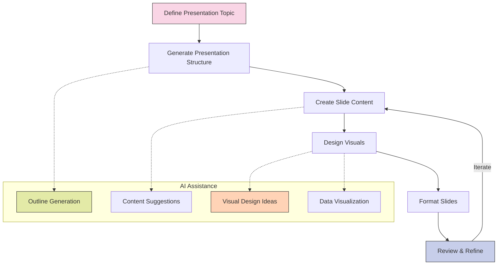

Generative AI can be a powerful tool for designing and structuring professional presentations.

### How Generative AI Can Help

1. **Organizing Content:** Use AI to outline your presentation structure, ensuring logical flow and completeness.  
2. **Creating Visuals:** Generate custom images, graphics, or charts to enhance the visual appeal of your slides.  
3. **Writing Slide Content:** Craft concise and impactful slide text tailored to your audience.  
4. **Design Suggestions:** Get recommendations for layouts, color schemes, and fonts to match your presentation's theme.  

### Example Prompts

#### Structuring a Presentation

*"I'm a product designer at a headphones brand. I'm putting together a presentation for my team about what new features should be included in our next product line. The presentation includes findings from our market research on features that our 18-to-34-year-old customers want their headphones to have. These features include new colors, the ability to control playback with head movements, and noise-canceling capabilities.*  

*Consider the relationship between our demographics' disposable income and their most important considerations when buying headphones. How should I structure my presentation? List each slide's topic with its key points and visuals."*

#### Creating Visuals for the Presentation

*"Generate close-up images of a pair of sleek, silver headphones on a desk in a college dorm room. They should have musical notes floating around the headphones to show that they're playing music."*

## Use AI as a Creative or Expert Partner

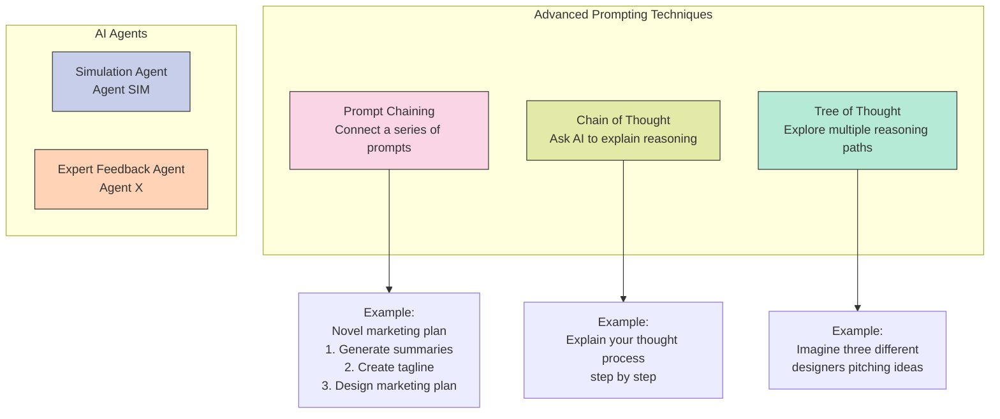

Generative AI can be leveraged not only as a tool but as a creative or expert partner to enhance problem-solving, content creation, and skill-building.

### Advanced Prompting Techniques

#### Prompt Chaining

Prompt chaining guides the AI tool through a series of interconnected prompts, adding layers of complexity along the way.

**Example Scenario:**  
You're an author who has written a novel and now needs a marketing plan.  

1. **Generate Summaries:**  
   *Prompt:*  
   *"Generate three options for a one-sentence summary of this novel manuscript. The summary should be similar in voice and tone to the manuscript but more catchy and engaging."*  

   

2. **Create a Tagline:**  
   *Prompt:*  
   *"Create a tagline that is a combination of the previous three options, with a special focus on the exciting plot twist and mystery of the book. Find the catchiest and most impactful combination."*  

   

3. **Design a Marketing Plan:**  
   *Prompt:*  
   *"Generate a six-week promotional plan for a book tour, including what locations I should visit and what channels I should utilize to promote each stop on the tour."*  

   

#### Chain of Thought Prompting

Chain of thought prompting involves asking AI to explain its reasoning step by step. This is especially useful for identifying errors and improving decision-making.  

*Prompt:*  
*"Explain your thought process step by step."*  

#### Tree of Thought Prompting

Tree of thought prompting allows you to explore multiple reasoning paths simultaneously, making it valuable for abstract or complex problems.  

*Example Prompt:*  
*"Imagine three different designers are pitching their design to me. Each designer writes one step of their thinking and shares it with the group. If any expert realizes they're wrong at any point, they leave. The question is: Generate an image that's visually energetic, featuring art supplies and computers. Show me three suggestions in different styles from simple to detailed."*  

*Follow-up Prompt:*  
*"I like the first option. Expand the idea and generate three different color schemes for that concept."*  

#### Pro Tips for Prompting

1. Combine chain-of-thought and tree-of-thought techniques by asking AI to explain its reasoning at each iteration.  
2. Use meta-prompting: Ask AI to help you generate the next prompt when you're stuck.  

### AI Agents

AI agents are specialized virtual assistants designed to help with specific tasks or provide expert feedback.  

#### Types of AI Agents

1. **Simulation Agent ("Agent SIM"):**  
   Simulates scenarios, such as role-playing exercises.  

   *Example Prompt:*  
   *"Act as a career development training simulator. Your task is to help interns master interview skills and conduct conversations with potential managers. Support these types of conversations:*  
   *- Articulating strengths and skills*  
   *- Communicating professionally and confidently*  
   *- Discussing future career goals*  
   *Continue the role play until the intern replies with 'JAZZ HANDS'. Then provide key takeaways from the simulation and areas for improvement."*  

   

2. **Expert Feedback Agent ("Agent X"):**  
   Acts as a tutor or consultant to provide feedback.  

   *Example Prompt:*  
   *"You're my potential client, the VP of Advertising at a world-famous sports car company known for innovation and performance. Critique my answers, ask follow-up questions, and provide feedback until I say 'BREAK.' Summarize areas for improvement after the session."*  

   

#### Designing Effective AI Agents

1. Assign a persona to the agent.  
   
2. Provide context and detail about the scenario.  
   
3. Specify conversation types and interaction rules.  
   
4. Define a stop phrase for ending interactions.  
   
5. Request feedback after the interaction.  
   

## Rules to Prompt Engineering

| Rule | Ineffective Approach | Effective Approach |
|------|---------------------|-------------------|
| **Rule 1:** Ditch the fluff | "Can you please write me a short story about a robot and a dog who go on adventure together?" | "Write a short story about a robot and a dog going on an adventure" |
| **Rule 2:** Be Descriptive | "A blog post about the economics of the Middle East in the 1960s" | "Write a 1000-word blog about the economic situation of Kuwait from 1961 to 1967, aimed at beginners, in a conversational tone" |
| **Rule 3:** Context & Specifics | "Write a blog post about social media marketing" | "Write a 1000-word blog post about digital social media marketing for beginners, using a conversational tone, targeting a general audience, and dividing it into 5 parts, each with a short list" |
| **Rule 4:** Use role play | "Explain the legal process for patenting an invention" | "You are a patent lawyer. Explain the legal process for patenting an invention in simple terms for a non-legal audience" |
| **Rule 5:** Use Limitations | "Write about renewable energy" | "Write a 200-word summary on the benefits of solar energy, avoiding technical jargon, and focusing on environmental advantages" |
| **Rule 6:** Use Iterative Prompting | Single complex prompt | Start simple and build with follow-up prompts that refine the request |
| **Rule 7:** Specify Output formats | "Tell me about the history of computers" | "Write a timeline of major events in computer history, formatted as a bulleted list. Include 5-7 key milestones, with one sentence explaining each" |
| **Rule 8:** Provide examples | "Write a chord progression in the style of the Beach Boys" | "Write a chord progression in the style of the Beach Boys. Here is an example: [your example]" |
| **Rule 9:** Use Chain-of-Thought | "Explain the pros and cons of renewable energy" | "Explain the pros and cons of renewable energy by addressing the following: Environmental impact, Economic considerations, Availability and scalability, Long-term sustainability" |
| **Rule 10:** Split huge prompts | "Explain the causes, effects, and potential solutions for climate change" | Break into multiple focused prompts: "1. List the top three causes of climate change" followed by effect and solution prompts |
| **Rule 11:** Ask for help with prompting | Direct question | "Refine this prompt to make it clearer and more effective: 'Explain the causes, effects, and potential solutions for climate change'" |

## Parameters

Parameters are essentially settings you can adjust to control how an AI responds to your prompts.

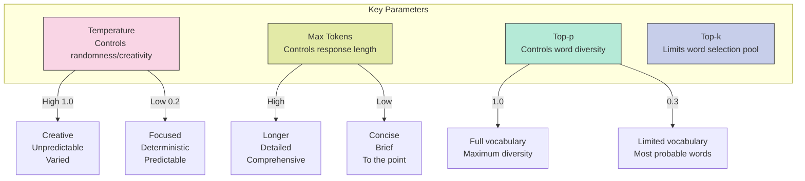

### Key Parameters and Their Functions

1. **Temperature:**  
   The "randomness dial" that determines how creative or focused the AI's responses are.  
   - **High Temperature (e.g., 1.0):** Produces creative, chaotic, and unpredictable outputs.  
   - **Low Temperature (e.g., 0.2):** Results in structured, deterministic, and rule-abiding responses.

2. **Max Tokens:**  
   Controls the maximum length of the AI's response.  
   - A lower value limits the output length, making it concise.  
   - A higher value allows the AI to provide detailed and extended answers.  

3. **Top-p (Nucleus Sampling):**  
   Influences the creative diversity of the response by narrowing or expanding the pool of words considered.  
   - A value of `1.0` includes all possible words (high diversity).  
   - A lower value (e.g., `0.3`) focuses on only the most probable options, reducing randomness.  

4. **Top-k:**  
   Limits the number of options the AI considers when selecting the next word.  
   - A lower value forces the AI to pick from only the most likely words.  
   - A higher value increases the number of potential choices, enhancing creativity.  

### Practical Usage

Every language model handles parameters differently, so the syntax for specifying them varies:  
- In **ChatGPT/Claude/Gemini**, parameters are formatted like `temperature:0.7`.  
- In **Mistral**, parameters use an equal sign, e.g., `temperature=0.7`.  

## Image Generation

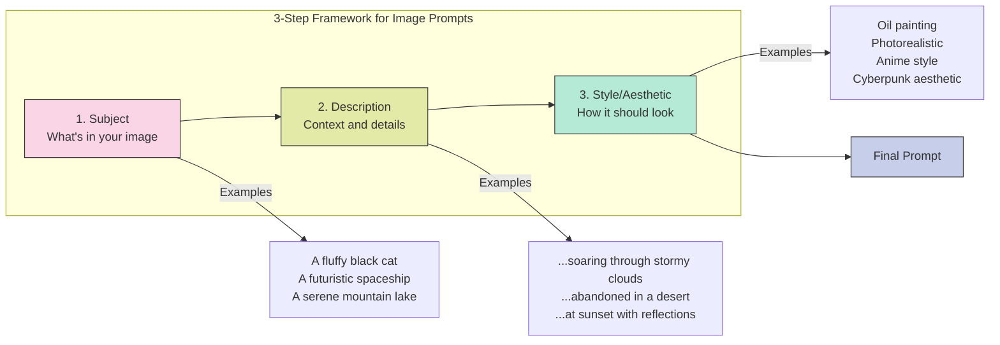

Image generation with AI is an incredible blend of creativity and technology. At its core, it uses **diffusion**—an AI process that refines noise bit by bit, turning chaos into something stunning.  

### The 3-Step Framework for Killer Image Prompts

1. **Subject:**  
   The foundation of your image, like the main character of your visual story. This is usually a noun (*dog*, *spaceship*, *guitar*, *waterfall*).  
   - For better results, spice it up with adjectives.  
   - **Example:** *A fluffy black cat with glowing green eyes*  

2. **Description:**  
   Add context—what's your subject doing? How are they doing it? What's happening around them? Details make all the difference.  
   - **Example:** *A red dragon soaring through stormy clouds, lightning illuminating its scales as it breathes fire into the night*  

3. **Style/Aesthetic:**  
   Think of this as picking the filter for your image. Decide how you want it to look:  
   - Is it a photo or a painting?  
   - What's the art style (impressionist, surreal, 3D render, etc.)?  
   - **Example:** *A 3D render of a futuristic cityscape at sunset with neon lights glowing*  

### Rules for Image Generation Prompting

| Rule | Ineffective Approach | Effective Approach |
|------|---------------------|-------------------|
| **Rule 1:** Don't overthink it - Describe the image as you would to a friend | "cat, urban street, cyberpunk, neon, nighttime, high quality" | "A sleek black cat perched on a rain-slicked urban street in a glowing cyberpunk city at night. Neon signs in electric blues and purples reflect off the wet pavement, casting a dreamy glow. The cat's cybernetic eyes shimmer softly as it watches hover cars zip through the misty air in the background" |
| **Rule 2:** Find the right prompt length for your image complexity | "A snowy mountain range at sunrise, golden light hitting icy peaks, with a lone climber in the distance" | "A stunning snowy mountain range illuminated by the warm glow of sunrise. Golden light glints off icy peaks, contrasting against the deep blue shadows. A lone climber in vibrant gear scales the ridge, surrounded by an expanse of untouched snow" |
| **Rule 3:** Use negative prompting to exclude unwanted elements | "Generate me an image of a serene beach scene with crystal clear water and white sand" | "Generate me an image of a serene beach scene with crystal clear water and white sand, exclude trees" |
| **Rule 4:** Specify resolution and layout | - | "Generate me an image of a cat, 4k, high resolution, detailed textures, landscape orientation" |

### Key Tips for Crafting Prompts

- Be as specific as possible to avoid ambiguity
- Think about the mood, color palette, and perspective (e.g., wide shot, close-up)
- Test and iterate—AI models often improve results with refined instructions
- Use negative prompting to exclude unwanted elements
- Specify resolution and quality settings as needed
- Consider including reference to a specific artist or style for more distinctive results