# Retrieval-Augmented Generation (RAG)

## Overview

Retrieval-Augmented Generation (RAG) is an advanced approach that combines the capabilities of information retrieval systems with generative AI models. By leveraging external knowledge sources during the generation process, RAG ensures the creation of accurate, contextually relevant, and up-to-date content. This hybrid methodology bridges the gap between static generative models and dynamic, information-rich environments, making it a powerful tool for applications requiring precise and reliable outputs.

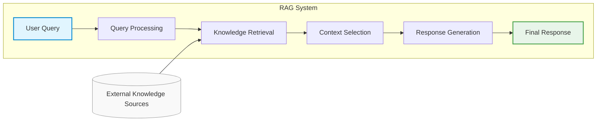
```mermaid
flowchart LR
    subgraph "RAG System"
        A[User Query] --> B[Query Processing]
        B --> C[Knowledge Retrieval]
        C --> D[Context Selection]
        D --> E[Response Generation]
        E --> F[Final Response]
    end
    G[(External Knowledge Sources)] --> C
    style G fill:#f9f9f9,stroke:#999,stroke-width:1px
    style A fill:#e1f5fe,stroke:#0288d1,stroke-width:2px
    style F fill:#e8f5e9,stroke:#43a047,stroke-width:2px
```

---

## RAG Techniques

### Foundational RAG Techniques

#### 1. Simple RAG for PDF and CSV Files

A basic Retrieval-Augmented Generation (RAG) system processes and queries PDF/CSV documents by encoding their content into a vector store, which can then be queried to retrieve relevant information.

##### Key Components

- **PDF Processing and Text Extraction**: Efficiently extract text from PDF documents for further processing.
- **Loading and Splitting CSV Files**: Seamlessly load and handle CSV files, splitting them into manageable units for processing.
- **Text Chunking**: Divide document content into smaller, manageable chunks to ensure smooth processing and retrieval for PDF documents.
- **Vector Store Creation**: Use advanced similarity search techniques like FAISS and embeddings (e.g., OpenAI embeddings) to create an efficient vector store for storing and retrieving document content.
- **Retriever Setup**: Configure a retriever to enable querying of the processed documents for relevant information.
- **Evaluation of the RAG System**: Assess the system's performance to ensure accurate and relevant retrieval of information.

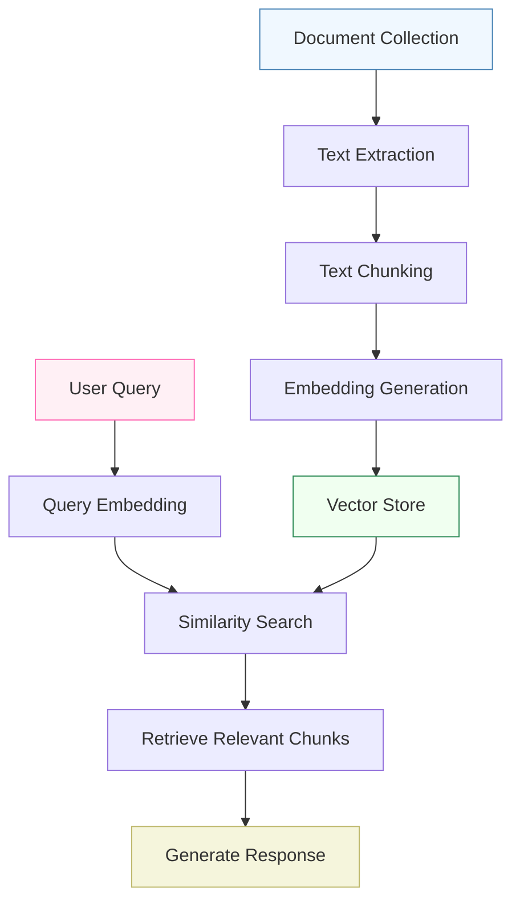
```mermaid
flowchart TD
    A[Document Collection] --> B[Text Extraction]
    B --> C[Text Chunking]
    C --> D[Embedding Generation]
    D --> E[Vector Store]
    F[User Query] --> G[Query Embedding]
    G --> H[Similarity Search]
    E --> H
    H --> I[Retrieve Relevant Chunks]
    I --> J[Generate Response]
    
    style A fill:#f0f8ff,stroke:#4682b4
    style E fill:#f0fff0,stroke:#2e8b57
    style F fill:#fff0f5,stroke:#ff69b4
    style J fill:#f5f5dc,stroke:#bdb76b
```

---

#### 2. Reliable-RAG

The "Reliable-RAG" method enhances the traditional Retrieval-Augmented Generation (RAG) approach by incorporating additional layers of validation and refinement to ensure the accuracy and reliability of retrieved information.

##### Key Components

- **Document Loading and Chunking**: Web-based documents are loaded and divided into smaller, manageable chunks to facilitate efficient vector encoding and retrieval.
- **Vector Store Creation**: Leverages advanced tools like Chroma and Cohere embeddings to encode document chunks into a vector store, enabling similarity-based retrieval.
- **Document Relevancy Check**: Implements a relevance-checking mechanism using a language model to filter out non-relevant documents before generating answers.
- **Answer Generation**: Uses a language model to produce concise and accurate answers based on the relevant documents retrieved.
- **Hallucination Detection**: Includes a dedicated step to identify and eliminate unsupported or erroneous information, ensuring that generated answers are grounded in the retrieved documents.
- **Document Snippet Highlighting**: Identifies and highlights the specific document segments directly used in generating the answer, providing transparency and traceability.

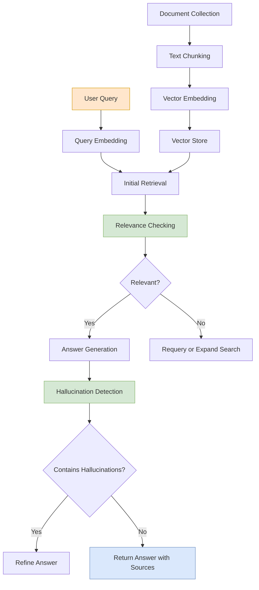
```mermaid
flowchart TD
    A[Document Collection] --> B[Text Chunking]
    B --> C[Vector Embedding]
    C --> D[Vector Store]
    E[User Query] --> F[Query Embedding]
    F --> G[Initial Retrieval]
    D --> G
    G --> H[Relevance Checking]
    H --> I{Relevant?}
    I -- Yes --> J[Answer Generation]
    I -- No --> K[Requery or Expand Search]
    J --> L[Hallucination Detection]
    L --> M{Contains Hallucinations?}
    M -- Yes --> N[Refine Answer]
    M -- No --> O[Return Answer with Sources]
    
    style E fill:#ffe6cc,stroke:#d79b00
    style H fill:#d5e8d4,stroke:#82b366
    style L fill:#d5e8d4,stroke:#82b366
    style O fill:#dae8fc,stroke:#6c8ebf
```

---

#### 3. Propositions Chunking

The Propositions Chunking method enhances document processing by breaking input text into smaller, atomic units called propositions. These propositions are designed to be factual, self-contained, and concise, enabling efficient encoding into a vector store for future retrieval.

##### Key Components

- **Document Chunking**: Dividing the document into smaller sections to facilitate easier analysis and processing.
- **Proposition Generation**: Utilizing large language models (LLMs) to distill document chunks into concise, factual, and independent propositions.
- **Proposition Quality Check**: Assessing the generated propositions for their accuracy, clarity, completeness, and conciseness to ensure reliability.
- **Embedding and Vector Store**: Encoding both the refined propositions and larger document chunks into a vector store to support fast and efficient retrieval.
- **Retrieval and Comparison**: Conducting retrieval tests with various query sizes, comparing the results from proposition-based retrieval with those from larger chunk-based models to highlight the advantages of this approach.

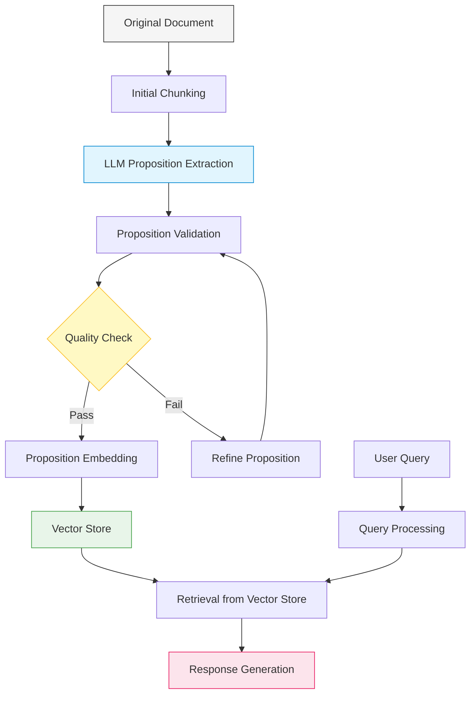
```mermaid
flowchart TD
    A[Original Document] --> B[Initial Chunking]
    B --> C[LLM Proposition Extraction]
    C --> D[Proposition Validation]
    D --> E{Quality Check}
    E -- Pass --> F[Proposition Embedding]
    E -- Fail --> G[Refine Proposition]
    G --> D
    F --> H[Vector Store]
    I[User Query] --> J[Query Processing]
    J --> K[Retrieval from Vector Store]
    H --> K
    K --> L[Response Generation]
    
    style A fill:#f5f5f5,stroke:#333333
    style C fill:#e1f5fe,stroke:#0288d1
    style E fill:#fff9c4,stroke:#fbc02d
    style H fill:#e8f5e9,stroke:#43a047
    style L fill:#fce4ec,stroke:#e91e63
```

---

### Query Enhancements

#### 4. Query Transformations

Retrieval-Augmented Generation (RAG) systems often encounter challenges when handling complex or ambiguous queries. Query transformation techniques address these challenges by reformulating or expanding queries to improve the match with relevant documents.

##### Techniques

- **Query Rewriting**: Reformulates the original query to make it more specific and detailed, improving the alignment with relevant documents.
- **Step-back Prompting**: Broadens the query context by generating higher-level or more generalized prompts to capture broader information.
- **Sub-query Decomposition**: Breaks down complex or multifaceted queries into simpler, more manageable sub-queries, facilitating targeted retrieval.

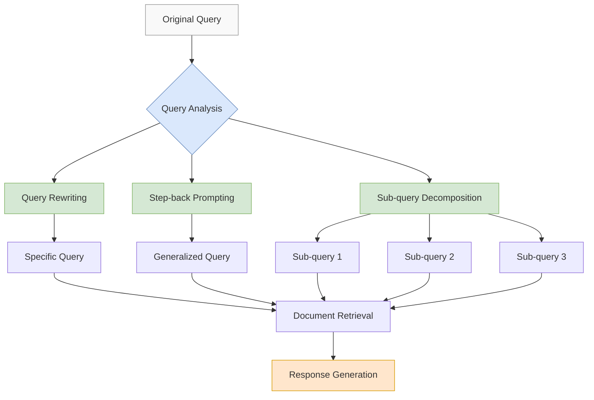
```mermaid
flowchart TD
    A[Original Query] --> B{Query Analysis}
    B --> C[Query Rewriting]
    B --> D[Step-back Prompting]
    B --> E[Sub-query Decomposition]
    
    C --> F[Specific Query]
    D --> G[Generalized Query]
    E --> H[Sub-query 1]
    E --> I[Sub-query 2]
    E --> J[Sub-query 3]
    
    F --> K[Document Retrieval]
    G --> K
    H --> K
    I --> K
    J --> K
    
    K --> L[Response Generation]
    
    style A fill:#f9f9f9,stroke:#999
    style B fill:#dae8fc,stroke:#6c8ebf
    style C fill:#d5e8d4,stroke:#82b366
    style D fill:#d5e8d4,stroke:#82b366
    style E fill:#d5e8d4,stroke:#82b366
    style L fill:#ffe6cc,stroke:#d79b00
```

##### Benefits of these Techniques

- **Improved Relevance**: Query rewriting helps in retrieving more specific and relevant information.
- **Better Context**: Step-back prompting allows for retrieval of broader context and background information.
- **Comprehensive Results**: Sub-query decomposition enables retrieval of information that covers different aspects of a complex query.
- **Flexibility**: Each technique can be used independently or in combination, depending on the specific use case.

---

#### 5. Hypothetical Document Embedding (HyDE)

Hypothetical Document Embedding (HyDE) tackles the challenge of bridging the semantic gap between brief queries and longer, more detailed documents by transforming the query into a full hypothetical document.

##### Key Components

- **PDF Processing and Text Chunking**: Efficiently processes documents by extracting and segmenting text into manageable chunks for analysis.
- **Vector Store Creation**: Utilizes advanced techniques like FAISS and OpenAI embeddings to encode documents and hypothetical queries into a shared vector space for similarity-based retrieval.
- **Language Model for Hypothetical Document Generation**: Leverages a language model to generate detailed hypothetical documents that enrich the query representation.

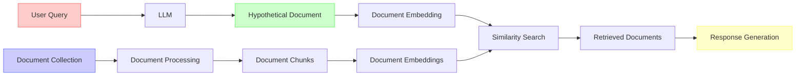
```mermaid
flowchart LR
    A[User Query] --> B[LLM]
    B --> C[Hypothetical Document]
    C --> D[Document Embedding]
    E[Document Collection] --> F[Document Processing]
    F --> G[Document Chunks]
    G --> H[Document Embeddings]
    D --> I[Similarity Search]
    H --> I
    I --> J[Retrieved Documents]
    J --> K[Response Generation]
    
    style A fill:#ffcccc,stroke:#ff6666
    style C fill:#ccffcc,stroke:#66ff66
    style E fill:#ccccff,stroke:#6666ff
    style K fill:#ffffcc,stroke:#ffff66
```

##### Benefits of this Approach

- **Improved Relevance**: By expanding queries into comprehensive documents, HyDE captures more nuanced and relevant matches within the dataset.
- **Handling Complex Queries**: Particularly beneficial for queries that are multi-faceted or difficult to match directly, enabling more precise retrieval.
- **Adaptability**: Supports a wide range of query types and document domains, making it flexible for various applications.
- **Potential for Better Context Understanding**: Expanded queries provide a richer representation of the context and intent, improving the overall retrieval quality.

---

### Context and Content Enrichment

#### 6. Contextual Chunk Headers (CCH)

Contextual Chunk Headers (CCH) address the challenge of insufficient context within individual chunks by augmenting them with higher-level context, ensuring better retrieval accuracy and comprehension by the language model.

##### Problems Addressed by CCH

- **Implicit References**: Chunks may refer to their subject using pronouns or vague references, making them difficult to retrieve or interpret accurately.
- **Context Dependency**: Many chunks lack standalone meaning and can only be properly understood within the broader context of the section or document, leading to potential misinterpretation.

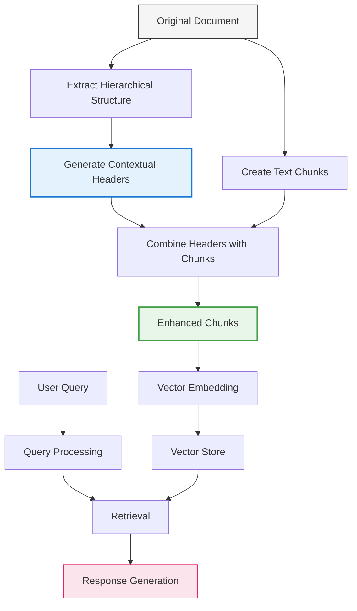
```mermaid
flowchart TD
    A[Original Document] --> B[Extract Hierarchical Structure]
    A --> C[Create Text Chunks]
    B --> D[Generate Contextual Headers]
    D --> E[Combine Headers with Chunks]
    C --> E
    E --> F[Enhanced Chunks]
    F --> G[Vector Embedding]
    G --> H[Vector Store]
    I[User Query] --> J[Query Processing]
    J --> K[Retrieval]
    H --> K
    K --> L[Response Generation]
    
    style A fill:#f5f5f5,stroke:#333333
    style D fill:#e3f2fd,stroke:#1976d2,stroke-width:2px
    style F fill:#e8f5e9,stroke:#43a047,stroke-width:2px
    style L fill:#fce4ec,stroke:#e91e63
```

##### Benefits of CCH

- **Improved Context Representation**: Provides a more complete representation of the content and meaning of the text.
- **Enhanced Retrieval Accuracy**: Makes it easier to retrieve relevant chunks even when implicit references are used.
- **Reduced Hallucinations**: Helps the language model understand chunks within the appropriate context, minimizing errors in generated responses.

---

#### 7. Relevant Segment Extraction (RSE)

Relevant Segment Extraction (RSE) provides a dynamic approach to address the challenges of chunk size optimization by reconstructing multi-chunk segments of contiguous text from retrieved chunks.

##### Challenges in Chunking

- **Context vs. Precision**: Large chunks are ideal for complex or high-level queries but may retrieve irrelevant information. Small chunks are precise but lack the broader context needed for more nuanced queries.
- **Query Diversity**: Real-world RAG use cases often involve a mix of queries, from simple fact-based questions to complex, multi-faceted inquiries that require extensive context.

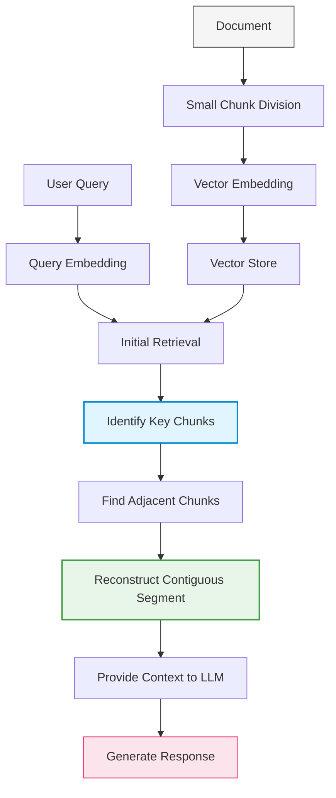
```mermaid
flowchart TD
    A[Document] --> B[Small Chunk Division]
    B --> C[Vector Embedding]
    C --> D[Vector Store]
    E[User Query] --> F[Query Embedding]
    F --> G[Initial Retrieval]
    D --> G
    G --> H[Identify Key Chunks]
    H --> I[Find Adjacent Chunks]
    I --> J[Reconstruct Contiguous Segment]
    J --> K[Provide Context to LLM]
    K --> L[Generate Response]
    
    style A fill:#f5f5f5,stroke:#333333
    style H fill:#e1f5fe,stroke:#0288d1,stroke-width:2px
    style J fill:#e8f5e9,stroke:#43a047,stroke-width:2px
    style L fill:#fce4ec,stroke:#e91e63
```

---

#### 8. Context Enrichment Window for Document Retrieval

The Context Enrichment Window enhances the standard retrieval process by including surrounding context for each retrieved chunk, resulting in more coherent and comprehensive information.

##### Key Components

1. **PDF Processing and Text Chunking**: Extracts and segments text into manageable chunks for effective analysis and retrieval.
2. **Vector Store Creation**: Uses advanced techniques such as FAISS and OpenAI embeddings to encode and store document chunks in a shared vector space.
3. **Custom Retrieval Function with Context Window**: Adds a configurable context window to enrich the retrieved chunks with surrounding text, ensuring completeness and coherence.
4. **Comparison Between Standard and Context-Enriched Retrieval**: Evaluates the effectiveness of context-enriched retrieval against traditional methods, highlighting its advantages in providing richer information.

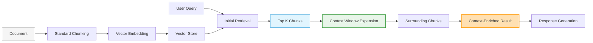
```mermaid
flowchart LR
    A[Document] --> B[Standard Chunking]
    B --> C[Vector Embedding]
    C --> D[Vector Store]
    E[User Query] --> F[Initial Retrieval]
    D --> F
    F --> G[Top K Chunks]
    G --> H[Context Window Expansion]
    H --> I[Surrounding Chunks]
    I --> J[Context-Enriched Result]
    J --> K[Response Generation]
    
    style A fill:#f5f5f5,stroke:#333333
    style G fill:#e1f5fe,stroke:#0288d1
    style H fill:#e8f5e9,stroke:#43a047,stroke-width:2px
    style J fill:#ffe0b2,stroke:#ff9800,stroke-width:2px
```

##### Benefits of this Approach

1. **Improved Coherence**: Delivers results that are more contextually connected and meaningful.
2. **Enhanced Utility of Vector Search**: Retains the benefits of vector-based retrieval while addressing its limitations of returning fragmented text.
3. **Flexible Context Adjustment**: Allows fine-tuning of the context window size to meet specific retrieval needs, enabling adaptability for different use cases.

---

#### 9. Semantic Chunking for Document Processing

Semantic chunking addresses the limitations of traditional text splitting methods by dividing text at natural breakpoints, preserving semantic coherence within each chunk.

##### Key Components

1. **PDF Processing and Text Extraction**: Extracts raw text from PDF documents for further analysis.
2. **Semantic Chunking**: Utilizes advanced techniques, such as LangChain's SemanticChunker, to create meaningful and contextually consistent text segments.
3. **Vector Store Creation**: Encodes the semantically coherent chunks into a vector store using tools like FAISS and OpenAI embeddings.
4. **Retriever Setup**: Configures a retriever to query the semantically processed documents effectively.

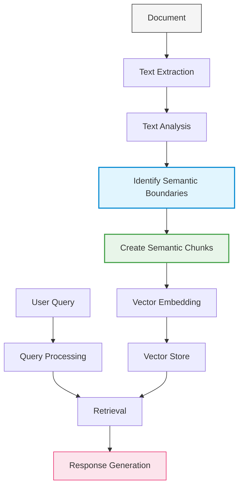
```mermaid
flowchart TD
    A[Document] --> B[Text Extraction]
    B --> C[Text Analysis]
    C --> D[Identify Semantic Boundaries]
    D --> E[Create Semantic Chunks]
    E --> F[Vector Embedding]
    F --> G[Vector Store]
    H[User Query] --> I[Query Processing]
    I --> J[Retrieval]
    G --> J
    J --> K[Response Generation]
    
    style A fill:#f5f5f5,stroke:#333333
    style D fill:#e1f5fe,stroke:#0288d1,stroke-width:2px
    style E fill:#e8f5e9,stroke:#43a047,stroke-width:2px
    style K fill:#fce4ec,stroke:#e91e63
```

##### Benefits of this Approach

1. **Improved Coherence**: Ensures that each chunk contains complete ideas or thoughts, enhancing their standalone clarity.
2. **Better Retrieval Relevance**: Maintains context within chunks, improving the accuracy of information retrieval.
3. **Adaptability**: Allows for customization of chunking methods based on document characteristics and retrieval requirements.
4. **Enhanced Understanding**: Facilitates better performance of LLMs and downstream tasks by providing more coherent and meaningful text segments.

---

#### 10. Contextual Compression in Document Retrieval

Contextual compression tackles the inefficiency of traditional document retrieval by extracting and compressing only the most relevant portions of retrieved documents, resulting in a more focused and streamlined retrieval process.

##### Key Components

1. **Vector Store Creation from a PDF Document**: Encodes document content into a vector store using advanced embedding techniques.
2. **Base Retriever Setup**: Configures the initial retriever to fetch relevant document chunks.
3. **LLM-Based Contextual Compressor**: Employs a language model to analyze and compress retrieved chunks, focusing on the most relevant information.
4. **Contextual Compression Retriever**: Integrates the compressor with the retriever for optimized query results.
5. **Question-Answering Chain**: Utilizes the compressed retriever in a question-answering pipeline to provide concise and accurate answers.

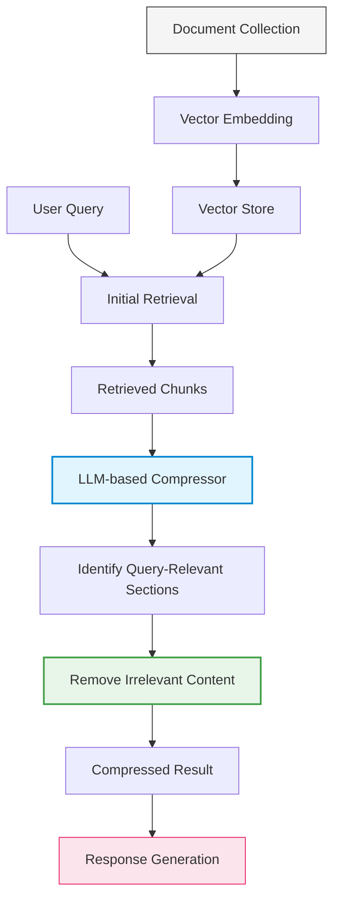
```mermaid
flowchart TD
    A[Document Collection] --> B[Vector Embedding]
    B --> C[Vector Store]
    D[User Query] --> E[Initial Retrieval]
    C --> E
    E --> F[Retrieved Chunks]
    F --> G[LLM-based Compressor]
    G --> H[Identify Query-Relevant Sections]
    H --> I[Remove Irrelevant Content]
    I --> J[Compressed Result]
    J --> K[Response Generation]
    
    style A fill:#f5f5f5,stroke:#333333
    style G fill:#e1f5fe,stroke:#0288d1,stroke-width:2px
    style I fill:#e8f5e9,stroke:#43a047,stroke-width:2px
    style K fill:#fce4ec,stroke:#e91e63
```

##### Benefits of this Approach

1. **Improved Relevance**: Delivers only the most pertinent information, reducing noise in the results.
2. **Increased Efficiency**: Minimizes the volume of text the LLM needs to process, enhancing system performance.
3. **Enhanced Context Understanding**: Leverages the contextual analysis capabilities of LLMs to extract precise information aligned with the query intent.
4. **Flexibility**: Easily adaptable to various document types and query requirements, ensuring versatility in application.

---

#### 11. Document Augmentation through Question Generation for Enhanced Retrieval

This technique enhances document retrieval within a vector database by generating additional questions related to each text fragment, improving the standard retrieval process.

##### Key Components

1. **PDF Processing and Text Chunking**: Processes PDF documents and divides them into manageable text fragments for efficient analysis.
2. **Question Augmentation**: Utilizes OpenAI's language models to generate relevant questions at both the document and fragment levels.
3. **Vector Store Creation**: Encodes documents and generated questions into a vector store using OpenAI's embedding model and FAISS for similarity search.
4. **Retrieval and Answer Generation**: Leverages FAISS to retrieve the most relevant documents and uses the provided context to generate accurate answers.

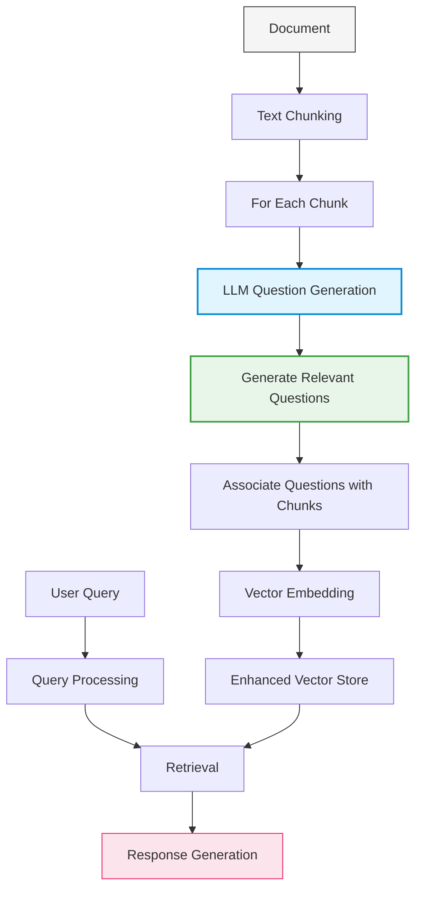
```mermaid
flowchart TD
    A[Document] --> B[Text Chunking]
    B --> C[For Each Chunk]
    C --> D[LLM Question Generation]
    D --> E[Generate Relevant Questions]
    E --> F[Associate Questions with Chunks]
    F --> G[Vector Embedding]
    G --> H[Enhanced Vector Store]
    I[User Query] --> J[Query Processing]
    J --> K[Retrieval]
    H --> K
    K --> L[Response Generation]
    
    style A fill:#f5f5f5,stroke:#333333
    style D fill:#e1f5fe,stroke:#0288d1,stroke-width:2px
    style E fill:#e8f5e9,stroke:#43a047,stroke-width:2px
    style L fill:#fce4ec,stroke:#e91e63
```

##### Benefits of This Approach

1. **Enhanced Retrieval Process**: Improves the probability of retrieving the most relevant documents from the vector store for a given query.
2. **Flexible Context Adjustment**: Supports dynamic adjustment of the context window size for both documents and individual fragments, catering to diverse query requirements.
3. **High-Quality Language Understanding**: Employs OpenAI's advanced language models for generating meaningful questions and producing precise answers, ensuring a robust retrieval mechanism.

---

### Advanced Retrieval Methods

#### 12. Fusion Retrieval in Document Search

Fusion retrieval combines vector-based (semantic) and keyword-based (BM25) retrieval methods to create a more robust and accurate retrieval system that can handle a wider range of queries effectively.

##### Key Components

1. **PDF Processing and Text Chunking**: Prepares documents for analysis by splitting them into manageable chunks.
2. **Vector Store Creation**: Utilizes FAISS and OpenAI embeddings to build a vector-based semantic retrieval system.
3. **BM25 Index Creation**: Implements a keyword-based retrieval system using the BM25 algorithm.
4. **Custom Fusion Retrieval Function**: Combines vector-based and keyword-based retrieval methods to enhance search capabilities.

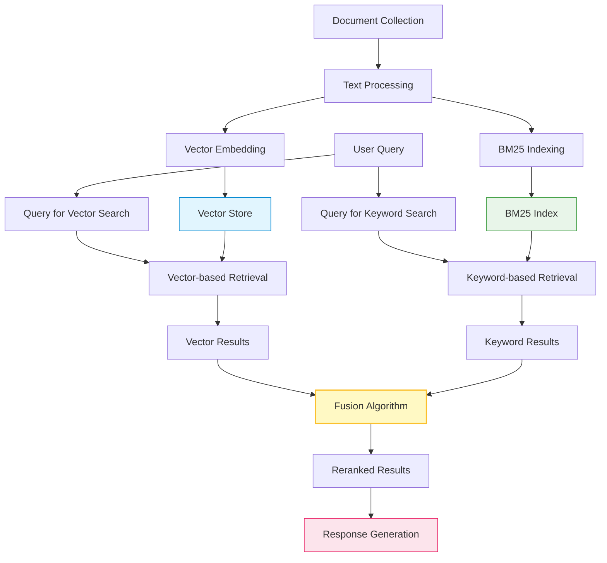
```mermaid
flowchart TD
    A[Document Collection] --> B[Text Processing]
    B --> C[Vector Embedding]
    B --> D[BM25 Indexing]
    C --> E[Vector Store]
    D --> F[BM25 Index]
    G[User Query] --> H[Query for Vector Search]
    G --> I[Query for Keyword Search]
    H --> J[Vector-based Retrieval]
    I --> K[Keyword-based Retrieval]
    E --> J
    F --> K
    J --> L[Vector Results]
    K --> M[Keyword Results]
    L --> N[Fusion Algorithm]
    M --> N
    N --> O[Reranked Results]
    O --> P[Response Generation]
    
    style E fill:#e1f5fe,stroke:#0288d1
    style F fill:#e8f5e9,stroke:#43a047
    style N fill:#fff9c4,stroke:#fbc02d,stroke-width:2px
    style P fill:#fce4ec,stroke:#e91e63
```

##### Benefits of This Approach

1. **Improved Retrieval Quality**: By combining semantic and keyword-based search, the system can capture both conceptual similarity and exact keyword matches.
2. **Flexibility**: The α parameter allows for adjusting the balance between vector and keyword search based on specific use cases or query types.
3. **Robustness**: The combined approach can handle a wider range of queries effectively, mitigating weaknesses of individual methods.
4. **Customizability**: The system can be easily adapted to use different vector stores or keyword-based retrieval methods.

---

#### 13. Intelligent Reranking

Reranking allows for more sophisticated relevance assessment, taking into account nuanced relationships between queries and documents that might be missed by traditional retrieval techniques.

##### Key Components

1. **Initial Retriever**: Often a vector store using embedding-based similarity search.
2. **Reranking Model**: This can be either:
    * A Large Language Model (LLM) for scoring relevance
    * A Cross-Encoder model specifically trained for relevance assessment
3. **Scoring Mechanism**: A method to assign relevance scores to documents
4. **Sorting and Selection Logic**: To reorder documents based on new scores

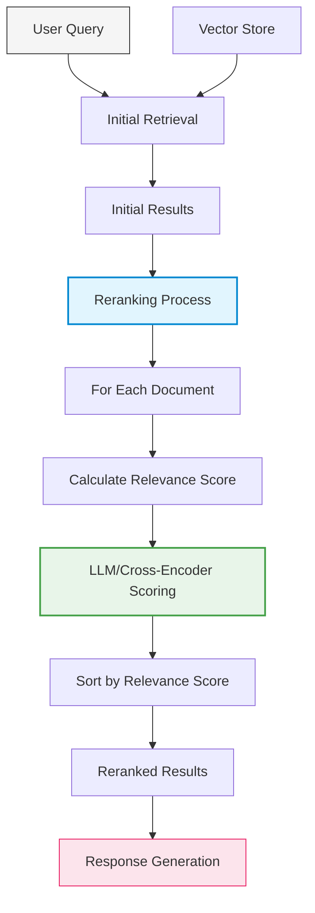
```mermaid
flowchart TD
    A[User Query] --> B[Initial Retrieval]
    C[Vector Store] --> B
    B --> D[Initial Results]
    D --> E[Reranking Process]
    E --> F[For Each Document]
    F --> G[Calculate Relevance Score]
    G --> H[LLM/Cross-Encoder Scoring]
    H --> I[Sort by Relevance Score]
    I --> J[Reranked Results]
    J --> K[Response Generation]
    
    style A fill:#f5f5f5,stroke:#333333
    style E fill:#e1f5fe,stroke:#0288d1,stroke-width:2px
    style H fill:#e8f5e9,stroke:#43a047,stroke-width:2px
    style K fill:#fce4ec,stroke:#e91e63
```

##### Benefits of this Approach

1. **Improved Relevance**: By using more sophisticated models, reranking can capture subtle relevance factors.
2. **Flexibility**: Different reranking methods can be applied based on specific needs and resources.
3. **Enhanced Context Quality**: Providing more relevant documents to the RAG system improves the quality of generated responses.
4. **Reduced Noise**: Reranking helps filter out less relevant information, focusing on the most pertinent content.

---

#### 14. Hierarchical Indices in Document Retrieval

Hierarchical indexing provides a two-tier system for improved efficiency and context-aware retrieval, ensuring more relevant and precise results.

##### Key Components

1. **PDF Processing and Text Chunking**  
   Extracts text from PDFs and divides it into manageable chunks for processing.  

2. **Asynchronous Document Summarization**  
   Summarizes text chunks using language models like OpenAI's GPT-4, providing high-level overviews of document sections.  

3. **Vector Store Creation**  
   Builds separate vector stores for summaries and detailed chunks using technologies like FAISS and OpenAI embeddings, enabling efficient similarity search.  

4. **Custom Hierarchical Retrieval Function**  
   Implements a retrieval process that searches summaries first and drills down into detailed chunks as needed for more granular results.  

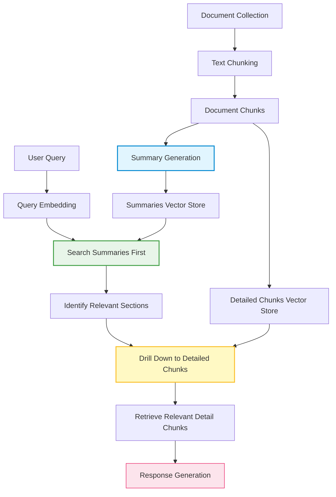
```mermaid
flowchart TD
    A[Document Collection] --> B[Text Chunking]
    B --> C[Document Chunks]
    C --> D[Summary Generation]
    C --> E[Detailed Chunks Vector Store]
    D --> F[Summaries Vector Store]
    G[User Query] --> H[Query Embedding]
    H --> I[Search Summaries First]
    F --> I
    I --> J[Identify Relevant Sections]
    J --> K[Drill Down to Detailed Chunks]
    E --> K
    K --> L[Retrieve Relevant Detail Chunks]
    L --> M[Response Generation]
    
    style D fill:#e1f5fe,stroke:#0288d1,stroke-width:2px
    style I fill:#e8f5e9,stroke:#43a047,stroke-width:2px
    style K fill:#fff9c4,stroke:#fbc02d,stroke-width:2px
    style M fill:#fce4ec,stroke:#e91e63
```

##### Benefits of this Approach

1. **Improved Retrieval Efficiency**  
   Searching summaries first helps quickly locate relevant sections without processing the entire dataset.  

2. **Better Context Preservation**  
   Maintains a broader understanding of document structure, ensuring that retrieved information aligns with the overall context.  

3. **Scalability**  
   Particularly effective for large documents or datasets, where flat indexing methods may struggle with performance or context.  

4. **Flexibility**  
   Allows customization of the retrieval process, such as adjusting the number of summaries and detailed chunks retrieved, to suit different use cases or query types.  

---

#### 15. Multi-modal Retrieval

Multi-modal Retrieval-Augmented Generation (RAG) systems are designed to handle the complexity of documents containing both text and images, such as PDFs.

##### Key Components

1. **PDF Parsers**  
   Extract text and images from PDFs, preparing the content for further processing.  

2. **Multi-Modal LLM**  
   Summarizes and interprets images, tables, and textual content within the document.  

3. **Embeddings**  
   Converts document fragments, including text and image descriptions, into embeddings for similarity-based retrieval.  

4. **Vectorstore**  
   Stores embeddings for efficient search and retrieval of relevant document content.  

5. **Framework**  
   Orchestrates the end-to-end pipeline, from retrieval to response generation, ensuring seamless integration of multi-modal data.  

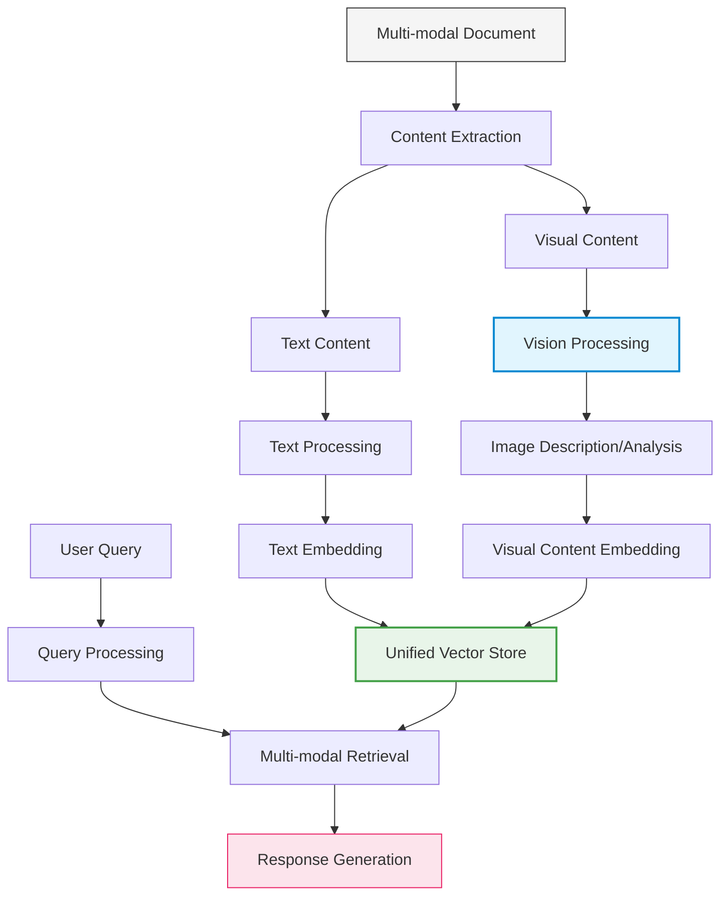
```mermaid
flowchart TD
    A[Multi-modal Document] --> B[Content Extraction]
    B --> C[Text Content]
    B --> D[Visual Content]
    C --> E[Text Processing]
    D --> F[Vision Processing]
    F --> G[Image Description/Analysis]
    E --> H[Text Embedding]
    G --> I[Visual Content Embedding]
    H --> J[Unified Vector Store]
    I --> J
    K[User Query] --> L[Query Processing]
    L --> M[Multi-modal Retrieval]
    J --> M
    M --> N[Response Generation]
    
    style A fill:#f5f5f5,stroke:#333333
    style F fill:#e1f5fe,stroke:#0288d1,stroke-width:2px
    style J fill:#e8f5e9,stroke:#43a047,stroke-width:2px
    style N fill:#fce4ec,stroke:#e91e63
```

##### Benefits

1. **Simplified Retrieval**  
   Handles complex documents containing diverse data types, enabling straightforward access to relevant content.  

2. **Streamlined Question-Answering**  
   Facilitates efficient Q&A processes by integrating both text and visual elements into the retrieval and response generation workflow.  

3. **Flexible Architecture**  
   Supports scalability and adaptation to additional document types, expanding its applicability across various domains.  

---

### Iterative and Adaptive Techniques

#### 16. Retrieval with Feedback Loops

Incorporating feedback loops enables RAG systems to adapt and improve continually, ensuring higher relevance and accuracy over time.

##### Key Components

1. **PDF Content Extraction**  
   Extracts textual content from PDF documents to make them searchable and indexable.  

2. **Vectorstore**  
   Stores embeddings of document content for efficient similarity-based retrieval.  

3. **Retriever**  
   Identifies and fetches documents most relevant to user queries based on embeddings.  

4. **Language Model**  
   Generates responses using the context provided by retrieved documents.  

5. **Feedback Collection**  
   Captures user feedback regarding the quality, relevance, and accuracy of the system's responses.  

6. **Feedback Storage**  
   Maintains collected feedback for long-term use and system training.  

7. **Relevance Score Adjustment**  
   Dynamically updates the relevance scores of documents based on user feedback, improving future retrieval accuracy.  

8. **Index Fine-Tuning**  
   Periodically refines the vectorstore using accumulated feedback to reflect evolving user needs and document content.  

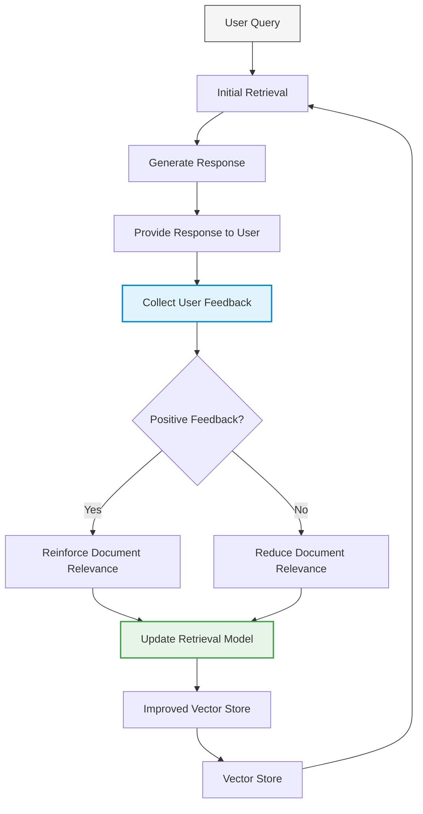
```mermaid
flowchart TD
    A[User Query] --> B[Initial Retrieval]
    C[Vector Store] --> B
    B --> D[Generate Response]
    D --> E[Provide Response to User]
    E --> F[Collect User Feedback]
    F --> G{Positive Feedback?}
    G -- Yes --> H[Reinforce Document Relevance]
    G -- No --> I[Reduce Document Relevance]
    H --> J[Update Retrieval Model]
    I --> J
    J --> K[Improved Vector Store]
    K --> C
    
    style A fill:#f5f5f5,stroke:#333333
    style F fill:#e1f5fe,stroke:#0288d1,stroke-width:2px
    style J fill:#e8f5e9,stroke:#43a047,stroke-width:2px
```

##### Benefits of this Approach

1. **Continuous Improvement**  
   The system learns and evolves from user interactions, progressively enhancing response quality.  

2. **Personalization**  
   Adapts retrieval and response strategies to align with individual or collective user preferences over time.  

3. **Increased Relevance**  
   Feedback integration ensures that retrieved documents become more pertinent to user queries in future interactions.  

4. **Quality Control**  
   Reduces the likelihood of repeating irrelevant or low-quality responses, maintaining a high standard of output.  

5. **Adaptability**  
   Adjusts to changes in user needs or content within the knowledge base, ensuring long-term reliability and effectiveness.  

---

#### 17. Adaptive Retrieval

Adaptive Retrieval addresses the limitation of uniform retrieval approaches by employing tailored strategies that align with the specific requirements of different queries.

##### Key Components

1. **Query Classifier**  
   Categorizes queries into distinct types, such as Factual, Analytical, Opinion, or Contextual, to determine the most appropriate retrieval strategy.  

2. **Adaptive Retrieval Strategies**  
   Implements four customized retrieval strategies to suit different query types:  
   - **Factual Strategy**: Focused and precise retrieval for direct factual answers.  
   - **Analytical Strategy**: Broader retrieval to gather diverse information for in-depth analysis.  
   - **Opinion Strategy**: Searches for multiple perspectives to address subjective or opinion-based queries.  
   - **Contextual Strategy**: Incorporates user-specific information to enhance relevance for contextual queries.  

3. **LLM Integration**  
   Utilizes Large Language Models (LLMs) to enhance the retrieval, ranking, and contextual understanding processes.  

4. **OpenAI GPT Model**  
   Generates the final response using the retrieved documents as context, ensuring coherent and accurate answers.

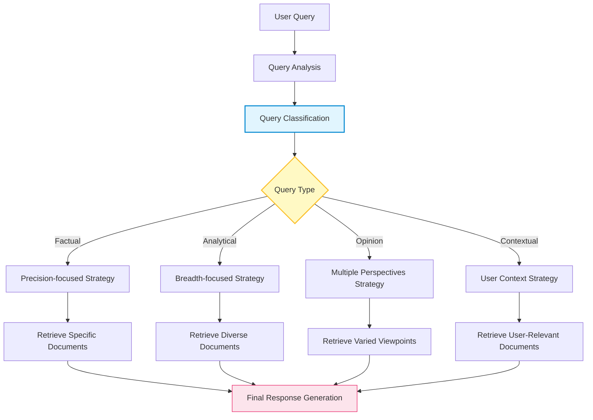
```mermaid
flowchart TD
    A[User Query] --> B[Query Analysis]
    B --> C[Query Classification]
    C --> D{Query Type}
    D -- Factual --> E[Precision-focused Strategy]
    D -- Analytical --> F[Breadth-focused Strategy]
    D -- Opinion --> G[Multiple Perspectives Strategy]
    D -- Contextual --> H[User Context Strategy]
    E --> I[Retrieve Specific Documents]
    F --> J[Retrieve Diverse Documents]
    G --> K[Retrieve Varied Viewpoints]
    H --> L[Retrieve User-Relevant Documents]
    I --> M[Final Response Generation]
    J --> M
    K --> M
    L --> M
    
    style C fill:#e1f5fe,stroke:#0288d1,stroke-width:2px
    style D fill:#fff9c4,stroke:#fbc02d,stroke-width:2px
    style M fill:#fce4ec,stroke:#e91e63
```

##### Benefits of This Approach

1. **Improved Accuracy**  
   Tailoring retrieval strategies to specific query types enhances the precision and relevance of responses.  

2. **Flexibility**  
   Adapts dynamically to diverse query requirements, offering a versatile solution for various user needs.  

3. **Context-Awareness**  
   For contextual queries, the system integrates user-specific information, ensuring personalized and meaningful responses.  

4. **Diverse Perspectives**  
   Actively gathers and presents multiple viewpoints for opinion-based queries, fostering balanced and comprehensive insights.  

5. **Comprehensive Analysis**  
   The analytical strategy provides in-depth exploration of complex topics, supporting thorough and well-rounded responses.  

---

### Evaluation

#### 18. DeepEval Evaluation

The `DeepEval` library provides a comprehensive framework for evaluating the performance of Retrieval-Augmented Generation (RAG) systems with a flexible and robust design that enables the assessment of various performance metrics.

##### Key Components

1. **Correctness Evaluation**: Assesses whether the generated answer is accurate in addressing the query.  
2. **Faithfulness Evaluation**: Ensures the response is grounded in the retrieved context and does not include fabricated information.  
3. **Contextual Relevancy Evaluation**: Evaluates how well the response aligns with the context retrieved for the query.  
4. **Combined Evaluation of Multiple Metrics**: Integrates different metrics to provide a holistic assessment.  
5. **Batch Test Case Creation**: Facilitates the efficient creation of multiple test cases for large-scale evaluations.  

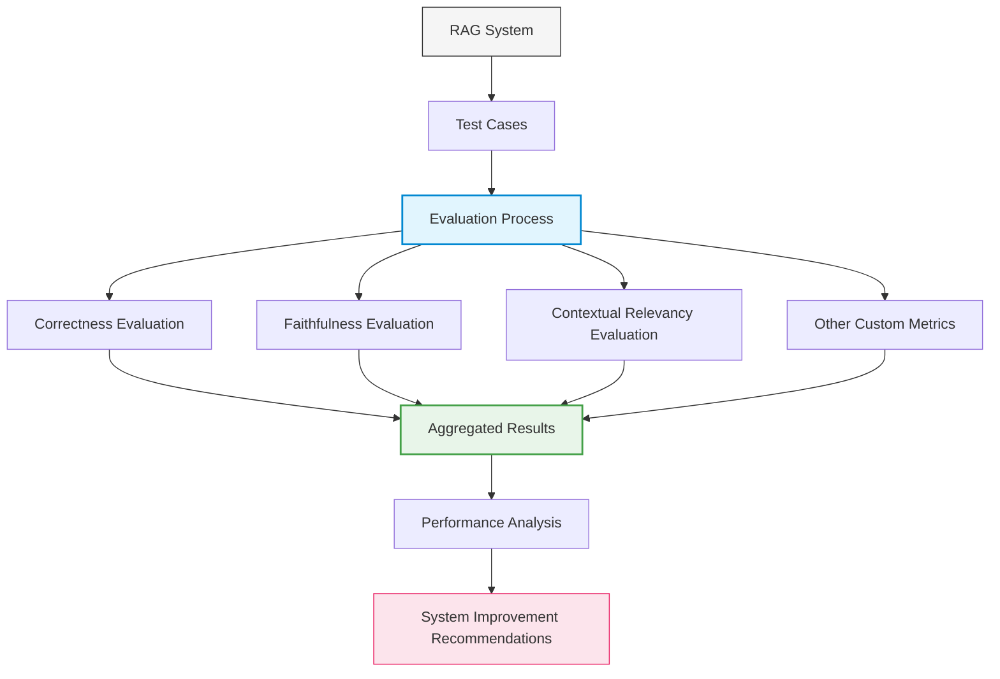
```mermaid
flowchart TD
    A[RAG System] --> B[Test Cases]
    B --> C[Evaluation Process]
    C --> D[Correctness Evaluation]
    C --> E[Faithfulness Evaluation]
    C --> F[Contextual Relevancy Evaluation]
    C --> G[Other Custom Metrics]
    D --> H[Aggregated Results]
    E --> H
    F --> H
    G --> H
    H --> I[Performance Analysis]
    I --> J[System Improvement Recommendations]
    
    style A fill:#f5f5f5,stroke:#333333
    style C fill:#e1f5fe,stroke:#0288d1,stroke-width:2px
    style H fill:#e8f5e9,stroke:#43a047,stroke-width:2px
    style J fill:#fce4ec,stroke:#e91e63
```

##### Key Features

1. **Flexible Metric Configuration**: Metrics can be customized with various models and parameters to fit specific needs.  
2. **Multi-Metric Evaluation**: Allows simultaneous evaluation across multiple metrics for a comprehensive analysis.  
3. **Batch Test Case Creation**: Includes utilities for generating and managing large sets of test cases efficiently.  
4. **Detailed Feedback**: Provides explanations for evaluation results, offering actionable insights.  

##### Benefits of This Approach

1. **Comprehensive Evaluation**: Covers all critical aspects of RAG system performance, ensuring balanced assessments.  
2. **Flexibility**: Enables easy addition or modification of evaluation metrics and test cases.  
3. **Scalability**: Handles extensive test case evaluations and supports diverse evaluation criteria efficiently.  
4. **Interpretability**: Delivers detailed reasons behind evaluation results, aiding in debugging and refining RAG systems.  

---

#### 19. GroUSE Evaluation

The GroUSE framework provides an automated evaluation solution by leveraging Large Language Models (LLMs) with finely tuned prompts to address potential failure modes in Grounded Question Answering.

##### Key Components

1. **Answer Relevancy Evaluation**: Assesses whether the generated answer directly addresses the user's query.  
2. **Completeness Evaluation**: Evaluates if the response includes all necessary information to fully answer the query.  
3. **Faithfulness Evaluation**: Ensures that the generated content is accurate and grounded in the retrieved context.  
4. **Usefulness Evaluation**: Determines the practical value and clarity of the response for the end user.  
5. **Judge LLM Customization**: Tailors the evaluation model to specific use cases or domains by refining prompts and criteria.  

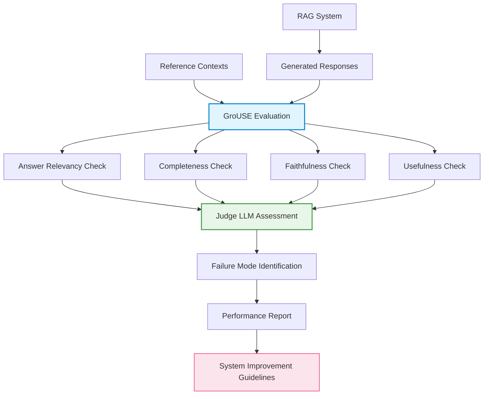
```mermaid
flowchart TD
    A[RAG System] --> B[Generated Responses]
    C[Reference Contexts] --> D[GroUSE Evaluation]
    B --> D
    D --> E[Answer Relevancy Check]
    D --> F[Completeness Check]
    D --> G[Faithfulness Check]
    D --> H[Usefulness Check]
    E --> I[Judge LLM Assessment]
    F --> I
    G --> I
    H --> I
    I --> J[Failure Mode Identification]
    J --> K[Performance Report]
    K --> L[System Improvement Guidelines]
    
    style D fill:#e1f5fe,stroke:#0288d1,stroke-width:2px
    style I fill:#e8f5e9,stroke:#43a047,stroke-width:2px
    style L fill:#fce4ec,stroke:#e91e63
```

##### Benefits of This Approach

1. **Comprehensive Failure Mode Coverage**: Effectively addresses seven key failure modes in Grounded Question Answering.  
2. **Efficiency**: Automates the evaluation process, reducing the need for extensive manual oversight.  
3. **Accuracy**: Identifies weaknesses in RAG pipeline outputs with precision, enabling targeted improvements.  
4. **Scalability**: Supports large-scale evaluation of RAG systems across diverse queries and contexts.  

---

### Explainability and Transparency

#### 20. Explainable Retrieval in Document Search

Explainable Retrieval addresses the lack of transparency in traditional document retrieval systems by combining effective retrieval with clear, comprehensible explanations.

##### Key Components

1. **Vector Store Creation**: Processes input texts and generates embeddings for efficient storage and retrieval using tools like FAISS.  
2. **Base Retriever**: Performs similarity-based retrieval to identify relevant documents.  
3. **Language Model (LLM)**: Generates detailed explanations for why specific documents were retrieved based on their relevance to the query.  
4. **Custom ExplainableRetriever Class**: Integrates retrieval and explanation generation into a unified system for enhanced user interaction.  

```mermaid
flowchart TD
    A[User Query] --> B[Document Retrieval]
    C[Vector Store] --> B
    B --> D[Retrieved Documents]
    D --> E[LLM Explanation Process]
    E --> F[For Each Document]
    F --> G[Generate Relevance Explanation]
    G --> H[Document + Explanation]
    H --> I[Explainable Results]
    I --> J[Response Generation]
    
    style A fill:#f5f5f5,stroke:#333333
    style E fill:#e1f5fe,stroke:#0288d1,stroke-width:2px
    style G fill:#e8f5e9,stroke:#43a047,stroke-width:2px
    style J fill:#fce4ec,stroke:#e91e63
```

##### Benefits of This Approach

1. **Transparency**: Provides clear explanations for why documents were selected, improving system understanding.  
2. **Trust**: Builds user confidence by making retrieval decisions interpretable and justifiable.  
3. **Learning**: Helps users understand the relationships between their queries and the retrieved documents, promoting deeper insights.  
4. **Debugging**: Simplifies the process of identifying and resolving retrieval issues by exposing the underlying reasoning.  
5. **Customization**: Allows explanation prompts to be tailored to specific domains or use cases, ensuring relevance and clarity.  

---

### Advanced Architectures

#### 21. GraphRAG

GraphRAG offers a novel approach to Retrieval-Augmented Generation (RAG) by addressing the challenges of maintaining context in long documents and drawing connections between related pieces of information using a graph-based knowledge structure.

##### Key Components

1. **DocumentProcessor**: Processes input documents by dividing them into text chunks and generating embeddings for each chunk.  
2. **KnowledgeGraph**: Constructs a graph where nodes represent text chunks and edges capture the relationships between them, creating a structured and connected knowledge base.  
3. **QueryEngine**: Handles user queries by traversing the knowledge graph and leveraging vector-based retrieval to provide accurate and contextually rich answers.  
4. **Visualizer**: Generates visual representations of the graph and highlights the traversal path taken to derive the answer, offering explainable results.  

```mermaid
flowchart TD
    A[Document Collection] --> B[Text Chunking]
    B --> C[Generate Embeddings]
    C --> D[Build Knowledge Graph]
    D --> E[Connect Related Chunks]
    E --> F[Establish Relationships]
    F --> G[Complete Knowledge Graph]
    H[User Query] --> I[Query Analysis]
    I --> J[Graph Traversal]
    G --> J
    J --> K[Identify Relevant Paths]
    K --> L[Extract Context from Graph]
    L --> M[Generate Response]
    
    style D fill:#e1f5fe,stroke:#0288d1,stroke-width:2px
    style E fill:#e8f5e9,stroke:#43a047,stroke-width:2px
    style J fill:#fff9c4,stroke:#fbc02d,stroke-width:2px
    style M fill:#fce4ec,stroke:#e91e63
```

##### Benefits of This Approach

1. **Improved Context Awareness**: By organizing information as a graph, GraphRAG preserves relationships between concepts, maintaining context across long documents.  
2. **Enhanced Retrieval**: Goes beyond traditional keyword-based methods, leveraging the graph structure to retrieve relevant information intelligently.  
3. **Explainable Results**: Provides transparency and trust by visualizing how the system navigates the graph to arrive at answers.  
4. **Flexible Knowledge Representation**: Easily adapts to new information and evolving relationships, ensuring up-to-date and comprehensive knowledge.  
5. **Efficient Information Traversal**: Utilizes weighted graph edges to prioritize the most relevant pathways, optimizing the query resolution process.  

---

#### 22. Microsoft GraphRAG

Microsoft's graph-based approach to Retrieval-Augmented Generation (RAG) tackles the challenges of synthesizing information from diverse sources by connecting related data and enhancing semantic understanding.

##### Key Components

1. **Knowledge Graph Generation**: Creates graphs where entities serve as nodes and relationships form the edges, establishing a structured representation of the dataset.  
2. **Community Detection**: Identifies clusters of related entities, uncovering underlying patterns and relationships within the graph.  
3. **Summarization**: Produces concise summaries for each cluster, equipping language models with enhanced contextual understanding.  
4. **Query Processing**: Utilizes summaries from the knowledge graph to improve the accuracy and depth of responses to complex queries.  

```mermaid
flowchart TD
    A[Document Corpus] --> B[Entity Extraction]
    B --> C[Relationship Identification]
    C --> D[Knowledge Graph Construction]
    D --> E[Community Detection Algorithm]
    E --> F[Identify Entity Clusters]
    F --> G[Generate Cluster Summaries]
    G --> H[Enhanced Knowledge Base]
    I[User Query] --> J[Query Analysis]
    J --> K[Retrieve Relevant Clusters]
    H --> K
    K --> L[Extract Combined Context]
    L --> M[Generate Response]
    
    style D fill:#e1f5fe,stroke:#0288d1,stroke-width:2px
    style F fill:#e8f5e9,stroke:#43a047,stroke-width:2px
    style G fill:#fff9c4,stroke:#fbc02d,stroke-width:2px
    style M fill:#fce4ec,stroke:#e91e63
```

##### Benefits of Microsoft RAG

1. **Enhanced Connectivity**: Links related pieces of information across diverse datasets, fostering a comprehensive understanding.  
2. **Semantic Insight**: Enables a deeper grasp of complex concepts through graph-based representation and clustering.  
3. **Improved Performance**: Excels at global sensemaking tasks by synthesizing data from multiple sources.  
4. **Efficiency**: Summarizes clusters to provide concise, relevant contexts for query processing, reducing computational overhead.  
5. **Holistic Understanding**: Facilitates the discovery of new insights by highlighting interrelations within large datasets.  

---

#### 23. RAPTOR: Recursive Abstractive Processing and Thematic Organization for Retrieval

RAPTOR redefines document retrieval by employing a hierarchical structure that enables seamless navigation between high-level overviews and specific details.

##### Key Components

1. **Tree Building**: Constructs a hierarchy of document summaries, creating multiple levels of abstraction to represent the content.  
2. **Embedding and Clustering**: Groups documents and summaries based on semantic similarity, forming clusters for efficient organization.  
3. **Vectorstore**: Stores embeddings in a format optimized for fast and accurate retrieval.  
4. **Contextual Retriever**: Dynamically selects the most relevant information by identifying the appropriate level of detail for a given query.  
5. **Answer Generation**: Produces coherent and contextually grounded responses using the retrieved information.  

```mermaid
flowchart TD
    A[Document Collection] --> B[Document Chunking]
    B --> C[Create Level 0 Chunks]
    C --> D[Recursive Summarization]
    D --> E[Level 1 Summaries]
    E --> F[Level 2 Summaries]
    F --> G[Level N Summaries]
    H[Complete Hierarchy] --> I[Vector Embedding]
    I --> J[Multi-level Vector Store]
    K[User Query] --> L[Query Analysis]
    L --> M[Determine Appropriate Level]
    M --> N[Level-specific Retrieval]
    J --> N
    N --> O[Navigate Hierarchy as Needed]
    O --> P[Extract Relevant Context]
    P --> Q[Generate Response]
    
    style D fill:#e1f5fe,stroke:#0288d1,stroke-width:2px
    style H fill:#e8f5e9,stroke:#43a047,stroke-width:2px
    style M fill:#fff9c4,stroke:#fbc02d,stroke-width:2px
    style Q fill:#fce4ec,stroke:#e91e63
```

##### Benefits of this Approach

1. **Scalability**: Effectively manages large document collections by working with hierarchical summaries.  
2. **Flexibility**: Offers both concise overviews and detailed insights, catering to varied query requirements.  
3. **Context-Awareness**: Retrieves information from the most suitable abstraction level, ensuring relevance.  
4. **Efficiency**: Leverages embeddings and vectorstore for rapid and precise retrieval, minimizing processing time.  
5. **Traceability**: Maintains connections between summaries and original documents, allowing users to verify sources easily.  

---

#### 24. Self-RAG

Self-RAG introduces a refined approach to question answering by dynamically balancing information retrieval and response generation, ensuring that responses are both factually grounded and flexible.

##### Key Components

1. **Retrieval Decision**: Determines whether information retrieval is necessary for the given query.  
2. **Document Retrieval**: Searches a vector store to find documents potentially relevant to the query.  
3. **Relevance Evaluation**: Filters retrieved documents to identify those most pertinent to the query's intent.  
4. **Response Generation**: Constructs responses using the most relevant context available.  
5. **Support Assessment**: Verifies how well the generated response is grounded in the provided context.  
6. **Utility Evaluation**: Assesses the overall usefulness and coherence of the response for the query.  

```mermaid
flowchart TD
    A[User Query] --> B[Retrieval Decision Module]
    B --> C{Retrieval Needed?}
    C -- Yes --> D[Document Retrieval]
    C -- No --> E[Generate Without Retrieval]
    F[Vector Store] --> D
    D --> G[Relevance Filtering]
    G --> H[Extract Best Documents]
    H --> I[Response Generation with Context]
    E --> J[Direct Response Generation]
    I --> K[Support Assessment]
    J --> K
    K --> L[Utility Evaluation]
    L --> M[Final Response]
    
    style B fill:#e1f5fe,stroke:#0288d1,stroke-width:2px
    style G fill:#e8f5e9,stroke:#43a047,stroke-width:2px
    style K fill:#fff9c4,stroke:#fbc02d,stroke-width:2px
    style M fill:#fce4ec,stroke:#e91e63
```

##### Benefits of the Approach

1. **Dynamic Retrieval**: Adapts to diverse queries by deciding when retrieval is necessary, optimizing efficiency.  
2. **Relevance Filtering**: Ensures that only the most pertinent information informs the response, reducing extraneous noise.  
3. **Quality Assurance**: Incorporates mechanisms to evaluate the support and utility of generated responses, maintaining high standards.  
4. **Flexibility**: Allows for response generation with or without retrieval, making it versatile across different contexts.  
5. **Improved Accuracy**: Combines relevant retrieved data with robust generation techniques to produce precise and contextually grounded outputs.  

---

#### 25. Corrective RAG

Corrective RAG is a methodology designed to address shortcomings in traditional Retrieval-Augmented Generation (RAG) systems, particularly when retrieved data is irrelevant, incomplete, or outdated.

##### Key Components

1. **FAISS Index**: A vector-based system that efficiently retrieves relevant information from pre-existing knowledge bases.  
2. **Relevance Evaluator**: Determines how closely retrieved documents align with the query's intent.  
3. **Knowledge Refinement**: Extracts and refines important details from retrieved documents to ensure accuracy.  
4. **Web Search Query Optimization**: Reformulates queries for web searches when local knowledge falls short.  
5. **Response Generator**: Constructs clear and accurate responses by integrating knowledge from various sources.  

```mermaid
flowchart TD
    A[User Query] --> B[Initial Local Knowledge Retrieval]
    C[Vector Store] --> B
    B --> D[Relevance Evaluation]
    D --> E{Sufficient Relevant Data?}
    E -- Yes --> F[Knowledge Refinement]
    E -- No --> G[Web Search Query Formulation]
    G --> H[Execute Web Search]
    H --> I[Process Web Results]
    I --> J[Combine with Local Knowledge]
    F --> J
    J --> K[Response Generation]
    K --> L[Final Response]
    
    style D fill:#e1f5fe,stroke:#0288d1,stroke-width:2px
    style E fill:#fff9c4,stroke:#fbc02d,stroke-width:2px
    style J fill:#e8f5e9,stroke:#43a047,stroke-width:2px
    style L fill:#fce4ec,stroke:#e91e63
```

##### Benefits of the Corrective RAG Approach

1. **Dynamic Adaptability**: Automatically adjusts to retrieve accurate and relevant information.  
2. **Enhanced Flexibility**: Combines local knowledge retrieval with real-time web searches when needed.  
3. **Improved Precision**: Ensures that only relevant and reliable data is used in response generation.  
4. **Transparent Information**: Provides source references, enabling users to verify the credibility of information.  
5. **Rapid Retrieval**: Employs vector search for efficient access to large knowledge repositories.  
6. **Comprehensive Context**: Merges insights from multiple sources for more complete and nuanced answers.  
7. **Real-Time Updates**: Incorporates the latest information from the web to supplement outdated local data.  

---