# Industrial IoT: Smart Manufacturing and Digital Transformation

## Table of Contents
- [Industrial Revolution Evolution](#industrial-revolution-evolution)
- [Smart Manufacturing](#smart-manufacturing)
- [Nine Pillars of Industry 4.0](#nine-pillars-of-industry-40)
- [Reference Architectures](#reference-architectures)
- [Industrial Workloads](#industrial-workloads)
- [IT vs OT Security](#it-vs-ot-security)
- [Industrial IoT Readiness](#industrial-iot-readiness)

## Industrial Revolution Evolution

The Industrial Revolution has evolved through four distinct phases, each transforming manufacturing and technology:

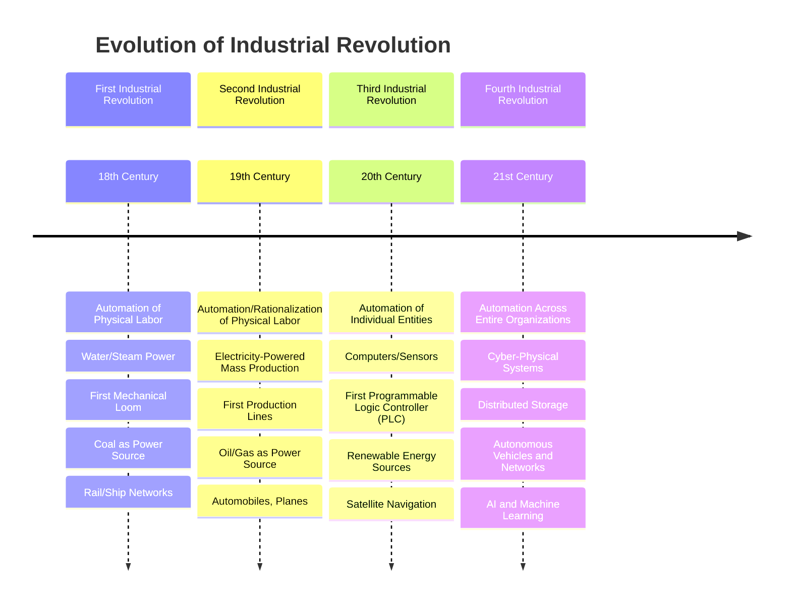

This timeline illustrates the progression of industrial capability across four major technological revolutions. Each phase represents a fundamental shift in how manufacturing operates:

- **First Industrial Revolution:** Marked the transition from manual production to machine-based manufacturing, fundamentally changing workforce requirements and production capabilities
- **Second Industrial Revolution:** Introduced mass production techniques and assembly lines, dramatically increasing output volume and standardization
- **Third Industrial Revolution:** Brought automation through computers and early digital technologies, enabling precise control of individual processes
- **Fourth Industrial Revolution (Industry 4.0):** Represents our current era where entire manufacturing ecosystems are connected, intelligent, and can operate with minimal human intervention

This evolution provides critical context for understanding today's Industrial IoT landscape, as each revolution built upon the technological foundations of the previous era.

## Smart Manufacturing

### Manufacturing Paradigms

Smart manufacturing combines advanced technologies to transform traditional processes into more efficient, agile, and sustainable systems.

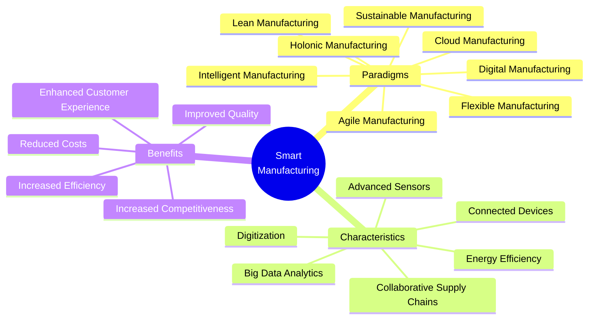

This mindmap captures the multifaceted nature of smart manufacturing, organizing it into three key dimensions:

- **Manufacturing Paradigms:** The various methodological approaches that comprise smart manufacturing, each with specific focuses like sustainability, agility, or intelligence
- **Core Characteristics:** The defining technological and operational features that distinguish smart manufacturing from traditional approaches
- **Business Benefits:** The tangible outcomes organizations can expect when implementing smart manufacturing principles

Understanding these interconnected elements helps organizations identify which aspects of smart manufacturing align with their strategic priorities and operational challenges.

### Discrete vs Process Manufacturing

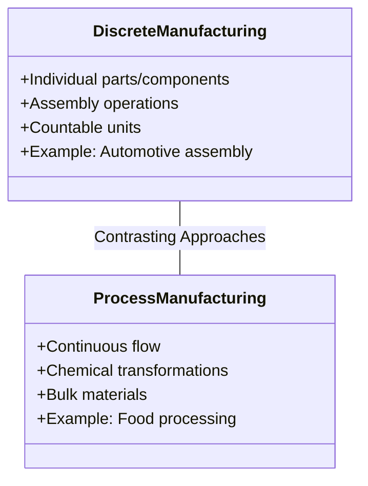

This diagram highlights the fundamental differences between the two primary manufacturing categories:

- **Discrete Manufacturing:** Produces distinct, countable items through assembly of components, where products can be disassembled back into their original parts
- **Process Manufacturing:** Creates products through chemical transformations or continuous processes where the raw materials cannot be returned to their original state

These distinctions are critical for IIoT implementation because they determine:
- Which sensors and monitoring technologies are appropriate
- How production data should be collected and analyzed
- What types of automation and control systems will be effective
- Which performance metrics and KPIs are most relevant

Organizations must align their IIoT strategy with their manufacturing type to ensure appropriate technology selection and implementation.

### Key Manufacturing Capabilities

Smart Manufacturing balances cost control and differentiation through four key areas:

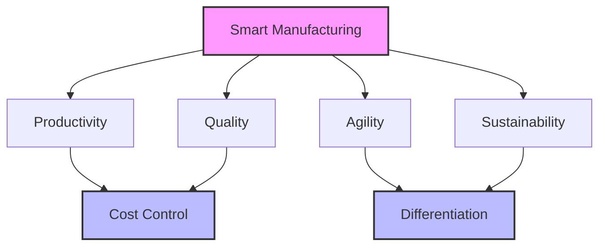

This diagram illustrates how smart manufacturing capabilities create competitive advantage through two distinct paths:

- **Cost Control Path:** Productivity improvements drive operational efficiency while quality enhancements reduce waste and rework, both contributing to lower overall costs
- **Differentiation Path:** Agility enables customization and faster response to market changes, while sustainability creates brand value and meets increasing regulatory requirements

Successful IIoT implementations typically address both paths simultaneously, creating a balanced approach that both reduces operating costs and enhances market position. Organizations should evaluate their IIoT initiatives against these four capability areas to ensure comprehensive business value creation.

### Design Principles & Smart System Elements

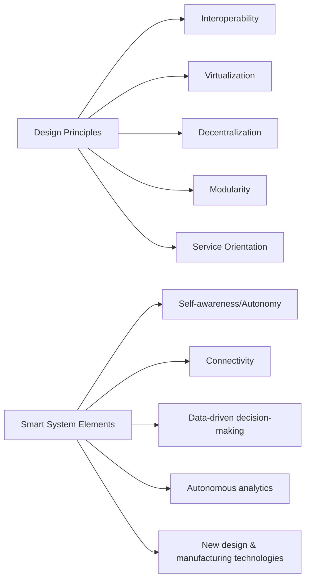

This flowchart outlines the architectural foundation for implementing smart manufacturing systems:

- **Design Principles:** The fundamental architectural concepts that should guide system design, focusing on flexibility, integration capability, and distributed intelligence
- **Smart System Elements:** The technical and functional components that must be incorporated to create truly intelligent manufacturing environments

These principles and elements form a blueprint for IIoT system architecture. When designing industrial systems, organizations should evaluate potential solutions against these criteria to ensure they're building truly smart manufacturing capabilities rather than simply digitizing existing processes.

## Nine Pillars of Industry 4.0

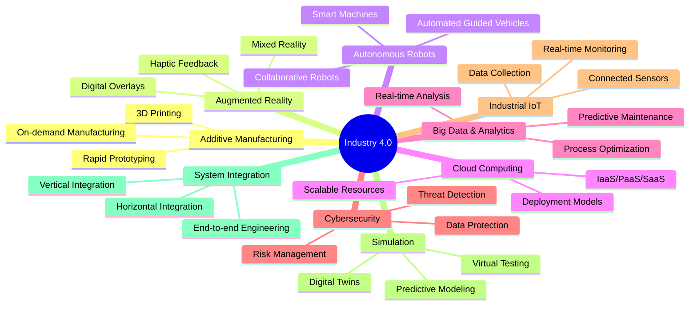

This comprehensive mindmap details the nine foundational technologies that define Industry 4.0:

- Each pillar represents a distinct technological capability that transforms traditional manufacturing
- The subcategories illustrate specific implementations and applications within each pillar
- Together, these technologies create cyber-physical systems that blur the line between digital and physical worlds

Organizations typically begin their Industry 4.0 journey by implementing 2-3 pillars that address their most pressing business challenges, then expand to incorporate additional technologies as their maturity increases. A holistic Industry 4.0 strategy should eventually incorporate elements from all nine pillars to realize maximum transformation potential.

### Additive Manufacturing

Additive manufacturing creates objects layer by layer, allowing for complex geometries and on-demand production.

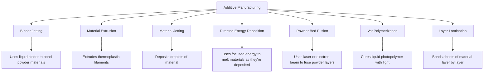

This diagram showcases the diversity of additive manufacturing technologies, each with specific capabilities and applications:

- Different technologies excel at working with different materials, from plastics to metals to ceramics
- Process selection depends on requirements for precision, material properties, production volume, and cost
- Each method creates unique possibilities for part design, customization, and supply chain transformation

Additive manufacturing represents a fundamental shift from subtractive methods (removing material) to additive processes (building layer by layer), enabling:
- Production of parts with previously impossible geometries
- Economical small-batch or one-off production
- Localized manufacturing closer to point of use
- Significant reduction in material waste

Organizations should evaluate these technologies based on their specific production requirements and integration potential with existing manufacturing processes.

### Industrial IoT

IIoT connects machines, sensors, and systems to enable real-time monitoring and data analysis:

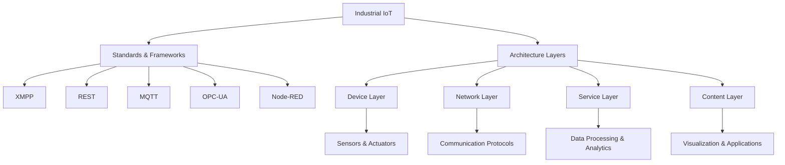

This flowchart outlines the technical architecture and standards that enable Industrial IoT implementation:

- **Standards & Frameworks:** Communication protocols and integration methods that allow diverse industrial systems to share data
- **Architecture Layers:** The four-tier structure of IIoT implementations, from physical devices to end-user applications

Understanding this architecture is critical because:
- Protocol selection impacts system compatibility, security, and performance
- Each layer presents distinct implementation challenges and requires specific expertise
- A comprehensive IIoT strategy must address all layers to create an end-to-end solution

Organizations implementing IIoT should start by standardizing on specific protocols and establishing a clear layered architecture to ensure scalability, interoperability, and security as their deployment grows.

### Simulation & Digital Twins

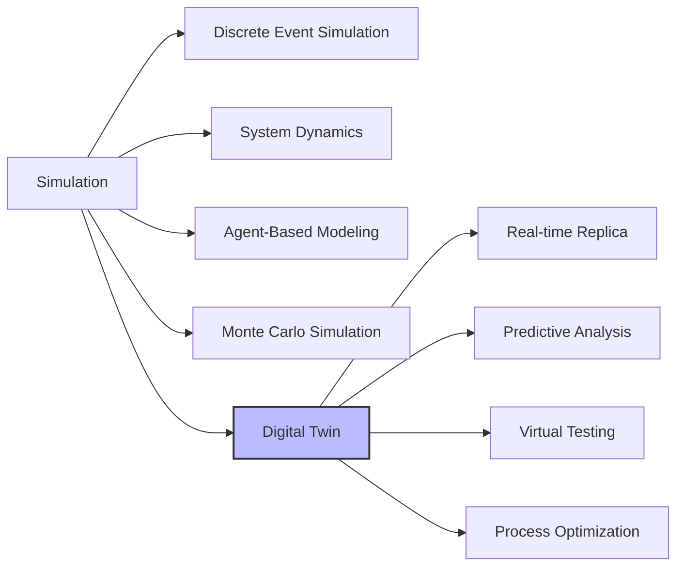

This graph illustrates the various simulation approaches used in manufacturing, with special emphasis on digital twins:

- **Simulation Methods:** Different mathematical and computational approaches for modeling system behavior
- **Digital Twin Applications:** The specific ways digital twins transform manufacturing operations

Digital twins represent a major advancement in simulation technology because they:
- Create a bidirectional link between physical assets and their digital models
- Update in real-time based on operating conditions and sensor data
- Enable predictive capabilities that traditional simulation methods cannot provide
- Allow for virtual experimentation without disrupting physical production

Organizations should begin their simulation journey with targeted applications like process optimization or maintenance planning, then progress toward comprehensive digital twin implementations as their data infrastructure matures.

### Horizontal and Vertical Integration

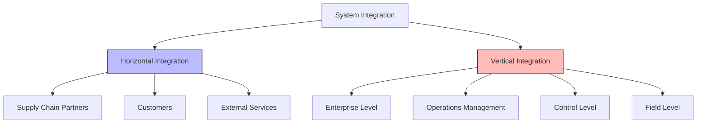

This flowchart depicts the two dimensions of integration essential for Industry 4.0:

- **Horizontal Integration:** Connects organizations across the value chain, linking suppliers, manufacturers, and customers through seamless data flow
- **Vertical Integration:** Connects different levels within an organization, from shop floor devices to enterprise management systems

These integration dimensions create significant value through:
- Eliminating data silos that prevent comprehensive visibility
- Enabling end-to-end process optimization beyond organizational boundaries
- Accelerating decision-making with real-time information flow
- Creating new business opportunities through partner collaboration

While most organizations begin with vertical integration to connect their own operations, true Industry 4.0 transformation requires expanding to horizontal integration with ecosystem partners. A successful integration strategy requires standardized data models, secure interfaces, and clear governance frameworks.

## Reference Architectures

### RAMI 4.0 (Reference Architectural Model Industry 4.0)

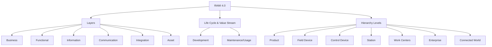

This diagram illustrates the Reference Architectural Model for Industry 4.0 (RAMI 4.0), a comprehensive framework for industrial system design:

- **Layers:** The six functional perspectives representing different aspects of system implementation, from physical assets to business processes
- **Life Cycle & Value Stream:** The temporal dimension showing how systems evolve from development through operation
- **Hierarchy Levels:** The organizational scope from individual products to connected ecosystems

RAMI 4.0 provides critical benefits for IIoT implementation:
- Creates a common language for describing complex industrial systems
- Ensures comprehensive coverage of all aspects of system design
- Facilitates interoperability between systems from different vendors
- Enables systematic digital transformation planning

Organizations should use RAMI 4.0 as a checkpoint to ensure their IIoT initiatives address all relevant architectural dimensions rather than focusing only on specific technologies or use cases.

### Industrial Edge Computing Architecture

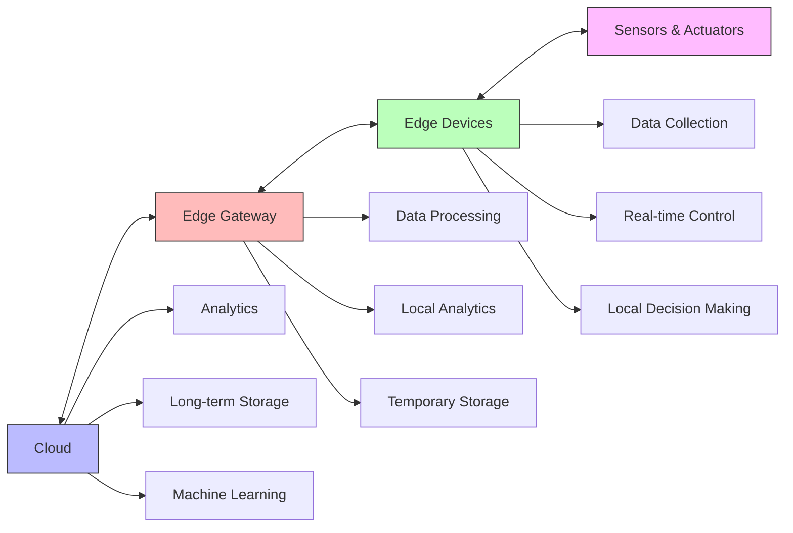

This flowchart depicts a modern edge computing architecture for industrial applications, illustrating how data flows between different processing tiers:

- **Cloud Layer:** Centralized computing resources for long-term storage, advanced analytics, and global process optimization
- **Edge Gateway:** Intermediate processing layer that aggregates data from multiple sources and provides local computing capabilities
- **Edge Devices:** Intelligent field devices that perform data collection and basic processing at the source
- **Sensors & Actuators:** Physical interface with the production environment, measuring conditions and executing control actions

This architecture addresses critical industrial requirements by:
- Minimizing latency for time-sensitive operations by processing data closer to the source
- Reducing bandwidth requirements by filtering and aggregating data before transmission
- Ensuring operational continuity even during cloud connectivity disruptions
- Balancing processing loads between central and distributed resources

Organizations should implement edge computing architectures when their applications require real-time response, have bandwidth limitations, or must maintain functionality during network outages.

### Predictive Maintenance Framework

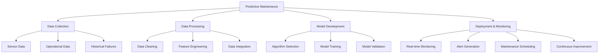

This graph details the end-to-end process for implementing predictive maintenance, one of the most valuable IIoT applications:

- **Data Collection:** Gathering the diverse inputs needed for effective failure prediction
- **Data Processing:** Transforming raw data into analysis-ready formats
- **Model Development:** Creating and validating the analytical models that predict equipment failure
- **Deployment & Monitoring:** Operationalizing predictive models and integrating them into maintenance workflows

Effective predictive maintenance creates substantial business value through:
- Reducing unplanned downtime by identifying potential failures before they occur
- Extending equipment life by addressing issues at optimal intervention points
- Optimizing maintenance resource allocation based on actual equipment condition
- Decreasing spare parts inventory by better forecasting maintenance needs

Organizations should approach predictive maintenance implementation incrementally, starting with critical assets that have clear failure modes and existing sensor infrastructure, then expanding to more complex equipment and failure types as capabilities mature.

### Overall Equipment Effectiveness (OEE)

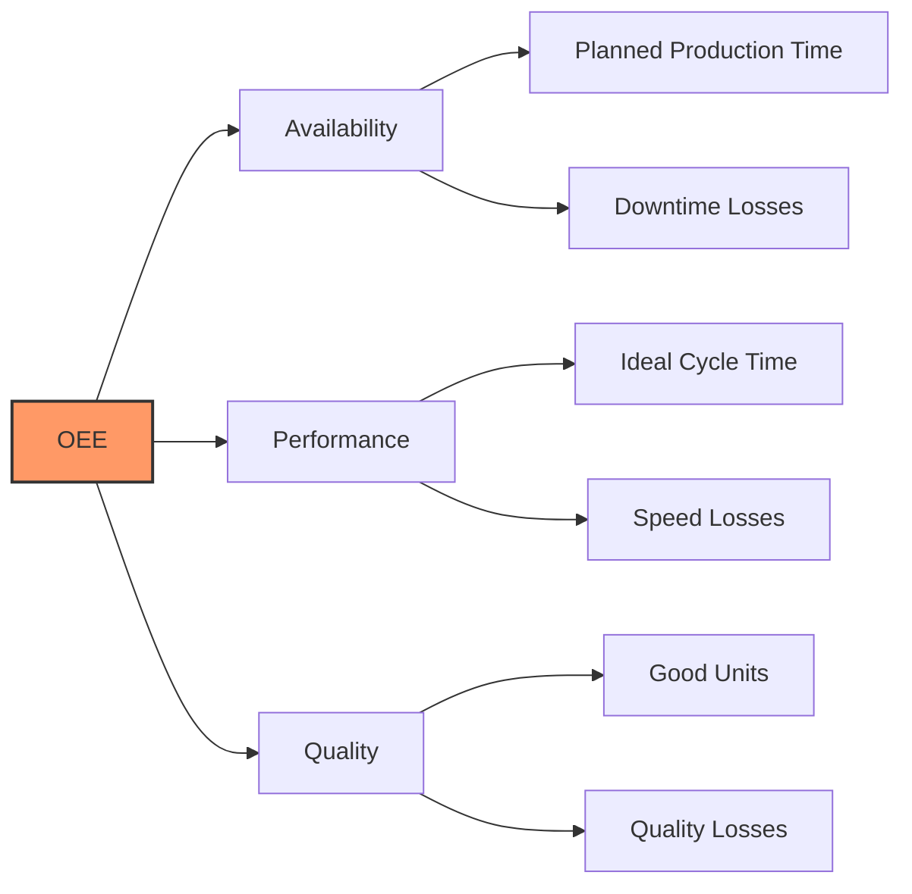

This diagram illustrates Overall Equipment Effectiveness (OEE), the standard metric for measuring manufacturing productivity:

- **Availability:** The percentage of scheduled time that equipment is available for operation
- **Performance:** The speed at which equipment operates compared to its designed speed
- **Quality:** The percentage of good units produced compared to total units

OEE provides a comprehensive view of productivity by:
- Combining three critical performance dimensions into a single metric
- Creating visibility into specific loss categories that impact production
- Enabling benchmarking across equipment, lines, and facilities
- Providing a clear target for improvement initiatives

IIoT technologies enhance OEE measurement by:
- Automating data collection for more accurate and real-time reporting
- Enabling deeper analysis of root causes for losses
- Facilitating predictive approaches to prevent losses before they occur
- Creating visibility across entire production networks

Organizations should use OEE as a central metric for their IIoT implementations, ensuring that technology deployments directly contribute to productivity improvement as measured by availability, performance, and quality.

### Industrial Control System Components

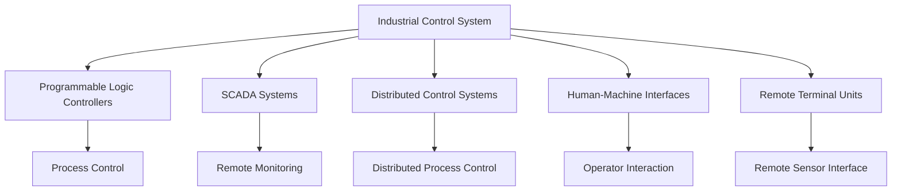

This flowchart outlines the fundamental components of industrial control systems that form the foundation for IIoT implementations:

- **Programmable Logic Controllers (PLCs):** Ruggedized industrial computers that control manufacturing processes
- **SCADA Systems:** Software platforms that monitor and control distributed equipment
- **Distributed Control Systems (DCS):** Integrated control architectures for continuous process industries
- **Human-Machine Interfaces (HMIs):** Operator interfaces for monitoring and controlling industrial processes
- **Remote Terminal Units (RTUs):** Field devices that interface with sensors and equipment in remote locations

Understanding these components is critical because:
- They represent the operational technology foundation that IIoT must integrate with
- Most IIoT implementations build upon rather than replace these existing systems
- Each component presents specific integration challenges and security considerations
- Different industries rely on different control system architectures

Organizations beginning their IIoT journey should start by thoroughly documenting their existing control system infrastructure, identifying potential integration points, and assessing security implications before connecting these systems to broader networks.

## Industrial Workloads

### Key Digital Transformation Enablers

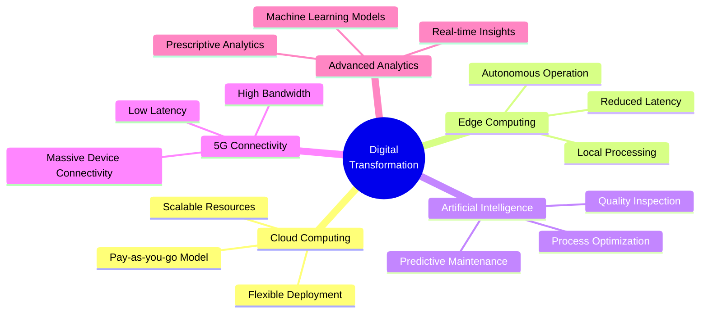

This mindmap identifies the core technologies enabling industrial digital transformation:

- Each enabler represents a distinct capability set that contributes to transformation potential
- The subcategories illustrate specific applications and features within each technology area
- Together, these enablers create a technological foundation for IIoT implementation

These technologies are interconnected and mutually reinforcing:
- Edge computing and 5G together enable real-time processing at the point of need
- Cloud computing provides the scalable resources needed for advanced analytics
- AI transforms raw data into actionable intelligence
- Advanced analytics extract maximum value from the industrial data collected

Organizations should develop a balanced technology portfolio that incorporates elements from each of these enablers, tailored to their specific industry requirements and digital maturity level.

### Digitalization Journey

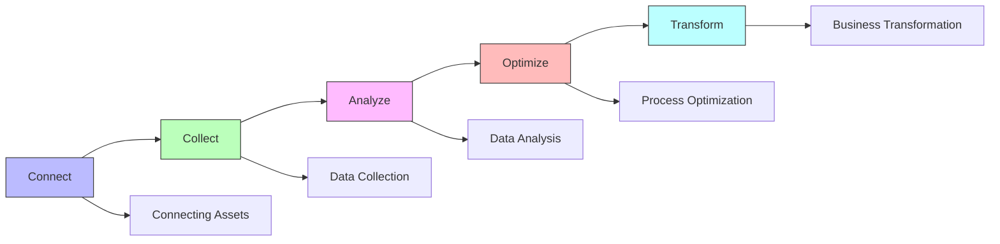

This progression illustrates the typical path organizations follow during their industrial digital transformation:

- **Connect:** Establishing connectivity between physical assets and digital systems
- **Collect:** Gathering and storing operational data from connected assets
- **Analyze:** Deriving insights from collected data through various analytical methods
- **Optimize:** Implementing changes based on analytical insights to improve operations
- **Transform:** Reimagining business models and processes based on digital capabilities

This journey represents a maturity progression where:
- Each stage builds on the capabilities established in previous stages
- Value increases as organizations move through the sequence
- The focus shifts from technology implementation to business transformation
- Early stages focus on efficiency, while later stages enable innovation

Organizations should assess their current position in this journey and develop roadmaps that address the specific challenges of transitioning between stages, recognizing that the later stages often require more significant organizational and cultural changes than the earlier, more technology-focused stages.

### Common Industrial Use Cases

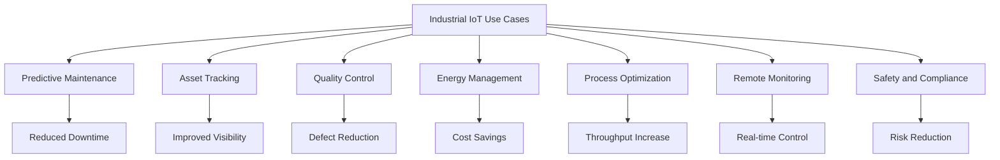

This diagram catalogs the most common and valuable IIoT applications across industries:

- Each use case addresses specific operational challenges faced by industrial organizations
- The outcomes highlight the primary business value created by each application
- These applications represent proven starting points for IIoT implementation

Organizations typically begin their IIoT journey by implementing one or two of these use cases, then expand to others as they gain experience and demonstrate value. When prioritizing initial applications, consider:
- Business impact (quantifiable ROI)
- Implementation complexity
- Alignment with organizational priorities
- Data availability and quality
- Required technology infrastructure

The most successful implementations focus on addressing specific business problems rather than deploying technology for its own sake, using these common use cases as templates that can be customized to specific industry and organizational requirements.

## IT vs OT Security

### IT and OT Security Comparison

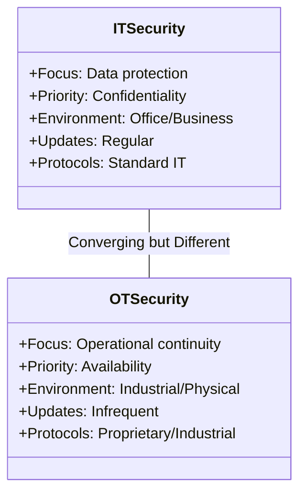

This class diagram contrasts the distinct priorities and characteristics of IT and OT security domains:

- **IT Security:** Focused on protecting information assets, with confidentiality as the primary concern
- **OT Security:** Focused on ensuring operational continuity, with availability as the primary concern

These fundamental differences create challenges for IIoT implementations because:
- Security practices optimized for IT environments may not address OT-specific requirements
- Traditional IT security tools may disrupt critical industrial processes
- OT systems often lack modern security capabilities due to age and design constraints
- Organization structures frequently separate IT and OT security responsibilities

As IT and OT converge through IIoT implementations, organizations must develop integrated security approaches that:
- Address both data protection and operational continuity needs
- Adapt IT security practices to accommodate OT constraints
- Enhance OT systems with appropriate security controls
- Create cross-functional governance structures spanning both domains

### Network Topologies in OT Environment

Industrial networks typically implement the Purdue Model for segmentation:

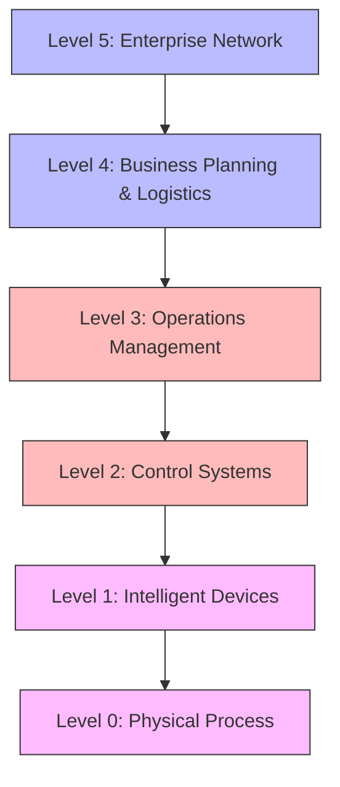

This flowchart illustrates the Purdue Enterprise Reference Architecture (PERA), the standard model for industrial network segmentation:

- **Levels 5-4:** Enterprise IT systems focused on business operations
- **Level 3:** Operations management systems bridging IT and OT
- **Levels 2-1:** Control systems directly managing industrial processes
- **Level 0:** Physical equipment performing the actual work

This model is crucial for IIoT security because:
- It establishes clear boundaries between network zones with different security requirements
- It provides a framework for implementing defense-in-depth strategies
- It identifies appropriate control points for monitoring and securing data flows
- It helps maintain operational integrity while enabling business integration

Organizations implementing IIoT should maintain the logical separation defined by the Purdue Model even as technologies evolve, using techniques like network segmentation, data diodes, and unidirectional gateways to control information flow between levels while enabling necessary integration.

### OT Security Challenges

```mermaid
mindmap
    root((OT Security<br>Challenges))
        Legacy Systems
            Long Lifecycles
            Outdated Software
            Limited Processing Power
        Air Gap Erosion
            IT/OT Convergence
            Remote Access
            Cloud Integration
        Proprietary Protocols
            Lack of Authentication
            Clear-text Communication
            Limited Security Features
        Safety Requirements
            Availability Priority
            Limited Patching Windows
            Physical Safety Implications
        Skills Gap
            Limited OT Security Expertise
            Different Security Mindset
            Converging IT/OT Skills
```

This mindmap outlines the major security challenges encountered when implementing IIoT in industrial environments:

- **Legacy Systems:** The extended lifecycle of industrial equipment means many systems lack modern security capabilities
- **Air Gap Erosion:** The traditional practice of physically isolating OT networks is increasingly difficult to maintain
- **Proprietary Protocols:** Many industrial communication protocols were designed without security considerations
- **Safety Requirements:** The operational constraints of industrial systems limit security options
- **Skills Gap:** The shortage of professionals with both IT security and OT expertise hampers implementation

These challenges require specialized approaches that differ from traditional IT security:
- Security must be implemented without disrupting critical operations
- Solutions must accommodate the constraints of legacy systems
- Protection strategies must address both cyber and physical dimensions
- Security measures must be appropriate for industrial environments
- Governance must bridge traditionally separate IT and OT organizations

Organizations should perform comprehensive assessments of their OT environment before implementing IIoT, identifying specific security challenges and developing mitigation strategies appropriate to their industry and operational requirements.

### Implementing OT Security

```mermaid
graph TD
    A[OT Security Implementation] --> B[Asset Discovery & Inventory]
    A --> C[Network Segmentation]
    A --> D[Threat Detection]
    A --> E[Vulnerability Management]
    A --> F[Access Control]
    A --> G[Incident Response]
    
    B --> B1[Identify all OT assets]
    C --> C1[Create security zones]
    D --> D1[Monitor for anomalies]
    E --> E1[Risk-based patch management]
    F --> F1[Principle of least privilege]
    G --> G1[OT-specific response plans]
```

This graph outlines the key elements of a comprehensive OT security program for IIoT environments:

- **Asset Discovery & Inventory:** Creating a complete inventory of all OT assets and their characteristics
- **Network Segmentation:** Dividing the network into security zones with controlled communication paths
- **Threat Detection:** Identifying potential security incidents through monitoring and analysis
- **Vulnerability Management:** Addressing security weaknesses through patching or mitigation
- **Access Control:** Restricting system access based on user roles and responsibilities
- **Incident Response:** Planning for and executing responses to security incidents

These elements work together to create defense-in-depth protection that:
- Establishes visibility into the OT environment and its security state
- Creates multiple layers of security controls to prevent incidents
- Provides detection capabilities to identify potential attacks
- Enables effective response when incidents occur
- Accommodates the unique constraints of industrial systems

Organizations should implement these security elements in coordination with their IIoT deployment, ensuring that connectivity does not outpace protection capabilities and that security is built into the foundation of their IIoT architecture.

## Industrial IoT Readiness

### Maturity Model Dimensions

```mermaid
pie title IIoT Readiness Dimensions
    "Technology" : 70
    "Strategy" : 50
    "Operations" : 60
    "Organization" : 40
    "Security" : 30
    "Skills" : 40
```

This chart visualizes a typical organization's readiness for IIoT implementation across six critical dimensions:

- **Technology:** The technical infrastructure, systems, and capabilities that enable IIoT
- **Strategy:** The clarity of vision, goals, and roadmap for IIoT implementation
- **Operations:** The operational processes and practices that support IIoT
- **Organization:** The organizational structures, roles, and governance for IIoT
- **Security:** The security capabilities and practices that protect IIoT implementations
- **Skills:** The workforce capabilities needed to implement and operate IIoT solutions

The format highlights:
- Relative maturity across dimensions, identifying areas of strength and weakness
- Balanced development across all dimensions rather than excellence in just one or two
- A holistic view of readiness beyond just technological capabilities

Organizations should assess their current state across these dimensions before beginning IIoT implementation, identifying specific gaps and developing plans to address them. This assessment should be repeated periodically throughout the IIoT journey to track progress and adjust strategies as needed.

### Maturity Levels

```mermaid
graph LR
    A[Level 1: Initial] --> B[Level 2: Managed]
    B --> C[Level 3: Defined]
    C --> D[Level 4: Measured]
    D --> E[Level 5: Optimizing]
    
    A --> A1[Ad-hoc processes<br>Limited awareness]
    B --> B1[Basic processes<br>Some standardization]
    C --> C1[Standardized processes<br>Organization-wide implementation]
    D --> D1[Quantitative management<br>Predictable performance]
    E --> E1[Continuous improvement<br>Innovation focus]
    
    style A fill:#fbb,stroke:#333,stroke-width:1px
    style B fill:#fbf,stroke:#333,stroke-width:1px
    style C fill:#bbf,stroke:#333,stroke-width:1px
    style D fill:#bfb,stroke:#333,stroke-width:1px
    style E fill:#bff,stroke:#333,stroke-width:1px
```

This graph illustrates the typical progression of organizational maturity in IIoT implementation:

- **Level 1: Initial** - Basic awareness and isolated efforts with limited coordination
- **Level 2: Managed** - Established processes with some standardization and coordination
- **Level 3: Defined** - Standardized, documented processes implemented across the organization
- **Level 4: Measured** - Performance is quantitatively managed with predictable results
- **Level 5: Optimizing** - Continuous improvement and innovation drive ongoing enhancement

This maturity model provides:
- A framework for assessing current state and planning improvement
- Realistic expectations for capabilities at each development stage
- Clear milestones for tracking progress
- A common language for discussing maturity across the organization

Organizations typically require 12-18 months to progress from one maturity level to the next. Implementation plans should reflect this realistic timeline, focusing on establishing capabilities appropriate to the current maturity level rather than attempting to implement advanced capabilities prematurely.

## Conclusion

Industrial IoT represents a significant shift in manufacturing and industrial operations, integrating digital technologies to improve efficiency, productivity, and innovation. The journey toward smart manufacturing requires understanding the nine pillars of Industry 4.0, implementing appropriate reference architectures, addressing IT/OT security challenges, and developing a clear path to digital maturity.

By focusing on these key areas, organizations can successfully navigate their digital transformation journey and realize the full potential of Industrial IoT.

---

# Industrial IoT Implementation Guide

## Getting Started with IIoT

This implementation guide provides a structured approach for organizations looking to adopt Industrial IoT technologies.

### Phase 1: Assessment & Planning
- Evaluate current digital maturity using the maturity model
- Identify specific use cases with highest business value
- Develop a roadmap with clearly defined milestones
- Secure executive sponsorship and funding

### Phase 2: Pilot Implementation
- Select a limited scope pilot project
- Implement basic data collection infrastructure
- Test connectivity and data flow
- Validate business case with preliminary results

### Phase 3: Scale & Optimize
- Expand to additional use cases based on pilot success
- Implement more advanced analytics capabilities
- Integrate with enterprise systems
- Develop comprehensive security framework

## Common Implementation Challenges

1. **Legacy System Integration**
   - Challenge: Connecting older machinery lacking digital interfaces
   - Solution: Retrofit with sensors, use protocol converters, or implement edge gateways

2. **Data Management**
   - Challenge: Dealing with high volume, velocity, and variety of industrial data
   - Solution: Implement edge processing for data filtering and aggregation

3. **Security Concerns**
   - Challenge: Addressing IT/OT security issues
   - Solution: Network segmentation, defense-in-depth approach, security monitoring

4. **Cultural Resistance**
   - Challenge: Overcoming resistance to new technologies and processes
   - Solution: Focus on training, demonstrating quick wins, and involving workers in solution design

## ROI Calculation Framework

When evaluating IIoT projects, consider these benefit categories:

1. **Direct Cost Savings**
   - Reduced maintenance costs
   - Lower energy consumption
   - Decreased material waste

2. **Productivity Improvements**
   - Increased throughput
   - Reduced downtime
   - Improved labor efficiency

3. **Quality Enhancements**
   - Reduced defect rates
   - Lower warranty claims
   - Improved customer satisfaction

4. **Strategic Value**
   - New business models
   - Enhanced decision-making
   - Improved competitiveness

## Key Success Factors

- Start with clear business objectives, not technology
- Ensure cross-functional collaboration (IT, OT, business)
- Implement robust cybersecurity from the beginning
- Focus on people and processes, not just technology
- Plan for data management and governance
- Build for scale from the start

---