

    <a href="https://kranthib.github.io/tech-pulse/" style="display: inline-block; padding: 6px 14px; background-color: #2054a6; color: white; text-decoration: none; border-radius: 3px; font-size: 14px; font-weight: 500; transition: background-color 0.3s;">Back to Home →</a>

# The Evolution of Enterprise Reference Architectures: A Comprehensive Guide

## Introduction

Enterprise architecture has evolved dramatically over the past three decades, shaped by technological innovation, changing business requirements, and organizational learning. This document presents a comprehensive visual guide to enterprise reference architectures—the blueprints that guide how organizations structure their technology landscapes to achieve business goals.

Reference architectures serve as standardized templates for designing complex systems, incorporating proven practices, patterns, and principles that address common challenges. Understanding this architectural evolution provides valuable context for strategic decision-making and explains the "why" behind technology transformations.

The journey from rigid, monolithic structures to flexible, distributed, and intelligent architectures reflects a fundamental shift in how enterprises create and deliver value in an increasingly digital world.

---

## Timeline: Evolution of Enterprise Architecture

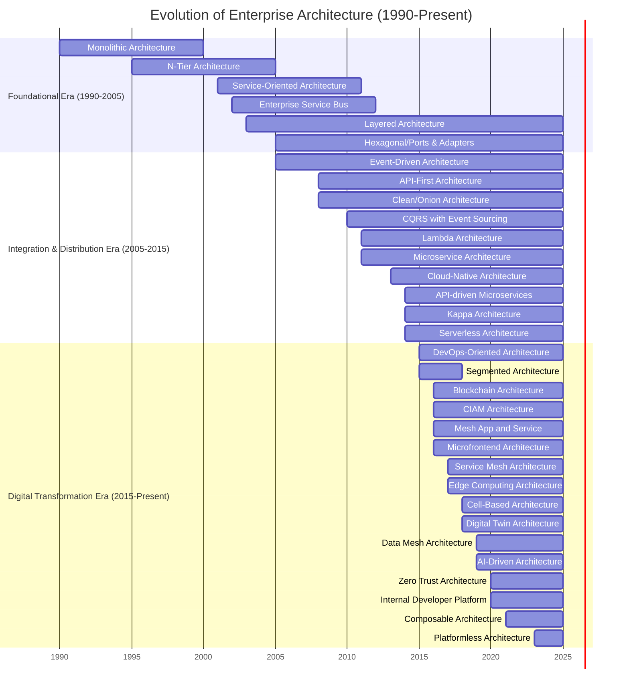
```mermaid
gantt
    title Evolution of Enterprise Architecture (1990-Present)
    dateFormat YYYY
    axisFormat %Y
    
    section Foundational Era (1990-2005)
    Monolithic Architecture       :1990, 10y
    N-Tier Architecture           :1995, 10y
    Service-Oriented Architecture :2001, 10y
    Enterprise Service Bus        :2002, 10y
    Layered Architecture          :2003, 22y
    Hexagonal/Ports & Adapters    :2005, 20y
    
    section Integration & Distribution Era (2005-2015)
    Event-Driven Architecture     :2005, 20y
    API-First Architecture        :2008, 17y
    Clean/Onion Architecture      :2008, 17y
    CQRS with Event Sourcing      :2010, 15y
    Lambda Architecture           :2011, 14y
    Microservice Architecture     :2011, 14y
    Cloud-Native Architecture     :2013, 12y
    API-driven Microservices      :2014, 11y
    Kappa Architecture            :2014, 11y
    Serverless Architecture       :2014, 11y
    
    section Digital Transformation Era (2015-Present)
    DevOps-Oriented Architecture   :2015, 10y
    Segmented Architecture         :2015, 3y
    Blockchain Architecture        :2016, 9y
    CIAM Architecture              :2016, 9y
    Mesh App and Service           :2016, 9y
    Microfrontend Architecture     :2016, 9y
    Service Mesh Architecture      :2017, 8y
    Edge Computing Architecture    :2017, 8y
    Cell-Based Architecture        :2018, 7y
    Digital Twin Architecture      :2018, 7y
    Data Mesh Architecture         :2019, 6y
    AI-Driven Architecture         :2019, 6y
    Zero Trust Architecture        :2020, 5y
    Internal Developer Platform    :2020, 5y
    Composable Architecture        :2021, 4y
    Platformless Architecture      :2023, 2y
```

---

## Architectural Evolution: Key Transitions

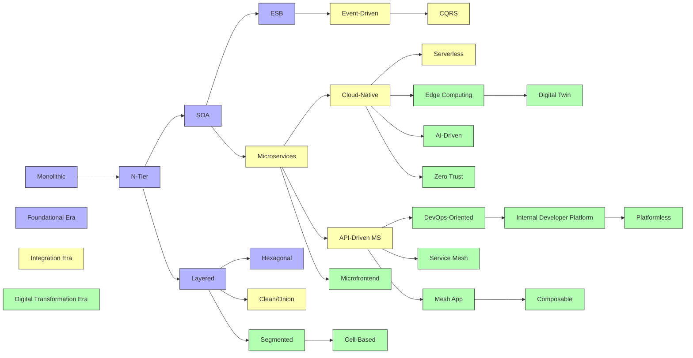
```mermaid
flowchart LR
    classDef foundation fill:#b3b3ff,stroke:#333,stroke-width:1px
    classDef integration fill:#ffffb3,stroke:#333,stroke-width:1px
    classDef digital fill:#b3ffb3,stroke:#333,stroke-width:1px

    %% Foundational Era
    M[Monolithic]:::foundation --> N[N-Tier]:::foundation
    N --> S[SOA]:::foundation
    S --> E[ESB]:::foundation
    N --> L[Layered]:::foundation
    L --> H[Hexagonal]:::foundation

    %% Integration Era
    E --> ED[Event-Driven]:::integration
    S --> MS[Microservices]:::integration
    L --> C[Clean/Onion]:::integration
    ED --> CQ[CQRS]:::integration
    MS --> CN[Cloud-Native]:::integration
    MS --> AP[API-Driven MS]:::integration
    CN --> SL[Serverless]:::integration

    %% Digital Transformation Era
    AP --> DO[DevOps-Oriented]:::digital
    L --> SG[Segmented]:::digital
    SG --> CB[Cell-Based]:::digital
    AP --> SM[Service Mesh]:::digital
    CN --> EC[Edge Computing]:::digital
    MS --> MF[Microfrontend]:::digital
    AP --> MA[Mesh App]:::digital
    EC --> DT[Digital Twin]:::digital
    CN --> AI[AI-Driven]:::digital
    CN --> ZT[Zero Trust]:::digital
    DO --> ID[Internal Developer Platform]:::digital
    MA --> CO[Composable]:::digital
    ID --> PL[Platformless]:::digital
    
    %% Legend
    L1[Foundational Era]:::foundation
    L2[Integration Era]:::integration
    L3[Digital Transformation Era]:::digital
```

---

## The Three Eras of Enterprise Architecture

Enterprise architecture evolution can be viewed through three distinctive eras:

1. **Foundational Era (1990s-2005)**: Characterized by the transition from monolithic applications to more structured approaches with clear separation of concerns. This era established the fundamental patterns that would influence all subsequent architectural thinking.

2. **Integration & Distribution Era (2005-2015)**: Marked by the rise of service orientation, APIs, and the initial decomposition of systems into smaller components. This era focused on enabling integration across increasingly diverse technology landscapes.

3. **Digital Transformation Era (2015-Present)**: Defined by cloud-native thinking, extreme distribution, and the embedding of intelligence throughout systems. This era emphasizes speed, flexibility, and customer experience as primary architectural drivers.

---

## Foundational Era (1990s-2005)

### Monolithic Architecture (1990s-2000s)

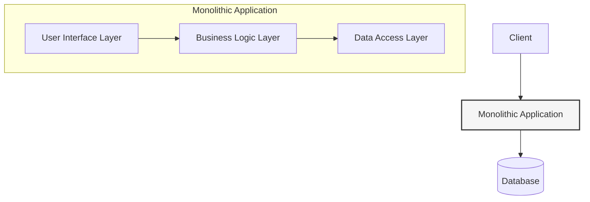
```mermaid
flowchart TD
    Client[Client] --> App[Monolithic Application]
    subgraph "Monolithic Application"
    UI[User Interface Layer] --> BL[Business Logic Layer]
    BL --> DAL[Data Access Layer]
    end
    App --> DB[(Database)]
    style App fill:#f5f5f5,stroke:#333,stroke-width:2px
```

**Overview:**  
Monolithic architecture represents the earliest common approach to enterprise applications. All components are interconnected and interdependent, deployed as a single unit where every function operates within the same process space.

**Key Characteristics:**
- Single deployment unit containing all functionality
- Shared memory and resources
- Tightly coupled components
- Single technology stack and language
- Centralized data storage

**Advantages & Challenges:**

| Advantages | Challenges |
|------------|------------|
| Simpler initial development | Limited scalability (must scale entire application) |
| Lower complexity for small applications | Technology lock-in |
| Straightforward deployment and testing | Difficult to maintain as size increases |
| Efficient component interaction | Impedes parallel development by large teams |
| Clear development workflow | Lower resilience (single point of failure) |

**Historical Context:**  
The monolithic approach dominated enterprise computing through the 1990s when most applications were designed for predictable user bases and deployment environments. Client-server applications and early web applications typically followed this pattern, which matched the organizational structures and technology capabilities of the time.

---

### N-Tier Architecture (Late 1990s-2000s)

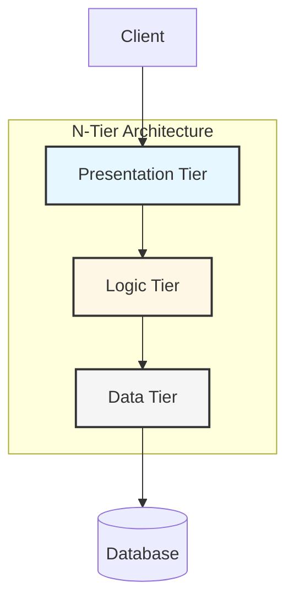
```mermaid
flowchart TD
    Client[Client] --> P[Presentation Tier]
    subgraph "N-Tier Architecture"
    P[Presentation Tier] --> L[Logic Tier]
    L --> D[Data Tier]
    end
    D --> DB[(Database)]
    style P fill:#e6f7ff,stroke:#333,stroke-width:2px
    style L fill:#fff7e6,stroke:#333,stroke-width:2px
    style D fill:#f5f5f5,stroke:#333,stroke-width:2px
```

**Overview:**  
N-tier architecture evolved from monolithic systems by introducing logical and physical separation between different application functions. Most commonly implemented as a three-tier model (presentation, application logic, and data), this pattern represented the first major step toward component-based thinking in enterprise systems.

**Key Characteristics:**
- Logical separation of presentation, business logic, and data access
- Components organized by technical function rather than business capability
- Communication occurs through well-defined interfaces between tiers
- Often deployed on separate physical infrastructure
- Each tier can scale independently (to some degree)

**Advantages & Challenges:**

| Advantages | Challenges |
|------------|------------|
| Improved maintainability through separation of concerns | Still relatively tightly coupled within each tier |
| Enhanced security by isolating data access | Complex deployment and environment management |
| Better scalability than monolithic systems | Performance overhead from inter-tier communication |
| Enables specialization of development teams | Scaling limited to tier-level granularity |
| Allows for technology diversity between tiers | Can lead to "fat" middle tiers |

**Historical Context:**  
The N-tier approach emerged as organizations faced increasingly complex applications with larger user bases. It aligned with the rise of web applications and early application servers in the late 1990s, providing a model that supported growing development teams and more sophisticated business requirements.

---

### Service-Oriented Architecture (SOA) (2001-2010)

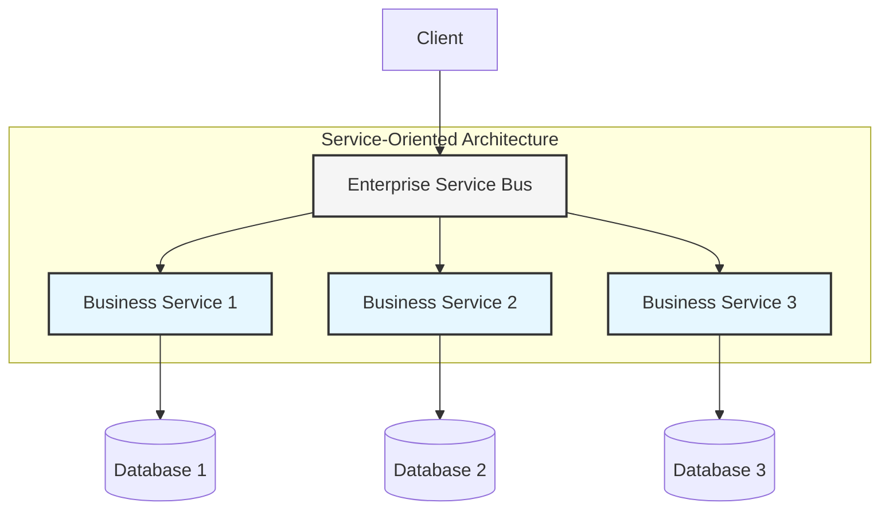
```mermaid
flowchart TD
    Client[Client] --> ESB[Enterprise Service Bus]
    subgraph "Service-Oriented Architecture"
    ESB[Enterprise Service Bus] --> S1[Business Service 1]
    ESB --> S2[Business Service 2]
    ESB --> S3[Business Service 3]
    end
    S1 --> DB1[(Database 1)]
    S2 --> DB2[(Database 2)]
    S3 --> DB3[(Database 3)]
    style ESB fill:#f5f5f5,stroke:#333,stroke-width:2px
    style S1 fill:#e6f7ff,stroke:#333,stroke-width:2px
    style S2 fill:#e6f7ff,stroke:#333,stroke-width:2px
    style S3 fill:#e6f7ff,stroke:#333,stroke-width:2px
```

**Overview:**  
Service-Oriented Architecture represented a significant paradigm shift by organizing software components as loosely coupled services communicating through well-defined interfaces. SOA aimed to promote reuse, interoperability, and business alignment through service contracts and standardized communication protocols.

**Key Characteristics:**
- Business capabilities exposed as autonomous services
- Service contracts define interfaces and behaviors
- Enterprise service bus for mediation and orchestration
- Protocol standardization (often SOAP/XML)
- Service registry and discovery mechanisms
- Focus on reuse across business domains

**Advantages & Challenges:**

| Advantages | Challenges |
|------------|------------|
| Business-aligned modularity | Complex governance requirements |
| Improved interoperability between diverse systems | Performance overhead from XML processing |
| Service reuse across multiple applications | Difficult to implement consistently |
| Ability to modernize systems incrementally | Expensive middleware infrastructure |
| Better alignment with business processes | Often led to "big SOA" with heavy centralization |

**Historical Context:**  
SOA emerged during a period of significant business application consolidation and the rise of enterprise resource planning (ERP) systems. Organizations struggled with siloed systems and the first wave of internet-driven business transformation, making integration a strategic priority. SOA provided a framework for addressing these challenges through standardized service interfaces.

---

### Enterprise Service Bus (ESB) (2002-2012)

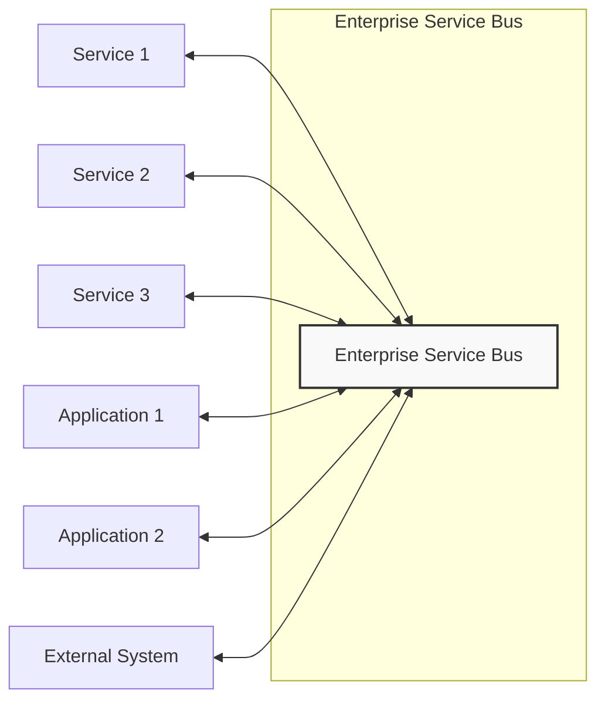
```mermaid
flowchart LR
    subgraph "Enterprise Service Bus"
    ESB[Enterprise Service Bus]
    end
    S1[Service 1] <--> ESB
    S2[Service 2] <--> ESB
    S3[Service 3] <--> ESB
    APP1[Application 1] <--> ESB
    APP2[Application 2] <--> ESB
    EXT[External System] <--> ESB
    style ESB fill:#f9f9f9,stroke:#333,stroke-width:2px
```

**Overview:**  
The Enterprise Service Bus pattern emerged as an implementation approach for SOA, providing a centralized communication backbone for enterprise integration. ESBs handled message routing, transformation, protocol conversion, and orchestration, enabling diverse systems to communicate while reducing point-to-point integrations.

**Key Characteristics:**
- Centralized message routing and transformation
- Protocol and format translation
- Service orchestration and choreography
- Message enhancement and enrichment
- Policy-based routing and mediation
- Quality of service management

**Advantages & Challenges:**

| Advantages | Challenges |
|------------|------------|
| Reduced integration complexity | Created a central bottleneck and dependency |
| Centralized monitoring and management | Often became "integration middleware" rather than true ESB |
| Improved service abstraction | Expensive license and maintenance costs |
| Enhanced message delivery reliability | Required specialized skills and knowledge |
| Protocol independence for service consumers | Introduced performance overhead |

**Historical Context:**  
ESBs gained prominence as organizations implemented SOA and faced challenges with diverse system integration. The rapid growth of e-commerce and B2B integration created demand for robust message routing and transformation capabilities. ESBs promised to simplify these integration challenges through a centralized infrastructure approach.

---

### Layered Architecture (Early 2000s-Present)

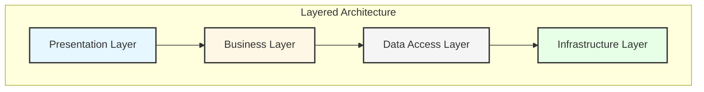
```mermaid
flowchart TD
    subgraph "Layered Architecture"
    P[Presentation Layer] --> B[Business Layer]
    B --> D[Data Access Layer]
    D --> I[Infrastructure Layer]
    end
    style P fill:#e6f7ff,stroke:#333,stroke-width:2px
    style B fill:#fff7e6,stroke:#333,stroke-width:2px
    style D fill:#f5f5f5,stroke:#333,stroke-width:2px
    style I fill:#e6ffe6,stroke:#333,stroke-width:2px
```

**Overview:**  
Layered architecture organizes components in horizontal layers (presentation, business logic, data access) where each layer serves the one above it. This pattern provides clear separation of concerns and continues to influence many other architectural styles, including microservices implementations.

**Key Characteristics:**
- Components organized in horizontal layers
- Each layer has a specific responsibility
- Layers communicate through well-defined interfaces
- Dependencies flow downward (upper layers depend on lower layers)
- Encapsulation of implementation details within layers

**Advantages & Challenges:**

| Advantages | Challenges |
|------------|------------|
| Clear separation of concerns | Can lead to unnecessary coupling across business domains |
| Improved maintainability and testability | May reduce performance due to inter-layer communication |
| Support for different development teams per layer | Tends toward monolithic deployment models |
| Ability to replace layers with minimal impact | Often results in "lasagna code" with too many layers |
| Familiar model that aligns with traditional development | Can impede business agility when changes cross multiple layers |

**Historical Context:**  
Layered architecture emerged as software engineering principles matured and organizations sought more structured approaches to application development. It provided a way to organize growing codebases and development teams, particularly as object-oriented programming became the dominant paradigm.

---

### Hexagonal/Ports and Adapters Architecture (2005-Present)

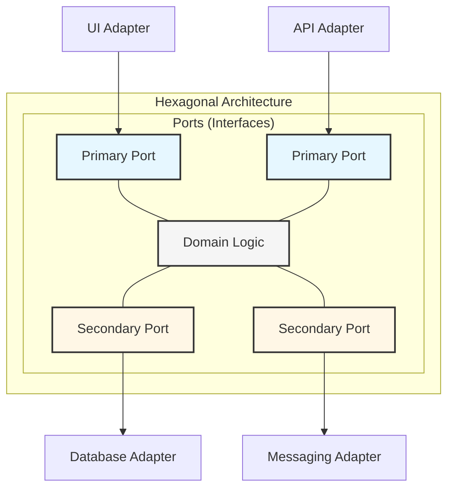
```mermaid
flowchart TD
    subgraph "Hexagonal Architecture"
    direction TB
    CORE[Domain Logic]
    
    subgraph "Ports (Interfaces)"
    P1[Primary Port] --- CORE
    P2[Primary Port] --- CORE
    CORE --- S1[Secondary Port]
    CORE --- S2[Secondary Port]
    end
    
    end
    
    UI[UI Adapter] --> P1
    API[API Adapter] --> P2
    S1 --> DB[Database Adapter]
    S2 --> MSG[Messaging Adapter]
    
    style CORE fill:#f5f5f5,stroke:#333,stroke-width:2px
    style P1 fill:#e6f7ff,stroke:#333,stroke-width:2px
    style P2 fill:#e6f7ff,stroke:#333,stroke-width:2px
    style S1 fill:#fff7e6,stroke:#333,stroke-width:2px
    style S2 fill:#fff7e6,stroke:#333,stroke-width:2px
```

**Overview:**  
Introduced by Alistair Cockburn, Hexagonal Architecture (also known as Ports and Adapters) isolates the core business logic from external concerns by defining "ports" (interfaces) and "adapters" (implementations). This approach enables applications to be driven by users, programs, automated tests, or batch scripts, and allows core business logic to be developed and tested in isolation from infrastructure concerns.

**Key Characteristics:**
- Core business logic at the center
- "Ports" define interfaces for external interaction
- "Adapters" implement ports for specific technologies
- Inside-out dependency management
- Technology-agnostic core domain
- Outside dependencies can be easily swapped

**Advantages & Challenges:**

| Advantages | Challenges |
|------------|------------|
| Highly testable architecture | Requires disciplined design approach |
| Protection of domain logic from external changes | Can introduce additional abstraction complexity |
| Improved maintainability and flexibility | May seem over-engineered for simple applications |
| Support for test-driven development | Learning curve for development teams |
| Easier technology migrations | Potential performance overhead from abstractions |

**Historical Context:**  
Hexagonal Architecture emerged as organizations struggled with tightly coupled systems that were difficult to test and maintain. The growing influence of test-driven development and domain-driven design created demand for architectural patterns that isolated business logic from infrastructure concerns.

---

## Integration & Distribution Era (2005-2015)

### Event-Driven Architecture (2003-Present)

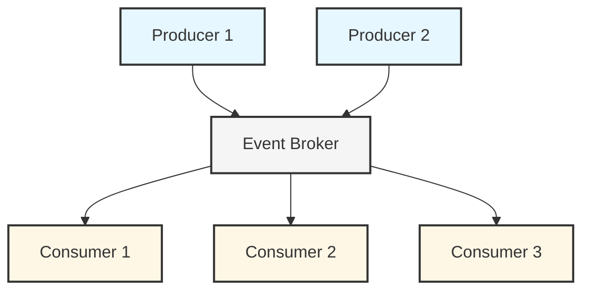
```mermaid
flowchart TD
    P1[Producer 1] --> EB[Event Broker]
    P2[Producer 2] --> EB
    EB --> C1[Consumer 1]
    EB --> C2[Consumer 2]
    EB --> C3[Consumer 3]
    style EB fill:#f5f5f5,stroke:#333,stroke-width:2px
    style P1 fill:#e6f7ff,stroke:#333,stroke-width:2px
    style P2 fill:#e6f7ff,stroke:#333,stroke-width:2px
    style C1 fill:#fff7e6,stroke:#333,stroke-width:2px
    style C2 fill:#fff7e6,stroke:#333,stroke-width:2px
    style C3 fill:#fff7e6,stroke:#333,stroke-width:2px
```

**Overview:**  
Event-Driven Architecture (EDA) focuses on producing, detecting, and reacting to events. This pattern decouples event producers from consumers, enabling asynchronous communication and real-time responsiveness. Events represent changes in state and provide the foundation for reactive systems.

**Key Characteristics:**
- Events as first-class architectural elements
- Loose coupling between producers and consumers
- Asynchronous communication model
- Event brokers or buses for distribution
- Publish-subscribe interaction patterns
- Event sourcing and event stores

**Advantages & Challenges:**

| Advantages | Challenges |
|------------|------------|
| Near real-time response to business events | Eventual consistency complexities |
| Improved scalability through decoupling | Difficult debugging and tracing |
| Enhanced system resilience | Event schema management |
| Support for complex event processing | Potential message delivery issues |
| Better alignment with business activities | Increased operational complexity |

**Historical Context:**  
Event-Driven Architecture gained prominence as digital transformation initiatives required more responsive systems. The rise of e-commerce, online banking, and digital customer interactions created demand for architectures that could process events in real-time and provide responsive user experiences.

---

### API-First Architecture (2008-Present)

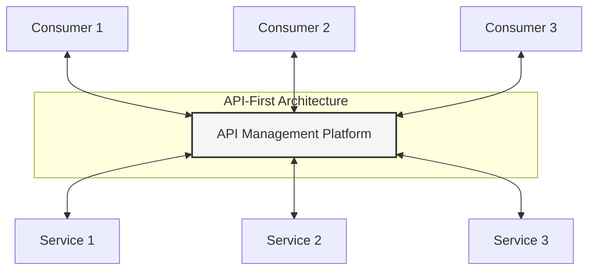
```mermaid
flowchart TD
    subgraph "API-First Architecture"
    APIM[API Management Platform]
    end
    C1[Consumer 1] <--> APIM
    C2[Consumer 2] <--> APIM
    C3[Consumer 3] <--> APIM
    APIM <--> S1[Service 1]
    APIM <--> S2[Service 2]
    APIM <--> S3[Service 3]
    style APIM fill:#f5f5f5,stroke:#333,stroke-width:2px
```

**Overview:**  
API-First Architecture prioritizes well-designed APIs as the foundation for system interactions. This approach views APIs as products and emphasizes their role in enabling integration, developer experience, and business capability exposure.

**Key Characteristics:**
- APIs designed before implementation
- Contracts define interface behaviors
- Consistent patterns across all APIs
- Developer experience as a design priority
- APIs as products with versioning and lifecycle
- API management for governance and analytics

**Advantages & Challenges:**

| Advantages | Challenges |
|------------|------------|
| Improved developer productivity | Risk of premature abstraction |
| Better support for multiple channels and clients | Potential performance overhead |
| Enablement of third-party ecosystems | API versioning complexities |
| Cleaner separation between frontend and backend | Requires strong governance |
| Foundation for new business models | May increase initial development time |

**Historical Context:**  
API-First Architecture emerged alongside the explosion of mobile applications and the growing popularity of software-as-a-service (SaaS) models. Organizations needed consistent ways to expose capabilities across multiple channels and integrate with partner ecosystems, driving the shift toward API-centric thinking.

---

### Clean/Onion Architecture (2008-Present)

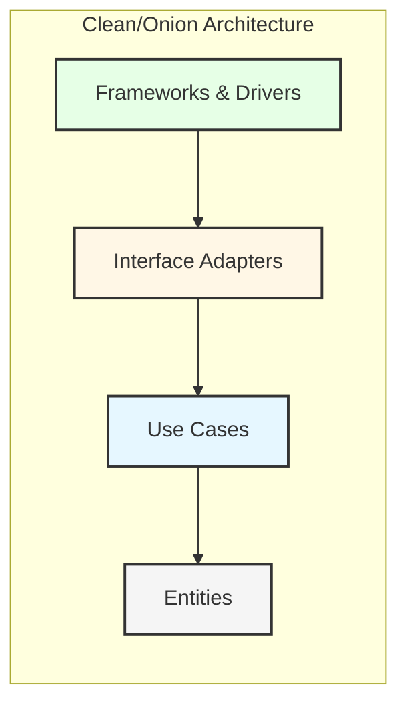
```mermaid
flowchart TD
    subgraph "Clean/Onion Architecture"
    direction TB
    E[Entities] 
    UC[Use Cases] 
    I[Interface Adapters]
    F[Frameworks & Drivers]
    
    F --> I
    I --> UC
    UC --> E
    end
    
    style E fill:#f5f5f5,stroke:#333,stroke-width:2px
    style UC fill:#e6f7ff,stroke:#333,stroke-width:2px
    style I fill:#fff7e6,stroke:#333,stroke-width:2px
    style F fill:#e6ffe6,stroke:#333,stroke-width:2px
```

**Overview:**  
Proposed by Robert C. Martin, Clean Architecture emphasizes separation of concerns through concentric layers that represent different levels of abstraction. The core contains business entities and use cases, surrounded by layers of interfaces and frameworks. This pattern enforces the dependency rule: inner layers know nothing about outer layers.

**Key Characteristics:**
- Concentric layering with domain at the center
- Inward-facing dependencies only
- Interfaces at layer boundaries
- Technology details isolated to outer layers
- Domain model independent of UI, database, frameworks
- Use cases as primary organizing structure

**Advantages & Challenges:**

| Advantages | Challenges |
|------------|------------|
| Highly testable domain logic | Complex initial setup |
| Framework and technology independence | Learning curve for development teams |
| Improved maintainability and flexibility | Can be over-engineered for simple applications |
| Support for domain-driven design principles | Risk of abstraction overload |
| Protection from technical debt | Potential performance implications |

**Historical Context:**  
Clean Architecture emerged as organizations sought ways to manage complexity in large-scale applications and protect business logic from technological churn. It built upon earlier patterns like Hexagonal Architecture while providing more structured guidance on layer organization and dependency management.

---

### CQRS with Event Sourcing (2010-Present)

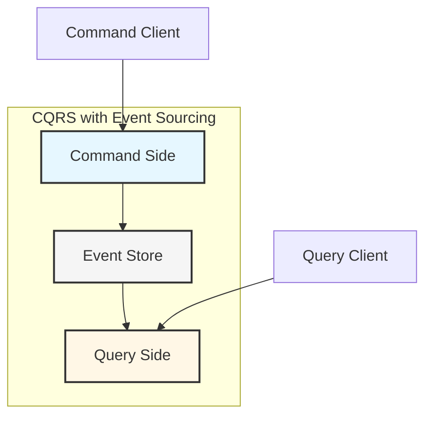
```mermaid
flowchart TD
    subgraph "CQRS with Event Sourcing"
    C[Command Side] --> ES[Event Store]
    ES --> Q[Query Side]
    end
    
    Client1[Command Client] --> C
    Client2[Query Client] --> Q
    
    style C fill:#e6f7ff,stroke:#333,stroke-width:2px
    style ES fill:#f5f5f5,stroke:#333,stroke-width:2px
    style Q fill:#fff7e6,stroke:#333,stroke-width:2px
```

**Overview:**  
Command Query Responsibility Segregation (CQRS) separates read and update operations for data stores, often combined with Event Sourcing, where changes to application state are stored as a sequence of events. This pattern is particularly valuable for complex domains with high performance requirements.

**Key Characteristics:**
- Separate models for reads (queries) and writes (commands)
- Optimized read models for specific use cases
- Events as the source of truth for system state
- Event store for durable event persistence
- State reconstruction from event sequences
- Eventual consistency between read and write models

**Advantages & Challenges:**

| Advantages | Challenges |
|------------|------------|
| Optimized performance for read-heavy systems | Significant architectural complexity |
| Improved scalability through targeted optimization | Eventual consistency management |
| Complete audit history of all state changes | Learning curve for development teams |
| Support for complex business rules | Operational overhead for event store |
| Better alignment with domain-driven design | Complexity in debugging and troubleshooting |

**Historical Context:**  
CQRS and Event Sourcing gained popularity as organizations faced increasingly complex business domains and demanding performance requirements. The rise of sophisticated e-commerce platforms, financial systems, and real-time analytics created use cases where traditional CRUD models were insufficient.

---

### Lambda Architecture (2011-Present)

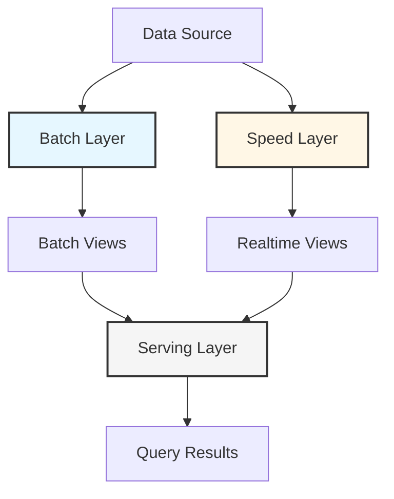
```mermaid
flowchart TD
    Data[Data Source] --> B[Batch Layer]
    Data --> S[Speed Layer]
    B --> BV[Batch Views]
    S --> RV[Realtime Views]
    BV --> SL[Serving Layer]
    RV --> SL
    SL --> Q[Query Results]
    
    style B fill:#e6f7ff,stroke:#333,stroke-width:2px
    style S fill:#fff7e6,stroke:#333,stroke-width:2px
    style SL fill:#f5f5f5,stroke:#333,stroke-width:2px
```

**Overview:**  
Lambda Architecture addresses big data processing by combining batch and stream processing methods. This pattern features three layers: a batch layer for comprehensive, accurate processing of historical data; a speed layer for real-time processing of recent data; and a serving layer that responds to queries by merging results from both layers.

**Key Characteristics:**
- Dual processing paths (batch and streaming)
- Immutable data store as the system of record
- Batch layer for accurate but delayed processing
- Speed layer for near real-time but potentially approximate results
- Serving layer for query handling and result merging
- Pre-computation of views for performance

**Advantages & Challenges:**

| Advantages | Challenges |
|------------|------------|
| Combination of accuracy and timeliness | Complexity of maintaining dual processing paths |
| Resilience to data processing failures | Code duplication between batch and speed layers |
| Support for both historical and real-time analytics | Operational overhead of multiple systems |
| Ability to handle massive data volumes | Complexity in merging results |
| Simplified correction of processing errors | Resource-intensive infrastructure requirements |

**Historical Context:**  
Lambda Architecture emerged as organizations began processing both historical and real-time big data at scale. The rise of social media platforms, IoT devices, and digital advertising created use cases requiring both comprehensive batch analysis and real-time insights from the same data sources.

---

### Microservice Architecture (2011-Present)

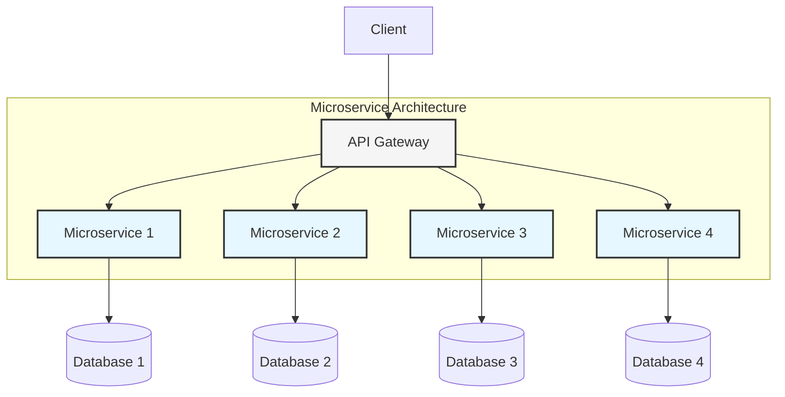
```mermaid
flowchart TD
    Client[Client] --> API[API Gateway]
    subgraph "Microservice Architecture"
    API --> MS1[Microservice 1]
    API --> MS2[Microservice 2]
    API --> MS3[Microservice 3]
    API --> MS4[Microservice 4]
    end
    MS1 --> DB1[(Database 1)]
    MS2 --> DB2[(Database 2)]
    MS3 --> DB3[(Database 3)]
    MS4 --> DB4[(Database 4)]
    style API fill:#f5f5f5,stroke:#333,stroke-width:2px
    style MS1 fill:#e6f7ff,stroke:#333,stroke-width:2px
    style MS2 fill:#e6f7ff,stroke:#333,stroke-width:2px
    style MS3 fill:#e6f7ff,stroke:#333,stroke-width:2px
    style MS4 fill:#e6f7ff,stroke:#333,stroke-width:2px
```

**Overview:**  
Microservices Architecture decomposes applications into small, independently deployable services organized around business capabilities. Each service has its own lifecycle, can be developed and deployed independently, and communicates via lightweight protocols. This pattern gained popularity as companies sought greater agility and scalability.

**Key Characteristics:**
- Small, focused services with single responsibility
- Independent deployment and scaling
- Decentralized data management
- Smart endpoints, dumb pipes
- Design for failure
- Automated deployment pipeline
- Language and technology diversity

**Advantages & Challenges:**

| Advantages | Challenges |
|------------|------------|
| Enhanced development velocity | Distributed system complexity |
| Improved organizational alignment | Operational overhead |
| Independent scaling of components | Inter-service communication challenges |
| Technology flexibility | Data consistency issues |
| Better fault isolation | Monitoring and debugging complexity |
| Support for continuous delivery | Transaction management |

**Historical Context:**  
Microservices emerged as organizations like Netflix, Amazon, and Spotify shared their experiences rebuilding monolithic applications for cloud environments. The rise of DevOps practices, containerization technologies, and cloud platforms created an environment where microservices could thrive at scale.

---

### Cloud-Native Architecture (2013-Present)

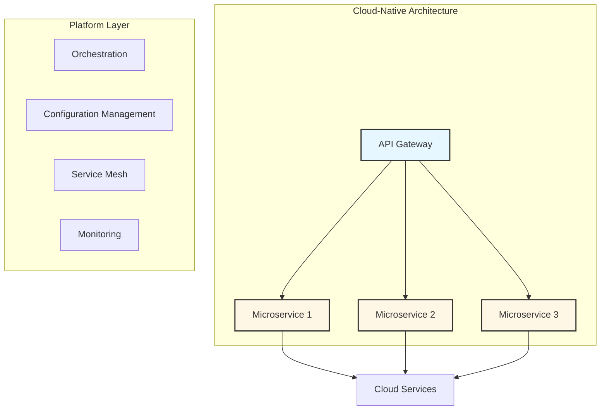
```mermaid
flowchart TD
    subgraph "Cloud-Native Architecture"
    API[API Gateway] --> MS1[Microservice 1]
    API --> MS2[Microservice 2]
    API --> MS3[Microservice 3]
    end
    
    MS1 --> CS1[Cloud Services]
    MS2 --> CS1
    MS3 --> CS1
    
    subgraph "Platform Layer"
    O[Orchestration]
    CM[Configuration Management]
    SM[Service Mesh]
    M[Monitoring]
    end
    
    style API fill:#e6f7ff,stroke:#333,stroke-width:2px
    style MS1 fill:#fff7e6,stroke:#333,stroke-width:2px
    style MS2 fill:#fff7e6,stroke:#333,stroke-width:2px
    style MS3 fill:#fff7e6,stroke:#333,stroke-width:2px
```

**Overview:**  
Cloud-Native Architecture leverages cloud computing models and technologies to create resilient, scalable applications optimized for cloud environments. This approach embraces containerization, orchestration, microservices, and DevOps practices to deliver highly available systems with automated operations.

**Key Characteristics:**
- Designed for cloud deployment from the start
- Containerization for consistent environments
- Orchestration for automated management
- Microservices for modular functionality
- Immutable infrastructure
- API-driven automation
- Declarative configuration

**Advantages & Challenges:**

| Advantages | Challenges |
|------------|------------|
| Optimized resource utilization | Complexity of distributed systems |
| Improved resilience and fault tolerance | Requires organizational transformation |
| Rapid scaling capabilities | Security challenges in shared environments |
| Reduced operational overhead | Skills gap for many organizations |
| Support for continuous deployment | Potential vendor lock-in |
| Built-in elasticity | Observability challenges |

**Historical Context:**  
Cloud-Native Architecture gained momentum as organizations moved beyond "lift and shift" cloud migrations to fully embrace cloud capabilities. The maturation of container technologies, orchestration platforms like Kubernetes, and cloud service models created an environment where applications could be built specifically for cloud deployment.

---

### API-driven Microservice Architecture (2014-Present)

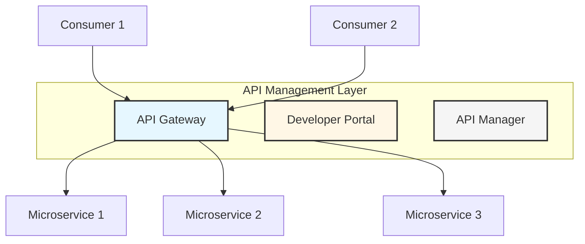
```mermaid
flowchart TD
    subgraph "API Management Layer"
    AG[API Gateway]
    DEV[Developer Portal]
    AM[API Manager]
    end
    
    C1[Consumer 1] --> AG
    C2[Consumer 2] --> AG
    
    AG --> MS1[Microservice 1]
    AG --> MS2[Microservice 2]
    AG --> MS3[Microservice 3]
    
    style AG fill:#e6f7ff,stroke:#333,stroke-width:2px
    style DEV fill:#fff7e6,stroke:#333,stroke-width:2px
    style AM fill:#f5f5f5,stroke:#333,stroke-width:2px
```

**Overview:**  
API-driven Microservice Architecture combines API management with microservices principles, using API gateways to manage, secure, and monitor microservice interactions. This pattern addresses many challenges of pure microservices implementations while maintaining their benefits.

**Key Characteristics:**
- API gateway as entry point for external consumers
- API management for security, throttling, and monitoring
- Standardized interface patterns
- Controlled exposure of microservices
- API lifecycle management
- Developer portal for documentation and onboarding

**Advantages & Challenges:**

| Advantages | Challenges |
|------------|------------|
| Simplified client integration | Potential gateway bottleneck |
| Improved security and governance | Additional complexity layer |
| Better developer experience | Risk of creating a monolithic gateway |
| Consistent monitoring and analytics | Performance overhead |
| Managed service evolution | Gateway resilience requirements |
| Support for monetization | Balancing centralization with microservice autonomy |

**Historical Context:**  
API-driven Microservice Architecture emerged as organizations implementing microservices faced challenges with service discovery, security, and client integration. The maturation of API management platforms and the growing importance of API ecosystems created demand for approaches that combined microservices flexibility with API governance.

---

### Kappa Architecture (2014-Present)

```mermaid
flowchart LR
    Data[Data Source] --> S[Stream Processing]
    S --> SV[Stream Views]
    SV --> Q[Query Results]
    
    style S fill:#e6f7ff,stroke:#333,stroke-width:2px
    style SV fill:#fff7e6,stroke:#333,stroke-width:2px
```

**Overview:**  
Kappa Architecture simplifies big data processing by using a single stream processing system for both real-time and historical data analysis, eliminating the need for separate batch processing. This streamlined approach reduces complexity and maintenance costs compared to Lambda Architecture.

**Key Characteristics:**
- Single processing path (streaming only)
- Immutable log of all raw data
- Stream processing for all data analytics
- Reprocessing capabilities for historical analysis
- Materialized views for query optimization
- Event log as system of record

**Advantages & Challenges:**

| Advantages | Challenges |
|------------|------------|
| Simplified architecture and operations | Stream processing complexity |
| Reduced code duplication | Requires high-performance streaming infrastructure |
| Lower maintenance costs | Potentially higher storage costs |
| Consistent processing semantics | Limited support for complex batch analytics |
| Improved development velocity | May require periodic full reprocessing |
| More straightforward debugging | Higher learning curve for stream processing |

**Historical Context:**  
Kappa Architecture emerged as a response to the operational complexity of Lambda Architecture. Advancements in stream processing technologies like Apache Kafka and improvements in processing performance made it feasible to handle both real-time and historical data through a single streaming pipeline.

---

### Serverless Architecture (2014-Present)

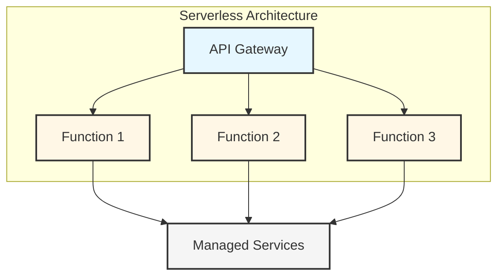
```mermaid
flowchart TD
    subgraph "Serverless Architecture"
    API[API Gateway] --> F1[Function 1]
    API --> F2[Function 2]
    API --> F3[Function 3]
    end
    
    F1 --> MS[Managed Services]
    F2 --> MS
    F3 --> MS
    
    style API fill:#e6f7ff,stroke:#333,stroke-width:2px
    style F1 fill:#fff7e6,stroke:#333,stroke-width:2px
    style F2 fill:#fff7e6,stroke:#333,stroke-width:2px
    style F3 fill:#fff7e6,stroke:#333,stroke-width:2px
    style MS fill:#f5f5f5,stroke:#333,stroke-width:2px
```

**Overview:**  
Serverless Architecture abstracts infrastructure management entirely, allowing developers to focus on functions that execute in response to events. This pattern eliminates the need to provision or manage servers, with the platform handling scaling automatically.

**Key Characteristics:**
- Function as a Service (FaaS) for compute
- Event-driven execution model
- Pay-per-execution pricing
- Automatic scaling from zero to peak
- Stateless function design
- Managed services for persistence and integration
- No infrastructure management

**Advantages & Challenges:**

| Advantages | Challenges |
|------------|------------|
| Reduced operational complexity | Cold start latency |
| Automatic scaling | Limited execution duration |
| Lower costs for variable workloads | Potential vendor lock-in |
| Faster time to market | Complex local development |
| No idle resource costs | Difficult debugging and testing |
| Focus on business logic | State management challenges |

**Historical Context:**  
Serverless Architecture gained prominence following the launch of AWS Lambda in 2014, addressing the desire for further abstraction beyond container-based deployments. Organizations sought to reduce operational overhead and optimize costs for variable workloads, particularly for event-driven use cases and sporadic processing needs.

---

## Digital Transformation Era (2015-Present)

### DevOps-Oriented Architecture (2015-Present)

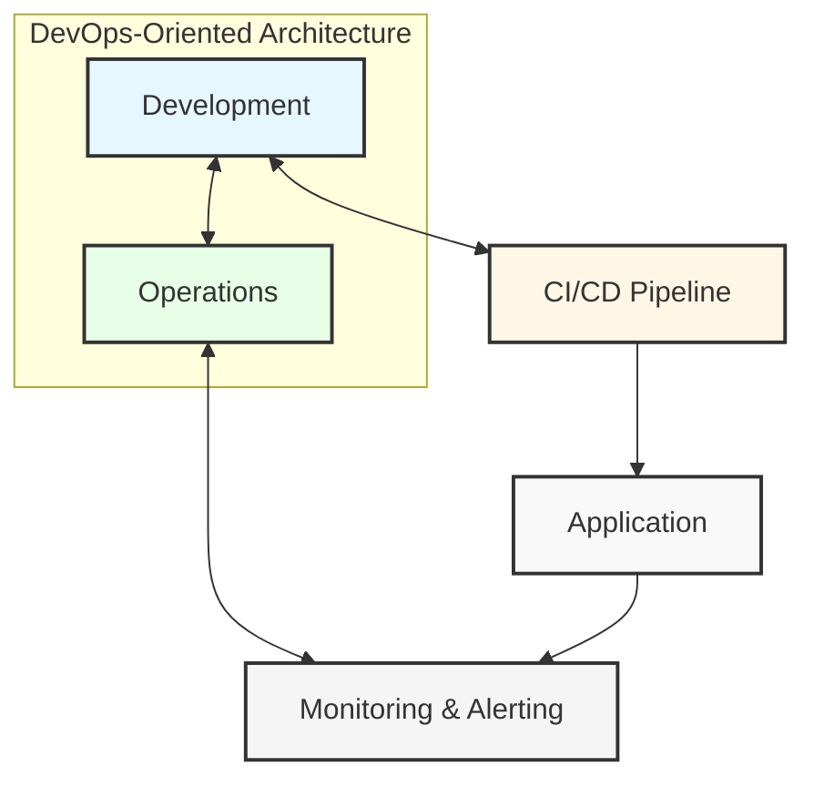
```mermaid
flowchart TD
    subgraph "DevOps-Oriented Architecture"
    D[Development] <--> O[Operations]
    end
    
    D <--> CI[CI/CD Pipeline]
    O <--> M[Monitoring & Alerting]
    
    CI --> A[Application]
    A --> M
    
    style D fill:#e6f7ff,stroke:#333,stroke-width:2px
    style CI fill:#fff7e6,stroke:#333,stroke-width:2px
    style A fill:#f9f9f9,stroke:#333,stroke-width:2px
    style O fill:#e6ffe6,stroke:#333,stroke-width:2px
    style M fill:#f5f5f5,stroke:#333,stroke-width:2px
```

**Overview:**  
DevOps-Oriented Architecture integrates development and operations concerns directly into architectural decisions. This pattern emphasizes automation, observability, self-service infrastructure, and continuous delivery pipelines as first-class architectural components.

**Key Characteristics:**
- Infrastructure as Code (IaC)
- Built-in observability and monitoring
- Automated testing at all levels
- Immutable infrastructure patterns
- Self-service developer platforms
- Deployment pipeline integration
- Feedback loops for operational data

**Advantages & Challenges:**

| Advantages | Challenges |
|------------|------------|
| Faster delivery cycles | Requires cultural transformation |
| Improved production reliability | Significant initial investment |
| Reduced friction between teams | Continuous skill development needs |
| Better alignment with business needs | Security and compliance integration |
| Rapid feedback on changes | Complex toolchain management |
| Consistent environments | Potential overemphasis on tools |

**Historical Context:**  
DevOps-Oriented Architecture emerged as organizations recognized that architectural decisions directly influenced operational capabilities and delivery speed. The growing competitive pressure for faster innovation and the rise of cloud-native technologies created demand for architectures that supported continuous delivery and operational excellence.

---

### Segmented Architecture (2015-2018)

```mermaid
flowchart TD
    subgraph "Segment 1 (Business Domain A)"
    P1[Presentation Layer] --> B1[Business Layer]
    B1 --> D1[Data Layer]
    end
    
    subgraph "Segment 2 (Business Domain B)"
    P2[Presentation Layer] --> B2[Business Layer]
    B2 --> D2[Data Layer]
    end
    
    subgraph "Segment 3 (Business Domain C)"
    P3[Presentation Layer] --> B3[Business Layer]
    B3 --> D3[Data Layer]
    end
    
    style P1 fill:#e6f7ff,stroke:#333,stroke-width:2px
    style B1 fill:#fff7e6,stroke:#333,stroke-width:2px
    style D1 fill:#f5f5f5,stroke:#333,stroke-width:2px
    style P2 fill:#e6f7ff,stroke:#333,stroke-width:2px
    style B2 fill:#fff7e6,stroke:#333,stroke-width:2px
    style D2 fill:#f5f5f5,stroke:#333,stroke-width:2px
    style P3 fill:#e6f7ff,stroke:#333,stroke-width:2px
    style B3 fill:#fff7e6,stroke:#333,stroke-width:2px
    style D3 fill:#f5f5f5,stroke:#333,stroke-width:2px
```

**Overview:**  
Segmented Architecture divides layered architecture into functional segments based on business capabilities. This pattern created better alignment between technical architecture and business domains while maintaining the benefits of layered organization.

**Key Characteristics:**
- Vertical slicing of horizontal layers
- Business capability-based segmentation
- Clear ownership boundaries
- Controlled inter-segment communication
- Shared infrastructure with logical isolation
- Common governance across segments

**Advantages & Challenges:**

| Advantages | Challenges |
|------------|------------|
| Better business alignment | Complex boundary definition |
| Clearer ownership and accountability | Inter-segment dependencies |
| Improved development team autonomy | Potentially inconsistent approaches |
| Enhanced maintainability | Risk of creating siloed segments |
| Support for differential governance | Governance across segments |
| Transition path from monoliths to microservices | Operational overhead of multiple segments |

**Historical Context:**  
Segmented Architecture gained popularity as organizations sought incremental paths from monolithic and layered architectures toward microservices. It provided a middle ground that improved business alignment and team autonomy without the full complexity of microservices adoption.

---

### Blockchain Architecture (2016-Present)

```mermaid
flowchart TD
    subgraph "Blockchain Architecture"
    N1[Node 1] <--> N2[Node 2]
    N1 <--> N3[Node 3]
    N2 <--> N3
    N2 <--> N4[Node 4]
    N3 <--> N4
    end
    
    A1[Application 1] --> N1
    A2[Application 2] --> N2
    A3[Application 3] --> N3
    A4[Application 4] --> N4
    
    style N1 fill:#e6f7ff,stroke:#333,stroke-width:2px
    style N2 fill:#e6f7ff,stroke:#333,stroke-width:2px
    style N3 fill:#e6f7ff,stroke:#333,stroke-width:2px
    style N4 fill:#e6f7ff,stroke:#333,stroke-width:2px
```

**Overview:**  
Blockchain Architecture implements distributed ledger technology with consensus mechanisms to create immutable, verifiable records across multiple participants without requiring central authority. This pattern has gained significant traction in supply chain, finance, healthcare, and identity management.

**Key Characteristics:**
- Distributed ledger across multiple nodes
- Consensus mechanism for validation
- Cryptographic verification of transactions
- Immutable transaction history
- Smart contracts for automated execution
- Decentralized trust model
- Peer-to-peer network topology

**Advantages & Challenges:**

| Advantages | Challenges |
|------------|------------|
| Trustless operation model | Performance limitations |
| Tamper-evident transaction history | Scalability constraints |
| Disintermediation of central authorities | High resource consumption |
| Automated contract execution | Complex governance |
| Transparent and auditable records | Regulatory uncertainty |
| Support for multi-party business processes | Integration with existing systems |

**Historical Context:**  
Blockchain Architecture gained enterprise attention following the success of Bitcoin and Ethereum. Organizations in finance, supply chain, and healthcare began exploring how distributed ledger technology could address trust and transparency challenges in multi-party business processes and regulatory compliance.

---

### Customer Identity and Access Management (CIAM) Architecture (2016-Present)

```mermaid
flowchart TD
    subgraph "CIAM Architecture"
    R[Registration] --> A[Authentication]
    A --> C[Consent Management]
    A --> P[Profile Management]
    end
    
    C1[Consumer 1] --> R
    C2[Consumer 2] --> R
    
    A --> AP[Applications]
    C --> DP[Data Processing]
    P --> CRM[CRM Systems]
    
    style R fill:#e6f7ff,stroke:#333,stroke-width:2px
    style A fill:#fff7e6,stroke:#333,stroke-width:2px
    style C fill:#f5f5f5,stroke:#333,stroke-width:2px
    style P fill:#e6ffe6,stroke:#333,stroke-width:2px
```

**Overview:**  
CIAM Architecture addresses the specific challenges of managing customer identities at scale while delivering seamless experiences. Unlike traditional IAM, this pattern focuses on customer experience, progressive profiling, consent management, and multi-channel support alongside security requirements.

**Key Characteristics:**
- Customer-centric identity lifecycle
- Progressive profile building
- Social identity integration
- Consent and preference management
- Multi-channel identity federation
- Customer analytics integration
- Adaptive authentication
- Privacy-by-design approach

**Advantages & Challenges:**

| Advantages | Challenges |
|------------|------------|
| Enhanced customer experience | Balancing security and user experience |
| Improved conversion rates | Complex regulatory landscape |
| Better regulatory compliance | Privacy requirements management |
| Unified customer view | Integration with marketing systems |
| Support for personalization | Managing social identity providers |
| Reduced fraud risk | Consent lifecycle management |
| Scalability for consumer volumes | Cross-channel identity consistency |

**Historical Context:**  
CIAM Architecture emerged as organizations recognized the strategic value of customer identity data and faced growing regulatory requirements like GDPR. The rise of omnichannel commerce and increasing consumer privacy concerns created demand for specialized approaches to customer identity management beyond traditional workforce IAM.

---

### Mesh App and Service Architecture (MASA) (2016-Present)

```mermaid
flowchart TD
    subgraph "MASA Architecture"
    API[API Layer] <--> MS[Microservices]
    API <--> EDA[Event-driven Services]
    end
    
    C1[Web Client] --> API
    C2[Mobile Client] --> API
    C3[IoT Client] --> API
    
    MS <--> DS[Data Services]
    EDA <--> E[Events]
    
    style API fill:#e6f7ff,stroke:#333,stroke-width:2px
    style MS fill:#fff7e6,stroke:#333,stroke-width:2px
    style EDA fill:#f5f5f5,stroke:#333,stroke-width:2px
```

**Overview:**  
MASA combines aspects of microservices, API-first, cloud-native, and event-driven architectures into a cohesive approach for developing flexible digital solutions. This pattern emphasizes loosely coupled services and APIs, frontend composition, and multichannel delivery.

**Key Characteristics:**
- API-first service design
- Composable frontend architecture
- Multichannel experience delivery
- Event-driven service interaction
- Backend for frontend (BFF) pattern
- API gateway for service access
- Loose coupling throughout the stack

**Advantages & Challenges:**

| Advantages | Challenges |
|------------|------------|
| Flexibility across channels and devices | Complex technical architecture |
| Improved development velocity | Potential frontend duplication |
| Better support for innovation | API lifecycle management complexity |
| Enhanced user experience consistency | Integration of legacy components |
| Support for continuous delivery | Team coordination challenges |
| Incremental modernization path | Security across the mesh |

**Historical Context:**  
MASA emerged as organizations faced increasing pressure to deliver consistent experiences across a proliferating array of channels and devices. The convergence of microservices adoption and multichannel experience requirements created demand for cohesive approaches that addressed both backend services and frontend composition.

---

### Microfrontend Architecture (2016-Present)

```mermaid
flowchart TD
    subgraph "Microfrontend Architecture"
    Shell[Application Shell]
    Shell --> MF1[Microfrontend 1]
    Shell --> MF2[Microfrontend 2]
    Shell --> MF3[Microfrontend 3]
    end
    
    MF1 --> MS1[Microservice 1]
    MF2 --> MS2[Microservice 2]
    MF3 --> MS3[Microservice 3]
    
    style Shell fill:#e6f7ff,stroke:#333,stroke-width:2px
    style MF1 fill:#fff7e6,stroke:#333,stroke-width:2px
    style MF2 fill:#fff7e6,stroke:#333,stroke-width:2px
    style MF3 fill:#fff7e6,stroke:#333,stroke-width:2px
```

**Overview:**  
Microfrontend Architecture extends microservices principles to frontend development, allowing teams to build and deploy UI components independently. This pattern enables organizations to decompose monolithic frontends into smaller, more manageable pieces that can evolve independently.

**Key Characteristics:**
- Independently deployable UI components
- Team-based vertical slicing
- Decentralized frontend governance
- Autonomous frontend development cycles
- Compatibility layer between components
- Shared design system
- Federated deployment model

**Advantages & Challenges:**

| Advantages | Challenges |
|------------|------------|
| Team autonomy for full-stack features | Consistency across components |
| Incremental updates to UI | Performance optimization |
| Independent technology choices | Shared state management |
| Parallel frontend development | Duplicate dependencies |
| Improved alignment with microservices | Integration testing complexity |
| Better scaling for large frontend teams | Operational overhead |

**Historical Context:**  
Microfrontend Architecture emerged as organizations implementing microservices realized that monolithic frontends were creating delivery bottlenecks. The growth of single-page applications and the increasing complexity of web interfaces created demand for approaches that allowed frontend development to scale across multiple teams.

---

### Service Mesh Architecture (2017-Present)

```mermaid
flowchart TD
    subgraph "Service Mesh Architecture"
    direction TB
    subgraph "Control Plane"
    CP[Control Plane]
    end
    
    subgraph "Data Plane"
    S1[Service 1] <--> P1[Proxy]
    S2[Service 2] <--> P2[Proxy]
    S3[Service 3] <--> P3[Proxy]
    end
    
    P1 <--> P2
    P1 <--> P3
    P2 <--> P3
    
    CP --> P1
    CP --> P2
    CP --> P3
    end
    
    style CP fill:#e6f7ff,stroke:#333,stroke-width:2px
    style P1 fill:#fff7e6,stroke:#333,stroke-width:2px
    style P2 fill:#fff7e6,stroke:#333,stroke-width:2px
    style P3 fill:#fff7e6,stroke:#333,stroke-width:2px
    style S1 fill:#f5f5f5,stroke:#333,stroke-width:2px
    style S2 fill:#f5f5f5,stroke:#333,stroke-width:2px
    style S3 fill:#f5f5f5,stroke:#333,stroke-width:2px
```

**Overview:**  
Service Mesh Architecture adds a dedicated infrastructure layer for handling service-to-service communication, typically implemented as proxies alongside each service instance. This pattern provides observability, traffic management, security, and resiliency without requiring changes to service code.

**Key Characteristics:**
- Sidecar proxy with each service instance
- Centralized control plane
- Traffic management capabilities
- Service discovery and load balancing
- Encryption and identity verification
- Circuit breaking and retry logic
- Distributed tracing integration
- Policy enforcement

**Advantages & Challenges:**

| Advantages | Challenges |
|------------|------------|
| Enhanced observability | Additional operational complexity |
| Consistent security implementation | Performance overhead |
| Improved service reliability | Complex debugging |
| Simplified service implementation | Learning curve for development teams |
| Centralized policy management | Resource consumption |
| Support for A/B testing and canary releases | Potential control plane bottleneck |

**Historical Context:**  
Service Mesh Architecture gained popularity as organizations implementing microservices at scale faced challenges with service-to-service communication reliability, security, and observability. The growing complexity of distributed systems and the operational challenges of managing them created demand for approaches that handled cross-cutting networking concerns consistently.

---

### Edge Computing Architecture (2017-Present)

```mermaid
flowchart TD
    subgraph "Edge Computing Architecture"
    E1[Edge Node 1] <--> C[Cloud]
    E2[Edge Node 2] <--> C
    E3[Edge Node 3] <--> C
    end
    
    IoT1[IoT Device 1] --> E1
    IoT2[IoT Device 2] --> E1
    IoT3[IoT Device 3] --> E2
    IoT4[IoT Device 4] --> E3
    
    style E1 fill:#e6f7ff,stroke:#333,stroke-width:2px
    style E2 fill:#e6f7ff,stroke:#333,stroke-width:2px
    style E3 fill:#e6f7ff,stroke:#333,stroke-width:2px
    style C fill:#f5f5f5,stroke:#333,stroke-width:2px
```

**Overview:**  
Edge Computing Architecture distributes processing closer to data sources rather than relying solely on centralized cloud resources. This pattern has become increasingly important with IoT growth, addressing latency, bandwidth, and privacy requirements.

**Key Characteristics:**
- Distributed processing near data sources
- Local data processing and filtering
- Reduced dependency on network connectivity
- Hierarchical data aggregation
- Hybrid cloud-edge deployment
- Location-aware services
- Local autonomy with central coordination

**Advantages & Challenges:**

| Advantages | Challenges |
|------------|------------|
| Reduced latency for time-sensitive operations | Complex distributed management |
| Bandwidth optimization | Limited resources at the edge |
| Enhanced privacy and security | Security across distributed nodes |
| Improved reliability with intermittent connectivity | Synchronization and consistency |
| Support for disconnected operation | Deployment and updates complexity |
| Reduced cloud processing costs | Heterogeneous edge environments |

**Historical Context:**  
Edge Computing Architecture gained prominence with the rapid growth of IoT devices and mobile applications requiring low-latency processing. The limitations of centralized cloud models for time-sensitive use cases and the increasing capabilities of edge devices created demand for architectures that distributed intelligence across the network.

---

### Cell-Based Architecture (2018-Present)

```mermaid
flowchart TD
    subgraph "Cell-Based Architecture"
    subgraph "Cell 1"
    GW1[Cell Gateway] --> MS1[Microservices]
    GW1 --> IS1[Integration Services]
    end
    
    subgraph "Cell 2"
    GW2[Cell Gateway] --> MS2[Microservices]
    GW2 --> IS2[Integration Services]
    end
    
    subgraph "Cell 3"
    GW3[Cell Gateway] --> MS3[Microservices]
    GW3 --> IS3[Integration Services]
    end
    end
    
    C[Client] --> GW1
    C --> GW2
    C --> GW3
    
    style GW1 fill:#e6f7ff,stroke:#333,stroke-width:2px
    style GW2 fill:#e6f7ff,stroke:#333,stroke-width:2px
    style GW3 fill:#e6f7ff,stroke:#333,stroke-width:2px
    style MS1 fill:#fff7e6,stroke:#333,stroke-width:2px
    style MS2 fill:#fff7e6,stroke:#333,stroke-width:2px
    style MS3 fill:#fff7e6,stroke:#333,stroke-width:2px
    style IS1 fill:#f5f5f5,stroke:#333,stroke-width:2px
    style IS2 fill:#f5f5f5,stroke:#333,stroke-width:2px
    style IS3 fill:#f5f5f5,stroke:#333,stroke-width:2px
```

**Overview:**  
Cell-Based Architecture represents a decentralized approach where applications are composed of cells—self-contained units with their own control plane. This pattern addresses limitations of traditional architectures in cloud-native environments by providing better isolation, autonomy, and scalability.

**Key Characteristics:**
- Self-contained, independently deployable cells
- Clear cell boundaries with managed ingress/egress
- Internal cell components invisible externally
- Cell gateway for all external communication
- Independent cell lifecycle management
- Multiple cells compose into solutions
- Autonomous team ownership of cells

**Advantages & Challenges:**

| Advantages | Challenges |
|------------|------------|
| Enhanced isolation and security | Cell granularity decisions |
| Improved team autonomy | Inter-cell communication complexity |
| Better alignment with organizational structure | Potential duplication across cells |
| Simplified dependency management | Gateway performance considerations |
| Support for heterogeneous implementation | Complex initial implementation |
| Clear boundaries for scalability | Cross-cutting concern management |

**Historical Context:**  
Cell-Based Architecture emerged as organizations implementing microservices at scale faced challenges with excessive inter-service dependencies and operational complexity. The need for clearer boundaries and team ownership in large-scale distributed systems created demand for approaches that provided higher-level modularity than individual microservices.

---

### Digital Twin Architecture (2018-Present)

```mermaid
flowchart LR
    subgraph "Physical World"
    PA[Physical Asset]
    end
    
    subgraph "Digital World"
    DT[Digital Twin]
    end
    
    PA <--> S[Sensors/IoT]
    S --> DT
    DT --> A[Analytics]
    DT --> SIM[Simulation]
    DT --> M[Monitoring]
    DT --> C[Control]
    C --> AC[Actuators]
    AC --> PA
    
    style PA fill:#e6f7ff,stroke:#333,stroke-width:2px
    style DT fill:#fff7e6,stroke:#333,stroke-width:2px
    style S fill:#f5f5f5,stroke:#333,stroke-width:2px
    style AC fill:#f5f5f5,stroke:#333,stroke-width:2px
```

**Overview:**  
Digital Twin Architecture creates virtual representations of physical objects or systems that can be used for monitoring, analysis, and simulation. This pattern has gained significant traction in manufacturing, healthcare, and urban planning, enabling real-time insights and predictive capabilities.

**Key Characteristics:**
- Virtual representation of physical entities
- Real-time synchronization with physical world
- Historical data retention for analysis
- Simulation capabilities for prediction
- Bidirectional communication (when applicable)
- Multi-resolution modeling
- Integration with AI/ML for insights

**Advantages & Challenges:**

| Advantages | Challenges |
|------------|------------|
| Enhanced visibility into physical operations | Complex data synchronization |
| Predictive maintenance capabilities | High data volume management |
| Support for simulation and what-if analysis | Accuracy of virtual representation |
| Remote monitoring and management | Integration with legacy systems |
| Improved operational decision-making | Security and privacy concerns |
| Historical performance analysis | Skill requirements for implementation |

**Historical Context:**  
Digital Twin Architecture gained enterprise adoption as IoT capabilities, cloud computing, and AI technologies matured. The convergence of operational technology and information technology created new possibilities for virtual representations that could provide business insights and operational improvements across industries.

---

### Data Mesh Architecture (2019-Present)

```mermaid
flowchart TD
    subgraph "Data Mesh Architecture"
    subgraph "Domain A"
    DA[Domain Data Product A]
    end
    
    subgraph "Domain B"
    DB[Domain Data Product B]
    end
    
    subgraph "Domain C"
    DC[Domain Data Product C]
    end
    
    P[Data Platform]
    G[Federated Governance]
    end
    
    C1[Consumer 1] --> DA
    C2[Consumer 2] --> DB
    C3[Consumer 3] --> DC
    
    DA --> P
    DB --> P
    DC --> P
    
    G --> DA
    G --> DB
    G --> DC
    
    style DA fill:#e6f7ff,stroke:#333,stroke-width:2px
    style DB fill:#e6f7ff,stroke:#333,stroke-width:2px
    style DC fill:#e6f7ff,stroke:#333,stroke-width:2px
    style P fill:#fff7e6,stroke:#333,stroke-width:2px
    style G fill:#f5f5f5,stroke:#333,stroke-width:2px
```

**Overview:**  
Data Mesh Architecture approaches data as a product, organizing it around business domains rather than centralized data lakes or warehouses. This pattern distributes ownership of data to domain teams, making them responsible for providing high-quality, accessible data products to the organization.

**Key Characteristics:**
- Domain-oriented data ownership
- Data as a product mindset
- Self-serve data infrastructure
- Federated computational governance
- Distributed data catalogs
- Domain-specific data models
- Product management approach to data

**Advantages & Challenges:**

| Advantages | Challenges |
|------------|------------|
| Improved data quality and relevance | Complex federated governance |
| Better alignment with business needs | Potential data inconsistency |
| Reduced bottlenecks from central teams | Skill development across domains |
| Enhanced domain expertise in data | Infrastructure standardization |
| Faster time to insight | Cross-domain data integration |
| Support for organizational scaling | Cultural transformation requirements |

**Historical Context:**  
Data Mesh Architecture emerged as organizations faced challenges with centralized data lake approaches and recognized parallels with the evolution from monolithic applications to microservices. The growing strategic importance of data and the limitations of centralized data teams created demand for approaches that distributed data ownership while maintaining governance.

---

### AI-Driven Architecture (2019-Present)

```mermaid
flowchart TD
    subgraph "AI-Driven Architecture"
    DI[Data Ingestion] --> FE[Feature Engineering]
    FE --> ML[ML Models]
    ML --> I[Inference]
    end
    
    DS[Data Sources] --> DI
    I --> A[Applications]
    
    subgraph "ML Ops"
    M[Monitoring]
    T[Training Pipeline]
    G[Governance]
    end
    
    M --> ML
    T --> ML
    G --> ML
    
    style DI fill:#e6f7ff,stroke:#333,stroke-width:2px
    style FE fill:#fff7e6,stroke:#333,stroke-width:2px
    style ML fill:#f5f5f5,stroke:#333,stroke-width:2px
    style I fill:#e6ffe6,stroke:#333,stroke-width:2px
```

**Overview:**  
AI-Driven Architecture treats artificial intelligence components as first-class architectural elements rather than just features within traditional systems. This pattern incorporates machine learning pipelines, continuous training infrastructure, and AI governance mechanisms as fundamental building blocks.

**Key Characteristics:**
- AI capabilities as core components
- Continuous training and deployment pipelines
- Feature stores for model inputs
- Monitoring for model drift and performance
- Explainability and transparency mechanisms
- AI governance and responsible use frameworks
- Integration of human and AI decision-making

**Advantages & Challenges:**

| Advantages | Challenges |
|------------|------------|
| Embedded intelligence throughout systems | Model governance and transparency |
| Improved adaptability to changing conditions | Data quality and bias management |
| Enhanced decision support capabilities | Complex operational requirements |
| Automation of complex tasks | Specialized skill requirements |
| Personalization at scale | Ethical and responsible use considerations |
| Continuous system improvement | Integration with traditional components |

**Historical Context:**  
AI-Driven Architecture gained prominence as artificial intelligence capabilities matured from experimental projects to core business capabilities. The growing strategic importance of AI and the challenges of operationalizing machine learning at scale created demand for architectural approaches that treated AI as a fundamental system component.

---

### Zero Trust Architecture (2020-Present)

```mermaid
flowchart TD
    subgraph "Zero Trust Architecture"
    PEP[Policy Enforcement Points]
    PDP[Policy Decision Point]
    PA[Policy Administrator]
    end
    
    U[User/Device] --> PEP
    PEP <--> PDP
    PDP <--> PA
    
    PEP --> R[Resources]
    
    subgraph "Continuous Verification"
    I[Identity]
    D[Device]
    C[Context]
    end
    
    I --> PDP
    D --> PDP
    C --> PDP
    
    style PEP fill:#e6f7ff,stroke:#333,stroke-width:2px
    style PDP fill:#fff7e6,stroke:#333,stroke-width:2px
    style PA fill:#f5f5f5,stroke:#333,stroke-width:2px
```

**Overview:**  
Zero Trust Architecture eliminates implicit trust within enterprise networks, requiring continuous verification for all users, devices, and resources regardless of location. This security-focused architecture has gained prominence as remote work and cloud adoption have eroded traditional network perimeters.

**Key Characteristics:**
- "Never trust, always verify" principle
- Micro-segmentation of networks
- Least privilege access control
- Continuous authentication and authorization
- Comprehensive monitoring and analytics
- Encryption of all data in transit
- Policy-based access decisions
- Device health verification

**Advantages & Challenges:**

| Advantages | Challenges |
|------------|------------|
| Improved security posture | Implementation complexity |
| Reduced impact of perimeter breaches | Performance overhead |
| Better support for remote work | User experience impacts |
| Enhanced visibility into access patterns | Legacy system integration |
| Reduced lateral movement opportunities | Initial deployment costs |
| Stronger compliance capabilities | Operational complexity |

**Historical Context:**  
Zero Trust Architecture gained widespread adoption as traditional network perimeters dissolved due to cloud adoption, mobile computing, and remote work. High-profile security breaches and the increasing sophistication of threats created urgent demand for security models that assumed compromise and verified every access request.

---

### Internal Developer Platform (IDP) (2020-Present)

```mermaid
flowchart TD
    subgraph "Internal Developer Platform"
    DP[Developer Portal]
    SC[Self-Service Capabilities]
    PL[Platform Layer]
    G[Governance]
    end
    
    D[Developers] --> DP
    DP --> SC
    SC --> PL
    G --> PL
    
    PL --> C[Cloud Infrastructure]
    PL --> T[Tools & Services]
    PL --> E[Environments]
    
    style DP fill:#e6f7ff,stroke:#333,stroke-width:2px
    style SC fill:#fff7e6,stroke:#333,stroke-width:2px
    style PL fill:#f5f5f5,stroke:#333,stroke-width:2px
    style G fill:#e6ffe6,stroke:#333,stroke-width:2px
```

**Overview:**  
Internal Developer Platform architecture focuses on providing self-service capabilities, standardized workflows, and integrated toolchains that empower development teams while maintaining governance. IDPs abstract away infrastructure complexity and streamline the developer experience across the software delivery lifecycle.

**Key Characteristics:**
- Self-service developer portal
- Infrastructure automation
- Integrated CI/CD pipelines
- Environment management
- Standardized application templates
- Centralized observability
- Policy-based governance
- Golden paths for common workflows

**Advantages & Challenges:**

| Advantages | Challenges |
|------------|------------|
| Improved developer productivity | Initial platform development investment |
| Standardized delivery processes | Balancing standardization and flexibility |
| Reduced cognitive load for developers | Platform team staffing requirements |
| Better governance and compliance | Addressing diverse team needs |
| Faster onboarding for new team members | Managing platform evolution |
| Consistency across development teams | Avoiding platform over-complexity |

**Historical Context:**  
Internal Developer Platforms gained prominence as organizations implementing cloud-native architectures and DevOps practices faced challenges with consistency, onboarding, and cognitive load. The growing complexity of modern development environments and the strategic importance of developer experience created demand for approaches that provided a balanced combination of autonomy and governance.

---

### Composable Architecture (2021-Present)

```mermaid
flowchart TD
    subgraph "Composable Architecture"
    PC[Packaged Capabilities]
    AI[API Integration Layer]
    CO[Composition Layer]
    end
    
    PC --> AI
    AI --> CO
    
    E1[Experience 1] --> CO
    E2[Experience 2] --> CO
    E3[Experience 3] --> CO
    
    style PC fill:#e6f7ff,stroke:#333,stroke-width:2px
    style AI fill:#fff7e6,stroke:#333,stroke-width:2px
    style CO fill:#f5f5f5,stroke:#333,stroke-width:2px
```

**Overview:**  
Composable Architecture treats business capabilities as modular, interchangeable building blocks that can be assembled and reassembled to rapidly create new applications and experiences. This pattern emphasizes packaged business capabilities (PBCs) and a "composable enterprise" approach to achieving business agility.

**Key Characteristics:**
- Business capabilities as composable modules
- Experience composition from capabilities
- API-first integration between components
- Event-driven coordination
- Decentralized governance model
- Multiple experience channels from same capabilities
- Business-oriented capability definition

**Advantages & Challenges:**

| Advantages | Challenges |
|------------|------------|
| Rapid reconfiguration for business needs | Complex capability definition |
| Improved reuse of capabilities | Governance across composable elements |
| Better alignment with business requirements | Integration consistency |
| Support for complex, unique processes | Experience design across components |
| Enhanced organizational agility | Performance optimization |
| Reduced time to market for new experiences | Organizational alignment requirements |

**Historical Context:**  
Composable Architecture emerged as organizations recognized that traditional approaches to packaged applications lacked the flexibility required for digital business. The limitations of monolithic enterprise applications and the growing importance of differentiated customer experiences created demand for approaches that enabled rapid reconfiguration of business capabilities.

---

### Platformless Architecture (2023-Present)

```mermaid
flowchart TD
    subgraph "Platformless Architecture"
    BL[Business Logic Focus]
    A[Complete Abstraction]
    DX[Developer Experience]
    end
    
    D[Developer] --> BL
    A --> CI[Cloud Infrastructure]
    A --> MS[Middleware Services]
    A --> O[Operations]
    
    BL --> BS[Business Services]
    DX --> D
    
    style BL fill:#e6f7ff,stroke:#333,stroke-width:2px
    style A fill:#fff7e6,stroke:#333,stroke-width:2px
    style DX fill:#f5f5f5,stroke:#333,stroke-width:2px
```

**Overview:**  
Platformless represents a radical simplification that abstracts away platform complexities entirely. By combining API-first approaches, cloud-native middleware, platform engineering, and exceptional developer experience, this pattern enables organizations to focus exclusively on building business applications without managing underlying platforms.

**Key Characteristics:**
- Complete abstraction of infrastructure
- Focus on business logic over platform concerns
- API-driven service composition
- Embedded developer experience tooling
- Zero-configuration environments
- Automated governance and compliance
- Self-service capability creation

**Advantages & Challenges:**

| Advantages | Challenges |
|------------|------------|
| Maximized developer productivity | Potential customization limitations |
| Reduced cognitive load | Governance without visibility |
| Faster time to market | Skill transition requirements |
| Lower operational overhead | Abstraction leakage risks |
| Built-in best practices | Security model adaptation |
| Focus on business differentiation | Dependency on platform providers |

**Historical Context:**  
Platformless Architecture represents the most recent evolution in enterprise architecture, emerging as organizations sought to further abstract the growing complexity of cloud-native platforms and focus exclusively on business differentiation. The cognitive load of modern development environments and the strategic importance of developer productivity created demand for approaches that radically simplified the developer experience.

---

## Conclusion: Future Trends in Enterprise Architecture

The evolution of enterprise architecture reflects a continuous quest for better ways to create technology systems that deliver business value efficiently. Looking toward the future, several key trends are emerging:

1. **Intelligence Everywhere**: AI capabilities are becoming embedded throughout systems rather than isolated in specific components. Future architectures will treat intelligence as a ubiquitous aspect of all systems, with composable AI services and embedded learning capabilities.

2. **Extreme Abstraction**: The trend toward higher levels of abstraction continues, with increasingly sophisticated platforms that shield developers from underlying complexity. The goal is to allow organizations to focus exclusively on business differentiation rather than infrastructure concerns.

3. **Organizational Alignment**: Architecture is increasingly recognized as a sociotechnical concern rather than a purely technical one. Future patterns will more explicitly address team structures, communication patterns, and organizational dynamics as first-class considerations.

4. **Sustainable Computing**: As environmental concerns grow, architecture patterns that optimize for energy efficiency, resource utilization, and environmental impact will gain prominence alongside traditional concerns like performance and cost.

5. **Adaptive Systems**: The next generation of architectures will increasingly emphasize self-adapting systems that can respond to changing conditions autonomously, reducing operational overhead and improving resilience.

The key lesson from this architectural evolution is that no single pattern represents an endpoint or perfect solution. Each new architecture emerges in response to specific challenges and opportunities of its time, building on lessons from previous approaches while addressing their limitations. The most successful organizations approach architecture as an ongoing journey, selecting and combining patterns that best address their unique business needs, organizational context, and technical requirements.

---
